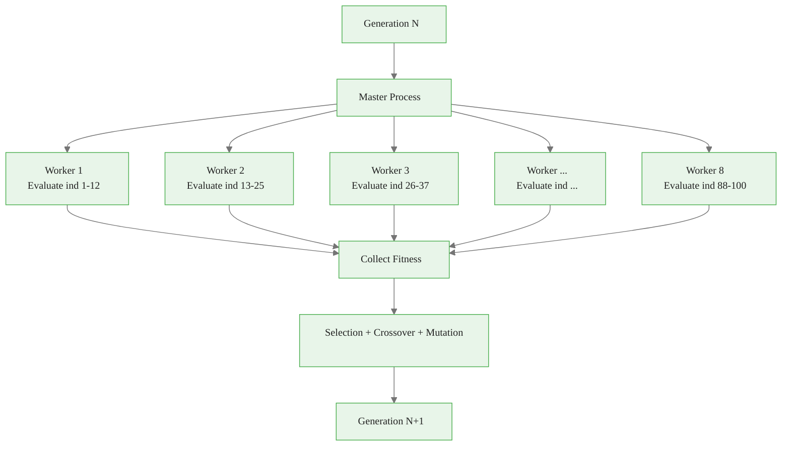
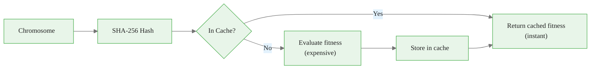

<!-- _class: lead -->

# Production Considerations

## Module 04 — Implementation

Scaling, parallelization, caching, and reproducibility

<!-- Speaker notes: This deck covers the engineering side of GAs. A correct GA that takes 14 hours is useless in production. Emphasize that these optimizations can reduce runtime by 28x without sacrificing solution quality. -->

---

## The Production Bottleneck

The fitness function dominates runtime:

$$T_{\text{serial}} = G \times P \times T_{\text{fitness}}$$

| Component | Value | Total |
|-----------|-------|-------|
| Generations ($G$) | 50 | |
| Population ($P$) | 100 | |
| Fitness eval ($T_{\text{fitness}}$) | 10s | |
| **Serial total** | | **50 × 100 × 10s = 13.9 hours** |

```
Serial:   ■■■■■■■■■■■■■■■■■■■■  13.9 hours
Parallel (8 cores): ■■■         1.7 hours
+ Caching (20% hits): ■■        1.4 hours
```

<!-- Speaker notes: Start with the math: 50 generations times 100 individuals times 10 seconds each equals nearly 14 hours for a serial GA. This is the baseline that motivates every optimization in this deck. Ask learners to calculate the cost for their own problem sizes. -->

---

## Parallelization Strategy



$$S = \frac{T_{\text{serial}}}{T_{\text{parallel}}} \approx \frac{W}{1 + \frac{W \times T_{\text{comm}}}{P \times T_{\text{fitness}}}}$$

<!-- Speaker notes: Use the diagram to show that fitness evaluations are embarrassingly parallel since each individual is evaluated independently. The master process handles selection and genetic operators, which are cheap. The speedup formula accounts for communication overhead between workers. -->

---

## Parallel Implementation


<div class="code-window">
<div class="code-header">
<div class="dots"><span class="dot-red"></span><span class="dot-yellow"></span><span class="dot-green"></span></div>
<span class="filename">parallelga.py</span>
</div>

```python
from joblib import Parallel, delayed
import multiprocessing as mp

class ParallelGA:
    def __init__(self, fitness_func, n_jobs=-1, cache_fitness=True):
        self.fitness_func = fitness_func
        self.n_jobs = n_jobs if n_jobs > 0 else mp.cpu_count()
        self.cache_fitness = cache_fitness
        self.fitness_cache = {}

    def evaluate_population(self, population):
        """Evaluate entire population in parallel."""
        if self.n_jobs == 1:
            return [self._evaluate(ind) for ind in population]
        else:
            return Parallel(n_jobs=self.n_jobs)(
                delayed(self._evaluate)(ind) for ind in population
            )

    def _evaluate(self, chromosome):
        """Evaluate with caching."""
        key = hashlib.sha256(chromosome.tobytes()).hexdigest()
        if self.cache_fitness and key in self.fitness_cache:
            self.cache_hits += 1
            return self.fitness_cache[key]

        fitness = self.fitness_func(chromosome)
        if self.cache_fitness:
            self.fitness_cache[key] = fitness
        return fitness
```

</div>

<!-- Speaker notes: Walk through the code showing joblib for parallelization and SHA-256 hashing for fitness caching. Highlight the cache hit counter for monitoring. Point out that n_jobs=-1 uses all available CPU cores automatically. -->

---

## Fitness Caching

```
WITHOUT CACHE:
Gen 10, Ind A: [1,0,1,0,1] → Train model → 0.85  (10s)
Gen 10, Ind B: [1,0,1,0,1] → Train model → 0.85  (10s) ← DUPLICATE!
                                              Total: 20s

WITH CACHE:
Gen 10, Ind A: [1,0,1,0,1] → Train model → 0.85 → CACHE  (10s)
Gen 10, Ind B: [1,0,1,0,1] → Cache HIT!  → 0.85           (0.001s)
                                              Total: 10s
```



Over 5000 evaluations with 20% hit rate → **1000 evaluations saved**.

<!-- Speaker notes: Caching works because crossover and mutation often produce chromosomes that have already been evaluated in previous generations. The hit rate increases over time as the population converges. SHA-256 hashing is fast and collision-resistant, making it ideal for chromosome fingerprinting. -->

---

## Reproducibility Management


<div class="code-window">
<div class="code-header">
<div class="dots"><span class="dot-red"></span><span class="dot-yellow"></span><span class="dot-green"></span></div>
<span class="filename">reproduciblega.py</span>
</div>

```python
class ReproducibleGA:
    def __init__(self, random_state=42):
        self.random_state = random_state
        self._setup_reproducibility()

    def _setup_reproducibility(self):
        """Fix ALL randomness sources."""
        import random, os
        random.seed(self.random_state)
        np.random.seed(self.random_state)
        os.environ['PYTHONHASHSEED'] = str(self.random_state)

        try:
            import tensorflow as tf
            tf.random.set_seed(self.random_state)
        except ImportError:
            pass

    def save_state(self, filepath):
        """Save GA state for checkpoint/resume."""
        state = {
            'random_state': self.random_state,
            'numpy_state': np.random.get_state(),
            'python_state': random.getstate()
        }
        with open(filepath, 'wb') as f:
            pickle.dump(state, f)
```

</div>

<!-- Speaker notes: Emphasize that reproducibility requires seeding ALL randomness sources: Python's random module, NumPy, and any ML framework like TensorFlow or PyTorch. The save_state method enables checkpointing so long runs can be resumed after failures. -->

---

## Common Reproducibility Failures

```
NON-REPRODUCIBLE:                 REPRODUCIBLE:

Run 1: seed=42 → fitness 0.87    Run 1: seed=42 → fitness 0.87
Run 2: seed=42 → fitness 0.89    Run 2: seed=42 → fitness 0.87
           Different! ✗                   Identical! ✓

Root causes:                      Solutions:
- CV shuffles differently         - Fix CV splitter seed
- Thread scheduling varies        - Deterministic parallel ordering
- Float non-determinism           - Fixed precision operations
- Library internal randomness     - Seed ALL libraries
```

<!-- Speaker notes: Ask learners if they have ever gotten different results from the same code. Walk through each root cause: CV shuffling, thread scheduling non-determinism, floating-point ordering differences, and unseeded library internals. These are subtle bugs that are hard to debug without awareness. -->

---

## Sklearn Pipeline Integration


<div class="code-window">
<div class="code-header">
<div class="dots"><span class="dot-red"></span><span class="dot-yellow"></span><span class="dot-green"></span></div>
<span class="filename">gafeatureselector.py</span>
</div>

```python
from sklearn.base import BaseEstimator, TransformerMixin
from sklearn.pipeline import Pipeline

class GAFeatureSelector(BaseEstimator, TransformerMixin):
    """Sklearn-compatible GA feature selector."""

    def __init__(self, estimator, population_size=50,
                 n_generations=30, n_jobs=-1, random_state=42):
        self.estimator = estimator
        self.population_size = population_size
        self.n_generations = n_generations
        self.n_jobs = n_jobs
        self.random_state = random_state

    def fit(self, X, y):
        ga = ParallelGA(...)
        result = ga.run()
        self.support_ = result['best_individual'].astype(bool)
        return self

    def transform(self, X):
        return X[:, self.support_]

# Use in pipeline
pipeline = Pipeline([
    ('scaler', StandardScaler()),
    ('ga_selector', GAFeatureSelector(estimator=RandomForestClassifier())),
    ('classifier', RandomForestClassifier())
])
pipeline.fit(X_train, y_train)
```

</div>

<!-- Speaker notes: This is the production-ready integration pattern. By implementing BaseEstimator and TransformerMixin, the GA feature selector plugs directly into sklearn pipelines with fit/transform, cross-validation, and grid search. This is the standard way to productionize custom feature selection. -->

---

## Performance Comparison

```
OPTIMIZATION STRATEGIES:

Strategy              Time      Speedup   Quality
──────────────────────────────────────────────────
Serial (baseline)     13.9h     1.0x      ★★★
Parallel (8 cores)     1.7h     8.0x      ★★★
+ Caching              1.4h     9.9x      ★★★
+ Early stopping       0.8h    17.4x      ★★★
+ Warm-start models    0.5h    27.8x      ★★★

Total potential speedup: ~28x
13.9 hours → 30 minutes
```

<!-- Speaker notes: This comparison table is the key reference slide. Walk through each optimization layer showing how they stack multiplicatively. The total speedup of 28x turns an overnight job into a 30-minute run, which is crucial for iterative development and experimentation. -->

---

## Common Pitfalls

| Pitfall | Symptom | Solution |
|---------|---------|----------|
| **Race conditions** | Inconsistent results | Immutable data, message passing |
| **Overhead > savings** | Parallel slower than serial | Batch evaluations, increase population |
| **Non-deterministic fitness** | Different results same chromosome | Fix CV splitter seed |
| **Memory leaks** | OOM after 1000 gens | LRU cache, periodic clearing |
| **Incorrect speedup expectations** | 5x instead of 8x | Account for Amdahl's law overhead |

<!-- Speaker notes: Emphasize the memory leak pitfall: an unbounded fitness cache will eventually consume all memory in long runs. Use an LRU cache with a fixed size or clear periodically. Also highlight that parallelism overhead can make small populations slower than serial execution. -->

---

## Key Takeaways

<div class="flow">
<div class="flow-step mint">Parallel</div>
<div class="flow-arrow">→</div>
<div class="flow-step blue">Cache</div>
<div class="flow-arrow">→</div>
<div class="flow-step amber">Reproduce</div>
<div class="flow-arrow">→</div>
<div class="flow-step lavender">Integrate</div>
</div>

| Production Need | Solution |
|----------------|----------|
| **Speed** | Parallel fitness evaluation (joblib/multiprocessing) |
| **Efficiency** | Fitness caching with SHA-256 hashing |
| **Reproducibility** | Seed all randomness sources, save/load state |
| **Integration** | Sklearn BaseEstimator/TransformerMixin interface |
| **Monitoring** | Track evaluations, cache hits, convergence |
| **Robustness** | Early stopping, elitism, warm-start models |

```
PRODUCTION CHECKLIST:
✓ Parallel evaluation       ✓ Fitness caching
✓ All seeds fixed           ✓ State save/restore
✓ Sklearn compatible        ✓ Early stopping
✓ Performance logging       ✓ Memory management
```

<!-- Speaker notes: Use the production checklist as a final review. Encourage learners to check off each item before deploying a GA in production. The combination of parallel evaluation, caching, sklearn compatibility, and reproducibility forms a complete production-ready system. -->

> **Next**: Module 05 — Advanced techniques: NSGA-II, hybrids, and adaptive operators.
