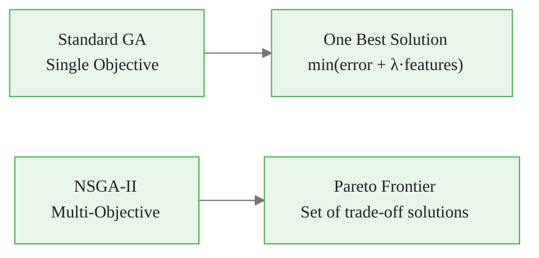
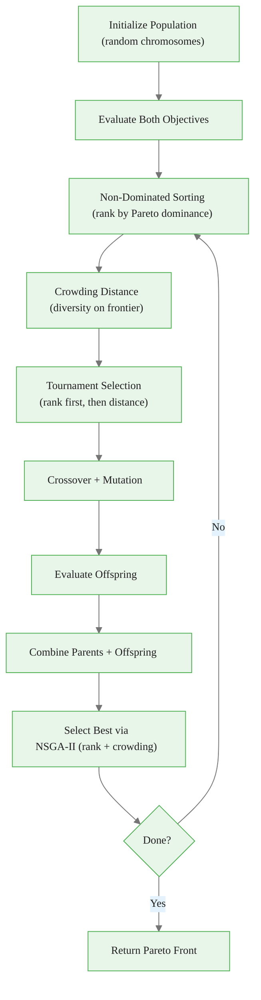
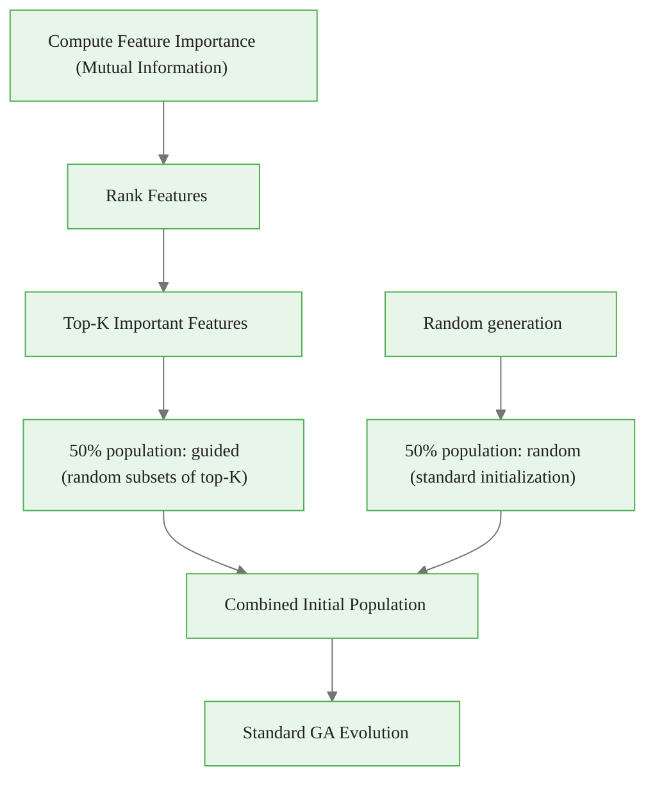
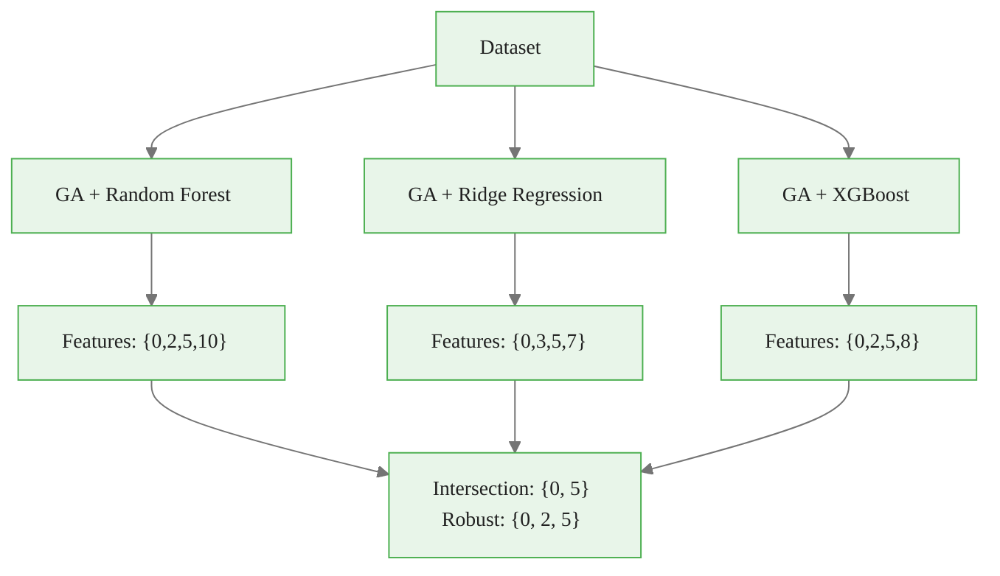
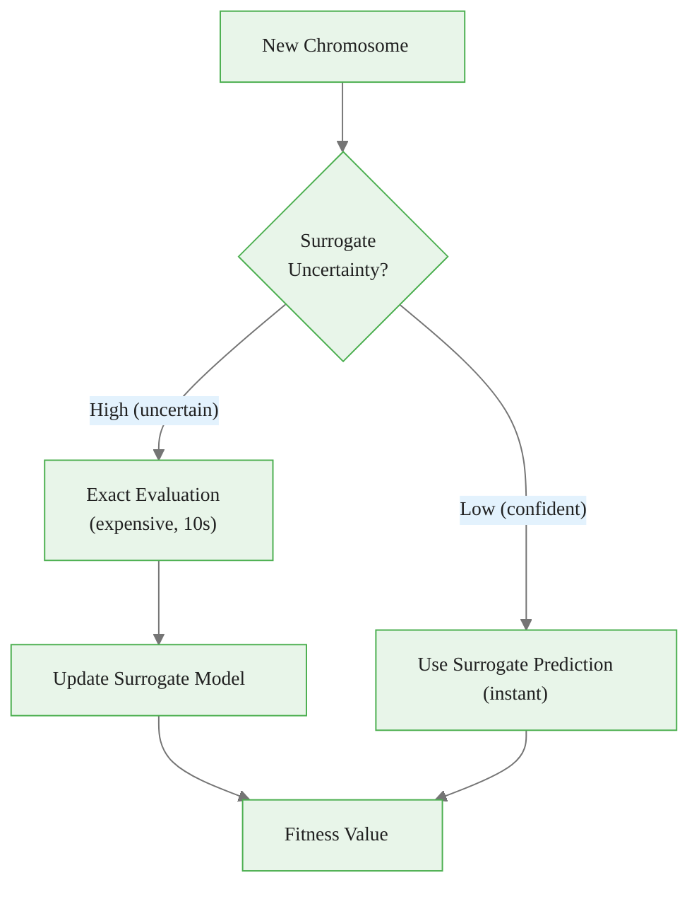

<!-- _class: lead -->

# Advanced GA Techniques

## Module 05 — Advanced

Multi-objective, hybrid, ensemble, and constraint handling

<!-- Speaker notes: This deck introduces four advanced GA paradigms. Emphasize that these are not theoretical curiosities but practical tools for handling real-world complexity: multiple competing objectives, hybrid optimization, ensemble robustness, and domain constraints. -->

---

## NSGA-II: Multi-Objective Feature Selection

Two competing objectives: **minimize error** AND **minimize feature count**.



$$\min_{\mathbf{x}} \begin{pmatrix} L(M_\mathbf{x}) \\ |\mathbf{x}|_1 \end{pmatrix}$$

No single best — a **set of non-dominated solutions**.

<!-- Speaker notes: Contrast single-objective with multi-objective optimization. The key insight is that combining objectives with a weighted sum (lambda) forces a trade-off choice upfront, while NSGA-II defers this choice by presenting the full Pareto frontier. Ask learners which approach is better when stakeholders disagree on the trade-off. -->

---

## The Pareto Frontier

```
Prediction Error
    |
    |  ×  Dominated
    |   ×    (worse on both objectives)
    |    ●───●───●  Pareto Frontier
    |         ●──●     (can't improve one
    |             ●      without worsening other)
    +────────────────> # Features

●  Non-dominated (Pareto optimal)
×  Dominated (strictly worse)

Choose based on your constraint:
  "I need <= 5 features"  → pick rightmost ● with ≤5
  "Error must be < 0.1"   → pick lowest ● above threshold
```

<!-- Speaker notes: Use this diagram to explain Pareto dominance: a solution is dominated if another solution is better on ALL objectives. The Pareto frontier consists of all non-dominated solutions. Walk through the two decision strategies at the bottom, showing how business constraints determine the final choice. -->

---

## NSGA-II Implementation


<div class="code-window">
<div class="code-header">
<div class="dots"><span class="dot-red"></span><span class="dot-yellow"></span><span class="dot-green"></span></div>
<span class="filename">evaluate.py</span>
</div>

```python
from deap import base, creator, tools

# Multi-objective: minimize BOTH error and feature count
creator.create("FitnessMulti", base.Fitness, weights=(-1.0, -1.0))
creator.create("Individual", list, fitness=creator.FitnessMulti)

def evaluate(individual):
    selected = [i for i, b in enumerate(individual) if b == 1]
    if len(selected) == 0:
        return (float('inf'), float('inf'))

    X_sel = X[:, selected]
    scores = cross_val_score(model, X_sel, y, cv=5,
                             scoring='neg_mean_squared_error')
    return (-scores.mean(), len(selected))  # (error, n_features)

# NSGA-II selection
toolbox.register("select", tools.selNSGA2)

# Extract Pareto front from final population
pareto_front = tools.sortNondominated(
    population, len(population), first_front_only=True
)[0]
```

</div>

<!-- Speaker notes: Walk through the code highlighting three key differences from single-objective: FitnessMulti with two negative weights, the evaluate function returning a two-element tuple, and selNSGA2 replacing selTournament. The sortNondominated call at the end extracts just the Pareto-optimal solutions. -->

---

## NSGA-II Evolution Flow



<!-- Speaker notes: Trace through the NSGA-II flow step by step. The two unique components are non-dominated sorting (ranking by Pareto dominance layers) and crowding distance (preferring solutions in sparse regions of the frontier for diversity). Together these produce a well-spread Pareto front. -->

---

<!-- _class: lead -->

# Hybrid Methods

<!-- Speaker notes: Transition to hybrid approaches. The core idea is that GAs are great at global exploration but slow at local refinement, while local search methods are the opposite. Combining them gives the best of both worlds. -->

---

## GA + Local Search (Memetic Algorithm)

```
PURE GA:                          MEMETIC ALGORITHM:
Gen 0:  [Random exploration]      Gen 0: [Random + local refinement]
Gen 10: [Converging slowly...]    Gen 10: [GA explores between peaks]
Gen 20: [Still converging...]               [Local search climbs each]
Gen 50: [Finally near optimum]    Gen 20: [CONVERGED to global optimum]
```


<div class="code-window">
<div class="code-header">
<div class="dots"><span class="dot-red"></span><span class="dot-yellow"></span><span class="dot-green"></span></div>
<span class="filename">local_search.py</span>
</div>

```python
def local_search(individual, X, y, n_iterations=10):
    """Hill climbing to refine GA solution."""
    best = individual.copy()
    best_fitness = evaluate_fitness(best, X, y)

    for _ in range(n_iterations):
        for i in range(len(best)):
            neighbor = best.copy()
            neighbor[i] = 1 - neighbor[i]
            if sum(neighbor) == 0:
                continue
            fitness = evaluate_fitness(neighbor, X, y)
            if fitness < best_fitness:
                best = neighbor
                best_fitness = fitness
                break  # First improvement
    return best, best_fitness
```

</div>

<!-- Speaker notes: Explain the memetic algorithm concept: after each GA generation, the top individuals are refined with local search (hill climbing). The code shows first-improvement hill climbing, which flips each bit and takes the first improvement found. This is covered in much more depth in the hybrid methods deck. -->

---

## GA + Filter Methods (Smart Initialization)




<div class="code-window">
<div class="code-header">
<div class="dots"><span class="dot-red"></span><span class="dot-yellow"></span><span class="dot-green"></span></div>
<span class="filename">filter_guided_initialization.py</span>
</div>

```python
def filter_guided_initialization(X, y, pop_size, top_k=None):
    mi_scores = mutual_info_regression(X, y)
    top_features = np.argsort(mi_scores)[::-1][:top_k]

    population = []
    for _ in range(pop_size // 2):  # Guided half
        chromosome = np.zeros(n_features, dtype=int)
        selected = np.random.choice(top_features, np.random.randint(3, 15))
        chromosome[selected] = 1
        population.append(chromosome)

    for _ in range(pop_size - len(population)):  # Random half
        population.append((np.random.random(n_features) < 0.3).astype(int))

    return population
```

</div>

<!-- Speaker notes: Smart initialization uses filter methods like mutual information to bias the initial population toward promising regions. Half the population uses guided initialization from top-K features, and half uses random initialization to maintain diversity. This hybrid approach reduces the number of generations needed to converge. -->

---

## Ensemble Feature Selection

Run GA multiple times and aggregate results:

```
Run 1 (seed=0):  Selected {0, 2, 5, 10, 15}
Run 2 (seed=1):  Selected {0, 3, 5, 10, 12}
Run 3 (seed=2):  Selected {0, 2, 5, 8, 15}
Run 4 (seed=3):  Selected {0, 5, 7, 10, 15}
Run 5 (seed=4):  Selected {0, 2, 5, 10, 12}

Feature Votes:
  Feature 0:  5/5 = 100%  ← CONSENSUS
  Feature 5:  5/5 = 100%  ← CONSENSUS
  Feature 10: 4/5 =  80%  ← CONSENSUS
  Feature 2:  3/5 =  60%  ← CONSENSUS (>50%)
  Feature 15: 3/5 =  60%  ← CONSENSUS
  Feature 12: 2/5 =  40%  ← Not consensus
```


<div class="code-window">
<div class="code-header">
<div class="dots"><span class="dot-red"></span><span class="dot-yellow"></span><span class="dot-green"></span></div>
<span class="filename">ensemble_ga.py</span>
</div>

```python
def ensemble_ga(X, y, n_runs=10, **ga_params):
    feature_votes = np.zeros(X.shape[1])
    for run in range(n_runs):
        result = run_ga(X, y, random_state=run, **ga_params)
        for feat in result['selected_features']:
            feature_votes[feat] += 1
    consensus = np.where(feature_votes > n_runs / 2)[0]
    return consensus
```

</div>

<!-- Speaker notes: Ensemble GA addresses the stochastic nature of GAs by running multiple independent searches and taking the consensus. Features selected in more than half the runs are considered robust. This dramatically reduces the risk of selecting features that are artifacts of a particular random seed. -->

---

## Stacked Feature Selection

Select features that work across **multiple models**:



Features selected by **multiple models** are more likely truly informative, not model-specific artifacts.

<!-- Speaker notes: Stacked feature selection is a powerful robustness technique. If Random Forest, Ridge Regression, and XGBoost all select the same features independently, those features capture genuine signal rather than model-specific quirks. The intersection or majority-vote gives the most robust subset. -->

---

## Constraint Handling: Repair Operators


<div class="code-window">
<div class="code-header">
<div class="dots"><span class="dot-red"></span><span class="dot-yellow"></span><span class="dot-green"></span></div>
<span class="filename">constrained_ga.py</span>
</div>

```python
def constrained_ga(X, y, feature_groups, min_per_group=1, max_per_group=3):
    def repair_individual(individual):
        """Fix constraint violations."""
        ind = list(individual)
        for group_name, indices in feature_groups.items():
            selected = [i for i in indices if ind[i] == 1]
            # Too few: add random features from group
            while len(selected) < min_per_group:
                available = [i for i in indices if ind[i] == 0]
                if not available: break
                ind[np.random.choice(available)] = 1
                selected = [i for i in indices if ind[i] == 1]
            # Too many: remove random features from group
            while len(selected) > max_per_group:
                ind[np.random.choice(selected)] = 0
                selected = [i for i in indices if ind[i] == 1]
        return ind
```

</div>

Repair after crossover and mutation to maintain feasibility.

<!-- Speaker notes: The repair operator approach is the most practical way to handle constraints. Rather than designing constraint-preserving operators, let standard operators run freely and then fix any violations. This separates concerns and keeps the code simpler. Walk through the min/max per-group logic. -->

---

## Surrogate Model Fitness

Replace expensive model training with a cheap approximation:




<div class="code-window">
<div class="code-header">
<div class="dots"><span class="dot-red"></span><span class="dot-yellow"></span><span class="dot-green"></span></div>
<span class="filename">surrogatefitness.py</span>
</div>

```python
class SurrogateFitness:
    def __init__(self, X, y):
        self.surrogate = GaussianProcessRegressor(kernel=RBF())
        self._initialize_surrogate(n_initial=50)

    def evaluate(self, individual, use_surrogate=True):
        if use_surrogate:
            pred, std = self.surrogate.predict([individual], return_std=True)
            if std[0] < 0.5:  # Confident
                return pred[0]   # Cheap!
        # Uncertain → exact evaluation
        fitness = self._exact_evaluation(individual)
        self._update_surrogate(individual, fitness)
        return fitness
```

</div>

<!-- Speaker notes: Surrogate models replace expensive fitness evaluations with cheap approximations. The Gaussian process gives both a prediction and an uncertainty estimate. When uncertainty is low, use the cheap prediction; when high, do the expensive evaluation and update the surrogate. This can cut evaluation costs by 50-80%. -->

---

## Key Takeaways

<div class="flow">
<div class="flow-step mint">NSGA-II</div>
<div class="flow-arrow">→</div>
<div class="flow-step amber">Hybrid</div>
<div class="flow-arrow">→</div>
<div class="flow-step blue">Ensemble</div>
<div class="flow-arrow">→</div>
<div class="flow-step lavender">Surrogate</div>
</div>

| Technique | When to Use |
|-----------|-------------|
| **NSGA-II** | Multiple objectives (error vs complexity) |
| **Memetic (GA + local search)** | Need fine-tuning near optima |
| **Filter-guided init** | Large search space, want fast start |
| **Ensemble GA** | Need stable, consensus features |
| **Stacked selection** | Multiple downstream models |
| **Constraint handling** | Feature group requirements |
| **Surrogate fitness** | Very expensive fitness evaluations |

<!-- Speaker notes: This reference table maps each technique to its use case. Encourage learners to identify which technique best matches their current project needs. Most real-world problems benefit from combining two or three of these approaches. -->

---

<div class="callout-insight">

💡 **Key Insight:** Most real-world problems benefit from combining two or three advanced techniques. Start simple and add complexity with evidence.

</div>

## Visual Summary

```
ADVANCED GA TECHNIQUES
======================

Multi-Objective:    Hybrid Methods:     Ensemble:
  Error               GA explores         Run 1 → {A,B,C}
  ↑  ●──●──●          Local refines       Run 2 → {A,C,D}
  |        ●           Together: fast      Run 3 → {A,B,D}
  |         ●                              ──────────────
  └──────────→         Constraints:        Consensus: {A}
    # Features         Repair operators
                       Keep feasibility

CHOOSE BASED ON YOUR PROBLEM:
  Many objectives? → NSGA-II
  Need refinement? → Memetic
  Need robustness? → Ensemble
  Have constraints? → Repair operators
  Expensive fitness? → Surrogate models
```

<!-- Speaker notes: Use this visual summary as a quick-reference recap. The decision tree at the bottom maps problem characteristics to techniques. Ask learners to identify which technique they would choose for their own feature selection problem and why. -->

> **Next**: Hybrid methods deep dive — memetic algorithms and Lamarckian vs Baldwinian learning.
