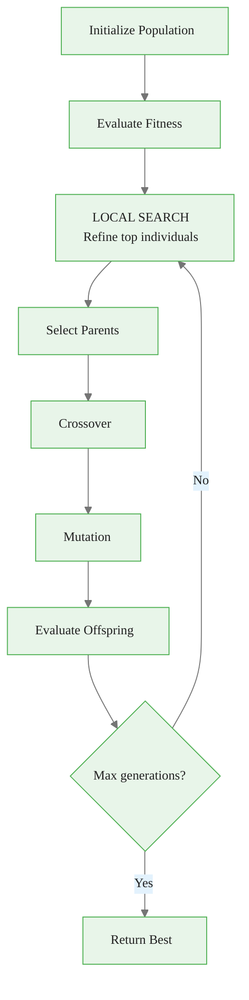
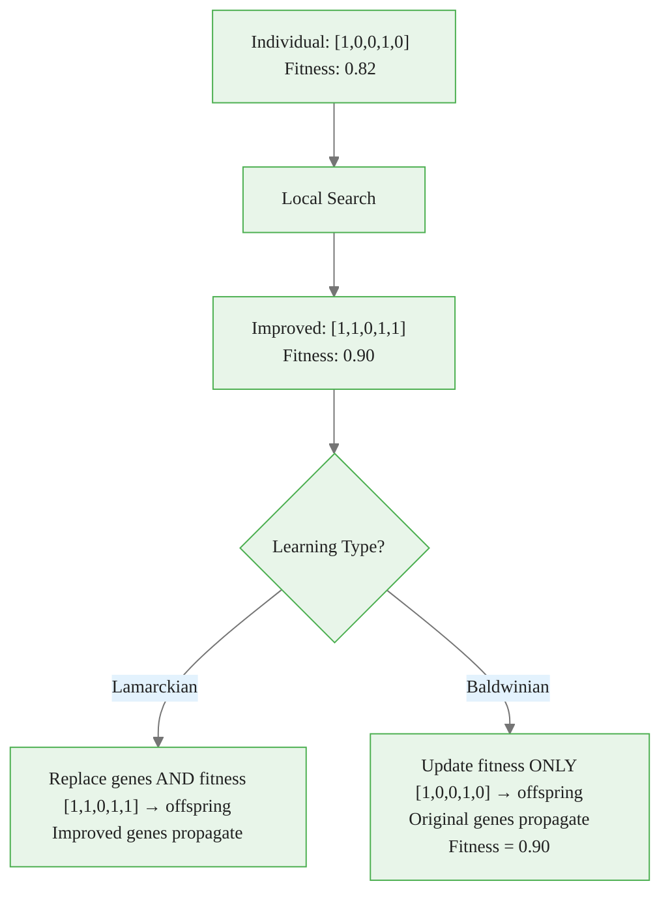

<!-- _class: lead -->

# Hybrid Methods: Memetic Algorithms

## Module 05 — Advanced

Combining GA global exploration with local search exploitation

<!-- Speaker notes: This deck deep-dives into memetic algorithms, which combine evolutionary search with local optimization. The name comes from Richard Dawkins' concept of memes: ideas that evolve culturally. Here, individuals improve themselves during their lifetime, not just across generations. -->

---

## The Complementary Strengths

```
PURE GA (Global, Slow):           PURE HILL CLIMBING (Local, Stuck):
Gen 0:  ×  ×  ×  ×  ×             Start: ×
Gen 10:    × ×× ×                 Step 1:  × (improved)
Gen 20:     ××× ×                 Step 2:   × (improved)
Gen 50:      ×××                  Step 3:    × STUCK! (local optimum)
  Slow convergence                No escape mechanism

MEMETIC ALGORITHM (Best of Both):
Gen 0:  ×→● ×→● ×→● ×→● ×→●     (local search refines each)
Gen 10:    ●→● ●→●               (crossover + refinement)
Gen 20:      ●                   (CONVERGED — global optimum!)
  2-5x fewer evaluations
```

<!-- Speaker notes: Walk through the three scenarios side by side. Pure GA explores broadly but converges slowly. Pure hill climbing finds a local optimum quickly but gets stuck. The memetic algorithm uses crossover to jump between peaks and local search to climb each one. The result is 2-5x fewer evaluations to reach the global optimum. -->

---

## Memetic Algorithm Framework



The key addition: **local search refinement** between evaluation and selection.

<!-- Speaker notes: Use the diagram to show where local search fits into the standard GA loop. The yellow-highlighted step is the only addition. Emphasize that the rest of the algorithm remains unchanged, making memetic algorithms easy to implement on top of existing GA code. -->

---

## Hill Climbing Local Search

For each selected individual, try flipping each bit:

```python
def hill_climbing(individual, fitness_func, max_iter=10):
    """1-flip neighborhood local search."""
    current = individual.copy()
    current_fitness = fitness_func(current)

    for iteration in range(max_iter):
        improved = False
        for i in range(len(current)):
            neighbor = current.copy()
            neighbor[i] = 1 - neighbor[i]
            if neighbor.sum() == 0:
                continue

            neighbor_fitness = fitness_func(neighbor)
            if neighbor_fitness > current_fitness:
                current = neighbor
                current_fitness = neighbor_fitness
                improved = True
                break  # First improvement (faster)

        if not improved:
            break  # Local optimum reached

    return current, current_fitness
```

<!-- Speaker notes: Walk through the hill climbing code step by step. For each bit position, it tries flipping the bit and checks if fitness improves. First-improvement means it takes the first improving move rather than searching all neighbors. This is faster than best-improvement and works well in practice. Note the zero-sum guard preventing empty feature sets. -->

---

## Lamarckian vs Baldwinian Learning



| Type | Genes | Fitness | Best For |
|------|-------|---------|----------|
| **Lamarckian** | Updated | Updated | Stationary problems |
| **Baldwinian** | Original | Updated | Non-stationary problems |

<!-- Speaker notes: This is a critical conceptual distinction. Lamarckian learning replaces the genes with the improved version, like an athlete passing their trained muscles to offspring. Baldwinian learning only updates the fitness score, so the original genes are passed to offspring but the individual is selected as if it were better. Ask learners which biological analogy is more realistic. -->

---

## When to Use Each Learning Type

```
LAMARCKIAN (Replace genes):
  ✓ Stable fitness landscape
  ✓ Good local optima = good genes
  ✓ Faster convergence
  ✗ Risk: local improvements may not generalize

BALDWINIAN (Keep original genes):
  ✓ Changing fitness landscape (time series, concept drift)
  ✓ Selection pressure toward "improvable" genotypes
  ✓ Better genetic diversity
  ✗ Slower convergence

Rule of thumb:
  Stationary data → Lamarckian
  Non-stationary data → Baldwinian
  Unsure → Test both!
```

<!-- Speaker notes: The practical rule of thumb is straightforward: if the fitness landscape is stable (stationary data), use Lamarckian because improved genes are still good in future generations. If the landscape changes (concept drift, non-stationary time series), use Baldwinian because today's improved genes might be wrong tomorrow. When in doubt, test both and compare. -->

---

## Memetic Algorithm Implementation

```python
class MemeticAlgorithm:
    def __init__(self, n_features, fitness_func,
                 local_search_freq=0.2,  # Refine top 20%
                 local_search_iters=10,
                 learning_type='lamarckian'):
        self.local_search_freq = local_search_freq
        self.local_search_iters = local_search_iters
        self.learning_type = learning_type

    def _local_search_refinement(self, population, fitness_scores):
        n_refine = max(1, int(len(population) * self.local_search_freq))
        top_indices = np.argsort(fitness_scores)[-n_refine:]

        for idx in top_indices:
            improved, improved_fit = self._hill_climbing(population[idx])

            if self.learning_type == 'lamarckian':
                population[idx] = improved      # Replace genes
                fitness_scores[idx] = improved_fit
            else:  # baldwinian
                population[idx] = population[idx]  # Keep genes
                fitness_scores[idx] = improved_fit  # Update fitness

        return population, fitness_scores
```

<!-- Speaker notes: Walk through the implementation highlighting the local_search_freq parameter that controls what fraction of the population gets refined. Only refining the top 20% keeps the computational cost manageable. Note how the learning type switch determines whether genes or only fitness values are updated. -->

---

## GA + Greedy Forward Selection

Another hybrid approach: use greedy search within GA:

```
GA finds promising region:
  [1, 0, 0, 1, 0, 0, 1, 0]  (features {0, 3, 6})

Greedy forward adds one-at-a-time:
  Try +feature 1: fitness 0.85 → 0.87  ✓ Add
  Try +feature 4: fitness 0.87 → 0.86  ✗ Skip
  Try +feature 5: fitness 0.87 → 0.89  ✓ Add
  ...

Result: [1, 1, 0, 1, 0, 1, 1, 0]  (features {0, 1, 3, 5, 6})

GA found the neighborhood.
Greedy refined the solution.
```

<!-- Speaker notes: This alternative hybrid approach uses greedy forward selection instead of hill climbing. The GA identifies a promising region of the feature space, and greedy search systematically tries adding each remaining feature one at a time. This is particularly effective when the GA solution is close to optimal but missing a few useful features. -->

---

## Computational Budget Allocation

$$E_{\text{total}} = E_{\text{GA}} + E_{\text{LS}}$$

```
Budget: 5000 evaluations total

Strategy 1: All GA
  50 pop × 100 gens = 5000 evaluations
  Quality: ★★★

Strategy 2: GA + Refine ALL (expensive)
  50 pop × 20 gens = 1000 GA evaluations
  50 × 20 × 4 = 4000 local search evaluations
  Quality: ★★★★ (but many wasted on bad solutions)

Strategy 3: GA + Refine ELITE (optimal)
  50 pop × 80 gens = 4000 GA evaluations
  10 elite × 10 iters × 10 gens = 1000 LS evaluations
  Quality: ★★★★★
```

> Refine the **elite only** (top 10-20%) for best budget efficiency.

<!-- Speaker notes: Budget allocation is the most overlooked aspect of memetic algorithms. Compare the three strategies: Strategy 3 (refine elite only) gets the best quality because it spends most evaluations on GA exploration and focuses expensive local search on the most promising individuals. Ask learners to calculate the budget split for their own problem size. -->

---

## Comparison: Standard GA vs Memetic

```
Feature Selection on 30 features, 200 samples:

Method              Best Fitness  Features  Evaluations
──────────────────────────────────────────────────────
Standard GA          0.82         12        2500
Memetic (Lamarck)    0.87          9        3200
Memetic (Baldwin)    0.85         10        3200
GA + Greedy          0.86         11        2800

Memetic Lamarckian: Best fitness AND fewer features
                    At cost of ~28% more evaluations
```

<!-- Speaker notes: This comparison table is the key evidence slide. Memetic Lamarckian achieves the best fitness AND the fewest features with only 28% more evaluations than standard GA. Highlight that fewer features with better fitness means the memetic algorithm found genuinely better solutions, not just over-fit ones. -->

---

## Common Pitfalls

| Pitfall | Symptom | Solution |
|---------|---------|----------|
| **Refining every individual** | 10x more evaluations, marginal gain | Refine elite only (top 10-20%) |
| **Local search cancels crossover** | Premature convergence | Apply selectively, maintain diversity |
| **Wrong learning type** | Lamarckian on non-stationary data | Use Baldwinian for drifting landscapes |
| **No iteration limit** | Single individual takes hours | Hard cap: 5-20 iterations |
| **Ignoring total budget** | "Same generations" but 5x evaluations | Track total evaluations, compare fairly |

<!-- Speaker notes: Emphasize the last pitfall: comparing a memetic GA with a standard GA by generation count is misleading because the memetic version does many more fitness evaluations per generation. Always compare by total evaluations for a fair assessment. Also highlight the iteration limit to prevent any single local search from consuming the entire budget. -->

---

## Key Takeaways

| Insight | Detail |
|---------|--------|
| **Complementary strengths** | GA explores globally, local search refines locally |
| **2-5x faster** | Memetic converges faster than pure GA |
| **Lamarckian** | Replace genes; faster convergence, stationary problems |
| **Baldwinian** | Keep genes; better diversity, non-stationary problems |
| **Budget allocation** | Refine elite only for best efficiency |
| **First improvement** | Faster than best improvement in local search |

```
EVOLUTION finds the mountain.
LOCAL SEARCH climbs it.
MEMETIC does both.
```

<!-- Speaker notes: Conclude with the memorable three-line summary: evolution finds the mountain, local search climbs it, memetic does both. Encourage learners to implement the simplest memetic version first (Lamarckian with hill climbing on the top 10%) and measure improvement before adding complexity. -->

> **Next**: Adaptive operators — self-tuning mutation rates and parameter evolution.
