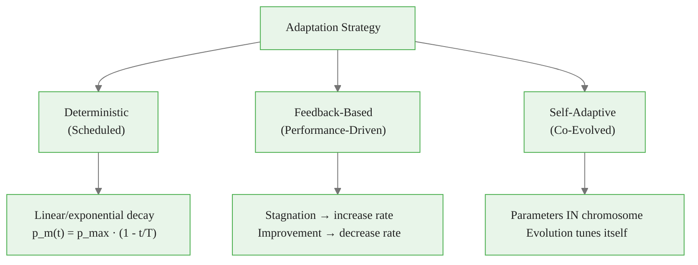
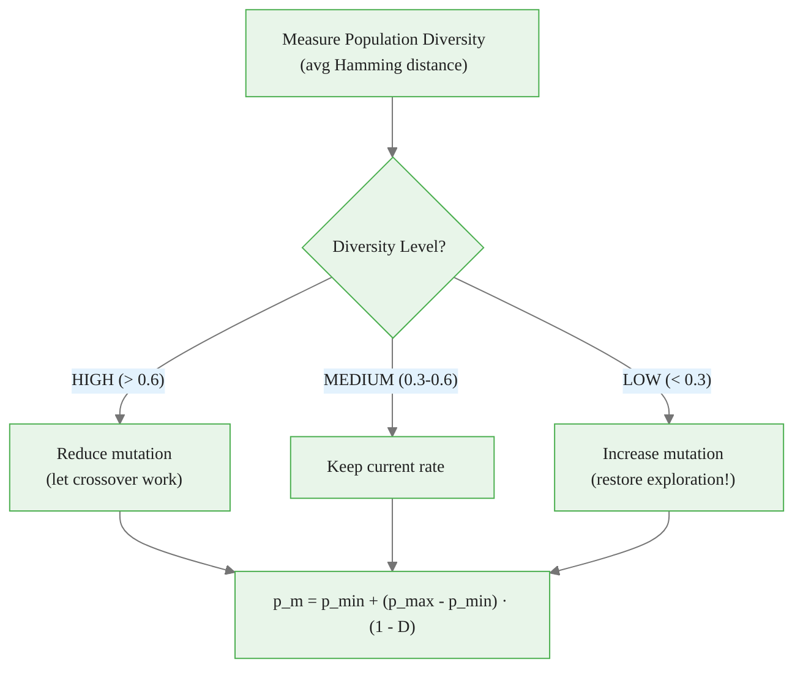
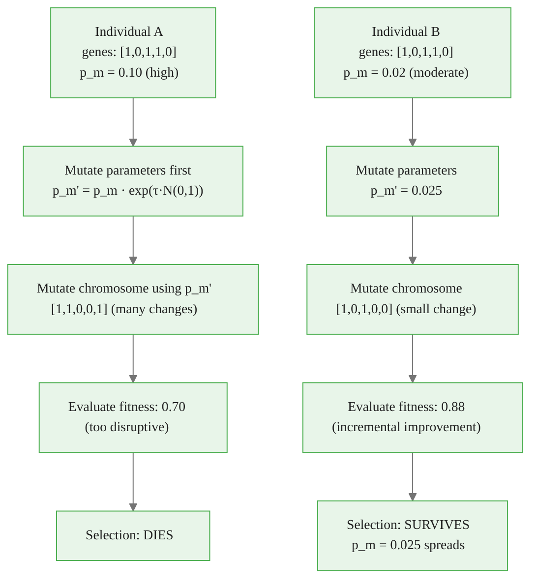
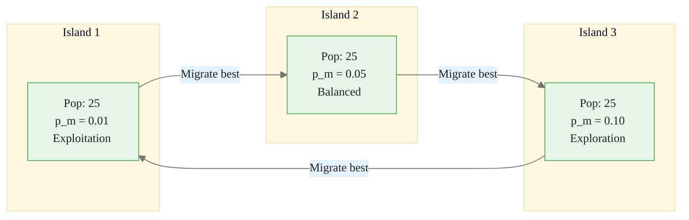

<!-- _class: lead -->

# Adaptive Genetic Operators

## Module 05 — Advanced

Self-tuning parameters and mutation rates

<!-- Speaker notes: This deck addresses a fundamental GA limitation: fixed parameters are suboptimal because the ideal mutation rate changes during evolution. The goal is to eliminate manual parameter tuning by letting the algorithm adapt itself. -->

---

## Why Fixed Parameters Fail

Optimal parameters change during search:

```
FIXED MUTATION = 0.01:                FIXED MUTATION = 0.1:
Gen 0:  [Exploring... too slow]       Gen 0:  [Exploring... great!]
Gen 20: [Still exploring slowly]       Gen 20: [Converging... okay]
Gen 40: [Finally making progress]      Gen 40: [Disrupting good solutions!]
Gen 50: [Suboptimal, never converged]  Gen 50: [Stuck, can't fine-tune]

ADAPTIVE MUTATION:
Gen 0:  rate=0.05  [Rapid exploration]
Gen 20: rate=0.02  [Focused search]
Gen 40: rate=0.005 [Fine-tuning]
Gen 50: rate=0.001 [Local refinement → OPTIMAL]
```

<!-- Speaker notes: Use the three-column comparison to show why fixed parameters fail. A low fixed rate underexplores early; a high fixed rate disrupts good solutions late. The adaptive approach starts high for exploration and decreases for exploitation. Ask learners what rate they would choose if forced to pick one fixed value. -->

---

## Three Adaptation Strategies



<!-- Speaker notes: Present the three strategies in order of increasing sophistication. Deterministic schedules are simplest but cannot react to the search dynamics. Feedback-based strategies react to performance but require threshold tuning. Self-adaptive strategies encode parameters in the chromosome itself, letting evolution discover the best values. -->

---

## Strategy 1: Linear Decay

$$p_m(t) = p_{max} - \frac{(p_{max} - p_{min}) \cdot t}{T}$$

```
Mutation Rate:
0.10 ┤████
     │    ████
0.05 │        ████
     │            ████
0.01 │                ████
     └──────────────────────>
      0    25    50    75   100
            Generation

Simple. Predictable. No feedback.
Good baseline, but can't react to search dynamics.
```

<!-- Speaker notes: Linear decay is the simplest adaptation strategy. Walk through the formula: the rate decreases linearly from p_max to p_min over T generations. It is predictable and easy to implement, making it a good first improvement over fixed parameters. The limitation is that it cannot respond if the search stagnates early or converges faster than expected. -->

---

## Strategy 2: Diversity-Based Adaptation



$$D(t) = \frac{1}{P(P-1)} \sum_{i=1}^P \sum_{j>i}^P \text{Hamming}(x_i, x_j) / n$$

High diversity → low mutation (exploitation)
Low diversity → high mutation (re-exploration)

<!-- Speaker notes: Diversity-based adaptation uses the population's Hamming distance as a feedback signal. When individuals become too similar (low diversity), mutation increases to restore exploration. When diversity is high, mutation decreases to let crossover and selection do their work. This is a self-correcting mechanism that prevents premature convergence. -->

---

## Strategy 3: Feedback-Based Adaptation

```python
def adapt_feedback(self, best_fitness):
    self.improvement_history.append(best_fitness)

    if len(self.improvement_history) >= 5:
        recent_improvement = (
            self.improvement_history[-1] - self.improvement_history[0]
        )

        if recent_improvement < 0.001:  # STAGNATION
            self.mutation_rate = min(
                self.mutation_rate * 1.2,   # Increase 20%
                self.max_mutation_rate
            )
        elif recent_improvement > 0.01:  # RAPID IMPROVEMENT
            self.mutation_rate = max(
                self.mutation_rate * 0.9,   # Decrease 10%
                self.min_mutation_rate
            )
```

```
Stagnation detected → mutation rate ↑ → explore more → find new region
Improvement detected → mutation rate ↓ → exploit → refine solution
```

<!-- Speaker notes: Walk through the feedback logic: if the best fitness has not improved in the last 5 generations (stagnation), increase the mutation rate by 20% to escape the current region. If rapid improvement is happening, decrease by 10% to avoid disrupting good solutions. The asymmetry between increase and decrease rates prevents oscillation. -->

---

<!-- _class: lead -->

# Self-Adaptive Parameters

<!-- Speaker notes: Transition to the most powerful adaptation approach. Self-adaptive parameters remove human judgment entirely by encoding the parameters directly into the chromosome. Evolution simultaneously optimizes both the solution and the strategy for finding it. -->

---

## Parameters Encoded in Chromosomes

Standard chromosome:
```
[1, 0, 1, 1, 0, 0, 1, 0]  ← feature selection bits only
```

Self-adaptive chromosome:
```
[1, 0, 1, 1, 0, 0, 1, 0, | 0.023, 0.72]
 ^^^^^^^^^^^^^^^^^^^^^^^^    ^^^^^  ^^^^
 Feature selection bits      p_m    p_c
                            (mutation rate, crossover prob)
```

**Evolution discovers optimal parameters** alongside solutions!

<!-- Speaker notes: Show the extended chromosome structure. The first 8 bits are the standard feature selection genes, and the appended real-valued genes encode the mutation rate and crossover probability. These strategy parameters evolve alongside the solution, so good parameter settings get selected together with good feature subsets. -->

---

## Self-Adaptive Evolution



**Parameter mutation**: $p_m' = p_m \cdot e^{\tau \cdot N(0,1)}$ where $\tau = \frac{1}{\sqrt{n}}$

<!-- Speaker notes: Use this diagram to trace two competing individuals. Individual A has a high mutation rate that causes too many changes and poor fitness, so it is eliminated. Individual B has a moderate rate that makes small improvements and survives, spreading its parameter values through the population. This is natural selection acting on strategy parameters. -->

---

## Self-Adaptive Implementation

```python
class SelfAdaptiveGA:
    def _create_individual(self):
        return {
            'chromosome': (self.rng.random(self.n_features) < 0.3).astype(int),
            'mutation_rate': 0.02 + self.rng.random() * 0.08,  # [0.02, 0.10]
            'crossover_prob': 0.5 + self.rng.random() * 0.4    # [0.5, 0.9]
        }

    def _mutate_parameters(self, individual):
        """Mutate strategy parameters (log-normal)."""
        mutant = individual.copy()
        mutant['mutation_rate'] = individual['mutation_rate'] * np.exp(
            self.tau * self.rng.randn()
        )
        mutant['mutation_rate'] = np.clip(mutant['mutation_rate'], 0.001, 0.2)
        return mutant

    def _evolve_one_step(self):
        # 1. Mutate PARAMETERS first
        child = self._mutate_parameters(parent)
        # 2. Then mutate CHROMOSOME using new parameters
        child = self._mutate_chromosome(child)
        # 3. Selection on FITNESS (parameters evolve implicitly)
```

<!-- Speaker notes: Highlight the critical ordering: mutate parameters FIRST, then mutate the chromosome using those new parameters. This ensures that the parameters used to create the offspring are the ones that get passed along. The clipping prevents parameters from drifting to extreme values. -->

---

## Island Model: Multi-Population Adaptation



- Different islands use different parameter settings
- Best individuals migrate between islands
- Successful parameters spread naturally

<!-- Speaker notes: The island model provides implicit adaptation by running multiple populations with different parameter settings simultaneously. Migration allows the best solutions and their associated parameter settings to spread. This is particularly useful when the optimal parameters differ across regions of the search space. -->

---

## Comparison: Adaptation Strategies

```
30 features, 200 samples, 30 generations:

Strategy            Best Fitness  Final p_m    Behavior
──────────────────────────────────────────────────────────
Fixed (p_m=0.01)    0.82          0.010        Underexplores
Fixed (p_m=0.05)    0.84          0.050        OK baseline
Linear decay        0.85          0.010        Smooth transition
Diversity-based     0.86          varies       Reactive
Feedback-based      0.86          varies       Improvement-driven
Self-adaptive       0.87          0.018*       Evolution discovers
                                  *population average
```

Self-adaptive: best performance, no manual tuning required.

<!-- Speaker notes: This comparison table provides empirical evidence across all adaptation strategies. Self-adaptive achieves the best fitness with no manual tuning, though it requires more implementation effort. Note that all adaptive strategies outperform the best fixed parameter setting, validating the core premise. -->

---

## The 1/5 Success Rule

Track success rate and adapt accordingly:

$$\text{SR}(t) = \frac{\text{Improvements in last } w \text{ generations}}{w}$$

$$p_m(t+1) = \begin{cases}
p_m(t) / c & \text{if SR} > 1/5 \text{ (too successful, exploit more)} \\
p_m(t) \cdot c & \text{if SR} < 1/5 \text{ (too few successes, explore more)} \\
p_m(t) & \text{if SR} \approx 1/5
\end{cases}$$

```
Success Rate Tracking:
Gen 1-5:   SR = 0.40 (> 0.20) → decrease p_m (exploit)
Gen 6-10:  SR = 0.10 (< 0.20) → increase p_m (explore)
Gen 11-15: SR = 0.22 (approximately 0.20) → keep p_m (balanced)
```

<!-- Speaker notes: The 1/5 success rule is a classic adaptation heuristic from evolution strategies. The idea is that about 1 in 5 mutations should produce an improvement for optimal search efficiency. If more succeed, you are being too conservative (decrease rate). If fewer succeed, you are being too disruptive (increase rate). This is a simple and effective rule of thumb. -->

---

## Common Pitfalls

| Pitfall | Symptom | Solution |
|---------|---------|----------|
| **Over-adapting** | Erratic parameters | Use moving averages, adapt every N gens |
| **Narrow range** | Adaptation has no effect | Wide range: [0.001, 0.1] |
| **Weak selection** | Bad parameters survive | Strong tournament (size 3-5) |
| **Single parameter** | Imbalanced operators | Adapt mutation AND crossover |
| **No baseline** | "Adaptive is better!" (unproven) | Compare vs well-tuned fixed params |

<!-- Speaker notes: The most important pitfall is the last one: always compare adaptive methods against a well-tuned fixed baseline. Adaptive overhead can negate benefits if the problem is simple enough for fixed parameters. Also warn against adapting too frequently, which causes erratic parameter oscillations that hurt performance. -->

---

## Key Takeaways

| Strategy | Complexity | Performance | Tuning Needed |
|----------|-----------|-------------|---------------|
| **Fixed** | Low | Baseline | Manual |
| **Linear decay** | Low | Good | Schedule params |
| **Diversity-based** | Medium | Better | Thresholds |
| **Feedback-based** | Medium | Better | Window size |
| **Self-adaptive** | High | Best | Minimal |

```
ADAPTATION DECISION:
  Quick prototype → Fixed parameters
  Known convergence pattern → Linear decay
  Uncertain landscape → Diversity or feedback
  Maximum performance → Self-adaptive
  Multiple subproblems → Island model
```

<!-- Speaker notes: Wrap up with the decision tree at the bottom. For quick prototypes, fixed parameters are fine. For production systems where performance matters, self-adaptive or diversity-based approaches are worth the extra implementation cost. The key message is that the right adaptation strategy depends on how much effort you can invest versus how much performance you need. -->

> **Summary**: Adaptive GAs eliminate manual tuning by letting evolution discover optimal parameters — the algorithm adapts itself.
