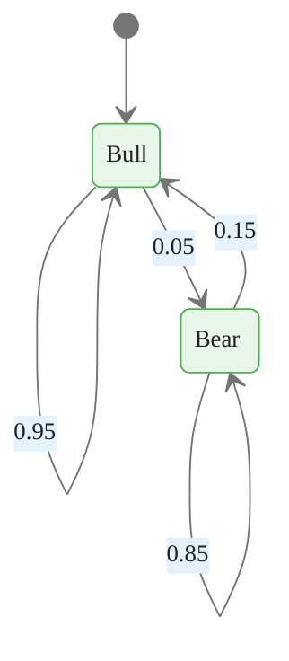
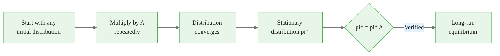
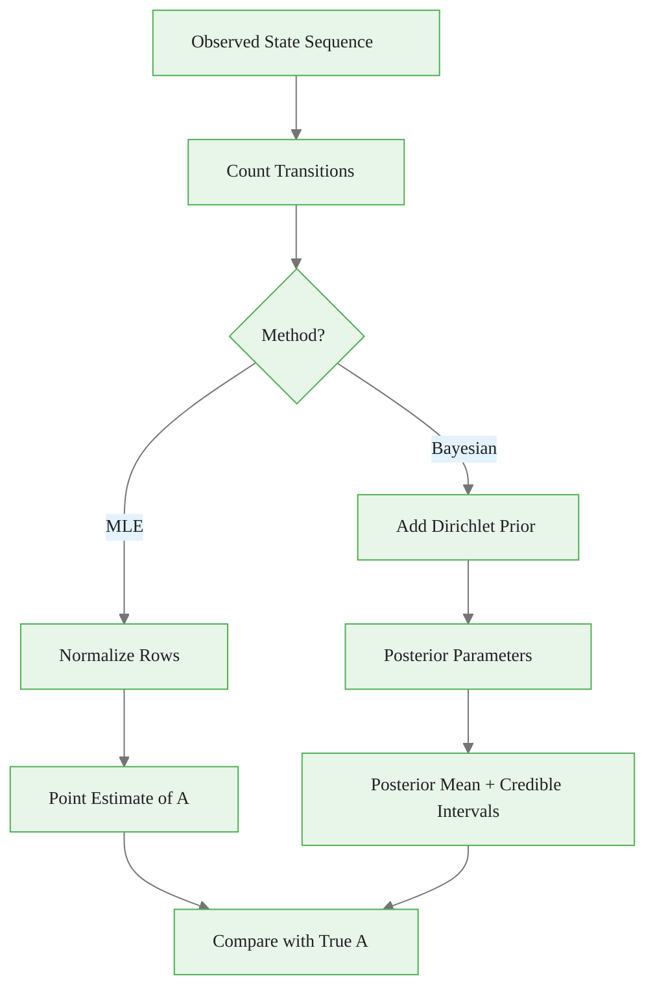
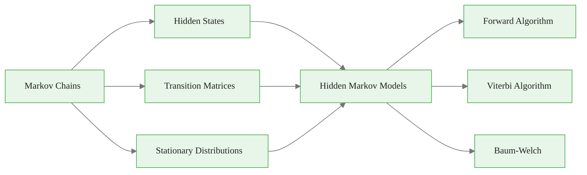

<!-- _class: lead -->

# Markov Chains Foundations

## Module 00 — Foundations
### Hidden Markov Models Course

<!-- Speaker notes: This deck covers the mathematical foundation for all HMM algorithms. Markov chains are the backbone of HMMs -- the hidden state layer follows a Markov chain. Understanding transition matrices, stationary distributions, and ergodicity is essential before moving to hidden states. -->

---

# What is a Markov Chain?

A **stochastic process** where future states depend only on the **current state** -- not the past.

### The Markov Property

$$P(X_{t+1} | X_t, X_{t-1}, ..., X_1) = P(X_{t+1} | X_t)$$

> "The future is independent of the past, given the present."

<!-- Speaker notes: The Markov property is the key simplification that makes sequential modeling tractable. Instead of tracking the entire history, we only need the current state to predict the future. This dramatically reduces the state space from exponential to constant. In finance, this models the idea that the current market regime contains all relevant information about future regime transitions. -->

---

# Markov Chain State Diagram



<div class="callout-key">

Key implementation detail -- study this pattern carefully.

</div>

<!-- Speaker notes: This state diagram shows a two-state market regime model. Bull markets are highly persistent with a 95 percent self-transition probability, meaning they last on average 20 days. Bear markets are less persistent at 85 percent, lasting about 6.7 days on average. The asymmetry reflects the empirical observation that bull markets tend to be longer than bear markets. -->

---

# Formal Definition

A discrete-time Markov chain consists of:

1. **State space** $S = \{s_1, s_2, ..., s_K\}$
2. **Transition matrix** $A$ where $a_{ij} = P(X_{t+1} = s_j | X_t = s_i)$
3. **Initial distribution** $\pi$ where $\pi_i = P(X_1 = s_i)$

<!-- Speaker notes: These three components fully specify a Markov chain. The state space defines the possible states, the transition matrix defines the dynamics, and the initial distribution defines where the chain starts. For HMMs, we will add a fourth component: the emission model that generates observations from hidden states. -->

---

# Transition Matrix

$$A = \begin{pmatrix}
a_{11} & a_{12} & \cdots & a_{1K} \\
a_{21} & a_{22} & \cdots & a_{2K} \\
\vdots & \vdots & \ddots & \vdots \\
a_{K1} & a_{K2} & \cdots & a_{KK}
\end{pmatrix}$$

**Constraints:**
- $a_{ij} \geq 0$ (non-negative)
- $\sum_{j=1}^K a_{ij} = 1$ (rows sum to 1)

<!-- Speaker notes: The transition matrix is row-stochastic: each row represents a probability distribution over next states. Row i gives the transition probabilities from state i. The two constraints ensure valid probability distributions. These same constraints apply to the transition matrix in HMMs. -->

---

# Implementation -- MarkovChain Class

```python
import numpy as np
from typing import List, Optional

class MarkovChain:
    """Discrete-time Markov chain."""

    def __init__(self, transition_matrix: np.ndarray,
                 state_names: Optional[List[str]] = None):
        self.A = np.array(transition_matrix)
        self.n_states = self.A.shape[0]
        self.state_names = state_names or [f"S{i}" for i in range(self.n_states)]

        assert self.A.shape[0] == self.A.shape[1], "Matrix must be square"
        assert np.allclose(self.A.sum(axis=1), 1), "Rows must sum to 1"
        assert np.all(self.A >= 0), "Probabilities must be non-negative"
```

<div class="callout-insight">

This pattern recurs throughout the course. Understanding it deeply pays dividends later.

</div>

<!-- Speaker notes: The constructor validates the three constraints on the transition matrix: square shape, row-stochastic, and non-negative entries. These assertions catch common errors like accidentally transposing the matrix or providing un-normalized probabilities. The state_names parameter makes output human-readable. -->

---

# Simulation and Analysis Methods

<div class="columns">

**Simulation:**
```python
def simulate(self, n_steps, initial_state=None,
             initial_dist=None):
    if initial_state is None:
        if initial_dist is None:
            initial_dist = np.ones(self.n_states) / self.n_states
        initial_state = np.random.choice(
            self.n_states, p=initial_dist)
    states = [initial_state]
    for _ in range(n_steps - 1):
        states.append(np.random.choice(
            self.n_states, p=self.A[states[-1]]))
    return states
```

<div class="callout-warning">

Watch for edge cases with this implementation in production use.

</div>

**Analysis:**
```python
def stationary_distribution(self):
    eigenvalues, eigvecs = np.linalg.eig(self.A.T)
    idx = np.argmin(np.abs(eigenvalues - 1))
    stationary = np.real(eigvecs[:, idx])
    return stationary / stationary.sum()
```

</div>

<!-- Speaker notes: The simulate method generates a state sequence by sampling from the transition probabilities at each step. The stationary distribution is computed via the eigenvalue method: it is the left eigenvector of A corresponding to eigenvalue 1. We normalize to ensure it sums to 1. The n-step transition matrix can be computed as A raised to the n-th power using np.linalg.matrix_power. -->

---

# Market Regime Example

```python
transition_matrix = np.array([
    [0.95, 0.05],  # Bull -> Bull: 95%, Bull -> Bear: 5%
    [0.15, 0.85]   # Bear -> Bull: 15%, Bear -> Bear: 85%
])

mc = MarkovChain(transition_matrix, state_names=["Bull", "Bear"])

states = mc.simulate(100, initial_state=0)
print(f"Simulated states: {states[:20]}...")

pi = mc.stationary_distribution()
print(f"Stationary distribution: Bull={pi[0]:.2%}, Bear={pi[1]:.2%}")
```

<div class="callout-info">

This approach follows established best practices in the field.

</div>

<!-- Speaker notes: With these parameters, the stationary distribution gives about 75 percent time in bull and 25 percent in bear, computed as pi_bull equals 0.15 divided by 0.05 plus 0.15. This matches the intuition: bear markets transition to bull three times faster than bull transitions to bear, so the chain spends more time in bull. -->

---

<!-- _class: lead -->

# Key Properties

<!-- Speaker notes: Understanding these properties is important because they determine whether our Markov chain model has a well-defined long-run behavior. Ergodic chains converge to a unique stationary distribution regardless of starting state. -->

---

# Stationary Distribution

The stationary distribution $\pi^*$ satisfies:

$$\pi^* = \pi^* A$$

$\pi^*$ is the **left eigenvector** of $A$ for eigenvalue 1.

```python
def verify_stationary(mc: MarkovChain):
    pi = mc.stationary_distribution()
    pi_next = pi @ mc.A
    print(f"pi:  {pi}")
    print(f"piA: {pi_next}")
    print(f"Converged: {np.allclose(pi, pi_next)}")
```

<!-- Speaker notes: The stationary distribution is a fixed point: multiplying by A leaves it unchanged. This means that if the chain reaches this distribution, it stays there forever. The verification code confirms this by checking that pi times A equals pi, up to numerical precision. -->

---

# Stationary Distribution Flow



<!-- Speaker notes: This diagram shows the convergence process. Starting from any initial distribution, repeatedly multiplying by A causes the distribution to converge to the stationary distribution. The rate of convergence depends on the second largest eigenvalue of A: closer to 1 means slower convergence. -->

---

# Ergodicity

A Markov chain is **ergodic** if it is:

1. **Irreducible**: Every state reachable from every other state
2. **Aperiodic**: No regular cycling patterns

> Ergodic chains have a **unique** stationary distribution.

<!-- Speaker notes: Irreducibility means there are no absorbing states or disconnected components. Aperiodicity means the chain does not cycle deterministically through states. Most financial regime models are ergodic because markets can always transition between any pair of regimes, and self-transitions break any periodicity. -->

---

# Checking Irreducibility and Aperiodicity

<div class="columns">

```python
def check_irreducibility(A):
    n = A.shape[0]
    reachability = sum(
        np.linalg.matrix_power(
            A > 0, k
        ) for k in range(n)
    )
    return np.all(reachability > 0)
```

```python
def check_aperiodicity(A):
    # Self-transition => aperiodic
    if np.any(np.diag(A) > 0):
        return True
    An = A.copy()
    for _ in range(A.shape[0] * 2):
        An = An @ A
        if np.all(An > 0):
            return True
    return False
```

</div>

<!-- Speaker notes: Irreducibility is checked by verifying that the reachability matrix has all positive entries. The reachability matrix sums powers of the adjacency matrix, indicating whether state j is reachable from state i within n steps. Aperiodicity is easily verified by checking for self-transitions: any positive diagonal entry guarantees aperiodicity. -->

---

# Convergence Rate

The rate of convergence to stationary distribution depends on the **second largest eigenvalue**:

$$\|\pi_t - \pi^*\| \leq C \cdot |\lambda_2|^t$$

```python
def convergence_rate(mc: MarkovChain) -> float:
    eigenvalues = np.linalg.eigvals(mc.A)
    eigenvalues_sorted = sorted(np.abs(eigenvalues), reverse=True)
    return eigenvalues_sorted[1]

rate = convergence_rate(mc)
print(f"Convergence rate: {rate:.4f}")
print(f"Half-life: {np.log(2) / np.log(1/rate):.1f} steps")
```

<!-- Speaker notes: The second largest eigenvalue determines the spectral gap and hence the mixing time. For our bull-bear model with persistence 0.95 and 0.85, the second eigenvalue is 0.80, giving a half-life of about 3 steps. This means the chain loses memory of its starting state quickly. In practice, financial regime models have second eigenvalues close to 1, indicating slow mixing and persistent regimes. -->

---

# Expected Hitting Times

The expected number of steps to reach state $j$ from state $i$:

<div class="code-window">
<div class="code-header">
<div class="dots"><span class="dot-red"></span><span class="dot-yellow"></span><span class="dot-green"></span></div>
<span class="filename">expected_hitting_time.py</span>
</div>

```python
def expected_hitting_time(mc, target_state):
    n = mc.n_states
    j = target_state
    mask = np.ones(n, dtype=bool)
    mask[j] = False
    A_reduced = mc.A[np.ix_(mask, mask)]
    b = np.ones(n - 1)
    hitting_times = np.linalg.solve(np.eye(n-1) - A_reduced, b)
    result = np.zeros(n)
    result[mask] = hitting_times
    return result
```

</div>

<!-- Speaker notes: The expected hitting time from state i to state j is found by solving a system of linear equations derived from the first-step analysis. We remove the target state from the system and solve for the expected number of steps from each remaining state. This is useful in finance for answering questions like: if we are in a bear market, how long on average until we return to a bull market? -->

---

<!-- _class: lead -->

# Estimation

<!-- Speaker notes: In practice, we observe a state sequence and want to estimate the transition matrix. Maximum likelihood estimation is straightforward: count transitions and normalize. Bayesian estimation adds prior information and quantifies uncertainty. -->

---

# Maximum Likelihood Estimation

<div class="code-window">
<div class="code-header">
<div class="dots"><span class="dot-red"></span><span class="dot-yellow"></span><span class="dot-green"></span></div>
<span class="filename">estimate_transitions.py</span>
</div>

```python
def estimate_transitions(states: List[int], n_states: int) -> np.ndarray:
    """Estimate transition matrix from observed state sequence."""
    counts = np.zeros((n_states, n_states))
    for i in range(len(states) - 1):
        counts[states[i], states[i+1]] += 1
    row_sums = counts.sum(axis=1, keepdims=True)
    row_sums[row_sums == 0] = 1
    return counts / row_sums

estimated_A = estimate_transitions(states, mc.n_states)
print("Estimated transition matrix:")
print(estimated_A)
```

</div>

<!-- Speaker notes: MLE for Markov chains simply counts the number of times each transition i to j occurs and divides by the total number of transitions from state i. This is the maximum likelihood estimator under the multinomial model. The guard against zero row sums prevents division by zero for states never visited, which can happen with short sequences or many states. -->

---

# Bayesian Estimation

<div class="code-window">
<div class="code-header">
<div class="dots"><span class="dot-red"></span><span class="dot-yellow"></span><span class="dot-green"></span></div>
<span class="filename">bayesian_transitions.py</span>
</div>

```python
def bayesian_transitions(states, n_states, prior_alpha=1.0):
    """Bayesian estimation with Dirichlet prior."""
    from scipy import stats
    counts = np.zeros((n_states, n_states))
    for i in range(len(states) - 1):
        counts[states[i], states[i+1]] += 1

    posterior_alpha = counts + prior_alpha
    mean = posterior_alpha / posterior_alpha.sum(axis=1, keepdims=True)

    ci_lower, ci_upper = np.zeros_like(mean), np.zeros_like(mean)
    for i in range(n_states):
        for j in range(n_states):
            alpha = posterior_alpha[i, j]
            beta = posterior_alpha[i].sum() - alpha
            ci_lower[i, j] = stats.beta.ppf(0.025, alpha, beta)
            ci_upper[i, j] = stats.beta.ppf(0.975, alpha, beta)
    return mean, ci_lower, ci_upper
```

</div>

<!-- Speaker notes: Bayesian estimation adds a Dirichlet prior with parameter alpha to the transition counts. With alpha equals 1, this is equivalent to Laplace smoothing and produces the posterior mean. The credible intervals quantify uncertainty in each transition probability. This is particularly useful with small samples where MLE may be unreliable. The Dirichlet is the conjugate prior for the multinomial, making the posterior analytically tractable. -->

---

# MLE vs Bayesian Estimation Flow



<!-- Speaker notes: Both methods start by counting transitions. MLE normalizes directly, giving a point estimate. Bayesian estimation adds prior counts first, producing a posterior distribution that provides both point estimates and uncertainty quantification. In practice, Bayesian estimation is preferred when you have fewer than 100 transitions per state. -->

---

# Key Takeaways

| Concept | Summary |
|---------|---------|
| **Markov property** | Enables tractable analysis of sequential data |
| **Transition matrix** | Encodes all dynamics in a compact form |
| **Stationary distribution** | Describes long-run behavior |
| **Ergodicity** | Ensures convergence to unique equilibrium |
| **MLE estimation** | Straightforward from observed sequences |

<!-- Speaker notes: These five concepts form the foundation for everything that follows in the HMM course. The Markov property makes inference tractable, the transition matrix is the core data structure, the stationary distribution describes equilibrium, ergodicity guarantees convergence, and MLE provides a simple estimation method. -->

---

# Connections



<!-- Speaker notes: This diagram shows how Markov chains connect to the rest of the course. The transition matrix and stationary distribution concepts carry directly into HMMs as the hidden state dynamics. The Forward, Viterbi, and Baum-Welch algorithms all rely on the Markov property for their dynamic programming formulations. -->
