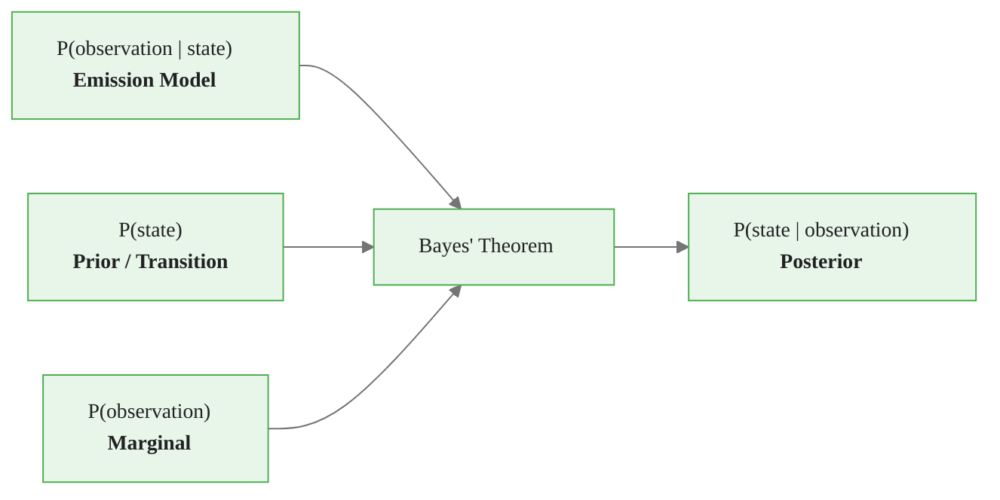
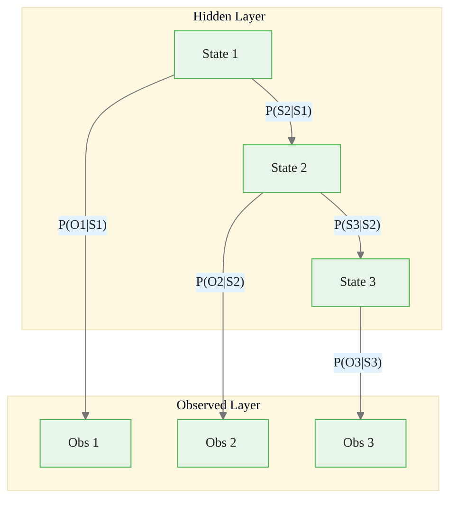
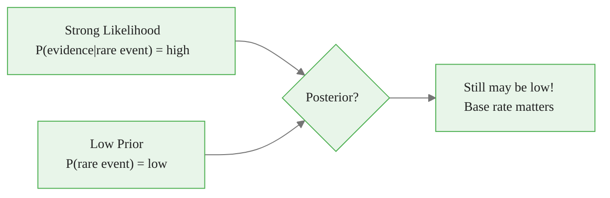
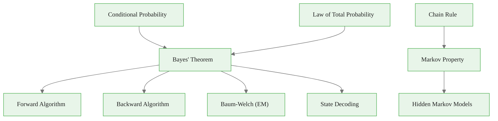

<!-- _class: lead -->

# Probability Review for Hidden Markov Models

## Module 00 — Foundations
### Hidden Markov Models Course

<!-- Speaker notes: This module reviews the probability foundations needed for HMMs. Learners should already have basic probability knowledge; this review connects familiar concepts to HMM-specific applications. -->
---

# In Brief

Essential probability concepts for HMMs:

- **Conditional probability**
- **Bayes' theorem**
- **Probability distributions**
- **Law of total probability**

> These form the mathematical foundation for understanding how hidden states generate observable sequences.

<!-- Speaker notes: This slide sets up the fundamental concept of hidden states. The key distinction is between what drives the system (hidden states) and what we can measure (observations). This disconnect is what makes HMMs both challenging and powerful. -->
---

# Key Insight

HMMs are fundamentally about computing **conditional probabilities** of hidden states given observations.

**Bayes' theorem** lets us invert relationships:

$$P(\text{observation}|\text{state}) \xrightarrow{\text{Bayes'}} P(\text{state}|\text{observation})$$

<!-- Speaker notes: The key insight is that HMMs invert conditional probabilities using Bayes' theorem. We know how states generate observations (emission model) and want to infer states from observations (posterior). This inversion is the central computational challenge. -->
---

# Bayes' Theorem Flow in HMMs



<div class="callout-key">

Key implementation detail -- study this pattern carefully.

</div>

<!-- Speaker notes: Walk through each arrow in the diagram. The emission model gives us P(observation given state), the transition model gives P(state), and Bayes' theorem combines them to give P(state given observation). This is exactly what the Forward-Backward algorithm computes. -->
---

# Conditional Probability

The probability of event $A$ given event $B$ has occurred:

$$P(A|B) = \frac{P(A \cap B)}{P(B)}$$

provided $P(B) > 0$.

**Intuition:** Conditional probability is updating beliefs with new information.

> If you know the market was in a bull regime, what's the probability of positive returns?

<!-- Speaker notes: Start with the simple definition and then connect it to HMMs: P(return given bull market) is a conditional probability that the emission model encodes. The intuition of updating beliefs with new information is central to sequential inference. -->
---

# Bayes' Theorem

$$P(A|B) = \frac{P(B|A) \cdot P(A)}{P(B)}$$

**In HMM context:**

$$P(\text{state}|\text{observations}) = \frac{P(\text{observations}|\text{state}) \cdot P(\text{state})}{P(\text{observations})}$$

| Term | Name | Role |
|----------|----------|----------|
| $P(B\|A)$ | Likelihood | How likely is the evidence given hypothesis? |
| $P(A)$ | Prior | What did we believe before? |
| $P(B)$ | Marginal | How likely is the evidence overall? |
| $P(A\|B)$ | Posterior | What do we believe after? |

<!-- Speaker notes: Walk through each row of the table: likelihood is what the emission model provides, prior comes from the transition matrix, marginal is computed by the forward algorithm, and posterior is what we ultimately want. This table maps directly to HMM inference. -->

---

# Law of Total Probability

For a partition $\{B_1, B_2, ..., B_n\}$ of the sample space:

$$P(A) = \sum_{i=1}^{n} P(A|B_i) \cdot P(B_i)$$

**Intuition:** To find the probability of an observation, consider **all possible hidden states** that could generate it, weighted by how likely each state is.

<!-- Speaker notes: This is the mathematical foundation of the Forward algorithm: to compute the probability of an observation, we sum over all possible hidden states, weighted by their probabilities. This marginalization over hidden states is the core computational step. -->
---

# Joint, Marginal, and Conditional

For random variables $X$ and $Y$:

| Type | Formula |
|----------|----------|
| **Joint** | $P(X=x, Y=y)$ |
| **Marginal** | $P(X=x) = \sum_y P(X=x, Y=y)$ |
| **Conditional** | $P(X=x\|Y=y) = \frac{P(X=x, Y=y)}{P(Y=y)}$ |

<!-- Speaker notes: These three probability types appear throughout HMM inference. The joint probability P(states, observations) is factored using the chain rule. Marginal probabilities are computed by the Forward algorithm. Conditional probabilities are the posterior state estimates. -->

---

# The HMM Connection

```
Hidden States (unknown):  S1 --> S2 --> S3 --> ...
                           |      |      |
                           v      v      v
Observations (known):     O1     O2     O3   ...

Question: Given we see O1, O2, O3, what states generated them?
Answer:   P(S1,S2,S3 | O1,O2,O3) <-- Bayes' theorem!
```

<!-- Speaker notes: This ASCII diagram formalizes the HMM structure: hidden states generate observations through emission probabilities. The question at the bottom is exactly the decoding problem solved by the Viterbi algorithm in Module 02. -->
---

# Probability Flow in an HMM



<div class="callout-insight">

This pattern recurs throughout the course. Understanding it deeply pays dividends later.

</div>

<!-- Speaker notes: This Mermaid diagram formalizes the HMM graphical model. Horizontal arrows are transition probabilities P(S2 given S1), vertical arrows are emission probabilities P(O1 given S1). The conditional independence structure enables efficient dynamic programming. -->
---

# Chain Rule of Probability

$$P(A_1, A_2, ..., A_n) = P(A_1) \cdot P(A_2|A_1) \cdot P(A_3|A_1, A_2) \cdots P(A_n|A_1, ..., A_{n-1})$$

**For HMM state sequences** (using Markov property):

$$P(q_1, q_2, ..., q_T) = P(q_1) \prod_{t=2}^{T} P(q_t | q_{t-1})$$

<!-- Speaker notes: The chain rule factorizes the joint probability of a sequence. The Markov property simplifies this dramatically: instead of conditioning on all previous states, each state only conditions on the immediately preceding state. This reduces the computation from exponential to linear. -->
---

# Independence and Conditional Independence

**Independence:** $P(A \cap B) = P(A) \cdot P(B)$

**Conditional Independence** (key for HMMs):

$$P(A, B | C) = P(A|C) \cdot P(B|C)$$

> In HMMs: Future and past are **conditionally independent** given the present state.

<!-- Speaker notes: Conditional independence is the key structural assumption of HMMs. Given the current hidden state, the observation is independent of all past states and observations. This is what makes the E-step of Baum-Welch tractable. -->
---

# Code — Conditional Probability and Bayes' Theorem

<div class="columns">

```python
def conditional_probability(
    joint_prob, condition_prob
):
    """P(A|B) = P(A,B) / P(B)"""
    if condition_prob == 0:
        raise ValueError(
            "Zero probability"
        )
    return joint_prob / condition_prob
```

<div class="callout-warning">

Watch for edge cases with this implementation in production use.

</div>

```python
def bayes_theorem(
    likelihood, prior, marginal
):
    """
    P(A|B) = P(B|A) * P(A) / P(B)
    """
    return (
        (likelihood * prior) / marginal
    )
```

</div>

<!-- Speaker notes: These are minimal implementations of the probability formulas. In practice, these operations are embedded inside the Forward-Backward algorithm, but seeing them as standalone functions helps build intuition. -->
---

# Code — Law of Total Probability

```python
def total_probability(conditional_probs, partition_probs):
    """
    P(A) = sum_i P(A|Bi) * P(Bi)
    """
    return np.dot(conditional_probs, partition_probs)
```

<div class="callout-info">

This approach follows established best practices in the field.

</div>

<!-- Speaker notes: The total probability function is a simple dot product, which is exactly what the Forward algorithm computes at each time step: sum over states of alpha times transition times emission. -->
---

# Market Regime Inference Example

```python
class RegimeInference:
    def __init__(self):
        self.p_bull, self.p_bear = 0.6, 0.4
        self.p_positive_given_bull = 0.7
        self.p_positive_given_bear = 0.3

    def marginal_positive_return(self):
        return total_probability(
            [self.p_positive_given_bull, self.p_positive_given_bear],
            [self.p_bull, self.p_bear]
        )

    def posterior_bull_given_positive(self):
        marginal = self.marginal_positive_return()
        return bayes_theorem(
            self.p_positive_given_bull, self.p_bull, marginal
        )
```

<!-- Speaker notes: This concrete example shows Bayes' theorem in action for market regime inference. Walking through the numbers: starting with 60 percent belief in bull, observing a positive return increases our belief to 77.8 percent. This is the same update that the Forward-Backward algorithm performs at each time step. -->
---

# Regime Inference Results

```python
regime_model = RegimeInference()

# Prior:    P(Bull) = 60%, P(Bear) = 40%
# Likelihood: P(+return | Bull) = 70%, P(+return | Bear) = 30%

# Posterior:
# P(Bull | +return) = 77.8%  (up from 60%)
# P(Bull | -return) = 39.1%  (down from 60%)
```

> Observing a positive return **increases** our belief we are in a bull regime.

<!-- Speaker notes: Highlight the key insight: observing evidence updates our beliefs. A positive return shifts probability toward bull, a negative return shifts toward bear. This is filtering in action, which the Forward algorithm formalizes for sequences. -->
---

# Discrete Probability Distributions

```python
class DiscreteProbDist:
    def __init__(self, outcomes, probabilities):
        self.outcomes = outcomes
        self.probs = np.array(probabilities)
        assert np.allclose(self.probs.sum(), 1.0)

    def sample(self, n=1):
        indices = np.random.choice(len(self.outcomes), size=n, p=self.probs)
        return [self.outcomes[i] for i in indices]

    def expectation(self, function=None):
        if function is None:
            function = lambda x: x
        return sum(function(o) * p for o, p in zip(self.outcomes, self.probs))
```

<!-- Speaker notes: This class implements a discrete probability distribution, which is the emission model for discrete HMMs. The sample method generates observations and the expectation method computes expected values, both of which are used in the EM algorithm. -->
---

# Continuous Distributions — Gaussian

<div class="code-window">
<div class="code-header">
<div class="dots"><span class="dot-red"></span><span class="dot-yellow"></span><span class="dot-green"></span></div>
<span class="filename">gaussiandistribution.py</span>
</div>

```python
from scipy import stats

class GaussianDistribution:
    def __init__(self, mean, variance):
        self.mean = mean
        self.std = np.sqrt(variance)
        self.dist = stats.norm(loc=mean, scale=self.std)

    def pdf(self, x):
        return self.dist.pdf(x)

    def log_likelihood(self, observations):
        return np.sum(self.dist.logpdf(observations))

# Return distributions by regime
bull_returns = GaussianDistribution(mean=0.05, variance=0.01)
bear_returns = GaussianDistribution(mean=-0.03, variance=0.04)
```

</div>

<!-- Speaker notes: The Gaussian distribution is the emission model for continuous HMMs, which we will use extensively in Module 03. The log_likelihood method is critical for numerical stability when evaluating long observation sequences. -->
---

<!-- _class: lead -->

# Common Pitfalls

<!-- Speaker notes: These pitfalls represent the most frequent mistakes practitioners make when implementing HMMs. Each one can lead to silently wrong results if not addressed. -->
---

# Pitfall 1 — Confusing P(A|B) with P(B|A)

$$P(\text{positive return} | \text{bull market}) \neq P(\text{bull market} | \text{positive return})$$

Always use **Bayes' theorem** to flip conditional probabilities.

<!-- Speaker notes: The prosecutor's fallacy is a classic example: P(evidence given guilt) is not P(guilt given evidence). In HMMs, confusing P(return given bull) with P(bull given return) leads to incorrect state estimates. Always apply Bayes' theorem explicitly. -->
---

# Pitfall 2 — Ignoring the Base Rate

- Posterior depends on **both** likelihood AND prior
- Rare events need **strong evidence** to become probable



<!-- Speaker notes: Base rate neglect is especially dangerous in regime detection. Even if a crash-like return is very likely in a bear market, if bear markets are rare, the posterior probability of being in a bear market may still be low after a single bad day. -->
---

# Pitfall 3 — Numerical Underflow

Multiplying many small probabilities leads to **zero** (underflow).

<div class="columns">

<div class="code-window">
<div class="code-header">
<div class="dots"><span class="dot-red"></span><span class="dot-yellow"></span><span class="dot-green"></span></div>
<span class="filename">example.py</span>
</div>

```python
# BAD: underflow
probs = [0.01] * 100
product = np.prod(probs)
# --> 0.0 (underflow!)
```

</div>

<div class="code-window">
<div class="code-header">
<div class="dots"><span class="dot-red"></span><span class="dot-yellow"></span><span class="dot-green"></span></div>
<span class="filename">example.py</span>
</div>

```python
# GOOD: log-space
log_probs = np.log([0.01] * 100)
log_product = np.sum(log_probs)
product = np.exp(log_product)
# --> accurate result
```

</div>

</div>

> **Rule:** Always work in **log space** when multiplying probabilities.

<!-- Speaker notes: Numerical underflow is the most common implementation bug in HMM algorithms. When multiplying hundreds of small probabilities, the product underflows to zero. The log-space solution converts multiplication to addition, which is numerically stable. -->
---

# More Pitfalls

| Pitfall | Solution |
|----------|----------|
| Assuming independence when it doesn't hold | Check assumptions; returns are often autocorrelated |
| Forgetting to normalize | Probabilities must sum to 1; verify after Bayes' |
| Numerical underflow in products | Work in log space: $\log(a \times b) = \log a + \log b$ |

<!-- Speaker notes: This summary table consolidates the key numerical and conceptual pitfalls. The autocorrelation point is particularly relevant: financial returns exhibit serial correlation, which violates the independence assumption unless accounted for by the hidden state structure. -->

---

# Practice Problem — Bayes' Theorem

**Given:**
- $P(\text{Bull}) = 0.6$, $P(\text{Bear}) = 0.4$
- $P(\text{+return}|\text{Bull}) = 0.7$, $P(\text{+return}|\text{Bear}) = 0.3$

**Find:** $P(\text{Bull}|\text{+return})$

**Solution:**
$$P(\text{+return}) = 0.7 \times 0.6 + 0.3 \times 0.4 = 0.54$$
$$P(\text{Bull}|\text{+return}) = \frac{0.7 \times 0.6}{0.54} \approx 77.8\%$$

<!-- Speaker notes: Walk through this problem step by step. First compute the marginal, then apply Bayes. The answer of 77.8 percent matches the RegimeInference class output, providing a consistency check. -->
---

# Connections



<!-- Speaker notes: This diagram maps the probability concepts to the HMM algorithms they enable. Conditional probability and the law of total probability feed into the Forward and Backward algorithms. The chain rule combined with the Markov property is what makes HMM inference tractable. -->
---

# Summary

| Concept | Role in HMMs |
|----------|----------|
| Conditional probability | Emission model $P(o_t \| q_t)$ |
| Bayes' theorem | Infer states from observations |
| Law of total probability | Marginalize over hidden states (Forward algo) |
| Chain rule + Markov property | Factorize joint probability of state sequences |
| Conditional independence | Enables efficient dynamic programming |

<!-- Speaker notes: This summary table maps each probability concept to its role in HMMs. Use this as a reference card for the rest of the course. -->

> **Next:** With this probability foundation, you are ready for Markov chains and Hidden Markov Models.

