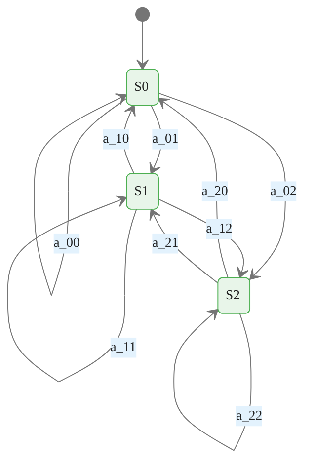
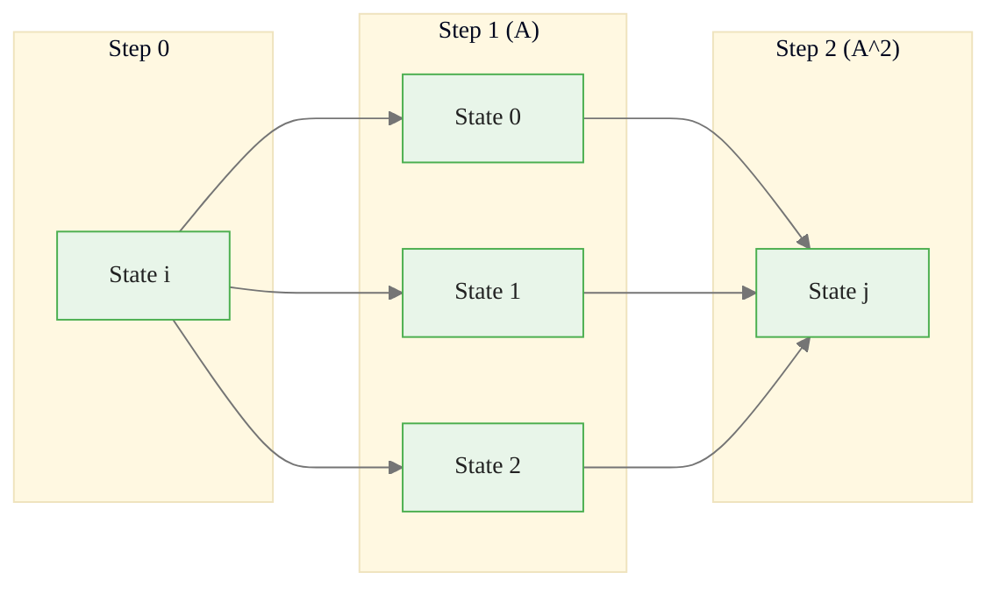
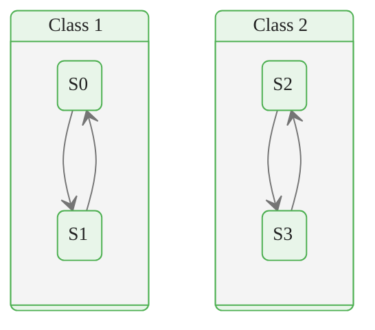
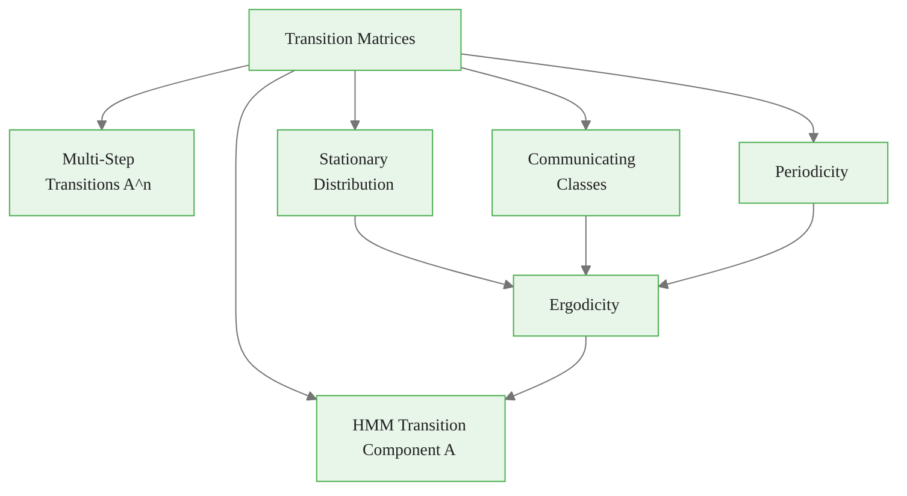

<!-- _class: lead -->

# Transition Matrices and State Dynamics

## Module 00 — Foundations
### Hidden Markov Models Course

<!-- Speaker notes: Transition matrices are the mathematical backbone of Markov processes. This section covers construction, analysis, stationary distributions, and state classification, all of which are prerequisites for HMM algorithms. -->
---

# Introduction

The **transition matrix** is the heart of Markov processes.

It encodes the probabilistic rules governing **state evolution**.

<!-- Speaker notes: The transition matrix is the single most important data structure in Markov chains and HMMs. Everything from stationary distributions to the Forward algorithm depends on it. -->
---

# The Transition Matrix

For a Markov chain with $K$ states, the transition matrix $A$ is $K \times K$:

$$A = \begin{bmatrix}
a_{11} & a_{12} & \cdots & a_{1K} \\
a_{21} & a_{22} & \cdots & a_{2K} \\
\vdots & \vdots & \ddots & \vdots \\
a_{K1} & a_{K2} & \cdots & a_{KK}
\end{bmatrix}$$

where $a_{ij} = P(S_{t+1} = j | S_t = i)$

<!-- Speaker notes: Walk through the matrix notation: row i, column j gives the probability of transitioning from state i to state j. Emphasize the row-stochastic constraint: each row is a probability distribution over next states. -->
---

# Required Properties

1. **Non-negativity**: $a_{ij} \geq 0$ for all $i, j$
2. **Row-stochastic**: $\sum_j a_{ij} = 1$ for all $i$



<div class="callout-key">

Key implementation detail -- study this pattern carefully.

</div>

<!-- Speaker notes: The state diagram visualizes the transition matrix. Each arrow is labeled with the corresponding matrix entry. The sum of all arrows leaving a state must equal 1. -->
---

# Creating Transition Matrices

```python
import numpy as np

def create_transition_matrix(n_states, style='random'):
    if style == 'random':
        A = np.random.rand(n_states, n_states)
        A = A / A.sum(axis=1, keepdims=True)
    elif style == 'persistent':
        A = np.eye(n_states) * 0.8
        off_diag = (1 - 0.8) / (n_states - 1)
        A[A == 0] = off_diag
    elif style == 'cyclic':
        A = np.zeros((n_states, n_states))
        for i in range(n_states):
            A[i, (i + 1) % n_states] = 0.9
            A[i, i] = 0.1
    elif style == 'absorbing':
        A = np.random.rand(n_states, n_states)
        A = A / A.sum(axis=1, keepdims=True)
        A[-1, :] = 0; A[-1, -1] = 1
    return A
```

<div class="callout-insight">

This pattern recurs throughout the course. Understanding it deeply pays dividends later.

</div>

<!-- Speaker notes: This function generates four types of transition matrices. Persistent matrices have high diagonal values, modeling sticky regimes. Cyclic matrices rotate through states, modeling seasonal patterns. Absorbing matrices have a terminal state, modeling default or bankruptcy. -->
---

# Transition Matrix Styles

| Style | Character | Example Use |
|----------|----------|----------|
| **Random** | No structure | Baseline / testing |
| **Persistent** | High self-transitions | Regime models |
| **Cyclic** | Rotate through states | Seasonal patterns |
| **Absorbing** | One terminal state | Default / bankruptcy |

<!-- Speaker notes: This table provides a quick reference for when to use each style. In financial applications, persistent is the most common because market regimes tend to last for extended periods. -->

---

<!-- _class: lead -->

# Multi-Step Transitions

<!-- Speaker notes: Multi-step transitions extend the one-step model to predict regime probabilities over longer horizons, which is essential for forecasting. -->
---

# Chapman-Kolmogorov Equation

The probability of transitioning from state $i$ to state $j$ in $n$ steps:

$$P(S_{t+n} = j | S_t = i) = [A^n]_{ij}$$

> Matrix power $A^n$ gives all $n$-step transition probabilities at once.

<!-- Speaker notes: The Chapman-Kolmogorov equation is the foundation for multi-step prediction. Matrix power A to the n gives all n-step transition probabilities simultaneously. This is computationally efficient and forms the basis for forecasting. -->
---

# Multi-Step Transition Visualization



<div class="callout-warning">

Watch for edge cases with this implementation in production use.

</div>

All intermediate paths are summed: $[A^2]_{ij} = \sum_k a_{ik} \cdot a_{kj}$

<!-- Speaker notes: This diagram shows that the 2-step transition probability from i to j sums over all intermediate states k. Each path i to k to j contributes a term a_ik times a_kj. This is exactly matrix multiplication. -->
---

# Analyzing Multi-Step Transitions

```python
def analyze_multistep_transitions(A, max_steps=10):
    n_states = A.shape[0]
    powers = [np.eye(n_states)]  # A^0 = I
    for step in range(1, max_steps + 1):
        powers.append(A @ powers[-1])

    # Compute stationary distribution
    eigenvalues, eigenvectors = np.linalg.eig(A.T)
    stationary_idx = np.argmin(np.abs(eigenvalues - 1))
    stationary = np.real(eigenvectors[:, stationary_idx])
    stationary = stationary / stationary.sum()

    return powers, stationary
```

<div class="callout-info">

This approach follows established best practices in the field.

</div>

<!-- Speaker notes: This code computes transition matrix powers and the stationary distribution. The powers converge to a matrix where every row equals the stationary distribution, illustrating the ergodic theorem. -->
---

<!-- _class: lead -->

# Stationary Distribution

<!-- Speaker notes: The stationary distribution describes the long-run behavior of the Markov chain, independent of starting conditions. -->
---

# Definition

A stationary distribution $\pi$ satisfies:

$$\pi = \pi A$$

$\pi$ is a **left eigenvector** of $A$ with eigenvalue 1.

<!-- Speaker notes: The stationary distribution equation pi equals pi times A is a fixed-point condition. It means that if the chain starts in the stationary distribution, it stays there. This is the long-run equilibrium of the system. -->
---

# Three Methods to Compute

<div class="columns">

**1. Eigenvalue Decomposition**
```python
eigenvalues, eigvecs = np.linalg.eig(A.T)
idx = np.argmin(np.abs(eigenvalues - 1))
pi = np.real(eigvecs[:, idx])
pi = pi / pi.sum()
```

**2. Power Iteration**
```python
pi = np.ones(n) / n
for _ in range(1000):
    pi_new = pi @ A
    if np.allclose(pi, pi_new):
        break
    pi = pi_new
```

</div>

**3. Linear System** — Solve $(A^T - I)\pi = 0$ with $\sum \pi_i = 1$

<!-- Speaker notes: All three methods compute the same result. Eigenvalue decomposition is the most numerically stable. Power iteration is the most intuitive. The linear system method is useful when you need to solve for the stationary distribution as part of a larger system of equations. -->
---

# Stationary Distribution — Verification

```python
# Compare methods
A = create_transition_matrix(4, 'random')

for method in ['eigenvalue', 'power', 'linear_solve']:
    pi = compute_stationary_distribution(A, method)
    residual = np.max(np.abs(pi - pi @ A))
    print(f"{method}: pi = {pi.round(4)}, residual = {residual:.2e}")
```

> All three methods converge to the same result.

<!-- Speaker notes: Always verify your computed stationary distribution by checking that pi times A equals pi. Numerical errors can accumulate, especially for nearly-periodic chains. -->
---

<!-- _class: lead -->

# Expected Hitting Times

<!-- Speaker notes: Expected hitting times quantify how long it takes to reach target states, which has direct financial applications for regime duration estimation. -->
---

# First Passage Time

Expected steps to reach state $j$ starting from state $i$:

$$h_i = 1 + \sum_{k \neq j} A_{ik} \cdot h_k, \quad h_j = 0$$

```python
def compute_hitting_times(A, target_state):
    n_states = A.shape[0]
    states = [i for i in range(n_states) if i != target_state]
    A_reduced = A[np.ix_(states, states)]
    h_reduced = np.linalg.solve(np.eye(len(states)) - A_reduced,
                                 np.ones(len(states)))
    h = np.zeros(n_states)
    for idx, state in enumerate(states):
        h[state] = h_reduced[idx]
    return h
```

<!-- Speaker notes: Expected hitting times answer the question: how long until we reach a target state? This is solved by a system of linear equations derived from the first-step analysis. In finance, this tells us the expected duration until a regime change. -->
---

<!-- _class: lead -->

# Classification of States

<!-- Speaker notes: State classification determines whether a Markov chain is well-behaved for modeling purposes. -->
---

# Communicating Classes

States $i$ and $j$ **communicate** if you can reach $i$ from $j$ AND $j$ from $i$.



A chain is **irreducible** if all states communicate (one class).

<!-- Speaker notes: States that communicate form a class. A chain is irreducible if all states form a single class. In financial regime models, we typically want irreducibility so that all regimes are reachable from any starting point. -->
---

# Finding Communicating Classes

```python
def find_communicating_classes(A, max_power=100):
    n_states = A.shape[0]
    reach = np.zeros((n_states, n_states), dtype=bool)
    A_power = np.eye(n_states)
    for _ in range(max_power):
        A_power = A_power @ A
        reach = reach | (A_power > 1e-10)

    communicate = reach & reach.T
    # Group states by class using union-find
    classes = list(range(n_states))
    for i in range(n_states):
        for j in range(i + 1, n_states):
            if communicate[i, j]:
                old_class = classes[j]
                new_class = classes[i]
                classes = [new_class if c == old_class else c for c in classes]
    # ... group and return
```

<!-- Speaker notes: This algorithm uses reachability analysis via matrix powers to identify communicating classes. The union-find data structure groups states into equivalence classes. For most financial applications, verify irreducibility rather than computing all classes. -->
---

# Periodicity

<div class="columns">

**Aperiodic** (period = 1):
```python
A = np.array([
    [0.5, 0.5],
    [0.3, 0.7]
])
# Has self-transitions => aperiodic
```

**Periodic** (period = 2):
<div class="code-window">
<div class="code-header">
<div class="dots"><span class="dot-red"></span><span class="dot-yellow"></span><span class="dot-green"></span></div>
<span class="filename">example.py</span>
</div>

```python
A = np.array([
    [0.0, 1.0],
    [1.0, 0.0]
])
# Alternates: 0->1->0->1->...
```

</div>

</div>

<div class="code-window">
<div class="code-header">
<div class="dots"><span class="dot-red"></span><span class="dot-yellow"></span><span class="dot-green"></span></div>
<span class="filename">compute_period.py</span>
</div>

```python
def compute_period(A, state=0, max_steps=100):
    return_times = []
    A_power = A.copy()
    for step in range(1, max_steps + 1):
        if A_power[state, state] > 1e-10:
            return_times.append(step)
        A_power = A_power @ A
    from math import gcd; from functools import reduce
    return reduce(gcd, return_times) if len(return_times) >= 2 else 1
```

</div>

<!-- Speaker notes: Periodicity means the chain revisits a state only at regular intervals. Any self-transition breaks periodicity. Financial regime models almost always have self-transitions (persistent regimes), so aperiodicity is guaranteed. -->
---

# Visualization — Heatmap and Graph

<div class="code-window">
<div class="code-header">
<div class="dots"><span class="dot-red"></span><span class="dot-yellow"></span><span class="dot-green"></span></div>
<span class="filename">visualize_transition_matrix.py</span>
</div>

```python
def visualize_transition_matrix(A, state_names=None):
    fig, axes = plt.subplots(1, 2, figsize=(14, 5))

    # Left: Heatmap
    ax1 = axes[0]
    im = ax1.imshow(A, cmap='Blues', vmin=0, vmax=1)
    for i in range(n_states):
        for j in range(n_states):
            color = 'white' if A[i,j] > 0.5 else 'black'
            ax1.text(j, i, f'{A[i,j]:.2f}', ha='center',
                     va='center', color=color)

    # Right: Network with arrows
    # ... (circular layout with weighted edges)
```

</div>

<!-- Speaker notes: Visualization is essential for understanding transition matrices. The heatmap shows the magnitude of each entry, making it easy to spot dominant transitions. The network graph shows the chain structure with edge widths proportional to transition probabilities. -->
---

# Key Takeaways

| Concept | Summary |
|----------|----------|
| **Transition matrices** | Row $i$ gives probabilities of next state from state $i$ |
| **Multi-step transitions** | Computed via matrix powers: $A^n$ |
| **Stationary distributions** | Represent long-run behavior |
| **Expected hitting times** | Measure reachability between states |
| **Communication classes** | Characterize chain structure |

<!-- Speaker notes: Transition matrices encode the complete dynamics of a Markov chain. The key practical points are: matrix powers give multi-step predictions, stationary distributions describe long-run behavior, and state classification determines whether the chain is well-behaved for modeling. -->

---

# Connections



<!-- Speaker notes: This diagram shows transition matrices as the foundation for both Markov chain analysis (multi-step transitions, stationary distributions, ergodicity) and HMM transition components. The ergodicity conditions ensure that learned HMM parameters are meaningful. -->
