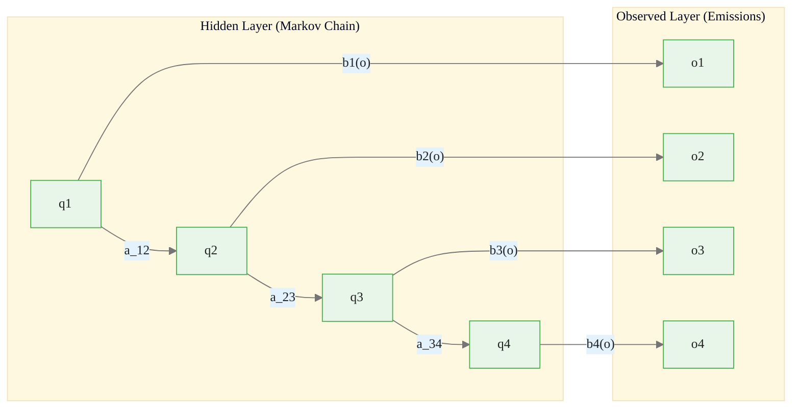
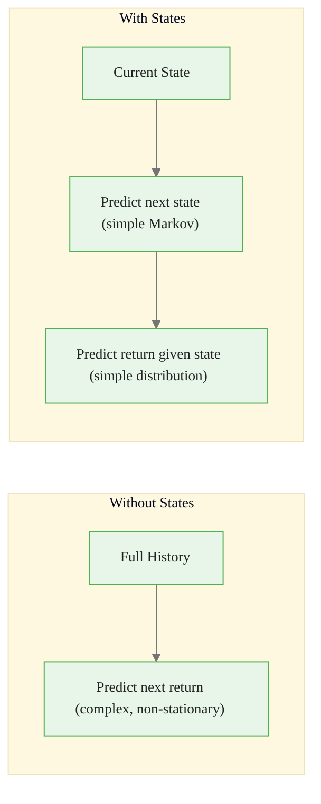
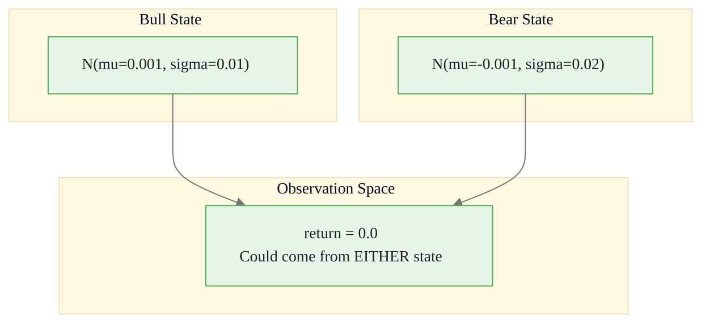
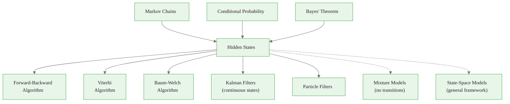

<!-- _class: lead -->

# Hidden States
## Why "Hidden" in Hidden Markov Models?

### Module 00 — Foundations
### Hidden Markov Models Course

<!-- Speaker notes: This section introduces the concept that makes HMMs distinct from observable Markov chains: the states are not directly observed. Understanding why states are hidden and how to infer them is the foundation for all HMM algorithms. -->
---

# In Brief

Hidden Markov Models assume an underlying **(hidden) state process** that we cannot directly observe.

We only see **emissions or observations** generated by these hidden states.

> The goal is to **infer the hidden states** from the observations.

<!-- Speaker notes: This slide sets up the fundamental concept of hidden states. The key distinction is between what drives the system (hidden states) and what we can measure (observations). This disconnect is what makes HMMs both challenging and powerful. -->
---

# Key Insight

Financial markets have regimes (bull/bear, high/low volatility) that we **cannot directly observe** — we only see prices and returns.

HMMs model this disconnect between:
- What **truly drives** the system (hidden states)
- What we **measure** (observations)

<!-- Speaker notes: Financial markets have regimes that we cannot directly measure. No single number tells us we are in a bull or bear market. HMMs formalize this intuition: hidden states drive the system while we only observe their effects (prices, returns, volatility). -->
---

# The HMM Structure



<div class="callout-key">

Key implementation detail -- study this pattern carefully.

</div>

<!-- Speaker notes: This is the canonical HMM diagram. The top row is the hidden Markov chain with transition probabilities. The bottom row is the observation sequence. Vertical arrows are emission probabilities. This diagram will reappear throughout the course. -->
---

# Observable vs Hidden Markov Chain

<div class="columns">

**Observable Markov Chain:**
- State sequence: $q_1, q_2, ..., q_T$ (directly observed)
- We see: States themselves
- Question: What happens next?

**Hidden Markov Model:**
- State sequence: $q_1, q_2, ..., q_T$ (hidden/latent)
- Observation sequence: $o_1, o_2, ..., o_T$ (observed)
- We see: Observations, not states
- Question: What hidden states generated these observations?

</div>

<!-- Speaker notes: The columns layout highlights the key difference: in observable chains we see states directly, in HMMs we only see observations generated by hidden states. This distinction motivates the need for inference algorithms. -->
---

# Key Properties of HMMs

1. **Hidden states** follow a Markov chain:
$$P(q_t | q_{t-1}, q_{t-2}, ..., q_1) = P(q_t | q_{t-1})$$

2. **Observations** depend only on current hidden state:
$$P(o_t | q_t, q_{t-1}, ..., o_{t-1}, ...) = P(o_t | q_t)$$

3. **Conditional independence**: Given $q_t$, observation $o_t$ is independent of all past states and observations

<!-- Speaker notes: These three properties define the HMM: first-order Markov for hidden states, output independence given the state, and conditional independence. Together they enable the dynamic programming algorithms in Module 02. -->
---

# Mathematical Specification

An HMM $\lambda$ is defined by:

$$\lambda = (\Pi, A, B)$$

| Parameter | Definition | Formula |
|----------|----------|----------|
| $\Pi = [\pi_i]$ | Initial state distribution | $\pi_i = P(q_1 = s_i)$ |
| $A = [a_{ij}]$ | Transition matrix | $a_{ij} = P(q_{t+1} = s_j \| q_t = s_i)$ |
| $B = [b_i(o)]$ | Emission distribution | $b_i(o) = P(o_t = o \| q_t = s_i)$ |

<!-- Speaker notes: Lambda equals (Pi, A, B) is the complete specification of an HMM. Every algorithm in the course takes these three parameter sets as input. This notation is standard in the HMM literature. -->

---

# The Weather Analogy

Locked in a room with no windows — you **cannot see the weather** (hidden state), but you observe what your friend wears:

```
Hidden States (Weather):     Sunny -> Rainy -> Rainy -> Sunny
                               |        |        |        |
                               v        v        v        v
Observations (Clothing):    Shorts  Umbrella  Raincoat  T-shirt
```

**The Challenge:** Given the clothing sequence, infer the weather.

<!-- Speaker notes: This classic analogy makes the concept concrete: you cannot see the weather (hidden state) but you observe your friend's clothing (emissions). The inference problem is exactly what HMM algorithms solve. -->
---

# Financial Markets Example

<div class="columns">

**Hidden States:** Market regimes
- Bull market (trending up)
- Bear market (trending down)
- Consolidation (sideways)

**Observations:** Daily returns
- +2.5%
- -1.3%
- +0.8%
- ...

</div>

**Why Hidden?**
- No single number says "we're in a bull market"
- Regime is a **latent concept** inferred from prices
- Transitions are not instantaneous or obvious

<!-- Speaker notes: Translate the weather analogy to finance. The columns layout shows hidden regimes on the left and observable returns on the right. Emphasize the three reasons why states are hidden: no single number defines a regime, transitions are gradual, and different regimes can produce similar observations. -->
---

# The Inference Problem

```python
# What we have:
observations = [+0.02, +0.03, -0.01, +0.02, ...]  # Returns

# What we want to know:
states = [Bull, Bull, Bear, Bull, ...]              # Hidden regimes

# How we get there:
# 1. Model: Assume regimes exist and follow Markov dynamics
# 2. Parameters: Learn P(regime transitions) and P(return | regime)
# 3. Inference: Use observations to infer most likely state sequence
```

<div class="callout-insight">

This pattern recurs throughout the course. Understanding it deeply pays dividends later.

</div>

<!-- Speaker notes: This code snippet summarizes the three-step process: assume regimes exist, learn their parameters, then infer the most likely regime at each time point. This maps to the three fundamental HMM problems. -->
---

<!-- _class: lead -->

# Why Use Hidden States?

<!-- Speaker notes: Understanding why hidden states are useful motivates the entire HMM framework and helps practitioners decide when HMMs are appropriate for their problem. -->
---

# Reason 1 — Dimension Reduction

**Without hidden states:**
- Stock returns can take infinite values (continuous)
- Joint distribution of 1000-day returns is intractable

**With hidden states:**
- Finite number of discrete states (e.g., 2-5)
- State transitions are simple (Markov property)
- Observations become simpler given states

<!-- Speaker notes: Hidden states provide a massive dimension reduction. Instead of modeling the joint distribution of 1000 daily returns, we model transitions between 2-5 discrete states and simple per-state emission distributions. -->
---

# Reason 2 — Interpretability

**Raw observations:** Daily return = +1.2% (hard to interpret in isolation)

**With hidden states:**
- State = "Bull Market" (interpretable concept)
- Returns in bull state: mean +5% annually, volatility 12%
- **Actionable insights** for decision-making

<!-- Speaker notes: Hidden states give us interpretable labels like bull and bear, with associated statistics like expected return and volatility. Raw observations alone do not provide this level of interpretability. -->
---

# Reason 3 — Prediction



<div class="callout-warning">

Watch for edge cases with this implementation in production use.

</div>

> Two simpler problems instead of one complex problem.

<!-- Speaker notes: The divide-and-conquer approach of HMMs splits a complex prediction problem into two simpler ones: predict the next state (Markov chain), then predict the observation given the state (emission model). -->
---

# Reason 4 — Missing Data Handling

```
States:       q1 --> q2 --> q3 --> q4 --> q5
Observations: o1    o2     ?     o4    o5
```

The hidden state layer provides **continuity** even when observations are missing.

<!-- Speaker notes: The hidden state layer provides continuity across missing observations. Even if some observations are missing, the Markov chain continues transitioning, and we can still estimate the most likely state at each time point. -->
---

# Code — Observable vs Hidden

<div class="code-window">
<div class="code-header">
<div class="dots"><span class="dot-red"></span><span class="dot-yellow"></span><span class="dot-green"></span></div>
<span class="filename">observablemarkovchain.py</span>
</div>

```python
class ObservableMarkovChain:
    """We observe states directly."""
    def simulate(self, n_steps, initial_state=0):
        states = [initial_state]
        for _ in range(n_steps - 1):
            current = states[-1]
            next_state = np.random.choice(self.n_states, p=self.A[current])
            states.append(next_state)
        return states, states  # observations = states

class HiddenMarkovModel:
    """We observe emissions, not states."""
    def simulate(self, n_steps, initial_state=0):
        states = [initial_state]
        observations = [self.emissions[initial_state].sample()]
        for _ in range(n_steps - 1):
            next_state = np.random.choice(self.n_states, p=self.A[states[-1]])
            states.append(next_state)
            observations.append(self.emissions[next_state].sample())
        return states, observations  # observations != states
```

</div>

<div class="callout-info">

This approach follows established best practices in the field.

</div>

<!-- Speaker notes: This code contrast makes the distinction concrete. In ObservableMarkovChain, observations equal states. In HiddenMarkovModel, observations are sampled from the emission distribution and differ from states. -->
---

# Gaussian Emission Model

<div class="code-window">
<div class="code-header">
<div class="dots"><span class="dot-red"></span><span class="dot-yellow"></span><span class="dot-green"></span></div>
<span class="filename">gaussianemission.py</span>
</div>

```python
class GaussianEmission:
    def __init__(self, mean, std):
        self.mean = mean
        self.std = std

    def sample(self):
        return np.random.normal(self.mean, self.std)

    def pdf(self, x):
        return (1 / (self.std * np.sqrt(2*np.pi))) * \
               np.exp(-0.5 * ((x - self.mean) / self.std)**2)

# Market regime emissions
emissions = {
    0: GaussianEmission(mean=0.001, std=0.01),   # Bull: +0.1% daily, 1% vol
    1: GaussianEmission(mean=-0.001, std=0.02)    # Bear: -0.1% daily, 2% vol
}
```

</div>

<!-- Speaker notes: This class implements the per-state emission distribution. The pdf method is used by the Forward and Viterbi algorithms to compute emission probabilities. The sample method is used for simulation and model checking. -->
---

# Why States Are Hidden — Observation Ambiguity

<div class="code-window">
<div class="code-header">
<div class="dots"><span class="dot-red"></span><span class="dot-yellow"></span><span class="dot-green"></span></div>
<span class="filename">example.py</span>
</div>

```python
# Same observation has non-zero probability under MULTIPLE states
obs_value = 0.0
# P(return=0.0 | state=Bull) = 39.89
# P(return=0.0 | state=Bear) = 19.95

# We CANNOT deterministically know the state from one observation.
# We need:
#   - Sequence of observations
#   - Model parameters (transitions + emissions)
#   - Inference algorithms (Viterbi, Forward-Backward)
```

</div>

<!-- Speaker notes: This is the key insight: a single observation is ambiguous because it has non-zero probability under multiple states. We need the full sequence and the model parameters to disambiguate. -->
---

# Emission Overlap



> This overlap is exactly why states are "hidden" — a single observation is ambiguous.

<!-- Speaker notes: The Mermaid diagram visualizes the ambiguity. Both bull and bear distributions assign non-zero probability to a return of zero. This overlap is what makes states hidden and motivates probabilistic inference. -->
---

# The Three Fundamental HMM Problems

| Problem | Question | Algorithm |
|----------|----------|----------|
| **Evaluation** | How likely is this observation sequence? | Forward algorithm |
| **Decoding** | What hidden states generated these observations? | Viterbi algorithm |
| **Learning** | What parameters best explain the data? | Baum-Welch (EM) |

<!-- Speaker notes: This table is one of the most important reference slides in the course. Evaluation uses the Forward algorithm, Decoding uses Viterbi, and Learning uses Baum-Welch. Each is covered in Module 02. -->

---

# Three Problems — Formal Definitions

**1. Evaluation:** Given $\lambda$ and $O$, compute $P(O|\lambda)$

**2. Decoding:** Given $\lambda$ and $O$, find $Q^* = \arg\max_Q P(Q|O,\lambda)$

**3. Learning:** Given $O$, find $\lambda^* = \arg\max_\lambda P(O|\lambda)$

<!-- Speaker notes: The formal definitions complement the intuitive descriptions. Note how each problem takes different inputs and produces different outputs. Evaluation gives a scalar, Decoding gives a sequence, and Learning gives parameters. -->
---

<!-- _class: lead -->

# Common Pitfalls

<!-- Speaker notes: These pitfalls represent the most frequent mistakes practitioners make when implementing HMMs. Each one can lead to silently wrong results if not addressed. -->
---

# Pitfalls to Avoid

| Pitfall | Why It's Wrong | Fix |
|----------|----------|----------|
| Assuming states are observable | If you see states, you don't need an HMM | Only use HMM for latent states |
| Too many states | Overfitting, poor generalization | Start with 2-3, use BIC/AIC |
| Ignoring the observation model | States are a means, not the goal | Choose emission distributions carefully |
| Expecting deterministic states | HMM gives probabilities, not certainties | Always consider uncertainty |
| Confusing filtering vs smoothing | Different information sets | Filtering: up to $t$; Smoothing: all data |

<!-- Speaker notes: Walk through each pitfall row by row. The most common mistake is using too many states, which overfits to noise. Start with 2 states (bull/bear) and only add states if BIC/AIC clearly improves. The filtering vs smoothing distinction is also frequently confused. -->

---

# Connections



<!-- Speaker notes: This diagram shows hidden states as the bridge between Markov chains (Module 00) and the three fundamental algorithms (Module 02). The dashed arrows to mixture models and state-space models show where HMMs sit in the broader family of latent variable models. -->
---

# Key Takeaway

States are "hidden" because we observe only **indirect evidence** (emissions) of an underlying process.

HMMs provide a principled probabilistic framework for **inferring these hidden states** from observations, enabling us to model complex systems where the true state is **latent or unobservable**.

<!-- Speaker notes: The core takeaway is that hidden states provide a principled framework for modeling systems where the true driving process is unobservable. HMMs give us probabilistic inference over these hidden states, enabling regime detection, prediction, and decision-making. -->
