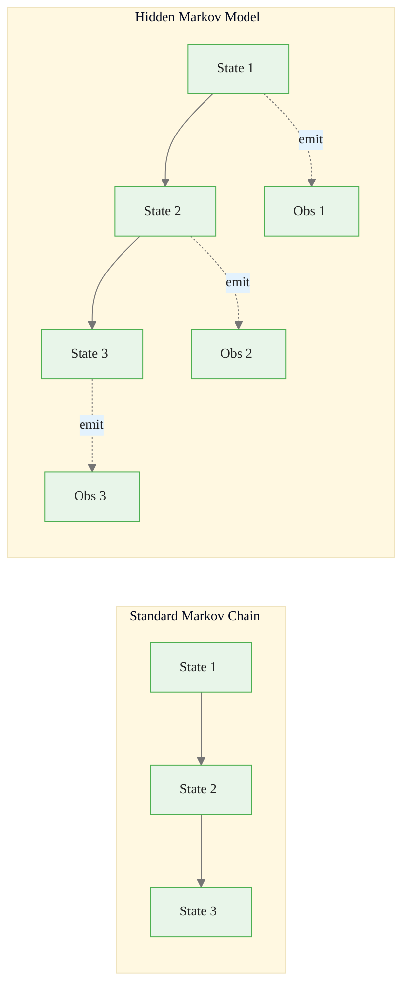
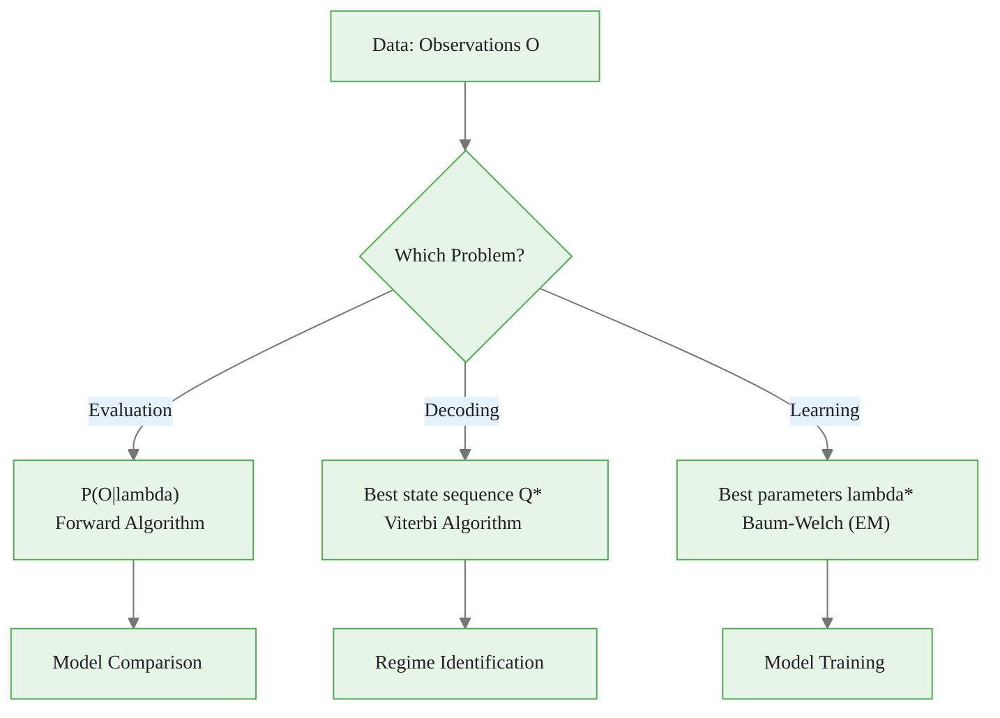
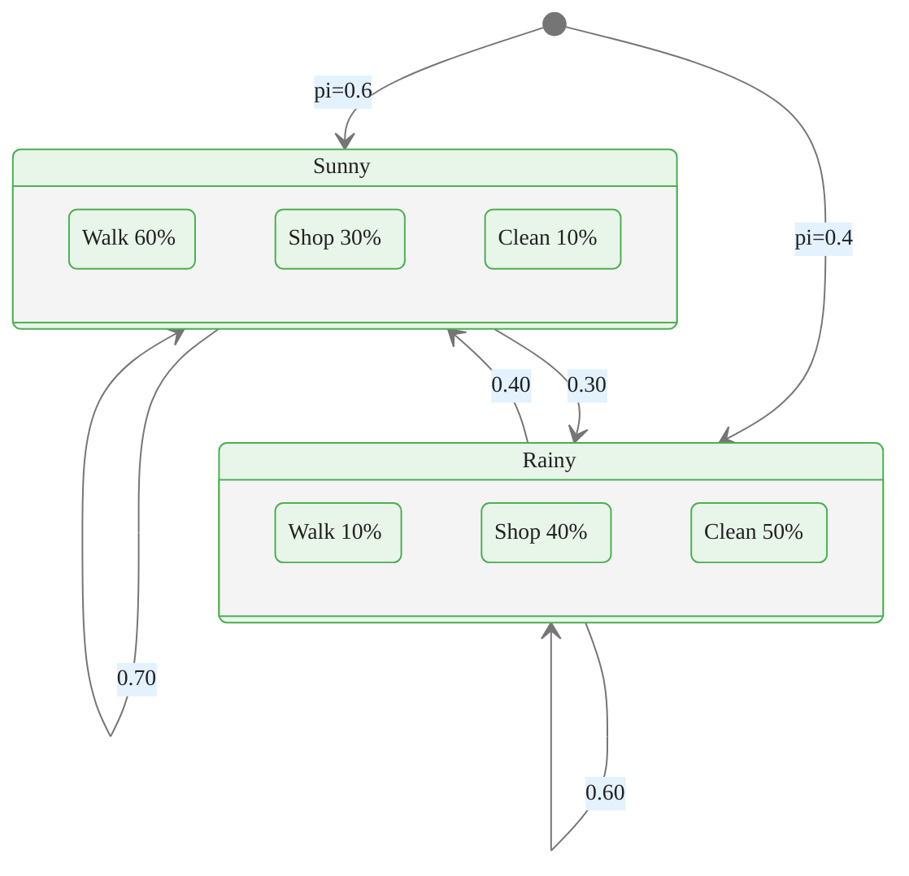
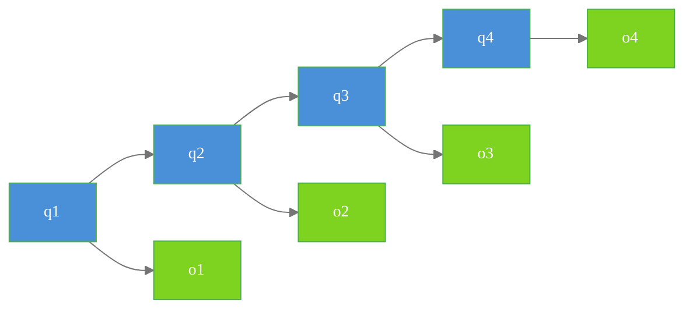
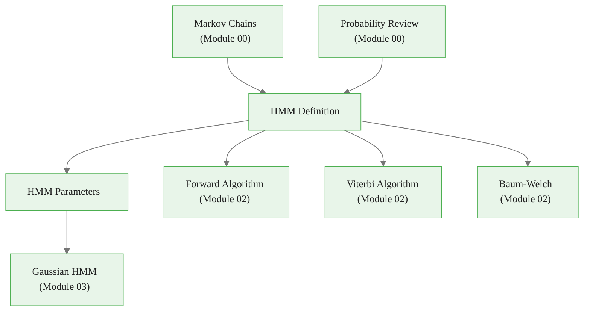

<!-- _class: lead -->

# HMM Framework and Definition

## Module 01 — Framework
### Hidden Markov Models Course

<!-- Speaker notes: This section formalizes the HMM framework by defining the three-tuple lambda = (Pi, A, B) and the three fundamental problems: evaluation, decoding, and learning. These definitions are referenced throughout the rest of the course. -->
---

# From Markov Chains to HMMs



<div class="callout-key">

Key implementation detail -- study this pattern carefully.

</div>

In an HMM, states are **hidden** and we only observe **emissions**.

<!-- Speaker notes: This diagram shows the architectural difference. The standard Markov chain has observable states. The HMM adds an emission layer: states are hidden, and we only see the emitted observations. This single addition creates the need for all three inference algorithms. -->
---

# Formal Definition

An HMM $\lambda = (A, B, \pi)$ consists of:

| Component | Symbol | Definition |
|----------|----------|----------|
| Hidden States | $S = \{s_1, ..., s_K\}$ | Finite set of states |
| Observations | $O = \{o_1, ..., o_T\}$ | Discrete or continuous |
| Initial Distribution | $\pi_i = P(q_1 = s_i)$ | Starting state probabilities |
| Transition Matrix | $a_{ij} = P(q_{t+1} = s_j \| q_t = s_i)$ | State dynamics |
| Emission Probabilities | $b_i(o) = P(o_t = o \| q_t = s_i)$ | Observation model |

<!-- Speaker notes: This table is the formal reference for HMM components. Each row defines a symbol, its name, and its role. All algorithms in Module 02 take these five components as input. -->

---

# The Three Fundamental Problems

| Problem | Question | Algorithm | Use Case |
|----------|----------|----------|----------|
| **Evaluation** | $P(O \| \lambda)$? | Forward | Model comparison |
| **Decoding** | Most likely state sequence? | Viterbi | Regime identification |
| **Learning** | Best parameters? | Baum-Welch | Model training |

<!-- Speaker notes: This table maps each problem to its algorithm and practical use case. Model comparison uses evaluation, regime identification uses decoding, and model training uses learning. These three problems form the algorithmic core of the course. -->

---

# Three Problems Flow



<div class="callout-insight">

This pattern recurs throughout the course. Understanding it deeply pays dividends later.

</div>

<!-- Speaker notes: The decision flowchart shows when to use each algorithm. Start with the data and the question you want to answer. This helps practitioners select the right tool for their specific task. -->
---

# HMM Class Structure

```python
from dataclasses import dataclass

@dataclass
class HMMParams:
    """HMM parameter container."""
    pi: np.ndarray      # Initial distribution (K,)
    A: np.ndarray       # Transition matrix (K, K)
    B: np.ndarray       # Emission matrix (K, M) for discrete

    @property
    def n_states(self) -> int:
        return len(self.pi)
```

<div class="callout-warning">

Watch for edge cases with this implementation in production use.

</div>

<!-- Speaker notes: The dataclass provides a clean container for HMM parameters. The property n_states is derived from pi, avoiding redundant specification. This pattern is used throughout the codebase. -->
---

# DiscreteHMM — Initialization

```python
class DiscreteHMM:
    """Hidden Markov Model with discrete emissions."""

    def __init__(self, n_states, n_symbols, params=None):
        self.n_states = n_states
        self.n_symbols = n_symbols
        if params:
            self.pi, self.A, self.B = params.pi, params.A, params.B
        else:
            self._initialize_random()

    def _initialize_random(self):
        self.pi = np.random.dirichlet(np.ones(self.n_states))
        self.A = np.random.dirichlet(np.ones(self.n_states),
                                      size=self.n_states)
        self.B = np.random.dirichlet(np.ones(self.n_symbols),
                                      size=self.n_states)
```

<div class="callout-info">

This approach follows established best practices in the field.

</div>

<!-- Speaker notes: The Dirichlet distribution generates random probability vectors (each sums to 1), making it ideal for initializing pi, A, and B. Random initialization is the starting point for Baum-Welch training. -->
---

# DiscreteHMM — Sequence Generation

```python
def generate(self, length):
    """Generate a sequence of states and observations."""
    states, observations = [], []

    # Initial state and observation
    state = np.random.choice(self.n_states, p=self.pi)
    states.append(state)
    observations.append(np.random.choice(self.n_symbols, p=self.B[state]))

    # Generate sequence
    for _ in range(length - 1):
        state = np.random.choice(self.n_states, p=self.A[state])
        states.append(state)
        observations.append(np.random.choice(self.n_symbols, p=self.B[state]))

    return states, observations
```

<!-- Speaker notes: The generate method simulates from the HMM by alternating between state transitions and observation emissions. This is essential for model validation: generate data from the fitted model and compare its statistics to the original data. -->
---

# Example — Weather HMM

<div class="code-window">
<div class="code-header">
<div class="dots"><span class="dot-red"></span><span class="dot-yellow"></span><span class="dot-green"></span></div>
<span class="filename">example.py</span>
</div>

```python
# Hidden states: Sunny (0), Rainy (1)
# Observations: Walk (0), Shop (1), Clean (2)

A = np.array([[0.7, 0.3],    # Sunny -> Sunny: 70%, Rainy: 30%
              [0.4, 0.6]])   # Rainy -> Sunny: 40%, Rainy: 60%

B = np.array([[0.6, 0.3, 0.1],   # Sunny: Walk 60%, Shop 30%, Clean 10%
              [0.1, 0.4, 0.5]])   # Rainy: Walk 10%, Shop 40%, Clean 50%

pi = np.array([0.6, 0.4])

params = HMMParams(pi=pi, A=A, B=B)
hmm = DiscreteHMM(n_states=2, n_symbols=3, params=params)
```

</div>

<!-- Speaker notes: The weather HMM is the classic textbook example. Two states (Sunny, Rainy) with three observation symbols (Walk, Shop, Clean). The parameters are chosen to make the example intuitive: sunny days favor walking, rainy days favor cleaning. -->
---

# Weather HMM State Diagram



<!-- Speaker notes: The state diagram provides a visual representation of the weather HMM parameters. Self-transitions are labeled on the loops, cross-transitions on the arrows between states, and emission probabilities are nested inside each state. -->
---

<!-- _class: lead -->

# Probability Calculations

<!-- Speaker notes: This section covers the joint probability formulas that underlie all HMM algorithms. Understanding how to compute and decompose these probabilities is essential. -->
---

# Joint Probability

For state sequence $Q$ and observations $O$:

$$P(O, Q | \lambda) = \pi_{q_1} \cdot b_{q_1}(o_1) \cdot \prod_{t=2}^{T} a_{q_{t-1}, q_t} \cdot b_{q_t}(o_t)$$

<div class="code-window">
<div class="code-header">
<div class="dots"><span class="dot-red"></span><span class="dot-yellow"></span><span class="dot-green"></span></div>
<span class="filename">joint_probability.py</span>
</div>

```python
def joint_probability(hmm, states, observations):
    """Compute joint probability P(O, Q | lambda)."""
    prob = hmm.pi[states[0]] * hmm.B[states[0], observations[0]]
    for t in range(1, len(observations)):
        prob *= hmm.A[states[t-1], states[t]]
        prob *= hmm.B[states[t], observations[t]]
    return prob
```

</div>

<!-- Speaker notes: The joint probability formula factorizes using the Markov and output independence assumptions. This is the quantity that all three algorithms ultimately compute or optimize. Understanding this factorization is essential for understanding the algorithms. -->
---

# Log Probability for Numerical Stability

<div class="code-window">
<div class="code-header">
<div class="dots"><span class="dot-red"></span><span class="dot-yellow"></span><span class="dot-green"></span></div>
<span class="filename">log_joint_probability.py</span>
</div>

```python
def log_joint_probability(hmm, states, observations):
    """Log joint probability avoids underflow."""
    log_prob = (np.log(hmm.pi[states[0]])
                + np.log(hmm.B[states[0], observations[0]]))

    for t in range(1, len(observations)):
        log_prob += np.log(hmm.A[states[t-1], states[t]])
        log_prob += np.log(hmm.B[states[t], observations[t]])

    return log_prob
```

</div>

> Always use **log probabilities** for sequences longer than ~20 steps.

<!-- Speaker notes: Always use log probabilities for sequences longer than about 20 steps. The log transforms products into sums, preventing numerical underflow. This is a recurring theme throughout the course. -->
---

# Likelihood of Observations

The total probability marginalizing over all state sequences:

$$P(O | \lambda) = \sum_{\text{all } Q} P(O, Q | \lambda)$$

**Problem**: For $T$ observations and $K$ states, there are $K^T$ possible sequences!

**Solution**: Dynamic programming (Forward algorithm) — Module 02.

<!-- Speaker notes: This slide motivates the Forward algorithm: marginalizing over all state sequences is exponential, but dynamic programming makes it quadratic. The K to the T versus T times K squared comparison is the key insight. -->
---

# Independence Assumptions

### 1. First-Order Markov Property
$$P(q_t | q_{t-1}, ..., q_1) = P(q_t | q_{t-1})$$

### 2. Output Independence
$$P(o_t | q_T, ..., q_1, o_{t-1}, ..., o_1) = P(o_t | q_t)$$

> The observation depends **only** on the current hidden state.

<!-- Speaker notes: The two independence assumptions (first-order Markov and output independence) are what make HMM inference tractable. Without them, we would need to track the entire history, making computation exponential. -->
---

# Graphical Model Representation



Arrows indicate conditional dependencies. Blue = hidden, Green = observed.

<!-- Speaker notes: The colored graphical model shows the conditional dependency structure. Blue nodes are hidden, green are observed. Arrows indicate direct dependencies. The absence of arrows between observations indicates conditional independence given the hidden states. -->
---

# Common HMM Variants

| Variant | Emissions | Use Case |
|----------|----------|----------|
| **Discrete HMM** | Categorical | Text, DNA sequences |
| **Gaussian HMM** | Normal distribution | Returns, prices |
| **GMM-HMM** | Gaussian mixture | Speech recognition |
| **Autoregressive HMM** | AR process | Correlated time series |

<!-- Speaker notes: This table previews the variants covered in Module 05. For this course's financial focus, Gaussian HMM (Module 03) is the most important variant. -->

---

# Applications in Finance

<div class="columns">

**Market Regime Detection**
- 2-state model: Bull vs Bear
- Observations: Daily returns
- Bull: higher mean, lower vol
- Bear: lower mean, higher vol

**Volatility Regimes**
- 2-state model: Low Vol vs High Vol
- Observations: Realized volatility
- State determines volatility level

</div>

<!-- Speaker notes: The columns layout shows the two most common financial applications: market regime detection and volatility regime detection. Both use 2-state Gaussian HMMs but with different observation variables. -->
---

# Key Takeaways

| Takeaway | Detail |
|----------|----------|
| HMMs extend Markov chains | Adding an emission layer |
| Three core problems | Evaluation, Decoding, Learning |
| Independence assumptions | Make inference tractable |
| Log probabilities | Essential for numerical stability |
| Multiple variants | Different emission types for different data |

<!-- Speaker notes: The HMM framework provides a complete probabilistic model for sequential data with hidden states. The three fundamental problems (evaluation, decoding, learning) map to specific algorithms that exploit the Markov structure for computational efficiency. -->

---

# Connections



<!-- Speaker notes: This diagram shows the HMM definition at the center of the course: it connects the foundational probability concepts (Module 00) to the algorithmic solutions (Module 02) and practical applications (Module 04). -->
