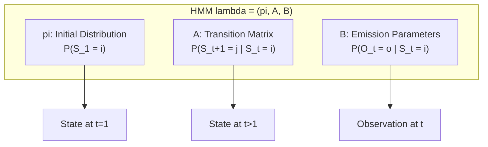
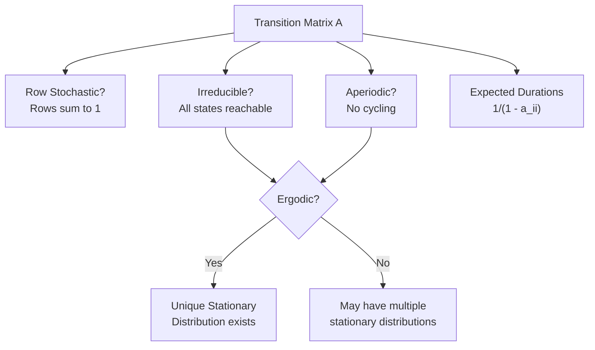
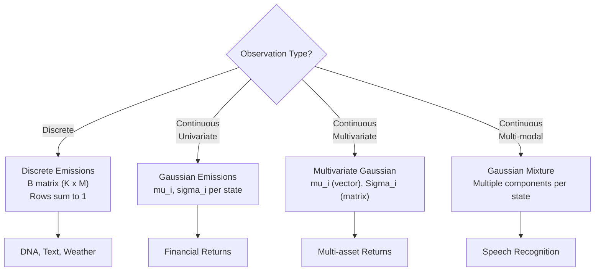
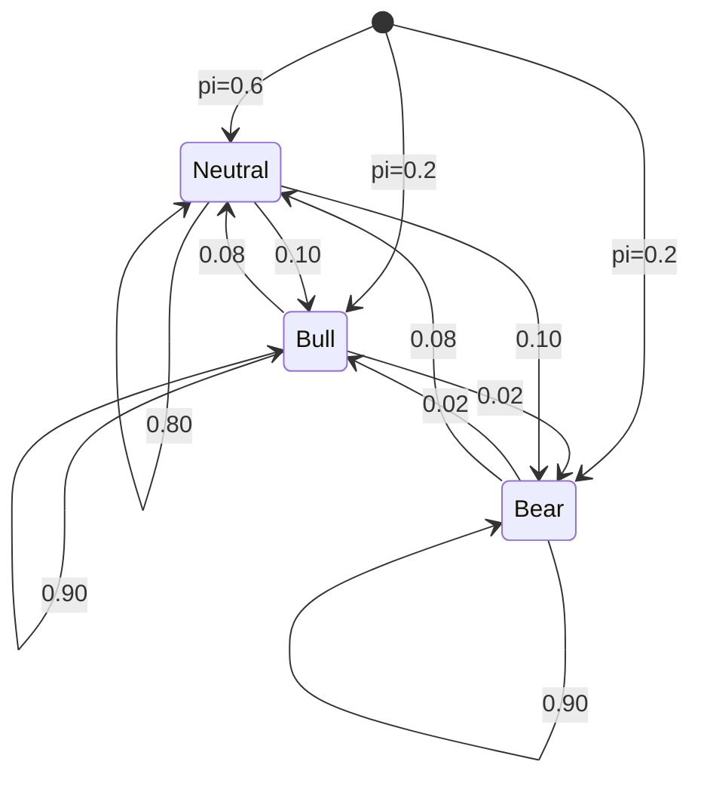
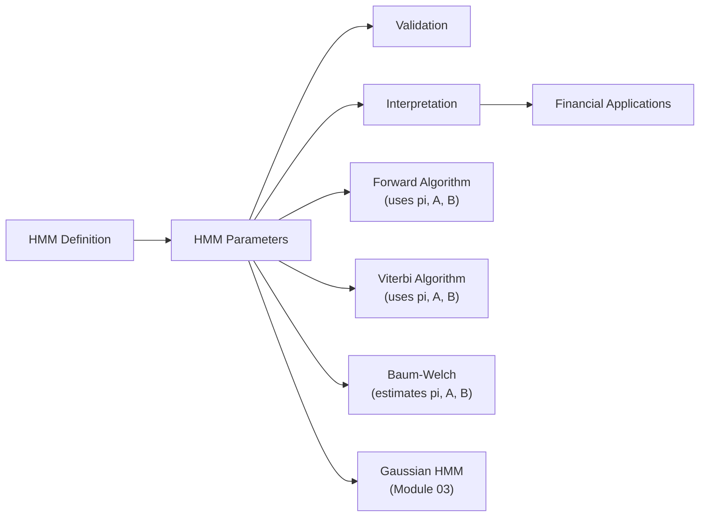

<!-- _class: lead -->

# HMM Parameters: The Complete Picture

## Module 01 — Framework
### Hidden Markov Models Course

<!-- Speaker notes: This section provides a detailed treatment of all HMM parameters: initial state distribution Pi, transition matrix A, and emission distributions B. Understanding parameter structure is essential for implementing the algorithms in Module 02. -->
---

# The Three Parameter Sets

A Hidden Markov Model is fully specified by:

$$\lambda = (\pi, A, B)$$

| Parameter | Name | Role |
|----------|----------|----------|
| $\pi$ | Initial distribution | Starting state probabilities |
| $A$ | Transition matrix | State-to-state transitions |
| $B$ | Emission parameters | Observation probabilities given state |

<!-- Speaker notes: This is the fundamental equation: lambda equals pi, A, B. Every HMM algorithm takes these three parameter sets. Understanding what each controls is essential for model design and interpretation. -->

---

# HMM Parameter Architecture



<!-- Speaker notes: The architecture diagram shows the data flow: pi determines the starting state, A determines subsequent states, and B determines observations. This three-level structure is the template for all HMM variants. -->
---

# Initial State Distribution

### Definition

$\pi_i = P(S_1 = i)$ for $i = 1, ..., K$

**Constraints:**
- $\pi_i \geq 0$ for all $i$
- $\sum_i \pi_i = 1$

<!-- Speaker notes: Pi is often the least discussed parameter but can significantly affect short sequences. For long sequences, the effect of pi diminishes as the chain converges to its stationary distribution. -->
---

# Setting Initial Distribution

```python
def set_initial_distribution(self, pi=None, style='uniform'):
    if pi is not None:
        self.pi = np.array(pi)
    elif style == 'uniform':
        self.pi = np.ones(self.n_states) / self.n_states
    elif style == 'first_state':
        self.pi = np.zeros(self.n_states)
        self.pi[0] = 1.0
    elif style == 'random':
        self.pi = np.random.dirichlet(np.ones(self.n_states))

    assert np.isclose(self.pi.sum(), 1.0), "pi must sum to 1"
    assert all(self.pi >= 0), "pi must be non-negative"
```

<!-- Speaker notes: The four initialization styles serve different purposes. Uniform is the safest default, first_state is for when the starting condition is known, and random is for multiple restart training. -->
---

# Transition Matrix — Setting Up

```python
def set_transition_matrix(self, A=None, style='persistent', persistence=0.9):
    if A is not None:
        self.A = np.array(A)
    elif style == 'persistent':
        self.A = np.eye(self.n_states) * persistence
        off_diag = (1 - persistence) / (self.n_states - 1)
        self.A[self.A == 0] = off_diag
    elif style == 'uniform':
        self.A = np.ones((self.n_states, self.n_states)) / self.n_states
    elif style == 'random':
        self.A = np.random.dirichlet(
            np.ones(self.n_states), self.n_states
        )

    assert np.allclose(self.A.sum(axis=1), 1.0)
    assert np.all(self.A >= 0)
```

<!-- Speaker notes: Persistent initialization with high diagonal values is the standard for financial applications because market regimes tend to last. The persistence parameter directly controls expected regime duration: 1 divided by (1 minus persistence). -->
---

<!-- _class: lead -->

# Transition Matrix Analysis

<!-- Speaker notes: Transition matrix analysis extracts key properties like stationary distribution, expected durations, and ergodicity that determine long-run model behavior. -->
---

# Analyzing the Transition Matrix

```python
def analyze_transition_matrix(A):
    n_states = A.shape[0]

    # Stationary distribution
    eigenvalues, eigenvectors = np.linalg.eig(A.T)
    idx = np.argmin(np.abs(eigenvalues - 1))
    pi_stat = np.real(eigenvectors[:, idx])
    pi_stat = pi_stat / pi_stat.sum()

    # Expected state duration
    for i in range(n_states):
        duration = 1 / (1 - A[i, i]) if A[i, i] < 1 else float('inf')
        print(f"State {i}: {duration:.2f} periods")

    # Check ergodicity
    irreducible = check_irreducibility(A)
    aperiodic = np.any(np.diag(A) > 0)
    ergodic = irreducible and aperiodic
```

<!-- Speaker notes: This analysis function extracts three key properties: the stationary distribution (long-run regime probabilities), expected durations (how long each regime lasts), and ergodicity (whether the model is well-posed). -->
---

# Transition Matrix Properties Flow



<!-- Speaker notes: This decision flow helps verify that a transition matrix is well-specified. In production, always check row-stochasticity and ergodicity before using a model for inference. -->
---

<!-- _class: lead -->

# Emission Parameters

<!-- Speaker notes: The emission parameters define how each hidden state generates observations, which is the key link between the latent and observed processes. -->
---

# Discrete Emissions

For discrete observations $o \in \{1, ..., M\}$:

$$b_i(o) = P(O_t = o | S_t = i)$$

```python
class DiscreteHMM(HMMParameters):
    def set_emission_matrix(self, B=None, style='random'):
        if B is not None:
            self.B = np.array(B)
        elif style == 'random':
            self.B = np.random.dirichlet(
                np.ones(self.n_symbols), self.n_states
            )
        # B[i,j] = P(emit symbol j | state i)
        assert self.B.shape == (self.n_states, self.n_symbols)
        assert np.allclose(self.B.sum(axis=1), 1.0)
```

<!-- Speaker notes: For discrete HMMs, the emission matrix B has shape K by M where K is states and M is symbols. Each row is a probability distribution over symbols. This is used for text, DNA, and categorical time series. -->
---

# Gaussian Emissions

For continuous observations:

$$b_i(o) = \mathcal{N}(o; \mu_i, \sigma_i^2)$$

```python
class GaussianHMM(HMMParameters):
    def set_emission_params(self, means=None, covars=None):
        self.means = np.array(means)   # (K, d)
        self.covars = np.array(covars)  # (K, d, d)

    def emission_prob(self, state, observation):
        return stats.multivariate_normal.pdf(
            observation,
            mean=self.means[state].flatten(),
            cov=self.covars[state]
        )
```

<!-- Speaker notes: For continuous data like financial returns, Gaussian emissions are the standard choice. Each state has a mean and covariance that define its emission distribution. This is the foundation for Module 03. -->
---

# Emission Type Comparison



<!-- Speaker notes: This flowchart helps practitioners choose the right emission type based on their data. Financial returns use Gaussian, multi-asset returns use multivariate Gaussian, and speech recognition uses Gaussian mixtures. -->
---

# Gaussian HMM Example — 3 States

```python
gauss_hmm = GaussianHMM(n_states=3, n_features=1)

gauss_hmm.set_initial_distribution(pi=[0.6, 0.3, 0.1])

gauss_hmm.set_transition_matrix(A=[
    [0.8, 0.15, 0.05],
    [0.1, 0.8, 0.1],
    [0.05, 0.15, 0.8]
])

gauss_hmm.set_emission_params(
    means=[[-1.5], [0.5], [2.0]],
    covars=[[[0.3]], [[0.5]], [[0.8]]]
)
```

<!-- Speaker notes: This three-state example models bull, neutral, and bear markets with decreasing means and increasing variances. The transition matrix has high diagonal values for persistence. -->
---

<!-- _class: lead -->

# Parameter Validation

<!-- Speaker notes: Parameter validation catches common errors like non-stochastic matrices or singular covariances that would cause algorithms to fail silently. -->
---

# Ensuring Valid Parameters

```python
def validate_hmm_parameters(pi, A, B=None, means=None, covars=None):
    errors = []

    # Check pi: sums to 1, non-negative
    if not np.isclose(pi.sum(), 1.0):
        errors.append("pi doesn't sum to 1")

    # Check A: row-stochastic, non-negative
    if not np.allclose(A.sum(axis=1), 1.0):
        errors.append("A rows don't sum to 1")

    # Check B (discrete): row-stochastic
    if B is not None and not np.allclose(B.sum(axis=1), 1.0):
        errors.append("B rows don't sum to 1")

    # Check covars (Gaussian): positive definite
    if covars is not None:
        for i, cov in enumerate(covars):
            try: np.linalg.cholesky(cov)
            except: errors.append(f"Covar {i} not positive definite")

    return len(errors) == 0
```

<!-- Speaker notes: Parameter validation is critical in production. Invalid parameters (rows not summing to 1, negative probabilities, non-positive-definite covariance) will cause algorithms to produce garbage results or crash. -->
---

# Parameter Validation Checklist

| Parameter | Constraint | Check |
|----------|----------|----------|
| $\pi$ | $\sum_i \pi_i = 1$ | Sums to 1 |
| $\pi$ | $\pi_i \geq 0$ | Non-negative |
| $A$ | $\sum_j a_{ij} = 1$ | Row-stochastic |
| $A$ | $a_{ij} \geq 0$ | Non-negative |
| $B$ (discrete) | $\sum_o b_i(o) = 1$ | Row-stochastic |
| $\Sigma_i$ (Gaussian) | Positive definite | Cholesky decomposition |

<!-- Speaker notes: This checklist should be applied after every parameter update, especially after Baum-Welch training where numerical errors can accumulate. -->

---

<!-- _class: lead -->

# Financial Market Example

<!-- Speaker notes: This financial example demonstrates how to set up a realistic 3-state market regime model with parameters calibrated to typical equity market behavior. -->
---

# Market Regime HMM

```python
def create_market_regime_hmm():
    hmm = GaussianHMM(n_states=3, n_features=1)

    # Initial: Market starts neutral
    hmm.set_initial_distribution(pi=[0.2, 0.6, 0.2])

    # Transitions: Regimes are persistent
    hmm.set_transition_matrix(A=[
        [0.90, 0.08, 0.02],  # Bull
        [0.10, 0.80, 0.10],  # Neutral
        [0.02, 0.08, 0.90]   # Bear
    ])

    # Emissions: Returns by regime
    hmm.set_emission_params(
        means=[[0.10], [0.02], [-0.08]],
        covars=[[[0.12]], [[0.18]], [[0.25]]]
    )
    return hmm
```

<!-- Speaker notes: This three-state financial model is more realistic than two states. The transition matrix shows that bull and bear are persistent (0.90 self-transition) while neutral has lower persistence (0.80), reflecting the transitory nature of sideways markets. -->
---

# Market Regime State Diagram



<!-- Speaker notes: The state diagram visualizes the three-regime model. Note the asymmetry: bull-to-bear transitions are rare (0.02) but bear-to-bull are also rare, with most transitions going through the neutral state. -->
---

# Interpreting Market HMM Parameters

| Regime | Mean Return | Volatility | Duration |
|----------|----------|----------|----------|
| **Bull** | +10% ann. | 34.6% | 10 days |
| **Neutral** | +2% ann. | 42.4% | 5 days |
| **Bear** | -8% ann. | 50.0% | 10 days |

<!-- Speaker notes: This table translates mathematical parameters into financial intuition. Expected duration is calculated from the self-transition probability. The volatility column shows the well-known volatility asymmetry: bear markets are more volatile. -->

> Expected duration = $\frac{1}{1 - a_{ii}}$

---

# Key Takeaways

| Takeaway | Detail |
|----------|----------|
| Three parameter sets | $\lambda = (\pi, A, B)$ fully specifies an HMM |
| Initial distribution $\pi$ | Determines starting state probabilities |
| Transition matrix $A$ | Controls regime dynamics and persistence |
| Emission parameters $B$ | Links hidden states to observations |
| Validation | Ensures mathematical consistency |
| Interpretation | Domain-specific parameter design |

<!-- Speaker notes: Understanding HMM parameters is essential for both implementation and interpretation. The initial distribution Pi determines starting conditions, the transition matrix A captures regime persistence, and emission distributions B encode what each regime looks like. -->

---

# Connections



<!-- Speaker notes: This diagram shows how parameter estimation connects to the broader HMM workflow: parameters are initialized from domain knowledge or K-means, refined by Baum-Welch, and validated using held-out data. Good parameter understanding enables better initialization and interpretation. -->
