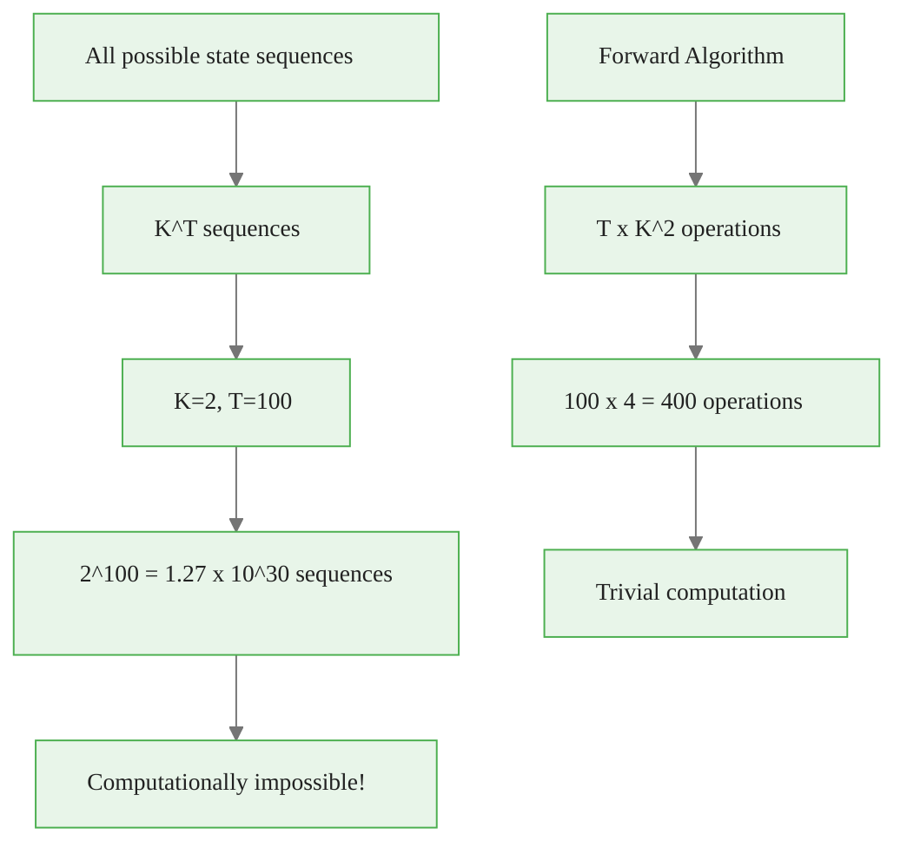
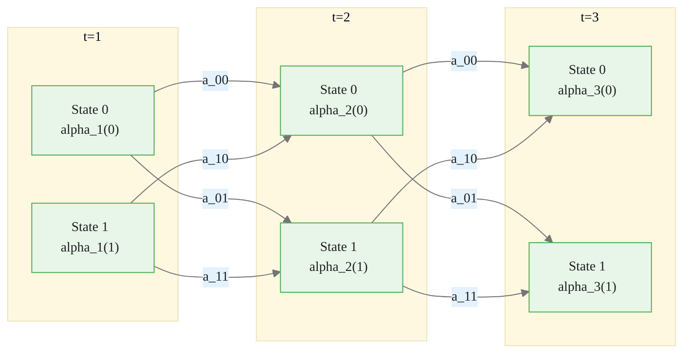
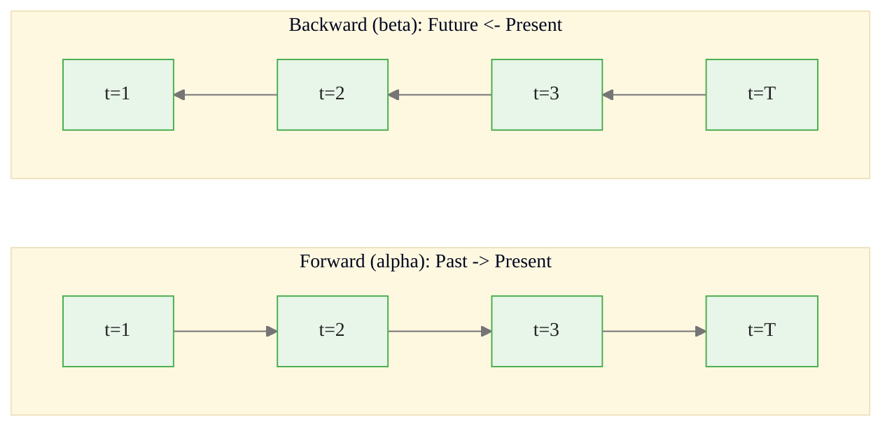
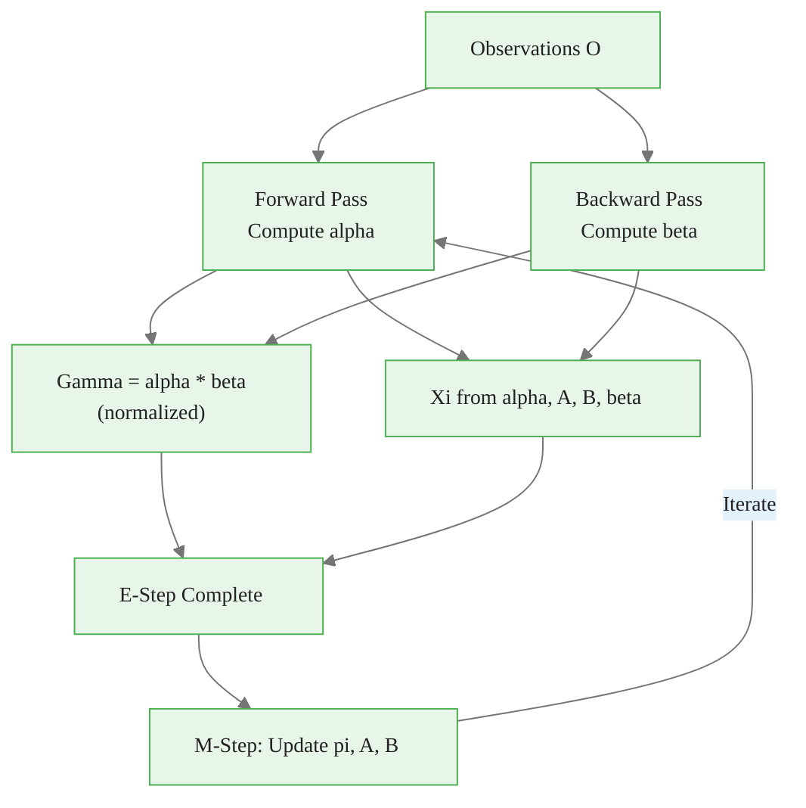

<!-- _class: lead -->

# Forward-Backward Algorithm

## Module 02 — Algorithms
### Hidden Markov Models Course

<!-- Speaker notes: The Forward-Backward algorithm solves Problem 1 (evaluation) and computes the posterior state probabilities needed for Baum-Welch learning. It is the most fundamental algorithm in the HMM toolkit. -->
---

# The Evaluation Problem

Given an HMM $\lambda$ and observations $O = o_1, ..., o_T$, compute $P(O | \lambda)$.

**Naive approach**: Sum over all $K^T$ state sequences — exponential complexity!

**Forward algorithm**: Dynamic programming in $O(T \cdot K^2)$ time.

<!-- Speaker notes: This slide motivates the Forward algorithm by showing the computational intractability of the naive approach. The jump from K to the T to T times K squared is a dramatic speedup that makes HMM inference practical. -->
---

# Why Naive Enumeration Fails



<div class="callout-key">

Key implementation detail -- study this pattern carefully.

</div>

<!-- Speaker notes: The numbers are stark: 2 to the power of 100 is astronomical, but 100 times 4 equals 400. This factor of 10 to the 27 reduction comes entirely from the dynamic programming structure enabled by the Markov property. -->
---

# Forward Variables

Define $\alpha_t(i)$ as the probability of observing $o_1, ..., o_t$ AND being in state $i$ at time $t$:

$$\alpha_t(i) = P(o_1, o_2, ..., o_t, q_t = s_i | \lambda)$$

<!-- Speaker notes: Alpha t of i is the joint probability of the observations up to time t AND being in state i at time t. The AND is critical: alpha is not a posterior probability but a joint probability. This distinction matters for computing gamma later. -->
---

# Forward Recursion

**Initialization** ($t = 1$):
$$\alpha_1(i) = \pi_i \cdot b_i(o_1)$$

**Induction** ($t = 2, ..., T$):
$$\alpha_t(j) = \left[ \sum_{i=1}^{K} \alpha_{t-1}(i) \cdot a_{ij} \right] \cdot b_j(o_t)$$

**Termination**:
$$P(O | \lambda) = \sum_{i=1}^{K} \alpha_T(i)$$

<!-- Speaker notes: Walk through the three steps: initialization multiplies the prior by the first emission, induction sums over all previous states weighted by transitions and emissions, and termination sums over all final states. Each step is O(K) or O(K squared). -->
---

# Forward Algorithm Trellis



<div class="callout-insight">

This pattern recurs throughout the course. Understanding it deeply pays dividends later.

</div>

Each node sums **all incoming paths** weighted by transition and emission probabilities.

<!-- Speaker notes: The trellis diagram is the key visualization for understanding the Forward algorithm. Each node stores alpha_t(i), and each arrow carries a transition probability. The value at each node is the sum of all incoming paths times the emission probability. -->
---

# Forward Algorithm Implementation

```python
def forward(observations, pi, A, B):
    """Forward algorithm for HMM."""
    T = len(observations)
    K = len(pi)
    alpha = np.zeros((T, K))

    # Initialization (t=0)
    alpha[0] = pi * B[:, observations[0]]

    # Induction
    for t in range(1, T):
        for j in range(K):
            alpha[t, j] = np.sum(alpha[t-1] * A[:, j]) * B[j, observations[t]]

    # Total probability
    likelihood = np.sum(alpha[-1])
    return alpha, np.log(likelihood)
```

<div class="callout-warning">

Watch for edge cases with this implementation in production use.

</div>

<!-- Speaker notes: This is the core Forward algorithm in about 10 lines of code. The key line is the induction: alpha[t,j] sums alpha[t-1] times A[:,j] (all transitions into state j) and multiplies by the emission probability B[j, o_t]. -->
---

# Scaled Forward Algorithm

For long sequences, $\alpha_t(i)$ **underflows**. Use scaling factors:

```python
def forward_scaled(observations, pi, A, B):
    T, K = len(observations), len(pi)
    alpha = np.zeros((T, K))
    scaling = np.zeros(T)

    alpha[0] = pi * B[:, observations[0]]
    scaling[0] = np.sum(alpha[0])
    alpha[0] /= scaling[0]

    for t in range(1, T):
        for j in range(K):
            alpha[t, j] = np.sum(alpha[t-1] * A[:, j]) * B[j, observations[t]]
        scaling[t] = np.sum(alpha[t])
        alpha[t] /= scaling[t]

    log_likelihood = np.sum(np.log(scaling))
    return alpha, scaling, log_likelihood
```

<div class="callout-info">

This approach follows established best practices in the field.

</div>

<!-- Speaker notes: Scaling prevents numerical underflow by normalizing alpha at each time step. The scaling factors are saved for later use in the Backward algorithm and for computing the log-likelihood as the sum of log scaling factors. -->
---

<!-- _class: lead -->

# Backward Algorithm

<!-- Speaker notes: The Backward algorithm complements the Forward algorithm by computing future evidence. Together they provide the complete posterior. -->
---

# Backward Variables

Define $\beta_t(i)$ as the probability of observing $o_{t+1}, ..., o_T$ given state $i$ at time $t$:

$$\beta_t(i) = P(o_{t+1}, ..., o_T | q_t = s_i, \lambda)$$

**Initialization** ($t = T$): $\beta_T(i) = 1$

**Induction** ($t = T-1, ..., 1$):
$$\beta_t(i) = \sum_{j=1}^{K} a_{ij} \cdot b_j(o_{t+1}) \cdot \beta_{t+1}(j)$$

<!-- Speaker notes: Beta t of i is the conditional probability of future observations given the current state. It looks backward in time from the perspective of the algorithm, computing the likelihood of all observations after time t. -->
---

# Forward vs Backward Direction



**Forward**: $P(o_1...o_t, q_t=i)$ — evidence from the past

**Backward**: $P(o_{t+1}...o_T | q_t=i)$ — evidence from the future

<!-- Speaker notes: Forward computes evidence from the past, backward computes evidence from the future. Combining them via gamma gives the full posterior using all available evidence. This is the key insight of the Forward-Backward algorithm. -->
---

# Backward Implementation

<div class="code-window">
<div class="code-header">
<div class="dots"><span class="dot-red"></span><span class="dot-yellow"></span><span class="dot-green"></span></div>
<span class="filename">backward.py</span>
</div>

```python
def backward(observations, A, B):
    T, K = len(observations), A.shape[0]
    beta = np.zeros((T, K))

    # Initialization
    beta[-1] = 1

    # Induction (backwards)
    for t in range(T-2, -1, -1):
        for i in range(K):
            beta[t, i] = np.sum(
                A[i, :] * B[:, observations[t+1]] * beta[t+1]
            )
    return beta
```

</div>

<!-- Speaker notes: The backward algorithm mirrors the forward algorithm but runs in reverse. Starting from beta_T equals 1, each step incorporates the next observation's emission probability and the transition matrix. -->
---

<!-- _class: lead -->

# State Probabilities

<!-- Speaker notes: Posterior state probabilities combine past and future evidence to give the best estimate of the hidden state at each time point. -->
---

# Posterior State Probability (Gamma)

$\gamma_t(i)$ = probability of being in state $i$ at time $t$ given **all** observations:

$$\gamma_t(i) = P(q_t = s_i | O, \lambda) = \frac{\alpha_t(i) \cdot \beta_t(i)}{P(O | \lambda)}$$

> Combines evidence from **past** (alpha) and **future** (beta).

<!-- Speaker notes: Gamma combines alpha (past evidence) and beta (future evidence) to give the complete posterior state probability using all observations. This is the central quantity computed by the Forward-Backward algorithm. -->
---

# Transition Probability (Xi)

$\xi_t(i, j)$ = probability of transition from $i$ to $j$ at time $t$:

$$\xi_t(i, j) = \frac{\alpha_t(i) \cdot a_{ij} \cdot b_j(o_{t+1}) \cdot \beta_{t+1}(j)}{P(O | \lambda)}$$

<!-- Speaker notes: Xi extends gamma to pairs of states. It gives the probability of being in state i at time t and state j at time t+1. Xi is essential for updating the transition matrix in the M-step of Baum-Welch. -->
---

# Computing Posteriors

<div class="code-window">
<div class="code-header">
<div class="dots"><span class="dot-red"></span><span class="dot-yellow"></span><span class="dot-green"></span></div>
<span class="filename">compute_posteriors.py</span>
</div>

```python
def compute_posteriors(observations, pi, A, B):
    T, K = len(observations), len(pi)

    alpha, scaling, _ = forward_scaled(observations, pi, A, B)
    beta = backward_scaled(observations, A, B, scaling)

    # Gamma: P(q_t = i | O)
    gamma = alpha * beta
    gamma /= gamma.sum(axis=1, keepdims=True)

    # Xi: P(q_t = i, q_{t+1} = j | O)
    xi = np.zeros((T-1, K, K))
    for t in range(T-1):
        for i in range(K):
            for j in range(K):
                xi[t, i, j] = (alpha[t, i] * A[i, j] *
                                B[j, observations[t+1]] * beta[t+1, j])
        xi[t] /= xi[t].sum()

    return gamma, xi
```

</div>

<!-- Speaker notes: This implementation computes both gamma and xi from the scaled forward and backward variables. The normalization ensures that gamma sums to 1 across states at each time step, and xi sums to 1 across state pairs. -->
---

# Relationship Between Variables

| Variable | Direction | Computes |
|----------|----------|----------|
| $\alpha_t(i)$ | Forward | $P(o_1...o_t, q_t=i)$ |
| $\beta_t(i)$ | Backward | $P(o_{t+1}...o_T \| q_t=i)$ |
| $\gamma_t(i)$ | Combined | $P(q_t=i \| O)$ — full posterior |
| $\xi_t(i,j)$ | Combined | $P(q_t=i, q_{t+1}=j \| O)$ |

<!-- Speaker notes: This table is a key reference. Alpha looks at the past, beta looks at the future, gamma combines both for single-state posteriors, and xi combines both for state-pair posteriors. -->

---

# Computational Complexity

| Operation | Time | Space |
|----------|----------|----------|
| Forward | $O(T \times K^2)$ | $O(T \times K)$ |
| Backward | $O(T \times K^2)$ | $O(T \times K)$ |
| Gamma | $O(T \times K)$ | $O(T \times K)$ |
| Xi | $O(T \times K^2)$ | $O(T \times K^2)$ |

<!-- Speaker notes: The Forward-Backward algorithm is O(T times K squared) in time and O(T times K) in space for alpha and beta. Xi requires O(T times K squared) space, which can be large for many states and long sequences. -->

---

# Log-Space Vectorized Implementation

<div class="code-window">
<div class="code-header">
<div class="dots"><span class="dot-red"></span><span class="dot-yellow"></span><span class="dot-green"></span></div>
<span class="filename">forward_vectorized.py</span>
</div>

```python
def forward_vectorized(observations, pi, A, B):
    T, K = len(observations), len(pi)
    log_alpha = np.zeros((T, K))

    # Initialization (log domain)
    log_alpha[0] = np.log(pi) + np.log(B[:, observations[0]])

    # Induction
    for t in range(1, T):
        for j in range(K):
            log_alpha[t, j] = (
                np.logaddexp.reduce(log_alpha[t-1] + np.log(A[:, j]))
                + np.log(B[j, observations[t]])
            )

    log_likelihood = np.logaddexp.reduce(log_alpha[-1])
    return np.exp(log_alpha), log_likelihood
```

</div>

<!-- Speaker notes: The log-space implementation uses logsumexp for numerical stability. This avoids the need for scaling factors but requires careful implementation. The logsumexp function computes log(sum(exp(x))) without overflow. -->
---

# Forward-Backward in the EM Pipeline



<!-- Speaker notes: This diagram shows how the Forward-Backward algorithm fits into the larger Baum-Welch training loop. It computes the sufficient statistics (gamma and xi) that the M-step uses to update parameters. -->
---

# Key Takeaways

| Takeaway | Detail |
|----------|----------|
| Forward algorithm | Computes $P(O\|\lambda)$ via dynamic programming |
| Backward algorithm | Computes future observation probability given state |
| Combined (gamma, xi) | Full posterior state probabilities |
| Scaling / log-domain | Essential for numerical stability |
| $O(T \times K^2)$ | Linear in sequence length |

<!-- Speaker notes: The Forward-Backward algorithm is the computational backbone of HMM inference. The forward pass computes evaluation probabilities, the backward pass enables smoothed state estimates, and together they provide the gamma and xi values needed for Baum-Welch parameter learning. -->

