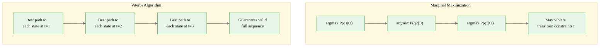
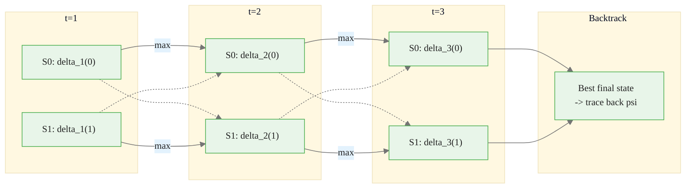
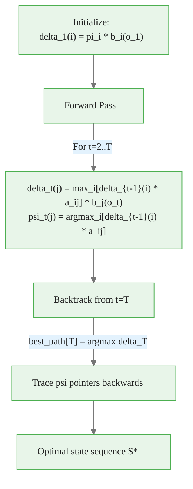
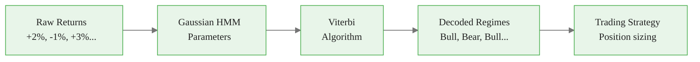

<!-- _class: lead -->

# The Viterbi Algorithm
## Finding the Most Likely State Sequence

### Module 02 — Algorithms
### Hidden Markov Models Course

<!-- Speaker notes: The Viterbi algorithm solves Problem 2 (decoding) by finding the single most likely state sequence. It uses dynamic programming to avoid the exponential cost of enumerating all possible state sequences. -->
---

# The Decoding Problem

Given observations $O = (o_1, ..., o_T)$ and model $\lambda$, find the **most likely state sequence**:

$$S^* = \arg\max_S P(S | O, \lambda)$$

> This is different from computing marginal probabilities at each time step.

<!-- Speaker notes: The decoding problem finds the single most likely state sequence, not just the most likely state at each time. This distinction is crucial: the sequence that maximizes the joint probability may differ from the sequence of marginal maxima. -->
---

# Why Not Just Take Marginal Maxima?

Taking the most likely state at each time step independently can give an **impossible** sequence (zero probability transitions).

```python
# Deterministic alternation: State 0 always -> State 1, State 1 always -> State 0
A = np.array([[0.0, 1.0],
              [1.0, 0.0]])

# Marginal max might say: [0, 0, 0, 0] -- but P(0->0) = 0!
# Viterbi guarantees valid transitions: [0, 1, 0, 1]
```

<div class="callout-key">

Key implementation detail -- study this pattern carefully.

</div>

<!-- Speaker notes: This example demonstrates the problem concretely. With deterministic alternation, the marginal maximum at every time step might be the same state, but the resulting sequence has zero probability. Viterbi avoids this by tracking full paths. -->
---

# Viterbi vs Marginal Comparison



<div class="callout-insight">

This pattern recurs throughout the course. Understanding it deeply pays dividends later.

</div>

<!-- Speaker notes: The side-by-side comparison shows the key difference: marginal maximization treats each time step independently and may violate transition constraints. Viterbi finds the globally optimal path that respects all constraints. -->
---

# The Viterbi Recursion

Define:
$$\delta_t(i) = \max_{s_1,...,s_{t-1}} P(s_1,...,s_{t-1}, s_t=i, o_1,...,o_t | \lambda)$$

This is the probability of the **most likely path** ending in state $i$ at time $t$.

<!-- Speaker notes: Delta t of i is the probability of the most likely path ending in state i at time t. The max operator replaces the sum in the forward algorithm. This single change turns evaluation into optimization. -->
---

# Viterbi Steps

**Initialization:**
$$\delta_1(i) = \pi_i \cdot b_i(o_1)$$

**Recursion:**
$$\delta_t(j) = \max_i [\delta_{t-1}(i) \cdot a_{ij}] \cdot b_j(o_t)$$

**Backtracking pointer:**
$$\psi_t(j) = \arg\max_i [\delta_{t-1}(i) \cdot a_{ij}]$$

<!-- Speaker notes: Walk through the three formulas: initialization is identical to forward, recursion replaces sum with max and adds a backtracking pointer psi, and backtracking recovers the optimal path by following psi pointers backward from the best final state. -->
---

# Viterbi Trellis Diagram



<div class="callout-warning">

Watch for edge cases with this implementation in production use.

</div>

Bold arrows = chosen path (max). Dashed = alternative paths.

<!-- Speaker notes: Bold arrows show the chosen path at each step (the max), dashed arrows show alternatives. The backtracking process follows bold arrows backward from the best final state to recover the complete optimal path. -->
---

# Implementation

```python
def viterbi_algorithm(observations, pi, A, B):
    T, K = len(observations), len(pi)
    delta = np.zeros((T, K))
    psi = np.zeros((T, K), dtype=int)

    # t = 0
    delta[0] = pi * B[:, observations[0]]

    # Forward pass
    for t in range(1, T):
        for j in range(K):
            probs = delta[t-1] * A[:, j]
            psi[t, j] = np.argmax(probs)
            delta[t, j] = probs[psi[t, j]] * B[j, observations[t]]

    # Backtrack
    best_path = [0] * T
    best_path[T-1] = np.argmax(delta[T-1])
    for t in range(T-2, -1, -1):
        best_path[t] = psi[t+1, best_path[t+1]]

    return best_path, delta[T-1, best_path[T-1]], delta, psi
```

<div class="callout-info">

This approach follows established best practices in the field.

</div>

<!-- Speaker notes: The implementation closely mirrors the forward algorithm. The key difference is argmax instead of sum when computing delta, plus the backtracking loop that recovers the optimal path from the psi pointers. -->
---

# Log-Space Implementation

For numerical stability with long sequences:

```python
def viterbi_log(observations, log_pi, log_A, log_B):
    T, K = len(observations), len(log_pi)
    log_delta = np.zeros((T, K))
    psi = np.zeros((T, K), dtype=int)

    log_delta[0] = log_pi + log_B[:, observations[0]]

    for t in range(1, T):
        for j in range(K):
            probs = log_delta[t-1] + log_A[:, j]
            psi[t, j] = np.argmax(probs)
            log_delta[t, j] = probs[psi[t, j]] + log_B[j, observations[t]]

    best_path = [0] * T
    best_path[T-1] = np.argmax(log_delta[T-1])
    for t in range(T-2, -1, -1):
        best_path[t] = psi[t+1, best_path[t+1]]

    return best_path, log_delta[T-1, best_path[T-1]]
```

<!-- Speaker notes: Log-space Viterbi converts products to sums and replaces max of products with max of sums. This is numerically stable for sequences of any length. Note that argmax is the same in both domains. -->
---

# Gaussian HMM Viterbi

<div class="code-window">
<div class="code-header">
<div class="dots"><span class="dot-red"></span><span class="dot-yellow"></span><span class="dot-green"></span></div>
<span class="filename">viterbi_gaussian.py</span>
</div>

```python
def viterbi_gaussian(observations, pi, A, means, covars):
    T, K = len(observations), len(pi)

    # Compute emission log-probabilities
    log_B = np.zeros((T, K))
    for t in range(T):
        for k in range(K):
            log_B[t, k] = stats.norm.logpdf(
                observations[t], loc=means[k],
                scale=np.sqrt(covars[k])
            )

    log_delta = np.zeros((T, K))
    psi = np.zeros((T, K), dtype=int)
    log_delta[0] = np.log(pi + 1e-10) + log_B[0]

    for t in range(1, T):
        for j in range(K):
            probs = log_delta[t-1] + np.log(A[:, j] + 1e-10)
            psi[t, j] = np.argmax(probs)
            log_delta[t, j] = probs[psi[t, j]] + log_B[t, j]

    # Backtrack...
```

</div>

<!-- Speaker notes: For Gaussian emissions, we compute log emission probabilities from the normal distribution instead of looking up a discrete emission matrix. The rest of the algorithm is identical. -->
---

# Viterbi Algorithm Flow



<!-- Speaker notes: This flowchart summarizes the complete algorithm: initialize, run the forward pass storing delta and psi, backtrack from the best final state, and return the optimal state sequence. -->
---

# Viterbi vs Forward-Backward Comparison

<div class="code-window">
<div class="code-header">
<div class="dots"><span class="dot-red"></span><span class="dot-yellow"></span><span class="dot-green"></span></div>
<span class="filename">compare_viterbi_forward_backward.py</span>
</div>

```python
def compare_viterbi_forward_backward(observations, pi, A, B):
    # Forward-Backward: marginal probabilities
    gamma = alpha * beta
    gamma = gamma / gamma.sum(axis=1, keepdims=True)
    marginal_path = np.argmax(gamma, axis=1).tolist()

    # Viterbi: joint optimal path
    viterbi_path, _, _, _ = viterbi_algorithm(observations, pi, A, B)

    # They CAN give different results!
    print(f"Viterbi path:  {viterbi_path}")
    print(f"Marginal path: {marginal_path}")
```

</div>

<!-- Speaker notes: This code demonstrates that the two methods can give different results. The forward-backward marginal path maximizes each time step independently, while Viterbi maximizes the entire sequence jointly. -->
---

# When They Differ

| Method | Optimizes | Guarantee |
|----------|----------|----------|
| **Viterbi** | Best joint sequence $P(Q\|O)$ | Valid transitions |
| **Marginal** | Best state per time $P(q_t\|O)$ | No transition guarantee |

<!-- Speaker notes: Use Viterbi when you need a coherent state sequence, such as for regime detection where you want to know the regime at every time point. Use marginal probabilities when you want the probability of being in each state, such as for probability-weighted allocation. -->

> Use **Viterbi** for regime detection (need coherent sequence).
> Use **Marginal** for state probability estimation.

---

<!-- _class: lead -->

# Financial Application

<!-- Speaker notes: Financial applications demonstrate how Viterbi decoding translates directly into actionable regime detection for trading and risk management. -->
---

# Market Regime Detection

<div class="code-window">
<div class="code-header">
<div class="dots"><span class="dot-red"></span><span class="dot-yellow"></span><span class="dot-green"></span></div>
<span class="filename">example.py</span>
</div>

```python
# True parameters
true_A = np.array([[0.9, 0.1], [0.1, 0.9]])
true_means = np.array([0.05, -0.03])   # Bull vs Bear
true_vars = np.array([0.01, 0.04])     # Low vs High vol

# Simulate 100 days of market data
# Then decode with Viterbi
decoded_path, log_delta = viterbi_gaussian(
    observations, true_pi, true_A, true_means, true_vars
)

accuracy = np.mean(np.array(decoded_path) == np.array(true_states))
print(f"Decoding accuracy: {accuracy:.1%}")
```

</div>

<!-- Speaker notes: This practical example shows Viterbi applied to synthetic market data. The accuracy metric compares decoded states to true states, giving a concrete measure of how well the algorithm recovers the hidden regime sequence. -->
---

# Regime Detection Flow



<!-- Speaker notes: This pipeline shows the end-to-end regime detection workflow: raw returns go into a fitted Gaussian HMM, Viterbi decodes the regimes, and the regimes drive trading strategy decisions. -->
---

# Key Takeaways

| Takeaway | Detail |
|----------|----------|
| Most likely state sequence | Not marginal maxima |
| Dynamic programming | $O(TK^2)$ complexity |
| Log-space computation | Prevents numerical underflow |
| Backtracking | Recovers optimal path after forward pass |
| Valid transitions | Viterbi ensures feasible path |
| Regime detection | Essential for financial applications |

<!-- Speaker notes: Viterbi finds the globally optimal state sequence using dynamic programming in O(K^2 * T) time. The key insight is that the best path to any state at time t can be computed from the best paths at time t-1, avoiding exponential enumeration of all K^T possible sequences. -->

