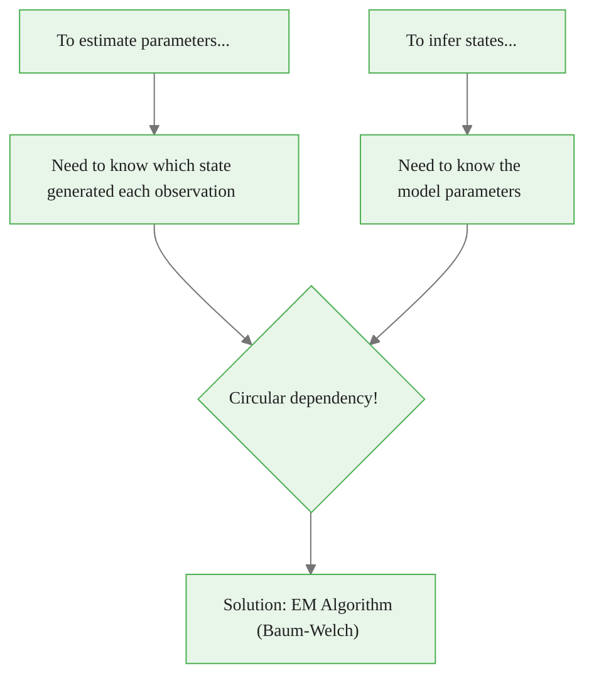
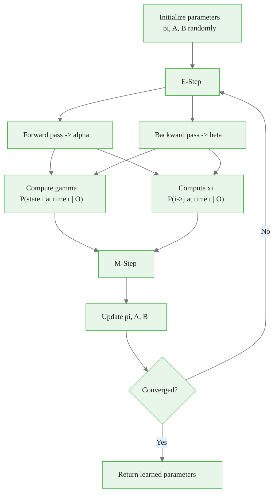
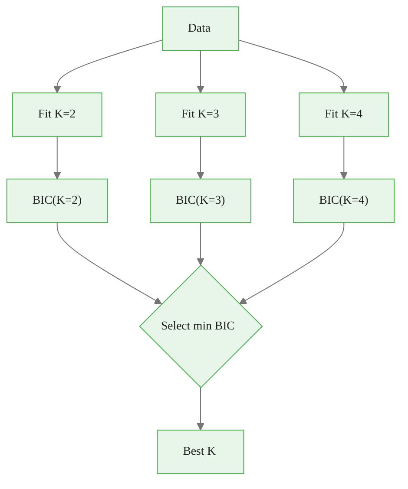
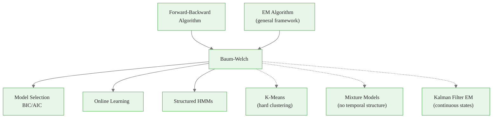

<!-- _class: lead -->

# Baum-Welch Algorithm
## Learning HMM Parameters

### Module 02 — Algorithms
### Hidden Markov Models Course

<!-- Speaker notes: The Baum-Welch algorithm is the EM algorithm specialized for HMMs. It solves Problem 3 (learning): given observations, find the parameters that maximize the data likelihood. This is the most complex algorithm in the course. -->
---

# The Learning Problem

**Given:**
- Observation sequence $O = (o_1, o_2, ..., o_T)$
- Model structure (number of states $K$)

**Find:**
- Parameters $\lambda^* = (\pi^*, A^*, B^*)$ that maximize $P(O|\lambda)$

$$\lambda^* = \arg\max_{\lambda} P(O|\lambda)$$

<!-- Speaker notes: The learning problem is the third fundamental HMM problem. Given only observations, find the parameters that maximize the data likelihood. This is an optimization problem that Baum-Welch solves using the EM framework. -->
---

# The Chicken-and-Egg Problem



<div class="callout-key">

Key implementation detail -- study this pattern carefully.

</div>

<!-- Speaker notes: This framing is the most intuitive explanation of why EM is needed. We cannot compute state probabilities without parameters, and we cannot estimate parameters without state probabilities. EM breaks this circular dependency. -->
---

# EM Framework for HMMs

**E-Step:** Compute expected sufficient statistics given current parameters $\lambda^{(n)}$

**M-Step:** Update parameters to maximize expected log-likelihood

**Iterate** until convergence:

$$|\log P(O|\lambda^{(n+1)}) - \log P(O|\lambda^{(n)})| < \epsilon$$

<!-- Speaker notes: The E-step computes expected sufficient statistics (gamma and xi) using the current parameters. The M-step updates parameters to maximize the expected complete-data log-likelihood. Each iteration is guaranteed to increase or maintain the log-likelihood. -->
---

# EM Convergence Guarantee

$$\log P(O | \lambda^{(n+1)}) \geq \log P(O | \lambda^{(n)})$$

Each iteration **increases** (or keeps constant) the likelihood.

> **Caveat:** Only guaranteed to find *local* maximum, not global.

<!-- Speaker notes: The monotonic increase property is the key theoretical result. It means EM never makes the model worse, though it may converge to a local rather than global optimum. This motivates multiple random restarts. -->
---

# Baum-Welch Algorithm Flow



<div class="callout-insight">

This pattern recurs throughout the course. Understanding it deeply pays dividends later.

</div>

<!-- Speaker notes: This detailed flow diagram shows the complete algorithm. The E-step uses forward-backward to compute gamma and xi. The M-step updates all parameters. The convergence check tests whether the log-likelihood has stabilized. -->
---

# Key Quantities — Forward and Backward

**Forward Variable:**
$$\alpha_t(i) = P(o_1, ..., o_t, q_t = s_i | \lambda)$$

**Backward Variable:**
$$\beta_t(i) = P(o_{t+1}, ..., o_T | q_t = s_i, \lambda)$$

<!-- Speaker notes: Alpha and beta are the building blocks. Alpha captures evidence from the past (observations 1 through t), beta captures evidence from the future (observations t+1 through T). Together they provide the complete posterior. -->
---

# Key Quantities — Gamma and Xi

**State Occupation Probability:**
$$\gamma_t(i) = P(q_t = s_i | O, \lambda) = \frac{\alpha_t(i) \beta_t(i)}{\sum_{j=1}^K \alpha_t(j) \beta_t(j)}$$

**Transition Probability:**
$$\xi_t(i,j) = \frac{\alpha_t(i) \cdot a_{ij} \cdot b_j(o_{t+1}) \cdot \beta_{t+1}(j)}{\sum_{i'} \sum_{j'} \alpha_t(i') \cdot a_{i'j'} \cdot b_{j'}(o_{t+1}) \cdot \beta_{t+1}(j')}$$

<!-- Speaker notes: Gamma is the posterior state probability at each time step. Xi is the posterior transition probability at each time step. Both are normalized to sum to 1 across their respective dimensions. -->
---

# Parameter Update Rules

**Initial State Distribution:**
$$\hat{\pi}_i = \gamma_1(i)$$

**Transition Matrix:**
$$\hat{a}_{ij} = \frac{\sum_{t=1}^{T-1} \xi_t(i,j)}{\sum_{t=1}^{T-1} \gamma_t(i)}$$

> Expected transitions $i \to j$ divided by expected time in state $i$.

<!-- Speaker notes: The update rules are intuitive: pi is updated to the posterior probability of starting in each state, A is updated to the ratio of expected transitions to expected occupancy. These are weighted maximum likelihood estimates. -->
---

# Emission Parameter Updates

**Discrete:**
$$\hat{b}_i(v_k) = \frac{\sum_{t: o_t=v_k} \gamma_t(i)}{\sum_{t=1}^{T} \gamma_t(i)}$$

**Gaussian Mean:**
$$\hat{\mu}_i = \frac{\sum_{t=1}^{T} \gamma_t(i) \cdot o_t}{\sum_{t=1}^{T} \gamma_t(i)}$$

**Gaussian Variance:**
$$\hat{\sigma}_i^2 = \frac{\sum_{t=1}^{T} \gamma_t(i) \cdot (o_t - \hat{\mu}_i)^2}{\sum_{t=1}^{T} \gamma_t(i)}$$

<!-- Speaker notes: Discrete emissions update by counting weighted observations. Gaussian emissions update by computing weighted means and variances. The weights are the gamma values from the E-step. -->
---

# Intuitive Explanation

**Iteration 1:**
- Guess: Bull mean = 1%, Bear mean = -1%
- E-step: When returns are positive, probably in Bull state
- M-step: Recompute Bull mean using weighted average
- New: Bull mean = 1.2%, Bear mean = -0.8%

**Iteration 2:**
- Use new parameters to recompute state probabilities
- Update parameters again
- ...continue until convergence

<!-- Speaker notes: Walk through the concrete numerical example. Starting with rough guesses, each iteration refines the parameters. The bull mean increases because positive returns are attributed more strongly to the bull state, and vice versa for bear. -->
---

<!-- _class: lead -->

# Implementation

<!-- Speaker notes: The implementation section translates the mathematical formulas into working code, bridging theory and practice. -->
---

# BaumWelchHMM Class — Core

```python
class BaumWelchHMM:
    def __init__(self, n_states, n_observations=None):
        self.K = n_states
        self.pi = np.ones(self.K) / self.K
        self.A = np.random.rand(self.K, self.K)
        self.A = self.A / self.A.sum(axis=1, keepdims=True)

        if n_observations is not None:
            self.B = np.random.rand(self.K, n_observations)
            self.B = self.B / self.B.sum(axis=1, keepdims=True)
            self.continuous = False
        else:
            self.means = np.random.randn(self.K)
            self.stds = np.ones(self.K)
            self.continuous = True
```

<div class="callout-warning">

Watch for edge cases with this implementation in production use.

</div>

<!-- Speaker notes: The constructor initializes parameters randomly. For discrete emissions, B is a random stochastic matrix. For continuous emissions, means and standard deviations are initialized from the standard normal distribution. -->
---

# E-Step Implementation

```python
def e_step(self, observations, alpha, beta):
    T = len(observations)

    # Gamma: P(q_t = i | O)
    gamma = alpha * beta
    gamma = gamma / (gamma.sum(axis=1, keepdims=True) + 1e-10)

    # Xi: P(q_t = i, q_{t+1} = j | O)
    xi = np.zeros((T-1, self.K, self.K))
    for t in range(T-1):
        for i in range(self.K):
            for j in range(self.K):
                xi[t, i, j] = (alpha[t, i] * self.A[i, j] *
                    self._emission_prob(observations[t+1], j) *
                    beta[t+1, j])
        xi[t] /= (xi[t].sum() + 1e-10)

    return gamma, xi
```

<div class="callout-info">

This approach follows established best practices in the field.

</div>

<!-- Speaker notes: The E-step computes gamma and xi from alpha and beta. The small epsilon (1e-10) prevents division by zero. The triple nested loop for xi is O(T times K squared), matching the theoretical complexity. -->
---

# M-Step Implementation

```python
def m_step(self, observations, gamma, xi):
    T = len(observations)

    # Update pi
    self.pi = gamma[0]

    # Update A
    for i in range(self.K):
        for j in range(self.K):
            self.A[i, j] = np.sum(xi[:, i, j]) / (np.sum(gamma[:-1, i]) + 1e-10)
    self.A = self.A / (self.A.sum(axis=1, keepdims=True) + 1e-10)

    # Update emission parameters (Gaussian)
    if self.continuous:
        for i in range(self.K):
            self.means[i] = np.sum(gamma[:, i] * observations) / \
                            (np.sum(gamma[:, i]) + 1e-10)
            diff = observations - self.means[i]
            self.stds[i] = np.sqrt(
                np.sum(gamma[:, i] * diff**2) / (np.sum(gamma[:, i]) + 1e-10))
```

<!-- Speaker notes: The implementation uses vectorized operations for efficiency. The outer product diff[:,:,None] times diff[:,None,:] computes the per-observation covariance contribution. The regularization term (1e-6 times identity) prevents singular covariance matrices. -->
---

# Fit Method — Full EM Loop

```python
def fit(self, observations, max_iterations=100, tolerance=1e-4):
    log_likelihoods = []

    for iteration in range(max_iterations):
        # E-step
        alpha, log_likelihood = self.forward(observations)
        beta = self.backward(observations)
        gamma, xi = self.e_step(observations, alpha, beta)

        # M-step
        self.m_step(observations, gamma, xi)
        log_likelihoods.append(log_likelihood)

        # Check convergence
        if iteration > 0:
            improvement = log_likelihoods[-1] - log_likelihoods[-2]
            if improvement < tolerance:
                print(f"Converged after {iteration+1} iterations")
                break

    return log_likelihoods
```

<!-- Speaker notes: The fit method orchestrates the full EM loop. It tracks log-likelihoods to monitor convergence and stops when the improvement falls below the tolerance. In practice, 50 to 200 iterations is typical. -->
---

<!-- _class: lead -->

# Common Pitfalls

<!-- Speaker notes: These pitfalls represent the most frequent mistakes practitioners make when implementing HMMs. Each one can lead to silently wrong results if not addressed. -->
---

# Pitfall 1 — Local Maxima

EM only finds **local** maxima. The likelihood surface is non-convex.

```python
def fit_with_multiple_initializations(observations, n_states, n_inits=10):
    best_hmm = None
    best_likelihood = -np.inf

    for i in range(n_inits):
        hmm = BaumWelchHMM(n_states, n_observations=None)
        log_liks = hmm.fit(observations, verbose=False)

        if log_liks[-1] > best_likelihood:
            best_likelihood = log_liks[-1]
            best_hmm = hmm

    return best_hmm
```

<!-- Speaker notes: Local maxima are the biggest practical challenge with Baum-Welch. The likelihood surface is non-convex, so different initializations converge to different solutions. Always run multiple restarts (10-50) and keep the best result by log-likelihood. -->
---

# Pitfall 2 — Numerical Underflow

Forward/backward probabilities become very small for long sequences.

<div class="columns">

**Problem:**
```python
# Multiplying many small numbers
# -> underflow to zero!
alpha_t = 1e-100 * 0.3 * 0.01
# = 3e-103 -> eventually 0.0
```

**Solution:**
<div class="code-window">
<div class="code-header">
<div class="dots"><span class="dot-red"></span><span class="dot-yellow"></span><span class="dot-green"></span></div>
<span class="filename">example.py</span>
</div>

```python
# Use scaling factors
alpha[t] /= scaling[t]
# or work in log space
log_alpha[t] = logsumexp(...)
```

</div>

</div>

<!-- Speaker notes: Numerical underflow in the forward-backward pass is the most common implementation bug. When sequence length exceeds about 100, raw probabilities underflow to zero. Scaling factors or log-space computation are essential for correctness. -->
---

# Pitfall 3 — Model Selection

More states always increase training likelihood but may **overfit**.

<div class="code-window">
<div class="code-header">
<div class="dots"><span class="dot-red"></span><span class="dot-yellow"></span><span class="dot-green"></span></div>
<span class="filename">compute_bic.py</span>
</div>

```python
def compute_bic(log_likelihood, n_params, n_observations):
    """BIC = -2 * log L + k * log(n) -- lower is better."""
    return -2 * log_likelihood + n_params * np.log(n_observations)

def select_num_states(observations, max_states=5):
    for K in range(2, max_states + 1):
        hmm = BaumWelchHMM(K)
        log_liks = hmm.fit(observations, verbose=False)
        n_params = (K-1) + K*(K-1) + 2*K  # pi + A + Gaussian params
        bic = compute_bic(log_liks[-1], n_params, len(observations))
        print(f"K={K}: BIC={bic:.2f}")
```

</div>

<!-- Speaker notes: Choosing the number of hidden states K is a model selection problem. Too few states underfit (miss important regime changes), too many overfit (detect noise as regimes). BIC penalizes complexity more heavily than AIC and is generally preferred for HMMs. -->
---

# Model Selection Flow



<!-- Speaker notes: The flow diagram shows the model selection procedure: fit models with different numbers of states, compute BIC for each, and select the minimum. This is standard practice for choosing the number of regimes. -->
---

# Pitfall 4 — Poor Initialization

Use K-means for smarter initial parameters:

<div class="code-window">
<div class="code-header">
<div class="dots"><span class="dot-red"></span><span class="dot-yellow"></span><span class="dot-green"></span></div>
<span class="filename">initialize_with_kmeans.py</span>
</div>

```python
from sklearn.cluster import KMeans

def initialize_with_kmeans(observations, n_states):
    hmm = BaumWelchHMM(n_states, n_observations=None)
    kmeans = KMeans(n_clusters=n_states)
    labels = kmeans.fit_predict(observations.reshape(-1, 1))

    for i in range(n_states):
        cluster_obs = observations[labels == i]
        if len(cluster_obs) > 0:
            hmm.means[i] = np.mean(cluster_obs)
            hmm.stds[i] = np.std(cluster_obs)

    # Initialize A from cluster transitions
    trans_counts = np.zeros((n_states, n_states))
    for t in range(len(labels) - 1):
        trans_counts[labels[t], labels[t+1]] += 1
    hmm.A = trans_counts / (trans_counts.sum(axis=1, keepdims=True) + 1e-10)
    return hmm
```

</div>

<!-- Speaker notes: K-means initialization is a practical technique that significantly improves convergence. By clustering observations first, we get reasonable initial emission parameters, and by counting transitions between cluster labels, we get a sensible initial transition matrix. -->
---

# All Pitfalls Summary

| Pitfall | Solution |
|----------|----------|
| Local maxima | Multiple random initializations |
| Numerical underflow | Scaling or log-space |
| Overfitting (too many states) | BIC/AIC model selection |
| Poor initialization | K-means clustering |
| Premature stopping | Monitor likelihood plateau |

<!-- Speaker notes: This summary table is a practical checklist for implementing Baum-Welch. Address each pitfall systematically: multiple restarts for local maxima, scaling for underflow, BIC for model selection, K-means for initialization, and regularization for degenerate states. -->

---

# Connections



<!-- Speaker notes: This diagram shows Baum-Welch at the intersection of Forward-Backward (E-step) and maximum likelihood estimation (M-step). It connects to Gaussian HMMs in Module 03 and to practical applications in Module 04 where learned parameters drive trading decisions. -->
---

# Key Takeaway

Baum-Welch solves the chicken-and-egg problem: we need states to estimate parameters, and parameters to infer states.

By alternating between **soft state inference** (E-step) and **parameter updates** (M-step), we iteratively improve our model until convergence to a local optimum.

<!-- Speaker notes: The key message is that Baum-Welch is EM for HMMs: alternate between computing state posteriors (E-step using Forward-Backward) and updating parameters (M-step using weighted counts). Practical success depends on multiple restarts, proper scaling, and model selection. -->
