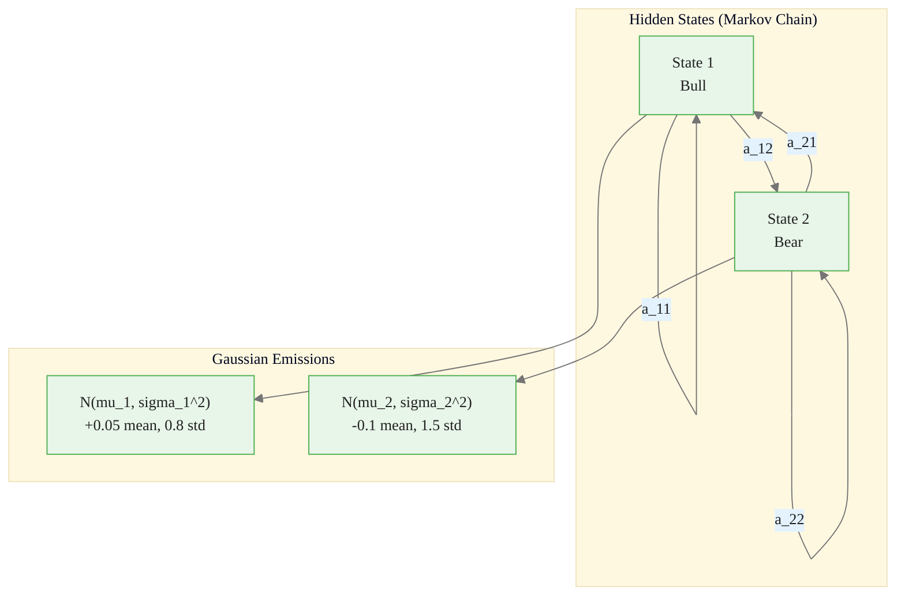
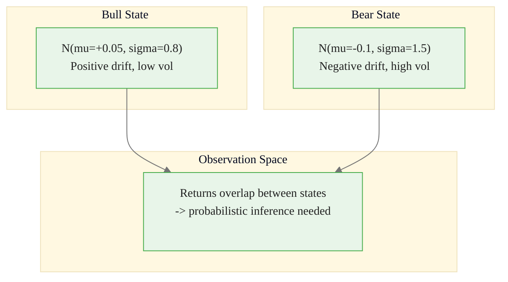
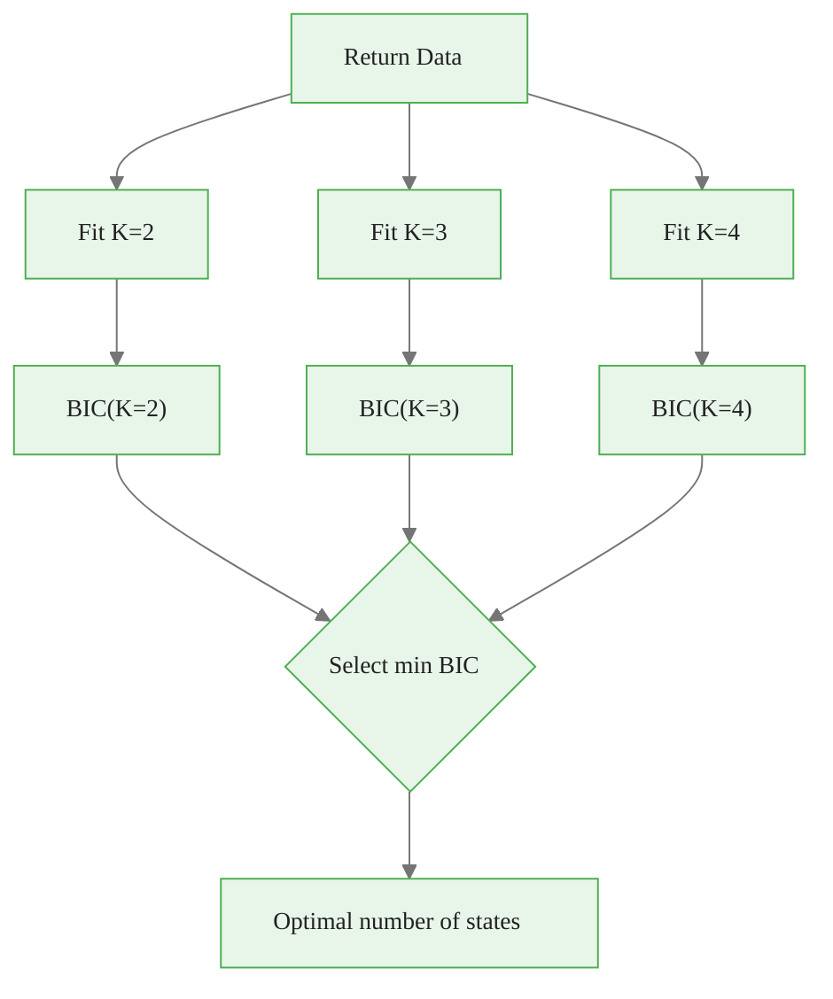
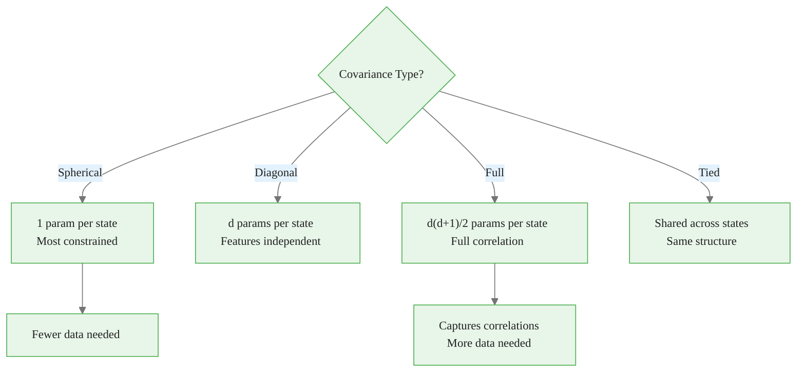
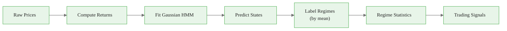

<!-- _class: lead -->

# Gaussian HMMs for Continuous Observations

## Module 03 — Gaussian HMM
### Hidden Markov Models Course

<!-- Speaker notes: This deck covers the complete Gaussian HMM framework for modeling continuous financial data. We start with the motivation, move through the mathematical formulation, and end with production-ready code patterns. -->

---

# From Discrete to Continuous

Financial data (returns, prices, volatility) is **continuous**. Gaussian HMMs model this directly:

$$o_t | q_t = k \sim \mathcal{N}(\mu_k, \Sigma_k)$$

Each hidden state $k$ has its own **mean** $\mu_k$ and **covariance** $\Sigma_k$.

<!-- Speaker notes: Unlike discrete HMMs where we count symbol frequencies, continuous observations require probability densities. Each regime in a financial market has distinct return and volatility characteristics that Gaussian emissions capture naturally. -->

---

# Gaussian Emission Model

**Univariate Case:**
$$b_k(o) = \frac{1}{\sqrt{2\pi\sigma_k^2}} \exp\left(-\frac{(o - \mu_k)^2}{2\sigma_k^2}\right)$$

**Multivariate Case:**
$$b_k(o) = \frac{1}{(2\pi)^{d/2}|\Sigma_k|^{1/2}} \exp\left(-\frac{1}{2}(o - \mu_k)^T\Sigma_k^{-1}(o - \mu_k)\right)$$

<!-- Speaker notes: The univariate case is a special case of the multivariate formula with d=1. The key parameters per state are the mean (location) and variance or covariance (spread). The exponent measures how far the observation is from the state's center, scaled by the covariance. -->

---

# Gaussian HMM Architecture



<div class="callout-key">

Key implementation detail -- study this pattern carefully.

</div>

<!-- Speaker notes: The architecture shows how hidden states follow a Markov chain at the top, and each state emits observations from its own Gaussian distribution. Bull markets have positive mean returns with low volatility, while bear markets have negative mean returns with high volatility. The overlap between these distributions is what makes states "hidden." -->

---

# Why Emissions Overlap Matters



<div class="callout-insight">

This pattern recurs throughout the course. Understanding it deeply pays dividends later.

</div>

<!-- Speaker notes: A single observation like a return of 0.0 percent has non-zero probability under both bull and bear states. This is precisely why we need probabilistic inference algorithms like Forward-Backward and Viterbi -- we cannot deterministically assign observations to states. -->

---

# Generating Synthetic Market Data

```python
np.random.seed(42)
n_samples = 1000
true_states, current_state = [], 0

for _ in range(n_samples):
    true_states.append(current_state)
    if current_state == 0:  # Bull
        if np.random.random() < 0.02: current_state = 1
    else:  # Bear
        if np.random.random() < 0.05: current_state = 0

true_states = np.array(true_states)
returns = np.zeros(n_samples)
returns[true_states == 0] = np.random.normal(0.05, 0.8, (true_states == 0).sum())
returns[true_states == 1] = np.random.normal(-0.1, 1.5, (true_states == 1).sum())
```

<div class="callout-warning">

Watch for edge cases with this implementation in production use.

</div>

<!-- Speaker notes: This synthetic data generator creates a two-state market with realistic persistence. Bull states transition to bear with 2 percent probability per step, while bear transitions to bull with 5 percent probability. This creates persistent regimes that we can later try to recover with our HMM. -->

---

# Implementation with hmmlearn

```python
from hmmlearn import hmm

model = hmm.GaussianHMM(
    n_components=2, covariance_type="full",
    n_iter=100, random_state=42
)
model.fit(returns.reshape(-1, 1))

predicted_states = model.predict(returns.reshape(-1, 1))
state_probs = model.predict_proba(returns.reshape(-1, 1))
```

<div class="callout-info">

This approach follows established best practices in the field.

</div>

<!-- Speaker notes: hmmlearn provides production-ready HMM implementations. The key parameters are n_components (number of hidden states), covariance_type (how covariance matrices are parameterized), and n_iter (maximum EM iterations). The fit method runs Baum-Welch, predict runs Viterbi, and predict_proba gives posterior state probabilities. -->

---

# Understanding the Learned Parameters

| Parameter | Accessor | Interpretation |
|-----------|----------|---------------|
| Initial distribution | `model.startprob_` | Starting state probabilities |
| Transition matrix | `model.transmat_` | Regime switching dynamics |
| Means | `model.means_` | Expected return per regime |
| Covariances | `model.covars_` | Volatility per regime |

<!-- Speaker notes: After fitting, inspect all four parameter sets. The means tell you the average behavior in each state, the covariances tell you the risk level, the transition matrix tells you how persistent each regime is, and the initial distribution reflects the starting conditions. -->

---

# RegimeDetector -- Production Class

```python
class RegimeDetector:
    def __init__(self, n_regimes=2):
        self.n_regimes = n_regimes

    def fit(self, returns, n_iter=100):
        if returns.ndim == 1: returns = returns.reshape(-1, 1)
        self.model = hmm.GaussianHMM(
            n_components=self.n_regimes, covariance_type="full",
            n_iter=n_iter, random_state=42)
        self.model.fit(returns)
        self._label_regimes()
        return self

    def _label_regimes(self):
        means = self.model.means_.flatten()
        self.regime_labels = {np.argmax(means): 'bull',
                              np.argmin(means): 'bear'}
```

<!-- Speaker notes: The RegimeDetector wraps hmmlearn with automatic regime labeling. Since HMM state indices are arbitrary, we label states by their learned means: the highest-mean state is bull, the lowest is bear. This ensures consistent interpretation across different random seeds and model fits. -->

---

# Extracting Regime Statistics

<div class="code-window">
<div class="code-header">
<div class="dots"><span class="dot-red"></span><span class="dot-yellow"></span><span class="dot-green"></span></div>
<span class="filename">get_regime_stats.py</span>
</div>

```python
def get_regime_stats(self):
    stats = {}
    for idx, label in self.regime_labels.items():
        stats[label] = {
            'mean': self.model.means_[idx, 0],
            'std': np.sqrt(self.model.covars_[idx, 0, 0]),
            'persistence': self.model.transmat_[idx, idx]}
    return stats
```

</div>

| Statistic | Bull | Bear |
|-----------|------|------|
| Mean return | Positive | Negative |
| Volatility | Low | High |
| Persistence | $a_{ii}$ | $a_{jj}$ |
| Expected duration | $1/(1-a_{ii})$ | $1/(1-a_{jj})$ |

<!-- Speaker notes: The persistence probability is the diagonal element of the transition matrix. Expected duration in a regime follows a geometric distribution with mean 1 divided by 1 minus the self-transition probability. For example, a persistence of 0.95 means an expected duration of 20 time steps. -->

---

# Model Selection with BIC

<div class="code-window">
<div class="code-header">
<div class="dots"><span class="dot-red"></span><span class="dot-yellow"></span><span class="dot-green"></span></div>
<span class="filename">select_n_states.py</span>
</div>

```python
def select_n_states(returns, max_states=5):
    if returns.ndim == 1: returns = returns.reshape(-1, 1)
    results = []
    for n in range(2, max_states + 1):
        model = hmm.GaussianHMM(n_components=n, n_iter=100)
        model.fit(returns)
        log_lik = model.score(returns)
        n_params = (n-1) + n*(n-1) + n + n*(n+1)//2
        bic = -2 * log_lik + n_params * np.log(len(returns))
        aic = -2 * log_lik + 2 * n_params
        results.append({'n_states': n, 'bic': bic, 'aic': aic})
    return pd.DataFrame(results)
```

</div>

<!-- Speaker notes: BIC penalizes model complexity more heavily than AIC, which is generally preferred for HMM selection because it guards against overfitting. The parameter count includes initial distribution, transition matrix, means, and covariance parameters. Choose the model with the lowest BIC. -->

---

# Model Selection Flow



<!-- Speaker notes: Fit models with increasing numbers of states and compare their BIC scores. The BIC-optimal model balances goodness of fit against complexity. For financial data, 2 or 3 states is most common: bull/bear, or bull/neutral/bear. More than 4 states is rarely justified. -->

---

# Covariance Type Selection



<!-- Speaker notes: The covariance type controls the number of free parameters per state. For univariate data, spherical and full are equivalent. For multivariate data, start with diagonal unless you have strong reason to believe features are correlated within states, in which case use full. Tied covariance assumes all states share the same covariance structure, which reduces parameters but may be too restrictive. -->

---

# Covariance Type Comparison

| Type | Description | Parameters per State |
|------|------------|---------------------|
| **Spherical** | Single variance | 1 |
| **Diagonal** | Independent variances per feature | $d$ |
| **Full** | Full covariance matrix | $d(d+1)/2$ |
| **Tied** | Shared across states | $d(d+1)/2$ total |

<!-- Speaker notes: This table summarizes the parameter count per state for each covariance type. The choice affects both the model's expressiveness and the amount of data needed for reliable estimation. As a rule of thumb, you need roughly 10 to 50 observations per free parameter. -->

---

# Real-World Regime Analysis

<div class="code-window">
<div class="code-header">
<div class="dots"><span class="dot-red"></span><span class="dot-yellow"></span><span class="dot-green"></span></div>
<span class="filename">regime_analysis.py</span>
</div>

```python
import yfinance as yf

def regime_analysis(ticker, start, end, n_states=2):
    data = yf.download(ticker, start=start, end=end)
    returns = data['Adj Close'].pct_change().dropna().values.reshape(-1, 1)

    model = hmm.GaussianHMM(n_components=n_states, n_iter=100)
    model.fit(returns)
    states = model.predict(returns)

    for i in range(n_states):
        mask = states == i
        r = returns[mask]
        print(f"Regime {i}: ann. return={r.mean()*252:.1%}, "
              f"ann. vol={r.std()*np.sqrt(252):.1%}, "
              f"days={mask.sum()}, pct={mask.mean():.1%}")
```

</div>

<!-- Speaker notes: This function downloads real market data and fits a Gaussian HMM to detect regimes. Annualizing daily returns multiplies the mean by 252 trading days and the standard deviation by the square root of 252. The output shows each regime's annualized return, volatility, number of days, and percentage of time spent in that regime. -->

---

# Regime Detection Pipeline



<!-- Speaker notes: This pipeline summarizes the end-to-end workflow. Starting from raw prices, compute returns, fit the HMM, decode states using Viterbi, label them consistently, extract statistics for each regime, and finally generate trading signals. The next module on applications covers the trading signal generation in detail. -->

---

# Key Takeaways

| Takeaway | Detail |
|----------|--------|
| Gaussian HMMs | Handle continuous observations naturally |
| Emission PDF | Each state has its own mean and variance |
| hmmlearn | Efficient, production-ready implementation |
| Model selection | BIC/AIC for number of states |
| Covariance types | Trade off flexibility vs. data requirements |
| Regime labeling | Identify bull/bear by learned means |
| Production patterns | RegimeDetector class with automatic labeling |

<!-- Speaker notes: The key takeaway is that Gaussian HMMs are the natural extension of discrete HMMs for financial data. The combination of hmmlearn for fitting, BIC for model selection, and consistent regime labeling by mean gives you a production-ready framework for market regime detection. -->
