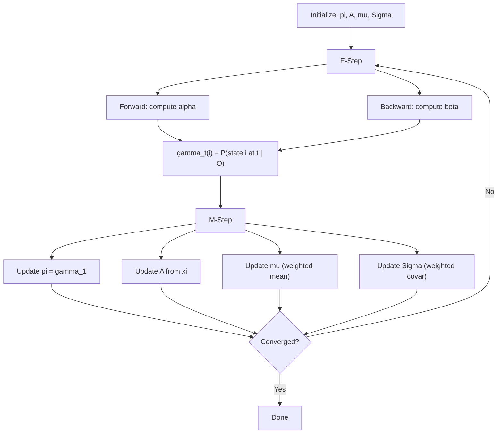
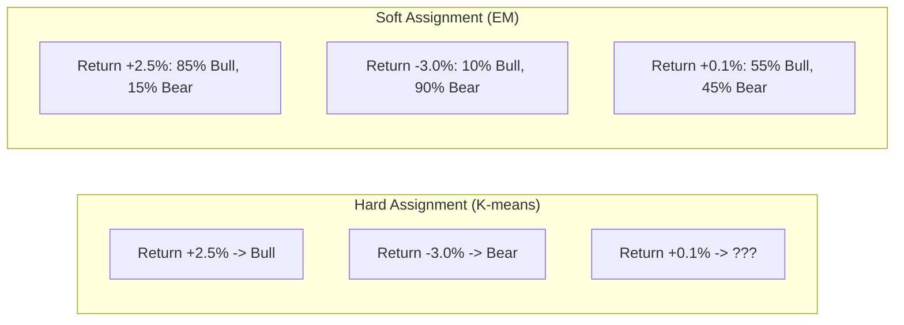
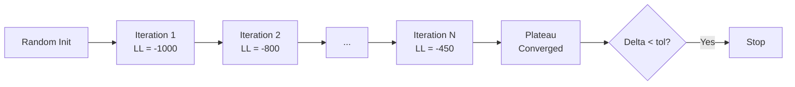
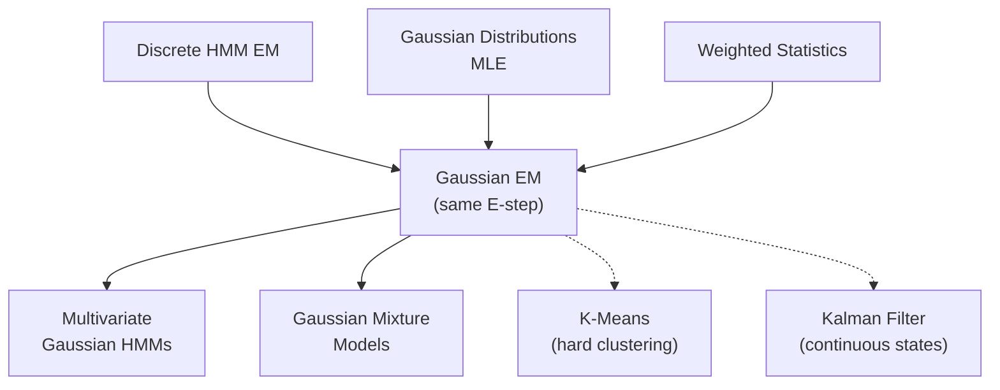

<!-- _class: lead -->

# EM for Gaussian HMMs
## Continuous Observations

### Module 03 — Gaussian HMM
### Hidden Markov Models Course

<!-- Speaker notes: This section extends the Baum-Welch algorithm from discrete to continuous observations. The key change is in the M-step: instead of counting symbol occurrences, we compute weighted means and covariances using state occupation probabilities as weights. -->
---

# Key Insight

For continuous observations (like financial returns), we cannot count "how many times we saw value X in state i" because each observation is **unique**.

Instead, we use **probability densities** and compute **weighted statistics** where weights are the probabilities of being in each state.

<!-- Speaker notes: For continuous observations like financial returns, each value is unique so we cannot count occurrences. Instead, EM computes weighted statistics where the weights are gamma values (state occupation probabilities). This is the fundamental difference from discrete EM. -->
---

# Gaussian HMM Model

**States:** $S = \{s_1, ..., s_K\}$

**Observations:** $o_t \in \mathbb{R}^D$ (continuous, D-dimensional)

**Emission Model:**
$$b_i(o_t) = \mathcal{N}(o_t | \mu_i, \Sigma_i) = \frac{1}{(2\pi)^{D/2} |\Sigma_i|^{1/2}} \exp\left(-\frac{1}{2}(o_t - \mu_i)^T \Sigma_i^{-1} (o_t - \mu_i)\right)$$

<!-- Speaker notes: The emission model is now a multivariate Gaussian instead of a discrete distribution. The key parameters per state are the mean vector mu and covariance matrix Sigma. -->
---

# EM Algorithm for Gaussian HMMs



<!-- Speaker notes: The flow diagram shows that the E-step is identical to discrete HMMs. The difference is entirely in the M-step, where we update means and covariances instead of emission probabilities. -->
---

# E-Step — Same as Discrete HMMs

**State Occupation:**
$$\gamma_t(i) = P(q_t = s_i | O, \lambda) = \frac{\alpha_t(i) \beta_t(i)}{\sum_j \alpha_t(j) \beta_t(j)}$$

**Transition Probability:**
$$\xi_t(i,j) = P(q_t = s_i, q_{t+1} = s_j | O, \lambda)$$

<!-- Speaker notes: Emphasize that the E-step computes gamma and xi using the same forward-backward formulas regardless of the emission type. Only the emission probability computation changes. -->
---

# M-Step — Gaussian Parameter Updates

**Mean Update:**
$$\hat{\mu}_i = \frac{\sum_{t=1}^T \gamma_t(i) \cdot o_t}{\sum_{t=1}^T \gamma_t(i)}$$

> Weighted average of observations, weighted by P(state i at time t).

**Variance Update (Univariate):**
$$\hat{\sigma}_i^2 = \frac{\sum_{t=1}^T \gamma_t(i) \cdot (o_t - \hat{\mu}_i)^2}{\sum_{t=1}^T \gamma_t(i)}$$

<!-- Speaker notes: The mean update is a weighted average where weights are the state occupation probabilities gamma. This is intuitive: observations that are more likely to belong to state i contribute more to that state's mean estimate. -->
---

# Multivariate Parameter Updates

**Mean Vector:**
$$\hat{\mu}_i = \frac{\sum_{t=1}^T \gamma_t(i) \cdot o_t}{\sum_{t=1}^T \gamma_t(i)}$$

**Covariance Matrix:**
$$\hat{\Sigma}_i = \frac{\sum_{t=1}^T \gamma_t(i) \cdot (o_t - \hat{\mu}_i)(o_t - \hat{\mu}_i)^T}{\sum_{t=1}^T \gamma_t(i)}$$

<!-- Speaker notes: The covariance update extends the variance update to matrices. The outer product of the centered observation with itself gives the contribution to the covariance, weighted by gamma. -->
---

# Intuitive Example

```
Day 1: return = +2.5%
  P(Bull | return=+2.5%, history) = 0.85
  P(Bear | return=+2.5%, history) = 0.15

Day 2: return = -3.0%
  P(Bull | return=-3.0%, history) = 0.10
  P(Bear | return=-3.0%, history) = 0.90
```

**M-Step for Bull mean:**
$$\hat{\mu}_{\text{Bull}} = \frac{0.85 \times 2.5\% + 0.10 \times (-3.0\%) + ...}{0.85 + 0.10 + ...}$$

<!-- Speaker notes: Walk through the concrete numbers. Day 1 has a positive return with 85 percent posterior probability of being in bull. Day 2 has a negative return with 90 percent posterior probability of being in bear. The weighted mean for bull is dominated by Day 1's contribution. -->
---

# Soft vs Hard Clustering



> EM uses **soft assignments** (probabilities) instead of hard labels.

<!-- Speaker notes: The EM versus K-means comparison is key. EM assigns soft probabilities (55 percent bull, 45 percent bear for ambiguous observations) while K-means makes hard assignments. Soft assignments are more robust, especially for overlapping distributions. -->
---

# Implementation — GaussianHMM Class

```python
class GaussianHMM:
    def __init__(self, n_states, n_features=1, covariance_type='full'):
        self.K = n_states
        self.D = n_features
        self.pi = np.ones(self.K) / self.K
        self.A = np.random.rand(self.K, self.K)
        self.A = self.A / self.A.sum(axis=1, keepdims=True)
        self.means = np.random.randn(self.K, self.D)
        if covariance_type == 'full':
            self.covars = np.array([np.eye(self.D) for _ in range(self.K)])

    def _emission_prob(self, observation, state):
        return stats.multivariate_normal.pdf(
            observation, mean=self.means[state], cov=self.covars[state])
```

<!-- Speaker notes: This class uses scipy's multivariate_normal for emission probability computation. The covariance type parameter controls the covariance structure. Full covariance captures cross-feature correlations. -->
---

# M-Step Implementation

```python
def m_step(self, observations, gamma, xi):
    # Update pi
    self.pi = gamma[0]

    # Update A
    for i in range(self.K):
        for j in range(self.K):
            self.A[i,j] = np.sum(xi[:,i,j]) / (np.sum(gamma[:-1,i]) + 1e-10)
    self.A /= self.A.sum(axis=1, keepdims=True)

    # Update Gaussian parameters
    for i in range(self.K):
        weights = gamma[:, i]
        # Weighted mean
        self.means[i] = np.sum(weights[:,None] * observations, axis=0) / \
                        (np.sum(weights) + 1e-10)
        # Weighted covariance
        diff = observations - self.means[i]
        self.covars[i] = np.sum(
            weights[:,None,None] * (diff[:,:,None] @ diff[:,None,:]),
            axis=0) / (np.sum(weights) + 1e-10)
        self.covars[i] += 1e-6 * np.eye(self.D)  # Regularization
```

<!-- Speaker notes: The implementation uses vectorized operations for efficiency. The outer product diff[:,:,None] times diff[:,None,:] computes the per-observation covariance contribution. The regularization term (1e-6 times identity) prevents singular covariance matrices. -->
---

# Convergence Monitoring

```python
def fit(self, observations, max_iter=100, tol=1e-4):
    log_likelihoods = []
    for iteration in range(max_iter):
        alpha, log_lik = self.forward(observations)
        beta = self.backward(observations, scales)
        gamma, xi = self.e_step(observations, alpha, beta)
        self.m_step(observations, gamma, xi)

        log_likelihoods.append(log_lik)
        if iteration > 0:
            if abs(log_likelihoods[-1] - log_likelihoods[-2]) < tol:
                print(f"Converged after {iteration+1} iterations")
                break
    return log_likelihoods
```

<!-- Speaker notes: Monitor convergence by tracking log-likelihood. It must increase monotonically. If it decreases, there is a bug. Convergence typically occurs within 50 to 200 iterations for well-initialized models. -->
---

<!-- _class: lead -->

# Common Pitfalls

<!-- Speaker notes: These pitfalls represent the most frequent mistakes practitioners make when implementing HMMs. Each one can lead to silently wrong results if not addressed. -->
---

# Pitfall 1 — Singular Covariance

**Problem:** Covariance becomes non-invertible.

**Solution:** Add regularization to diagonal.

```python
self.covars[i] += 1e-6 * np.eye(self.D)
```

<!-- Speaker notes: Singular covariance matrices crash the algorithm because the Gaussian PDF requires matrix inversion. This happens when a state captures too few observations or observations are collinear. Adding a small regularization term to the diagonal is the standard fix. -->
---

# Pitfall 2 — Label Switching

EM does not preserve state labels across runs.

```python
def identify_states(model):
    """Identify bull/bear by mean."""
    bull_idx = np.argmax(model.means)
    bear_idx = np.argmin(model.means)
    return bull_idx, bear_idx
```

<!-- Speaker notes: Label switching means state 0 in one run might correspond to state 1 in another run. EM only finds emission parameters, not meaningful labels. Post-hoc identification by sorting states by their mean (or volatility) provides consistent labeling across runs. -->
---

# Pitfall 3 — Initialization

Random initialization can lead to poor local optima.

```python
from sklearn.cluster import KMeans

def initialize_from_kmeans(model, observations):
    kmeans = KMeans(n_clusters=model.K)
    labels = kmeans.fit_predict(observations.reshape(-1, 1))
    for i in range(model.K):
        mask = labels == i
        if mask.sum() > 0:
            model.means[i] = observations[mask].mean()
            model.covars[i] = observations[mask].var()
    return model
```

<!-- Speaker notes: Random initialization often leads to poor local optima because the likelihood surface has many saddle points. K-means initialization clusters observations first, then uses cluster statistics as initial emission parameters. This dramatically improves convergence quality. -->
---

# EM Convergence Flow



<!-- Speaker notes: The convergence curve shows rapid improvement in early iterations followed by a plateau. The convergence check stops training when the improvement drops below the tolerance. -->
---

# Connections



<!-- Speaker notes: This diagram shows Gaussian EM at the intersection of discrete HMM EM (same E-step), Gaussian MLE (same parameter updates), and weighted statistics. It leads to multivariate extensions and connects to GMMs (HMMs without temporal structure) and K-means (hard assignment limit). -->
---

# Key Takeaway

Gaussian HMMs extend the EM framework to continuous observations by using **probability densities** instead of discrete probabilities.

The M-step becomes **weighted maximum likelihood estimation** for Gaussian parameters, where weights are the state occupation probabilities from the E-step.

<!-- Speaker notes: The core message is that Gaussian HMMs extend EM to continuous observations through weighted statistics. The E-step is identical to discrete HMMs. The M-step replaces symbol counting with weighted mean and covariance estimation, where weights are state occupation probabilities. -->
