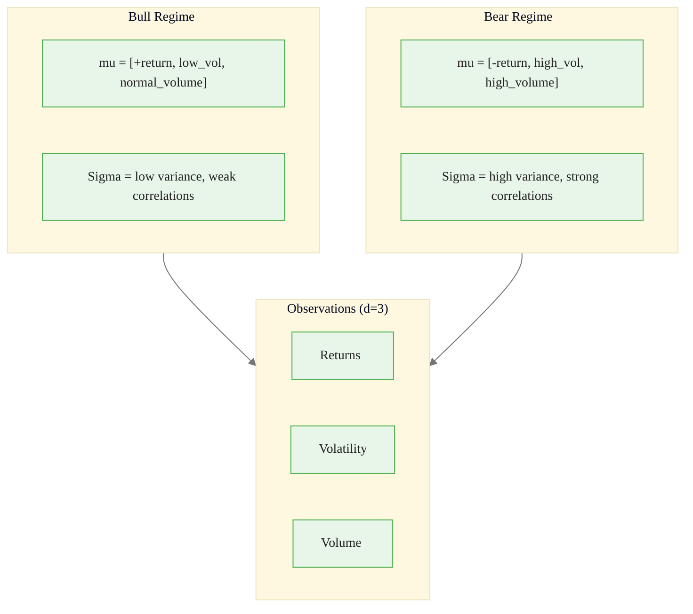
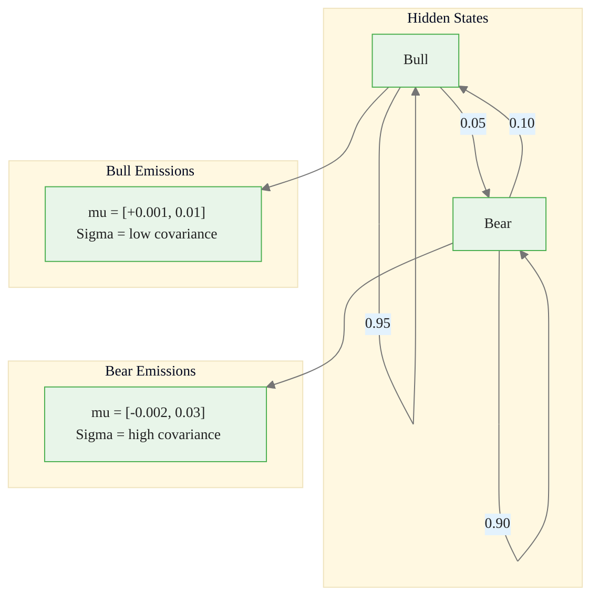
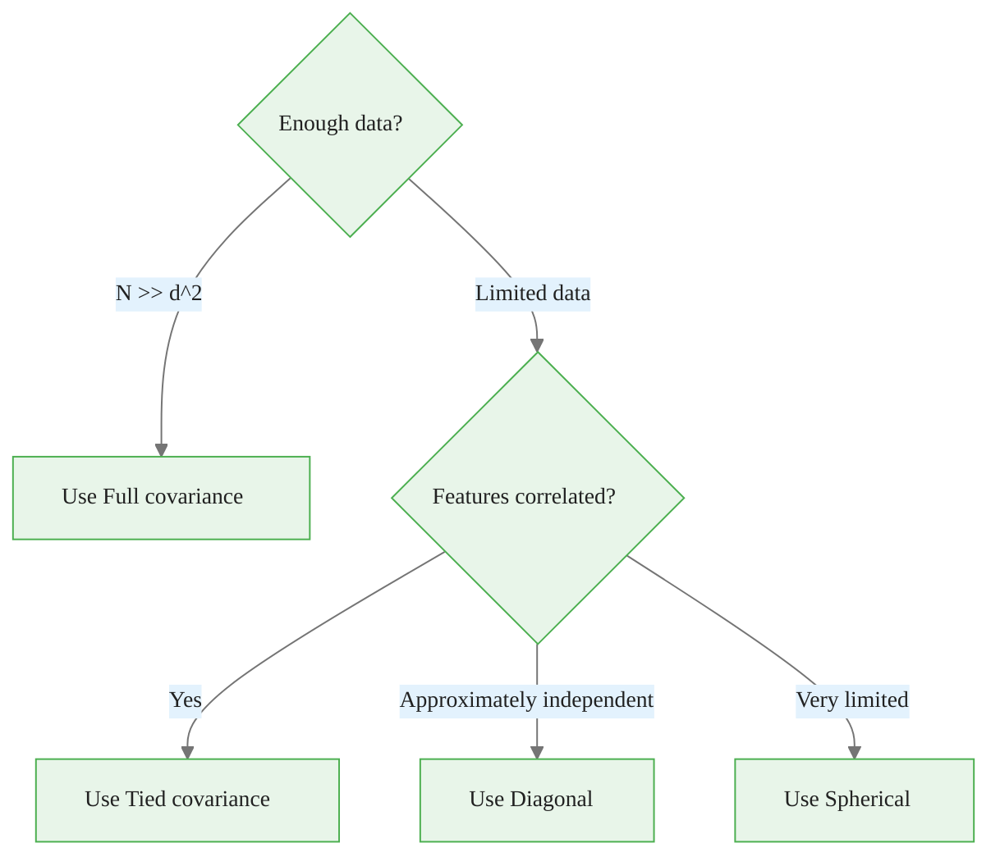
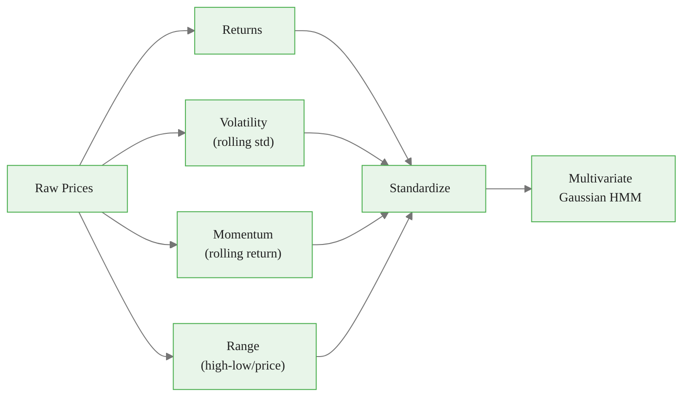
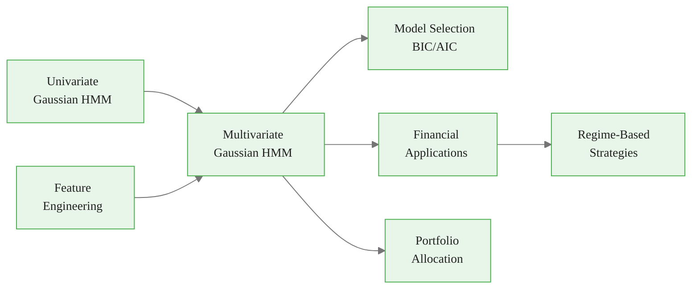

<!-- _class: lead -->

# Multivariate Gaussian HMMs
## Multi-Feature Regime Detection

### Module 03 — Gaussian HMM
### Hidden Markov Models Course

<!-- Speaker notes: This deck extends univariate Gaussian HMMs to multivariate observations. Using multiple features like returns, volatility, and momentum together produces richer and more robust regime detection than any single feature alone. -->

---

# Why Multivariate?

Single features give limited information. Combining **returns**, **volatility**, and **volume** captures richer regime dynamics.

$$\mathbf{o}_t | s_t = k \sim \mathcal{N}(\boldsymbol{\mu}_k, \boldsymbol{\Sigma}_k)$$

Each state has its own **mean vector** $\boldsymbol{\mu}_k$ and **covariance matrix** $\boldsymbol{\Sigma}_k$.

<!-- Speaker notes: A bull market is characterized not just by positive returns, but also by low volatility and moderate volume. A bear market has negative returns with high volatility and often elevated volume. A multivariate HMM captures these joint patterns, making regime detection more reliable. -->

---

# Multivariate Emission PDF

$$b_k(\mathbf{o}) = \frac{1}{(2\pi)^{d/2}|\boldsymbol{\Sigma}_k|^{1/2}} \exp\left(-\frac{1}{2}(\mathbf{o} - \boldsymbol{\mu}_k)^\top \boldsymbol{\Sigma}_k^{-1}(\mathbf{o} - \boldsymbol{\mu}_k)\right)$$

| Parameter | Shape | Description |
|-----------|-------|-------------|
| $\boldsymbol{\mu}_k$ | $(d,)$ | Mean vector for state $k$ |
| $\boldsymbol{\Sigma}_k$ | $(d, d)$ | Covariance matrix for state $k$ |

<!-- Speaker notes: The multivariate normal PDF generalizes the univariate case to d dimensions. The determinant of Sigma provides the normalization, and the quadratic form in the exponent measures the Mahalanobis distance from the observation to the state's mean. The covariance matrix captures both individual feature variances and cross-feature correlations. -->

---

# Multi-Feature Regime Concept



<div class="callout-key">

Key implementation detail -- study this pattern carefully.

</div>

<!-- Speaker notes: In bear markets, all features tend to move together: returns drop, volatility spikes, and volume surges. This creates stronger correlations between features in the bear state. The covariance matrix per state captures this regime-dependent correlation structure, which is a major advantage over modeling features independently. -->

---

# Multivariate HMM Architecture



<div class="callout-insight">

This pattern recurs throughout the course. Understanding it deeply pays dividends later.

</div>

<!-- Speaker notes: This diagram shows a 2-state, 2-feature model. The transition probabilities are highly persistent (0.95 and 0.90 for self-transitions), reflecting the fact that market regimes tend to last for extended periods. Each state emits 2-dimensional observations from its own multivariate Gaussian. -->

---

# Implementation -- Custom Class

```python
class MultivariateGaussianHMM:
    def __init__(self, n_states, n_features):
        self.n_states = n_states
        self.n_features = n_features

    def set_parameters(self, pi, A, means, covars):
        self.pi = np.array(pi)
        self.A = np.array(A)
        self.means = np.array(means)    # (n_states, n_features)
        self.covars = np.array(covars)  # (n_states, n_features, n_features)

    def emission_logprob(self, observation, state):
        return stats.multivariate_normal.logpdf(
            observation, mean=self.means[state], cov=self.covars[state])
```

<div class="callout-warning">

Watch for edge cases with this implementation in production use.

</div>

<!-- Speaker notes: This custom class stores parameters explicitly for educational purposes. In production, use hmmlearn's GaussianHMM which handles numerical stability, scaling, and convergence automatically. The log-probability is used instead of raw probability to avoid numerical underflow when multiplying many small values. -->

---

# Setting Up a Two-Feature Model

```python
model = MultivariateGaussianHMM(n_states=2, n_features=2)
model.set_parameters(
    pi=[0.5, 0.5],
    A=[[0.95, 0.05], [0.10, 0.90]],
    means=[
        [0.001, 0.01],   # Bull: positive return, low vol
        [-0.002, 0.03]   # Bear: negative return, high vol
    ],
    covars=[
        [[0.0001, 0.00005], [0.00005, 0.0001]],  # Bull: low variance
        [[0.0004, 0.0001], [0.0001, 0.0004]]      # Bear: high variance
    ]
)
```

<div class="callout-info">

This approach follows established best practices in the field.

</div>

<!-- Speaker notes: The mean vectors encode that bull markets have positive returns with low volatility, while bear markets have negative returns with high volatility. The covariance matrices show that bear states have four times the variance and stronger cross-feature correlation, reflecting the well-known phenomenon that correlations increase during market stress. -->

---

<!-- _class: lead -->

# Covariance Structures

<!-- Speaker notes: The choice of covariance structure is one of the most important modeling decisions in multivariate HMMs. It controls the trade-off between model flexibility and the amount of data needed for reliable estimation. -->

---

# Covariance Type Trade-offs

| Type | Flexibility | Parameters (K=2, d=3) | When to Use |
|------|------------|----------------------|-------------|
| **Spherical** | Low | 2 | Very limited data |
| **Diagonal** | Medium | 6 | Features approximately independent |
| **Full** | High | 12 | Need to capture correlations |
| **Tied** | Medium | 6 | States share correlation structure |

<!-- Speaker notes: The table shows how parameter counts scale. With full covariance, 2 states and 3 features need 12 covariance parameters plus 6 for means and 3 for transitions, totaling 21 free parameters. You generally need 10 to 50 observations per parameter for reliable estimation, so 3 features with full covariance requires at least 200 to 1000 data points. -->

---

# Covariance Selection Decision Flow



<!-- Speaker notes: As a practical rule, if you have more than 50 times d-squared observations, full covariance is safe. For smaller datasets, diagonal is a good default because financial features like returns and volatility are often only weakly correlated within a regime. Tied covariance is useful when you believe the correlation structure is the same across regimes but the scales differ. -->

---

# Parameter Counting

```python
def count_parameters(n_states, n_features, cov_type):
    base = (n_states - 1)                    # pi
    base += n_states * (n_states - 1)        # A
    base += n_states * n_features            # means

    if cov_type == 'spherical':
        cov_params = n_states
    elif cov_type == 'diag':
        cov_params = n_states * n_features
    elif cov_type == 'full':
        cov_params = n_states * n_features * (n_features + 1) // 2
    elif cov_type == 'tied':
        cov_params = n_features * (n_features + 1) // 2

    return base + cov_params
```

<!-- Speaker notes: Accurate parameter counting is essential for BIC-based model selection. The transition matrix has K times K minus 1 free parameters because each row sums to 1. The covariance matrix has d times d plus 1 over 2 unique elements because it is symmetric. This function is used in the model selection grid search to compute BIC. -->

---

# Fitting with hmmlearn

<div class="code-window">
<div class="code-header">
<div class="dots"><span class="dot-red"></span><span class="dot-yellow"></span><span class="dot-green"></span></div>
<span class="filename">example.py</span>
</div>

```python
from hmmlearn import hmm

model = hmm.GaussianHMM(
    n_components=2, covariance_type='full',
    n_iter=200, random_state=42
)
model.fit(observations)  # shape: (T, d)

predicted_states = model.predict(observations)

# Align labels (may be swapped)
if model.means_[0, 0] < model.means_[1, 0]:
    predicted_states = 1 - predicted_states
```

</div>

<!-- Speaker notes: When fitting multivariate data, ensure observations have shape T by d where T is the number of time steps and d is the number of features. After fitting, state labels may be swapped from run to run, so always align by comparing learned means. Here we check if the first feature's mean for state 0 is lower than state 1 and swap if needed. -->

---

# Feature Engineering for HMMs

<div class="code-window">
<div class="code-header">
<div class="dots"><span class="dot-red"></span><span class="dot-yellow"></span><span class="dot-green"></span></div>
<span class="filename">prepare_features.py</span>
</div>

```python
def prepare_features(prices, window=20):
    df = pd.DataFrame({'price': prices})
    df['return'] = df['price'].pct_change()
    df['volatility'] = df['return'].rolling(window).std() * np.sqrt(252)
    df['momentum'] = df['price'] / df['price'].shift(window) - 1
    high = df['price'].rolling(window).max()
    low = df['price'].rolling(window).min()
    df['range'] = (high - low) / df['price']
    df = df.dropna()

    features = ['return', 'volatility', 'range']
    for f in features:
        df[f'{f}_std'] = (df[f] - df[f].mean()) / df[f].std()
    return df[[f'{f}_std' for f in features]].values
```

</div>

> Always **standardize** features before fitting.

<!-- Speaker notes: Feature engineering is critical for multivariate HMMs. We compute returns, rolling volatility, momentum, and price range, then standardize each to zero mean and unit variance. Standardization is essential because Gaussian HMMs are sensitive to scale differences between features. Without it, the feature with the largest variance would dominate the clustering. -->

---

# Feature Engineering Pipeline



<!-- Speaker notes: The pipeline shows the four features derived from raw prices, each standardized before being fed to the multivariate HMM. The choice of features should be guided by domain knowledge: include features that you expect to differ meaningfully across regimes. Avoid highly correlated features as they can cause numerical issues with covariance estimation. -->

---

# Model Selection Grid Search

<div class="code-window">
<div class="code-header">
<div class="dots"><span class="dot-red"></span><span class="dot-yellow"></span><span class="dot-green"></span></div>
<span class="filename">select_multivariate_hmm.py</span>
</div>

```python
def select_multivariate_hmm(observations, max_states=5):
    results = []
    for n_states in range(2, max_states + 1):
        for cov_type in ['diag', 'full']:
            model = hmm.GaussianHMM(
                n_components=n_states, covariance_type=cov_type,
                n_iter=100, random_state=42)
            model.fit(observations)
            score = model.score(observations)
            n_params = count_parameters(
                n_states, observations.shape[1], cov_type)
            bic = -2 * score + n_params * np.log(len(observations))
            results.append({'n_states': n_states,
                           'cov_type': cov_type, 'bic': bic})

    best = min(results, key=lambda x: x['bic'])
    return best
```

</div>

<!-- Speaker notes: The grid search tries all combinations of state count and covariance type. BIC balances model fit against complexity. For multivariate HMMs, this grid search is especially important because the parameter count grows quickly with the number of states and features. Run multiple random seeds for robustness. -->

---

# Key Takeaways

| Takeaway | Detail |
|----------|--------|
| Multivariate HMMs | Model joint distributions of multiple features |
| Mean vector + covariance | Per-state parameters capture full distribution |
| Covariance structure | Balance flexibility vs. data requirements |
| Feature engineering | Standardize; include returns, vol, momentum |
| Model selection | Grid search over states and covariance types |
| hmmlearn | Production-ready multivariate HMM fitting |

<!-- Speaker notes: The move from univariate to multivariate HMMs unlocks richer regime detection but requires careful attention to feature engineering, standardization, and covariance structure selection. Always validate with BIC and multiple random restarts. -->

---

# Connections



<!-- Speaker notes: Multivariate Gaussian HMMs build directly on the univariate case from the previous deck, adding feature engineering as a prerequisite. The outputs feed into both financial applications like regime-based trading and portfolio allocation, which are covered in Module 04. -->
