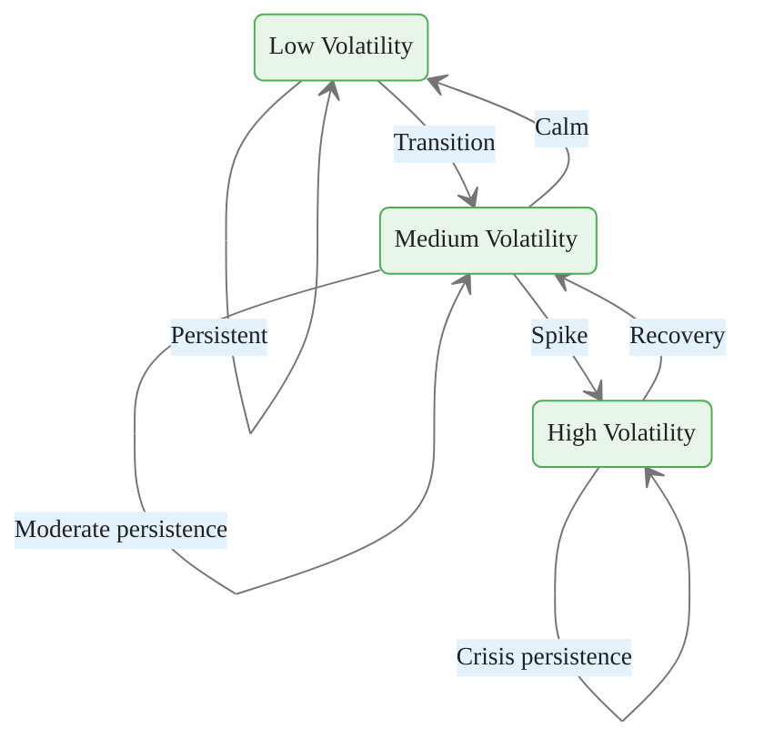

<!-- _class: lead -->

# Financial Applications of HMMs
## Regime Detection, Trading, and Risk

### Module 04 — Applications
### Hidden Markov Models Course

<!-- Speaker notes: This module bridges theory and practice by showing how HMMs solve real financial problems. The applications range from regime detection for risk management to dynamic portfolio allocation. Each application builds directly on the algorithms from Modules 02 and 03. -->
---

# HMM Applications in Finance

```mermaid
%%{init: {"theme": "base", "themeVariables": {"primaryColor": "#e8f5e9", "primaryBorderColor": "#4caf50", "primaryTextColor": "#212121", "secondaryColor": "#e3f2fd", "tertiaryColor": "#fff8e1", "lineColor": "#757575", "fontFamily": "Inter, sans-serif", "fontSize": "14px"}}}%%
flowchart TD
    HMM[\"HMM Framework\"] --> RD[\"Regime Detection\"]
    HMM --> VM[\"Volatility Modeling\"]
    HMM --> AA[\"Asset Allocation\"]
    HMM --> RM[\"Risk Management\"]
    HMM --> TS[\"Trading Signals\"]
    RD --> TS
    VM --> RM
    RD --> AA
```

<div class="callout-key">

Key implementation detail -- study this pattern carefully.

</div>

<!-- Speaker notes: This overview diagram shows the five main financial applications of HMMs. All flow from the core regime detection capability. The connections between applications show how regime information propagates through a trading system. -->
---

# MarketRegimeModel — Core Class

```python
class MarketRegimeModel:
    def __init__(self):
        self.model = None
        self.bull_state = None
        self.bear_state = None

    def fit(self, returns: np.ndarray):
        if returns.ndim == 1:
            returns = returns.reshape(-1, 1)
        self.model = hmm.GaussianHMM(
            n_components=2, covariance_type="full",
            n_iter=1000, random_state=42)
        self.model.fit(returns)
        self.bull_state = np.argmax(self.model.means_)
        self.bear_state = np.argmin(self.model.means_)
        return self
```

<div class="callout-insight">

This pattern recurs throughout the course. Understanding it deeply pays dividends later.

</div>

<!-- Speaker notes: This is the production entry point for regime detection. It wraps hmmlearn with automatic label alignment. The bull state has the highest mean return, the bear state has the lowest. Always use 1000 iterations for production models. -->
---

# Regime Prediction Methods

```python
def predict_regime(self, returns: np.ndarray) -> np.ndarray:
    """Predict regime (0=bear, 1=bull)."""
    states = self.model.predict(returns.reshape(-1, 1))
    regime = np.zeros_like(states)
    regime[states == self.bull_state] = 1
    return regime

def regime_probability(self, returns: np.ndarray) -> np.ndarray:
    """Get probability of bull regime."""
    probs = self.model.predict_proba(returns.reshape(-1, 1))
    return probs[:, self.bull_state]
```

<div class="callout-warning">

Watch for edge cases with this implementation in production use.

</div>

> State labeling by learned mean ensures consistent bull/bear identification across runs.

<!-- Speaker notes: The predict_regime method uses Viterbi for hard regime labels, while regime_probability uses forward-backward for soft probabilities. Use hard labels for reporting and soft probabilities for position sizing and allocation. -->
---

# Regime Parameter Extraction

```python
def get_parameters(self) -> dict:
    return {
        'bull': {
            'mean': self.model.means_[self.bull_state, 0],
            'std': np.sqrt(self.model.covars_[self.bull_state, 0, 0]),
            'persistence': self.model.transmat_[self.bull_state, self.bull_state]
        },
        'bear': {
            'mean': self.model.means_[self.bear_state, 0],
            'std': np.sqrt(self.model.covars_[self.bear_state, 0, 0]),
            'persistence': self.model.transmat_[self.bear_state, self.bear_state]
        }
    }
```

<div class="callout-info">

This approach follows established best practices in the field.

</div>

<!-- Speaker notes: Extracting regime parameters enables downstream analysis: the mean tells you the expected return, the std tells you the risk level, and the persistence tells you the expected regime duration. -->
---

<!-- _class: lead -->

# Regime-Based Trading

<!-- Speaker notes: Regime-based trading uses HMM state probabilities to generate signals, with thresholds controlling the trade-off between responsiveness and stability. -->
---

# Trading Signal Generation

```mermaid
%%{init: {"theme": "base", "themeVariables": {"primaryColor": "#e8f5e9", "primaryBorderColor": "#4caf50", "primaryTextColor": "#212121", "secondaryColor": "#e3f2fd", "tertiaryColor": "#fff8e1", "lineColor": "#757575", "fontFamily": "Inter, sans-serif", "fontSize": "14px"}}}%%
flowchart LR
    R[\"Returns\"] --> RP[\"Regime<br>Probability\"]
    RP --> TH{\"Threshold\"}
    TH -->|\"P(bull) > 0.7\"| LONG[\"Long Signal\"]
    TH -->|\"P(bull) < 0.3\"| SHORT[\"Short Signal\"]
    TH -->|\"0.3 < P < 0.7\"| NEUTRAL[\"Neutral\"]
    LONG --> EXEC[\"Execute\"]
    SHORT --> EXEC
    NEUTRAL --> EXEC
```

<!-- Speaker notes: The threshold-based signal generation creates a neutral zone between 0.3 and 0.7, preventing trades when regime conviction is low. This reduces turnover and avoids whipsaw trading during regime transitions. -->
---

# RegimeStrategy Implementation

```python
class RegimeStrategy:
    def __init__(self, regime_model: MarketRegimeModel):
        self.regime_model = regime_model

    def generate_signals(self, returns, bull_threshold=0.7,
                         bear_threshold=0.3):
        bull_prob = self.regime_model.regime_probability(returns)
        signals = np.zeros(len(bull_prob))
        signals[bull_prob > bull_threshold] = 1   # Long
        signals[bull_prob < bear_threshold] = -1  # Short
        return signals
```

> Thresholds create a **neutral zone** — only trade when regime conviction is high.

<!-- Speaker notes: The strategy class separates signal generation from execution. The thresholds are configurable parameters that control the trade-off between responsiveness and stability. -->
---

# Backtesting the Strategy

```python
def backtest(self, returns, signals) -> dict:
    # Shift signals (trade on next day's open)
    signals_shifted = np.roll(signals, 1)
    signals_shifted[0] = 0

    strategy_returns = signals_shifted * returns.flatten()

    total_return = np.exp(np.sum(np.log1p(strategy_returns))) - 1
    sharpe = np.mean(strategy_returns) / np.std(strategy_returns) * np.sqrt(252)
    max_dd = self._max_drawdown(strategy_returns)

    return {'total_return': total_return,
            'sharpe_ratio': sharpe,
            'max_drawdown': max_dd,
            'win_rate': (strategy_returns > 0).mean()}
```

<!-- Speaker notes: Critical detail: signals are shifted by one day to avoid look-ahead bias. The strategy returns are computed as the signal times the next day's return. Performance metrics include Sharpe ratio, maximum drawdown, and win rate. -->
---

# Backtesting Pipeline

```mermaid
%%{init: {"theme": "base", "themeVariables": {"primaryColor": "#e8f5e9", "primaryBorderColor": "#4caf50", "primaryTextColor": "#212121", "secondaryColor": "#e3f2fd", "tertiaryColor": "#fff8e1", "lineColor": "#757575", "fontFamily": "Inter, sans-serif", "fontSize": "14px"}}}%%
flowchart TD
    DATA[\"Historical Returns\"] --> FIT[\"Fit HMM\"]
    FIT --> SIGNALS[\"Generate Signals\"]
    SIGNALS --> SHIFT[\"Shift Signals<br>(avoid look-ahead)\"]
    SHIFT --> CALC[\"Calculate Strategy Returns\"]
    CALC --> METRICS[\"Performance Metrics\"]
    METRICS --> TR[\"Total Return\"]
    METRICS --> SR[\"Sharpe Ratio\"]
    METRICS --> MDD[\"Max Drawdown\"]
    METRICS --> WR[\"Win Rate\"]
```

<!-- Speaker notes: The flow diagram emphasizes the signal shift step, which prevents look-ahead bias. This is the most common backtesting error in quantitative finance. -->
---

<!-- _class: lead -->

# Volatility Regime Detection

<!-- Speaker notes: Volatility regime detection uses a separate HMM on realized volatility to capture the distinct dynamics of calm versus crisis markets. -->
---

# Multi-State Volatility Model

```python
class VolatilityRegimeModel:
    def __init__(self, n_regimes: int = 3):
        self.n_regimes = n_regimes

    def fit(self, returns, window=21):
        returns_series = pd.Series(returns.flatten())
        realized_vol = returns_series.rolling(window).std() * np.sqrt(252)
        realized_vol = realized_vol.dropna().values.reshape(-1, 1)
        self.model = hmm.GaussianHMM(
            n_components=self.n_regimes, covariance_type="full",
            n_iter=1000, random_state=42)
        self.model.fit(realized_vol)
        self._sort_regimes()
        return self
```

<!-- Speaker notes: This three-state model captures low, medium, and high volatility regimes. The input is realized volatility rather than raw returns, providing a complementary view to the return-based regime model. -->
---

# Three Volatility Regimes



> Three states capture calm markets, normal conditions, and crisis periods.

<!-- Speaker notes: The state diagram shows asymmetric transitions: low-to-high volatility jumps are rare but sudden, while high-to-low recovery is more gradual through the medium state. -->
---

<!-- _class: lead -->

# Asset Allocation with Regimes

<!-- Speaker notes: Regime-aware asset allocation adapts the portfolio to current market conditions, shifting between risk-on and risk-off positioning based on regime probabilities. -->
---

# RegimeAwareAllocator

<div class="columns">
<div>

**Bull Regime**
- Stocks: 80%
- Bonds: 20%
- Risk-on positioning
- Higher expected returns

</div>
<div>

**Bear Regime**
- Stocks: 30%
- Bonds: 70%
- Risk-off positioning
- Capital preservation

</div>
</div>

<!-- Speaker notes: The columns show the contrasting allocations between bull and bear regimes. The probability-weighted blending produces smooth allocation transitions rather than abrupt switches. -->
---

# Probability-Weighted Allocation

```python
class RegimeAwareAllocator:
    def __init__(self, regime_model, allocations=None):
        self.regime_model = regime_model
        self.allocations = allocations or {
            'bull': {'stocks': 0.8, 'bonds': 0.2},
            'bear': {'stocks': 0.3, 'bonds': 0.7}
        }

    def get_allocation(self, returns):
        bull_prob = self.regime_model.regime_probability(returns)[-1]
        allocation = {}
        for asset in self.allocations['bull'].keys():
            allocation[asset] = (
                bull_prob * self.allocations['bull'][asset] +
                (1 - bull_prob) * self.allocations['bear'][asset])
        return allocation
```

> Blending by probability produces **smooth allocation transitions** instead of abrupt switches.

<!-- Speaker notes: The blending formula weights each regime's allocation by its posterior probability. This produces gradually shifting allocations as regime probabilities evolve, reducing turnover compared to hard threshold switching. -->
---

<!-- _class: lead -->

# Regime-Switching Risk Models

<!-- Speaker notes: Regime-conditional risk models provide more accurate VaR and Expected Shortfall estimates by accounting for the current market regime. -->
---

# Value at Risk with Regimes

```python
class RegimeSwitchingVaR:
    def calculate_var(self, returns, confidence=0.95, horizon=1):
        params = self.regime_model.get_parameters()
        bull_prob = self.regime_model.regime_probability(returns)[-1]

        bull_var = params['bull']['mean'] - \
                   stats.norm.ppf(confidence) * params['bull']['std']
        bear_var = params['bear']['mean'] - \
                   stats.norm.ppf(confidence) * params['bear']['std']

        # Probability-weighted VaR
        weighted_var = bull_prob * bull_var + (1 - bull_prob) * bear_var
        weighted_var *= np.sqrt(horizon)

        return {'bull_var': bull_var, 'bear_var': bear_var,
                'weighted_var': weighted_var}
```

<!-- Speaker notes: Regime-conditional VaR gives different risk estimates for different regimes. The probability-weighted VaR blends them, producing a risk estimate that accounts for the current regime uncertainty. -->
---

# Risk Model Architecture

```mermaid
%%{init: {"theme": "base", "themeVariables": {"primaryColor": "#e8f5e9", "primaryBorderColor": "#4caf50", "primaryTextColor": "#212121", "secondaryColor": "#e3f2fd", "tertiaryColor": "#fff8e1", "lineColor": "#757575", "fontFamily": "Inter, sans-serif", "fontSize": "14px"}}}%%
flowchart TD
    RET[\"Returns\"] --> HMM[\"HMM Regime Model\"]
    HMM --> BP[\"Bull Probability\"]
    HMM --> PARAMS[\"Regime Parameters\"]
    PARAMS --> BVAR[\"Bull VaR\"]
    PARAMS --> BRVAR[\"Bear VaR\"]
    BP --> WVAR[\"Weighted VaR\"]
    BVAR --> WVAR
    BRVAR --> WVAR
    WVAR --> ES[\"Expected Shortfall\"]
    WVAR --> SIZING[\"Position Sizing\"]
```

<!-- Speaker notes: This flow diagram shows how regime information feeds into the complete risk management pipeline: from bull probability through VaR computation to position sizing decisions. -->
---

# Expected Shortfall (CVaR)

<div class="code-window">
<div class="code-header">
<div class="dots"><span class="dot-red"></span><span class="dot-yellow"></span><span class="dot-green"></span></div>
<span class="filename">calculate_expected_shortfall.py</span>
</div>

```python
def calculate_expected_shortfall(self, returns, confidence=0.95):
    params = self.regime_model.get_parameters()
    bull_prob = self.regime_model.regime_probability(returns)[-1]

    z = stats.norm.ppf(confidence)
    phi_z = stats.norm.pdf(z)

    bull_es = -params['bull']['mean'] + \
              params['bull']['std'] * phi_z / (1 - confidence)
    bear_es = -params['bear']['mean'] + \
              params['bear']['std'] * phi_z / (1 - confidence)

    weighted_es = bull_prob * bull_es + (1 - bull_prob) * bear_es
    return {'bull_es': bull_es, 'bear_es': bear_es,
            'weighted_es': weighted_es}
```

</div>

<!-- Speaker notes: Expected Shortfall gives the average loss in the worst (1-alpha) percent of scenarios. The phi_z divided by (1 minus confidence) adjustment accounts for the tail behavior of the Gaussian distribution. -->
---

<!-- _class: lead -->

# Practical Considerations

<!-- Speaker notes: Practical considerations are critical for production systems: look-ahead bias, local optima, and label switching can invalidate results if not properly handled. -->
---

# Avoiding Look-Ahead Bias

<div class="code-window">
<div class="code-header">
<div class="dots"><span class="dot-red"></span><span class="dot-yellow"></span><span class="dot-green"></span></div>
<span class="filename">expanding_window_regime.py</span>
</div>

```python
def expanding_window_regime(returns, min_periods=252):
    """Detect regimes using only past data."""
    n = len(returns)
    regimes = np.zeros(n)

    for t in range(min_periods, n):
        model = hmm.GaussianHMM(n_components=2, n_iter=100,
                                 random_state=42)
        model.fit(returns[:t].reshape(-1, 1))
        bull_state = np.argmax(model.means_)
        state = model.predict(returns[:t].reshape(-1, 1))[-1]
        regimes[t] = 1 if state == bull_state else 0

    return regimes
```

</div>

> **Never fit on future data** — always use expanding or rolling windows.

<!-- Speaker notes: The expanding window approach refits the HMM at each time step using only past data. This is computationally expensive but essential for honest backtesting. Never fit on future data. -->
---

# Multiple Random Starts

<div class="code-window">
<div class="code-header">
<div class="dots"><span class="dot-red"></span><span class="dot-yellow"></span><span class="dot-green"></span></div>
<span class="filename">fit_with_multiple_starts.py</span>
</div>

```python
def fit_with_multiple_starts(returns, n_components=2, n_starts=10):
    best_score = -np.inf
    best_model = None

    for seed in range(n_starts):
        model = hmm.GaussianHMM(
            n_components=n_components, covariance_type="full",
            n_iter=1000, random_state=seed)
        model.fit(returns.reshape(-1, 1))
        score = model.score(returns.reshape(-1, 1))

        if score > best_score:
            best_score = score
            best_model = model

    return best_model
```

</div>

<!-- Speaker notes: Multiple starts address the local optima problem. Different seeds may find different regime structures. Keeping the best model (highest log-likelihood) improves robustness. -->
---

# Practical Pitfalls

```mermaid
%%{init: {"theme": "base", "themeVariables": {"primaryColor": "#e8f5e9", "primaryBorderColor": "#4caf50", "primaryTextColor": "#212121", "secondaryColor": "#e3f2fd", "tertiaryColor": "#fff8e1", "lineColor": "#757575", "fontFamily": "Inter, sans-serif", "fontSize": "14px"}}}%%
flowchart TD
    P1[\"Look-Ahead Bias\"] --> S1[\"Expanding window<br>only past data\"]
    P2[\"Local Optima\"] --> S2[\"Multiple random<br>initializations\"]
    P3[\"Label Switching\"] --> S3[\"Sort states<br>by mean\"]
    P4[\"Overfitting\"] --> S4[\"BIC/AIC for<br>model selection\"]
    P5[\"Transaction Costs\"] --> S5[\"Add friction to<br>backtest\"]
```

<!-- Speaker notes: These pitfalls represent real production failures in quantitative finance. Look-ahead bias is the most dangerous because it inflates backtesting performance. Regime persistence bias means the model is slow to detect regime changes. Each pitfall has a concrete mitigation strategy. -->
---

# Key Takeaways

| Takeaway | Detail |
|----------|----------|
| Market regimes | Naturally map to HMM states (bull/bear) |
| Regime-based trading | Threshold-based signals from regime probability |
| Volatility modeling | Multi-state HMM on realized volatility |
| Asset allocation | Blend regime-optimal weights by probability |
| Risk management | Condition VaR/ES on current regime |
| Look-ahead bias | Use expanding windows for honest backtests |
| Robustness | Multiple initializations improve model quality |

<!-- Speaker notes: The key message is that HMMs provide actionable financial insights: regime-dependent risk estimates, dynamic hedging ratios, and portfolio rebalancing signals. Success requires careful attention to look-ahead bias, transaction costs, and model validation on out-of-sample data. -->

---

# Connections

```mermaid
%%{init: {"theme": "base", "themeVariables": {"primaryColor": "#e8f5e9", "primaryBorderColor": "#4caf50", "primaryTextColor": "#212121", "secondaryColor": "#e3f2fd", "tertiaryColor": "#fff8e1", "lineColor": "#757575", "fontFamily": "Inter, sans-serif", "fontSize": "14px"}}}%%
flowchart LR
    GHMM[\"Gaussian<br>HMM\"] --> RD[\"Regime<br>Detection\"]
    RD --> TRADE[\"Trading<br>Strategies\"]
    RD --> ALLOC[\"Asset<br>Allocation\"]
    RD --> RISK[\"Risk<br>Management\"]
    TRADE --> BT[\"Backtesting\"]
    ALLOC --> PORT[\"Portfolio<br>Optimization\"]
    RISK --> VAR[\"VaR / CVaR\"]
```

<!-- Speaker notes: This diagram shows financial applications as the practical culmination of the theoretical modules. Gaussian HMMs feed into regime detection, which drives risk management and portfolio allocation. The connection to extensions (Module 05) shows paths for handling more complex market dynamics. -->
