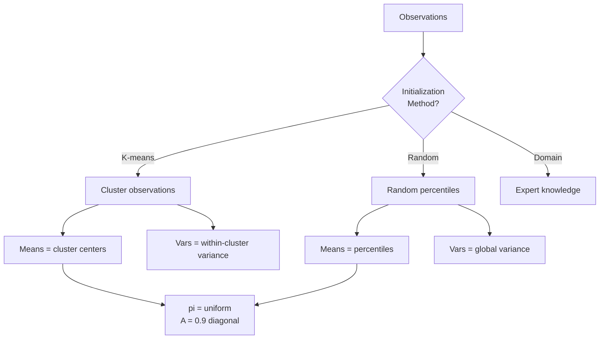
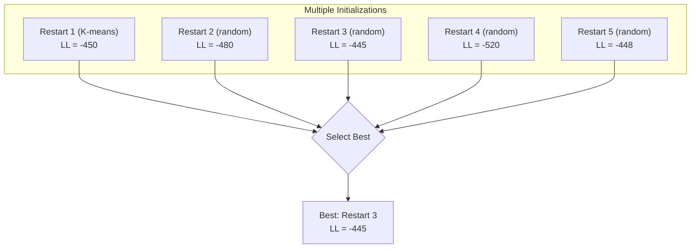
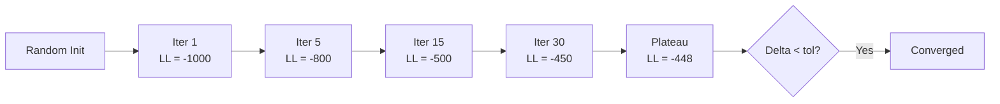
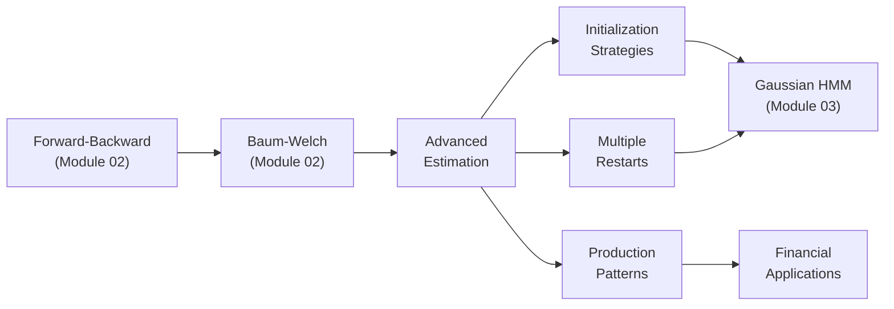

<!-- _class: lead -->

# Advanced Parameter Estimation
## Beyond Basic Baum-Welch

### Module 05 — Extensions
### Hidden Markov Models Course

<!-- Speaker notes: This deck builds on the Baum-Welch algorithm covered in Module 02. We focus on the practical challenges that arise when training HMMs on real data: initialization strategies, avoiding local optima, handling multiple sequences, and choosing between custom and production implementations. -->

---

# Recap: Baum-Welch Essentials

The Baum-Welch algorithm (covered in Module 02) iterates:

1. **E-Step**: Compute $\gamma_t(i)$ and $\xi_t(i,j)$ using forward-backward
2. **M-Step**: Update $\pi$, $A$, $\mu$, $\Sigma$ using weighted statistics
3. **Repeat** until log-likelihood converges

> See Module 02 `03_baum_welch_slides` for the full derivation and core implementation.

<!-- Speaker notes: We intentionally skip the detailed derivation here since Module 02 covers it thoroughly. This deck assumes you understand the E-step and M-step mechanics. We focus instead on the practical engineering challenges: how to initialize, how to avoid bad local optima, and when to build custom versus using a library. -->

---

# The Real Challenge: Initialization

EM converges to a **local** optimum. The starting point determines which one.



<!-- Speaker notes: Initialization is the single most important practical decision in HMM training. K-means initialization clusters the observations first, then uses cluster centers as initial means and within-cluster variances as initial variances. This gives the EM algorithm a head start by placing initial parameters near reasonable values. Random initialization chooses parameters from random distributions and is more exploratory but less reliable. -->

---

# K-Means Initialization

```python
class BaumWelchTrainer:
    def __init__(self, n_states, n_features=1):
        self.n_states = n_states
        self.n_features = n_features

    def initialize(self, observations, method='kmeans'):
        K = self.n_states
        self.pi = np.ones(K) / K
        self.A = np.ones((K, K)) * 0.1 / (K - 1)
        np.fill_diagonal(self.A, 0.9)

        if method == 'kmeans':
            from sklearn.cluster import KMeans
            kmeans = KMeans(n_clusters=K, random_state=42, n_init=10)
            labels = kmeans.fit_predict(observations.reshape(-1, 1))
            self.means = kmeans.cluster_centers_.flatten()
            self.covars = np.array([
                np.var(observations[labels == k]) + 1e-6
                for k in range(K)])
        return self
```

<!-- Speaker notes: The initialization sets pi to uniform, the transition matrix to 0.9 on the diagonal with the remaining 0.1 spread evenly across off-diagonal entries. This encodes the prior belief that states are persistent. K-means provides data-driven initial estimates for means and variances. The small epsilon added to variances prevents degenerate solutions. -->

---

# Why K-Means Initialization Wins

| Initialization | Typical Convergence | Final Log-Likelihood | Risk |
|---------------|-------------------|---------------------|------|
| **K-means** | 10-30 iterations | Near-optimal | Low |
| **Random** | 50-100 iterations | Variable | High (bad local optima) |
| **Domain expert** | 5-20 iterations | Best (if correct) | Medium (bias) |

<!-- Speaker notes: K-means initialization typically converges in one-third the iterations compared to random initialization and reaches a better local optimum. Domain expert initialization can be even better when the expert correctly guesses the regime parameters, but it risks encoding incorrect prior beliefs. In practice, use K-means for the first restart and random for subsequent restarts. -->

---

<!-- _class: lead -->

# Multiple Random Restarts

<!-- Speaker notes: Even with K-means initialization, there is no guarantee of reaching the global optimum. Multiple random restarts are the standard practical solution. -->

---

# Avoiding Local Optima

```python
def fit_with_restarts(observations, n_states, n_restarts=10):
    best_model = None
    best_ll = -np.inf

    for restart in range(n_restarts):
        np.random.seed(restart * 100)
        trainer = BaumWelchTrainer(n_states=n_states)
        trainer.initialize(observations,
                           method='kmeans' if restart == 0 else 'random')
        try:
            log_liks = trainer.fit(observations, n_iter=50,
                                    verbose=False)
            final_ll = log_liks[-1]
            if final_ll > best_ll:
                best_ll = final_ll
                best_model = trainer
        except Exception:
            pass

    return best_model
```

<!-- Speaker notes: The strategy is to use K-means for the first restart, then random initialization for the remaining restarts. Each restart runs a shorter number of iterations since we only need to identify promising starting points. The try-except block catches numerical failures from bad initializations. We keep only the model with the highest final log-likelihood. -->

---

# Restart Strategy Visualization



> First restart uses K-means, remaining use random initialization.

<!-- Speaker notes: In this example, Restart 3 with random initialization actually found a better solution than K-means (LL of minus 445 vs minus 450). This illustrates why multiple restarts matter: K-means gives a good starting point but does not guarantee the global optimum. With 10 restarts, you dramatically reduce the chance of being stuck in a poor local optimum. -->

---

# How Many Restarts?

**Practical guidelines:**

| Data Size | Recommended Restarts |
|-----------|---------------------|
| Small (< 500 obs) | 20-50 |
| Medium (500-5000) | 10-20 |
| Large (> 5000) | 5-10 |

**Diminishing returns:** Plot best log-likelihood vs. number of restarts. If it plateaus after 5 restarts, 10 is sufficient.

<!-- Speaker notes: The number of restarts depends on the data size and model complexity. Larger datasets have smoother likelihood surfaces with fewer local optima. More states means more local optima, so increase restarts when using 3 or more states. A practical approach is to run 20 restarts and check whether the best log-likelihood stabilizes. -->

---

<!-- _class: lead -->

# Training Pitfalls and Solutions

<!-- Speaker notes: Even with good initialization and multiple restarts, several common pitfalls can derail HMM training. These are practical issues that textbooks often gloss over but that matter critically in production systems. -->

---

# Six Common Pitfalls

<div class="columns">
<div>

**1. Local Minima**
- EM only guarantees local convergence
- Fix: Multiple random restarts

**2. Numerical Underflow**
- Product of small probabilities
- Fix: Scaling factors / log-space

**3. Degenerate Solutions**
- Variance collapses to zero
- Fix: Minimum variance constraint

</div>
<div>

**4. Overfitting**
- Too many states for data
- Fix: BIC/AIC model selection

**5. Slow Convergence**
- EM can be slow near optimum
- Fix: Convergence tolerance

**6. Label Switching**
- State labels swap between runs
- Fix: Order states by parameter

</div>
</div>

<!-- Speaker notes: These six pitfalls cover the most common practical issues. Local minima and underflow are algorithmic issues. Degenerate solutions and overfitting are model specification issues. Slow convergence is a computational issue. Label switching is an interpretation issue. Each has a well-established fix. -->

---

# Degenerate Solutions in Detail

When a state's variance approaches zero, it perfectly fits a single observation:

```python
# Regularization prevents degenerate covariance
def regularize_covars(covars, min_variance=1e-6):
    for k in range(len(covars)):
        covars[k] = max(covars[k], min_variance)
    return covars

# In hmmlearn, set min_covar parameter:
model = hmm.GaussianHMM(
    n_components=2, min_covar=1e-3,  # Prevents collapse
    n_iter=200, random_state=42)
```

<!-- Speaker notes: Degenerate solutions occur when a state captures only one or two observations, driving its variance toward zero. This makes the emission probability for those points approach infinity, dominating the log-likelihood. The fix is simple: clamp the minimum variance to a small positive value. hmmlearn exposes this as the min_covar parameter. -->

---

# Label Switching Problem

```python
def align_state_labels(model, reference='mean'):
    """Ensure consistent state labeling across runs."""
    if reference == 'mean':
        # Sort states by mean (ascending)
        order = np.argsort(model.means_.flatten())
    elif reference == 'variance':
        # Sort by variance (ascending = low-vol first)
        order = np.argsort([model.covars_[k, 0, 0]
                           for k in range(model.n_components)])

    model.means_ = model.means_[order]
    model.covars_ = model.covars_[order]
    model.startprob_ = model.startprob_[order]
    model.transmat_ = model.transmat_[order][:, order]
    return model
```

<!-- Speaker notes: Label switching means that State 0 in one run might correspond to State 1 in another. This makes it impossible to compare parameters across runs without alignment. The simplest approach sorts states by their mean return: the lowest-mean state becomes State 0 (bear), the highest becomes the last state (bull). Always align labels after fitting and before extracting parameters. -->

---

<!-- _class: lead -->

# Custom vs Production Implementation

<!-- Speaker notes: A key decision in HMM parameter estimation is whether to use a custom implementation or a production library like hmmlearn. Each has distinct advantages depending on your use case. -->

---

# Using hmmlearn in Production

```python
from hmmlearn import hmm

def train_with_hmmlearn(observations, n_states=2):
    observations = observations.reshape(-1, 1)
    model = hmm.GaussianHMM(
        n_components=n_states,
        covariance_type='full',
        n_iter=200,
        random_state=42,
        init_params='stmc',
        params='stmc')
    model.fit(observations)

    print(f"Log-likelihood: {model.score(observations):.4f}")
    print(f"Converged: {model.monitor_.converged}")
    print(f"Means: {model.means_.flatten()}")
    return model
```

> Use hmmlearn for production -- it handles scaling, convergence, and edge cases.

<!-- Speaker notes: The init_params parameter controls which parameters are initialized automatically (s=startprob, t=transmat, m=means, c=covariances). The params parameter controls which parameters are updated during training. The monitor_ attribute tracks convergence. In production, always check monitor_.converged and model.score to verify the fit quality. -->

---

# Custom vs hmmlearn Comparison

| Feature | Custom BaumWelch | hmmlearn |
|---------|-----------------|----------|
| Transparency | Full code visible | Black box |
| Performance | Slower (Python loops) | Faster (optimized) |
| Edge cases | Manual handling | Built-in |
| Customization | Total control | Limited |
| Production | Learning tool | Production-ready |
| Multiple sequences | Manual | Built-in |

<!-- Speaker notes: Custom implementations are valuable for learning and for research where you need to modify the algorithm. For production systems, hmmlearn is strongly preferred because it handles numerical edge cases, uses optimized C extensions, supports multiple observation sequences natively, and has been battle-tested by the community. The main limitation of hmmlearn is that it only supports standard HMM variants. -->

---

# When to Build Custom

Build custom implementations when you need:

- **Non-standard emission models** (Student-t, mixture, regime-dependent)
- **Modified EM updates** (online learning, Bayesian priors)
- **Custom constraints** (fixed parameters, structured transitions)
- **Educational purposes** (understanding the algorithm internals)

For everything else, use hmmlearn.

<!-- Speaker notes: The decision is straightforward: if hmmlearn supports your model, use it. Build custom only when the standard framework does not support your specific requirements. Even then, consider using hmmlearn for initialization and then modifying the fitted parameters. -->

---

# Convergence Monitoring



> EM **guarantees** log-likelihood increases monotonically, but only converges to a **local** optimum.

<!-- Speaker notes: Monitor convergence by tracking the log-likelihood at each iteration. It must increase monotonically. If it decreases, there is a bug in the implementation. The tolerance parameter controls when to stop: a common value is 1e-4. Plotting the log-likelihood curve helps diagnose issues: a flat curve from the start means poor initialization, and slow convergence may indicate model misspecification. -->

---

# Key Takeaways

| Takeaway | Detail |
|----------|--------|
| Initialization matters | K-means beats random; domain knowledge even better |
| Multiple restarts | Essential to avoid local minima (10+ restarts) |
| Regularization | Prevent degenerate solutions with min variance |
| Label alignment | Sort states by parameter for consistent interpretation |
| hmmlearn for production | Robust, optimized, handles edge cases |
| Custom for research | Full control when you need non-standard models |

<!-- Speaker notes: The key message is that basic Baum-Welch from Module 02 is the starting point, but production-quality HMM training requires initialization strategy, multiple restarts, regularization, and label alignment. Use hmmlearn unless you have a specific reason to build custom. -->

---

# Connections



<!-- Speaker notes: This deck connects Module 02's algorithmic foundations to Module 03's Gaussian HMM fitting and Module 04's financial applications. The practical estimation techniques covered here are essential for getting reliable results from any HMM variant. -->
