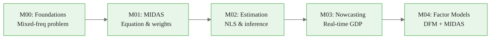

<!-- _class: lead -->

# The Mixed-Frequency Problem

## Why GDP, Payrolls, and Markets Cannot Simply Be Combined

**Mixed-Frequency Models: MIDAS Regression and Nowcasting**
Module 00 — Foundations

<!-- Speaker notes: Welcome to the course. This opening module sets up the central problem: how do we combine economic data that arrives at incompatible frequencies? GDP is quarterly, employment is monthly, markets are daily. This isn't a data cleaning problem — it's a fundamental statistical challenge. We'll spend this module building precise intuition before introducing the MIDAS solution in Module 01. -->

---

## The Frequency Mismatch

<div class="columns">

<div>

**Low frequency (Quarterly)**
- GDP growth
- Investment spending
- Government consumption
- Current account balance

**Medium frequency (Monthly)**
- Nonfarm payrolls
- Industrial production
- Retail sales
- CPI, PPI

</div>

<div>

**High frequency (Daily/Weekly)**
- S&P 500 returns
- Treasury yields
- Credit spreads
- Oil prices
- Initial jobless claims (weekly)

</div>

</div>

> All three layers carry complementary information about the same underlying economy.

<!-- Speaker notes: Notice the pattern: quarterly data requires expensive, survey-based measurement. Monthly data piggybacks on administrative records. Daily data is transactional and nearly free. The measurement interval reflects both economic structure and data collection costs. A good nowcasting model uses information from all three layers. -->

<div class="callout-key">

The key advantage of MIDAS is preserving high-frequency information that temporal aggregation destroys.

</div>

---

## Why This Matters: The Policy Maker's Problem

```
January 1 ────────────────────────────────── December 31

Q4 GDP advance estimate released January 30
   └─ Measures Oct–Dec activity
   └─ Already 4–5 months stale by time of next FOMC meeting

But we have:
  ✓ Daily market data through today
  ✓ Monthly payrolls through December
  ✓ Monthly IP through November
```

**The Fed sets rates based on current conditions — but measures them with a lag.**

<!-- Speaker notes: This is the operational reality for every central bank and macro hedge fund. The most recent hard GDP data is always lagging. The nowcasting literature emerged precisely to address this: can we combine the higher-frequency series to estimate current-quarter GDP before it's released? The answer is yes — and MIDAS is one of the most successful approaches. -->

<div class="callout-insight">

**Insight:** Parsimonious weight functions with 2-3 parameters can capture decay patterns that unrestricted models need 12+ parameters to approximate.

</div>

---

## Publication Calendar: Information Arrives Unevenly

| Indicator | Frequency | Lag |
|-----------|-----------|-----|
| GDP (advance) | Quarterly | ~30 days |
| Nonfarm Payrolls | Monthly | ~5 days |
| Industrial Production | Monthly | ~15 days |
| Retail Sales | Monthly | ~15 days |
| S&P 500 | Daily | 0 days |
| 10Y Treasury | Daily | 0 days |

**Key observation:** Within a quarter, monthly releases arrive one by one. A nowcast should improve with each new release.

<!-- Speaker notes: This table is worth memorizing. The publication lag column shows how far behind each series is. Payrolls come out within a week of month end — very fast. GDP comes out a month after the quarter closes. Financial data arrives instantly. This uneven arrival pattern creates the ragged edge problem we address in Module 03. -->

<div class="callout-warning">

**Warning:** Always account for the real-time data vintage when evaluating nowcast performance. Using revised data overstates accuracy.

</div>

---

## The Aggregation Problem

Three monthly observations must become one quarterly value. How?

$$\tilde{x}_t = \sum_{j=1}^{3} w_j \cdot x_{3(t-1)+j}^M$$

**Strategy 1 — Last period:** $w = (0, 0, 1)$
**Strategy 2 — Equal weights:** $w = (1/3, 1/3, 1/3)$
**Strategy 3 — Researcher-chosen:** any fixed $w$

**Problem with all three:** The weights are *imposed*, not estimated.

<!-- Speaker notes: Every aggregation scheme pre-commits to a weighting of within-quarter information before seeing any data. What if the last month of the quarter is most informative? What if the pattern is U-shaped? Fixed aggregation can't adapt. MIDAS estimates the weights from the data — that's the core innovation. -->

<div class="callout-info">

**Info:** MIDAS models can handle any frequency ratio: monthly-to-quarterly (3:1), daily-to-monthly (~22:1), or even tick-to-daily.

</div>

---

## Information Loss: A Visual Example

Two quarters, identical averages, very different dynamics:

```
Accelerating IP:  0.1 → 0.3 → 0.5   average = 0.30
Decelerating IP:  0.5 → 0.3 → 0.1   average = 0.30
```

After quarterly averaging: **indistinguishable.**

But momentum signal: accelerating → positive outlook, decelerating → negative.

> Simple aggregation destroys the within-quarter timing signal.

<!-- Speaker notes: This is a concrete, intuitive example of the information loss. Draw this out on the board if teaching live. The GDP forecasting literature finds that the timing pattern within a quarter matters — late acceleration tends to predict stronger next-quarter growth. This information is entirely erased by equal-weight aggregation. -->

---

## What About Bridge Equations?

The pre-MIDAS workaround:

1. Aggregate monthly series to quarterly: $\tilde{x}_t^Q = \text{avg}(x^M)$
2. Regress: $y_t^Q = \alpha + \beta \tilde{x}_t^Q + \varepsilon_t$
3. Forecast missing monthly obs within current quarter
4. Aggregate forecasts and plug into step 2

**Problems:**
- Two-step error compounding
- Aggregation weights fixed, not estimated
- Requires separate monthly forecasting model
- Timing information discarded in step 1

<!-- Speaker notes: Bridge equations were the standard approach for decades. The ECB and major central banks used them heavily in the 2000s. They work reasonably well in practice but have these structural limitations. MIDAS solves all four problems simultaneously: one-step estimation, learned weights, no separate monthly model needed, timing information preserved. -->

---

## The MIDAS Insight

$$y_t^Q = \alpha + \beta \cdot \underbrace{B(L^{1/m};\,\theta)}_{\text{estimated weights}} \cdot x_\tau^M + \varepsilon_t$$

- $L^{1/m}$: lag operator at high frequency
- $B(\cdot;\,\theta)$: parameterized weight function
- $\theta$: estimated from data — not imposed

**The weights $w_j(\theta)$ are learned, not assumed.**

We develop this fully in Module 01.

<!-- Speaker notes: This equation is the heart of the course. Right now, focus on the intuition: instead of aggregating x to quarterly frequency and then regressing, we feed the raw monthly x into the quarterly regression but multiply each monthly lag by an estimated weight. The weight function B gives the model enormous flexibility while the parameterization keeps the number of parameters small. -->

---

## The Ragged Edge: Real-Time Complexity

```
Quarter t — current position: Month 2 of 3

Available data:
  IP      : [0.3, 0.1, ???]    ← month 3 not yet released
  Payrolls: [0.2, 0.4, ???]    ← month 3 not yet released
  S&P 500 : 43 daily obs so far  ← continuous
  GDP     : [y_{t-1}, y_{t-2}, ...]  ← current quarter not released
```

A nowcast must form an estimate of $y_t^Q$ using this incomplete information.

<!-- Speaker notes: This ragged edge is what distinguishes nowcasting from standard forecasting. You're not predicting something that hasn't happened — GDP has already been determined by economic activity. You're estimating something that has occurred but hasn't been measured and released yet. The ragged edge means every nowcast model must explicitly track which observations are available. We build this machinery in Module 03. -->

---

## Three Frequencies, Three Roles

<div class="columns">

<div>

**Quarterly data**
- The target variable
- GDP, consumption, investment
- Long-run, low-noise
- Released with long lag

</div>

<div>

**Monthly data**
- Primary MIDAS regressors
- Employment, production, sales
- Medium frequency, moderate noise
- Released with 2–4 week lag

**Daily data**
- Financial conditions
- Market expectations
- High frequency, high noise
- Available immediately

</div>

</div>

<!-- Speaker notes: In a typical MIDAS nowcasting setup, the quarterly variable is the dependent variable and monthly/daily series are the regressors. But nothing prevents quarterly-on-daily MIDAS, or monthly-on-daily. The framework generalizes to any frequency ratio. Throughout this course we focus on the quarterly-monthly case because that's the most economically relevant, but the math is identical for other frequency ratios. -->

---

## Key Datasets in This Course

| Dataset | Source | Frequency | Variable |
|---------|--------|-----------|---------|
| Real GDP Growth | FRED: GDPC1 | Quarterly | Target variable |
| Industrial Production | FRED: INDPRO | Monthly | Core regressor |
| Nonfarm Payrolls | FRED: PAYEMS | Monthly | Core regressor |
| ISM Manufacturing | ISM | Monthly | Survey indicator |
| S&P 500 Returns | Yahoo Finance | Daily | Financial conditions |
| 10Y–2Y Spread | FRED: T10Y2Y | Daily | Financial conditions |

CSV fallbacks for all series are in `resources/`.

<!-- Speaker notes: We'll use these datasets throughout the course. All are freely available via FRED (St. Louis Fed's data API) and Yahoo Finance. The CSV fallbacks mean the notebooks run even without internet access. FRED API access requires a free key — setup instructions are in the Module 00 notebook. -->

---

## Why MIDAS Outperforms Aggregation

```
Empirical comparison (Ghysels, Santa-Clara, Valkanov 2006):

Predicting quarterly stock returns from daily realized volatility:
  Daily aggregated → quarterly variance:   R² = 0.08
  MIDAS (Beta polynomial):                 R² = 0.26

The aggregated model discards timing information.
MIDAS learns that recent weeks matter more.
```

<!-- Speaker notes: This is the original empirical motivation from the paper that started the literature. The Beta polynomial MIDAS model substantially outperforms the aggregated model at the same task. The improvement comes entirely from retaining the within-quarter timing information — information that aggregation discards. We'll replicate a similar comparison in Module 01's notebook. -->

---

## Course Roadmap



**You are here:** M00 — understanding why the problem exists before solving it.

<!-- Speaker notes: Map the journey for students. Module 00 is the problem statement. Module 01 introduces the MIDAS model. Module 02 covers how to estimate it rigorously. Module 03 applies it to real-time nowcasting. Module 04 extends to dynamic factor models that extract common signals from large datasets. Later modules cover ML extensions, financial applications, and production systems. -->

---

## Module 00 Learning Objectives

By the end of this module, you will be able to:

1. Explain why frequency mismatch creates an information loss problem
2. Describe the publication calendar and real-time data availability
3. Identify the limitations of aggregation and bridge equation approaches
4. Access and visualize mixed-frequency datasets from FRED
5. Characterize the ragged edge in real-time nowcasting

<!-- Speaker notes: These are the concrete skills this module builds. Notice they are all at the understanding and application level — we are not yet estimating MIDAS models. This module exists so that when we write down the MIDAS equation in Module 01, the motivation is crystal clear. Don't rush past foundations. -->

---

## Summary: The Core Problem

> **Economic variables are observed at different frequencies. Combining them requires either aggregating (and losing information) or modeling the mixed-frequency relationship directly (MIDAS).**

Three takeaways:

1. Aggregation discards within-period timing information
2. Bridge equations compound two sources of estimation error
3. MIDAS estimates the aggregation weights from data

**Next:** Module 00, Guide 02 — Traditional solutions and their limitations.

<!-- Speaker notes: Reinforce the three-point summary. The information loss from aggregation is not hypothetical — it shows up as lower R-squared and worse forecast accuracy in real applications. The MIDAS approach dominates in most empirical comparisons because it avoids this loss. Send students to the notebook to see this concretely with real GDP and IP data. -->

---

## Further Reading

- **Ghysels, Santa-Clara & Valkanov (2004)** — Original MIDAS paper
- **Giannone, Reichlin & Small (2008)** — Nowcasting methodology
- **NY Fed Nowcasting Report** — Live example of the problem being solved
- **FRED Blog** — Mixed-frequency data in practice

All references with DOI links in `resources/readings.md`.

<!-- Speaker notes: The Ghysels 2004 working paper is freely available online. Even skimming the introduction and the empirical section gives excellent context. The NY Fed nowcasting report is updated weekly — showing students a live example of the problem they're learning to solve is very motivating. -->
