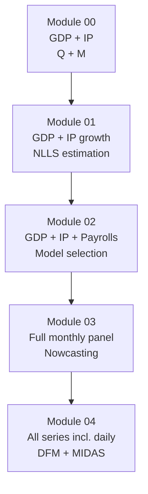

<!-- _class: lead -->

# Course Datasets

## FRED, Yahoo Finance, and CSV Fallbacks

**Mixed-Frequency Models: MIDAS Regression and Nowcasting**
Module 00 — Guide 03

<!-- Speaker notes: This guide is practical and operational — students need to know exactly which data we use, where it comes from, and how to load it. Every notebook in the course uses real data. This guide serves as the reference document for data access throughout the course. Spend time in the notebook (01_environment_setup.ipynb) actually running the data downloads and confirming everything works. -->

---

## Data Philosophy

> All exercises in this course use **real published data**.
> No synthetic datasets. No toy examples.

**Why this matters:**
- Real data has noise, missing values, and structural breaks
- Aggregation and ragged-edge problems appear naturally
- Model performance reflects realistic conditions
- Results are interpretable in economic context

<!-- Speaker notes: The decision to use only real data is deliberate. Synthetic data hides the messy realities that make mixed-frequency modeling challenging — data revisions, non-stationarity, outliers like COVID. By working with real data from the start, students encounter these challenges in a structured, guided context rather than being surprised by them when they try to apply the methods independently. -->

---

## Primary Sources

<div class="columns">

<div>

**FRED (Federal Reserve)**
- 800,000+ series
- Free API access
- GDP, IP, payrolls, rates
- `fredapi` Python package
- Key: free at fred.stlouisfed.org

</div>

<div>

**Yahoo Finance**
- Equity indices and prices
- Free, no API key needed
- `yfinance` Python package
- S&P 500, VIX
- Daily through current date

</div>

</div>

**CSV Fallbacks:** Every series has a pre-downloaded CSV in `resources/`. Notebooks work offline.

<!-- Speaker notes: The two-source setup covers all frequency ranges. FRED covers quarterly and monthly macro series plus some daily financial series (VIX, spreads, exchange rates). Yahoo Finance covers equity market data. The CSV fallbacks are essential for offline use — in classroom settings, internet access can be unreliable. All fallback CSVs cover 2000-2024 and are pre-cleaned. -->

---

## Quarterly Series: The Target Variables

| FRED ID | Description | Units |
|---------|-------------|-------|
| `GDPC1` | Real GDP | Billions 2017$, SAAR |
| `PCECC96` | Real Consumption | Billions 2017$, SAAR |
| `GPDIC1` | Real Investment | Billions 2017$, SAAR |

```python
from fredapi import Fred
import os

fred = Fred(api_key=os.environ.get('FRED_API_KEY'))
gdp = fred.get_series('GDPC1', observation_start='2000-01-01')
gdp_growth = gdp.pct_change() * 100   # QoQ growth rate
```

**Fallback:** `resources/gdp_quarterly.csv`

<!-- Speaker notes: Real GDP (GDPC1) is the primary target variable throughout the course. We use quarterly growth rates (pct_change * 100) rather than log differences, because percent changes are directly interpretable and reported in news. The SAAR (seasonally adjusted annual rate) convention means the quarterly level is already annualized — growth rates from pct_change are quarterly, not annualized. Make sure students understand this distinction. -->

---

## Monthly Series: Core Regressors

| FRED ID | Description | Transformation |
|---------|-------------|---------------|
| `INDPRO` | Industrial Production | MoM % change |
| `PAYEMS` | Nonfarm Payrolls | Monthly diff (000s) |
| `RSAFS` | Retail Sales | MoM % change |
| `UNRATE` | Unemployment Rate | Level |
| `CPIAUCSL` | CPI | YoY % change |

```python
ip = fred.get_series('INDPRO', observation_start='2000-01-01')
ip_growth = ip.pct_change() * 100      # month-over-month %

payrolls = fred.get_series('PAYEMS', observation_start='2000-01-01')
payrolls_chg = payrolls.diff()          # monthly change in thousands
```

<!-- Speaker notes: The transformation column is important. IP and retail sales are best expressed as month-over-month growth rates. Payrolls are expressed as the monthly change in thousands because the level is an index with no natural base. Unemployment rate is used in levels because it's already stationary (bounded between 0 and 100). CPI is typically used as year-over-year to handle the strong seasonality. Students often make the mistake of mixing growth rates and levels — always check what transformation is appropriate for the economic question. -->

---

## Daily/Weekly Series: High-Frequency Regressors

| ID | Source | Description |
|----|--------|-------------|
| `^GSPC` | Yahoo | S&P 500 Index |
| `T10Y2Y` | FRED | 10Y-2Y Treasury Spread |
| `DCOILWTICO` | FRED | WTI Crude Oil |
| `VIXCLS` | FRED | CBOE VIX |
| `DGS10` | FRED | 10-Year Treasury Yield |

```python
import yfinance as yf

sp500 = yf.download('^GSPC', start='2000-01-01', progress=False)
returns = sp500['Adj Close'].pct_change().dropna() * 100

vix = fred.get_series('VIXCLS', observation_start='2000-01-01')
```

**~65 trading days per quarter** — creates high-dimensional MIDAS regressors.

<!-- Speaker notes: The daily series create the most interesting MIDAS applications because the frequency ratio (65 daily to 1 quarterly) is much larger than the monthly-to-quarterly ratio (3). A MIDAS model with 4 quarterly lags of daily returns has 4 × 65 = 260 high-frequency observations per regressor. Unrestricted MIDAS would require estimating 260 coefficients — clearly intractable without the polynomial parameterization. This is where the Beta polynomial really earns its keep. -->

---

## CSV Fallback Structure

```
resources/
├── gdp_quarterly.csv              # GDPC1, 2000Q1–2024Q4
├── industrial_production_monthly.csv  # INDPRO, 2000-01 to 2024-12
├── payrolls_monthly.csv           # PAYEMS change, 2000-01 to 2024-12
├── sp500_daily.csv                # ^GSPC returns, 2000-01-03 to 2024-12-31
├── treasury_spread_daily.csv      # T10Y2Y, 2000-01-03 to 2024-12-31
├── vix_daily.csv                  # VIXCLS, 2000-01-03 to 2024-12-31
└── unemployment_monthly.csv       # UNRATE, 2000-01 to 2024-12
```

```python
import pandas as pd

# Standard loading pattern used in all notebooks
gdp = pd.read_csv('resources/gdp_quarterly.csv',
                   index_col='date', parse_dates=True).squeeze()
```

<!-- Speaker notes: The CSV fallbacks follow a consistent format: date as the index column in ISO 8601 format, single value column with a descriptive name. The squeeze() call converts the single-column DataFrame to a Series. All series are pre-transformed to the units used in the course (growth rates, not levels, where appropriate). This standardization means notebooks can switch between FRED and CSV with a single flag. -->

---

## Frequency Alignment: The Critical Step

Monthly and quarterly series must be aligned before MIDAS modeling.

```python
import pandas as pd

# Convert to Period for unambiguous quarterly alignment
gdp_q = gdp_growth.to_period('Q')          # 2020Q1, 2020Q2, ...
ip_m = ip_growth.to_period('M')            # 2020-01, 2020-02, ...

# Map each monthly observation to its containing quarter
ip_m_quarter = ip_m.index.to_period('Q')

# Verify coverage: 3 monthly obs per quarterly obs
print(ip_m.groupby(ip_m_quarter).count())  # should all equal 3
```

**Common error:** Using DatetimeIndex for both frequencies causes off-by-one alignment issues at quarter boundaries.

<!-- Speaker notes: Frequency alignment is where many MIDAS implementations go wrong. DatetimeIndex quarter boundaries are ambiguous (end-of-quarter vs start-of-next-quarter). Pandas Period index is unambiguous: 2020Q1 contains January, February, and March regardless of which convention you use. All course notebooks use Period index for quarterly and monthly alignment. The code on this slide should be copy-pasted into every notebook that combines quarterly and monthly data. -->

---

## Building the MIDAS Data Matrix

For a model with `n_lags` high-frequency lags and quarterly target:

```
X[t, j] = x_{m*t - j}   (high-frequency lag j for quarter t)

Quarter t=1:  X[1, 0] = x₃,  X[1, 1] = x₂,  X[1, 2] = x₁
Quarter t=2:  X[2, 0] = x₆,  X[2, 1] = x₅,  X[2, 2] = x₄
...
```

Matrix shape: $(T_L \times n_{\text{lags}})$

```python
def build_midas_matrix(y_low, x_high, n_lags, freq_ratio=3):
    T = len(y_low)
    X = np.full((T, n_lags), np.nan)
    for t in range(T):
        hf_end = (t + 1) * freq_ratio - 1
        for j in range(n_lags):
            hf_idx = hf_end - j
            if 0 <= hf_idx < len(x_high):
                X[t, j] = x_high.iloc[hf_idx]
    return X
```

<!-- Speaker notes: This data matrix construction is the fundamental operation in any MIDAS implementation. The rows are low-frequency time periods (quarters) and the columns are high-frequency lags. The matrix is always rectangular with more columns than rows for moderate lag counts. Walk through the indexing carefully: for quarter t (0-indexed), the last high-frequency observation in the quarter is at position (t+1)*m - 1 in the high-frequency series. Lag j counts backward from this end position. -->

---

## Data Quality: What to Check

```python
def data_quality_report(series, name):
    """Quick quality check for any series."""
    print(f"\n{name}")
    print(f"  Observations: {len(series)}")
    print(f"  Date range:   {series.index[0]} to {series.index[-1]}")
    print(f"  Missing:      {series.isna().sum()} ({series.isna().mean():.1%})")
    print(f"  Mean:         {series.mean():.3f}")
    print(f"  Std:          {series.std():.3f}")
    print(f"  Min/Max:      {series.min():.3f} / {series.max():.3f}")

data_quality_report(gdp_growth, "GDP Growth (QoQ %)")
data_quality_report(ip_growth, "IP Growth (MoM %)")
```

**Always check:** Missing values, date range, units (pct vs level), outliers (COVID 2020).

<!-- Speaker notes: This quality check function should be the first thing students run after loading any dataset. The COVID outliers in 2020Q1 and 2020Q2 are extreme — GDP growth of -8.9% and -31.4% annualized (or -2.4% and -9.0% quarterly). These observations will dominate any regression if not handled appropriately. In this course we keep them in the sample but note that out-of-sample evaluation should be done both including and excluding the COVID period. -->

---

## Vintage vs. Revised Data

| Data Type | What It Is | Use For |
|-----------|-----------|---------|
| Current vintage | Latest revised values (FRED default) | Model development |
| Real-time vintage | Values available at time $t$ | Honest backtesting |

```
GDP growth, 2019Q4:
  Real-time (Feb 2020):   +2.1%
  First revision (Apr 2020): +2.1%
  Current vintage (2024): +2.3%
```

> In this course, we use current-vintage data and note that real-time performance would be slightly worse due to revisions.

<!-- Speaker notes: The vintage data distinction is critical for any serious evaluation of nowcasting models. A model that looks excellent on current-vintage data may perform worse in real time because it was estimated and evaluated on revised (i.e., better quality) data. The Philadelphia Fed's Real-Time Data Set (RTDS) provides vintage data for many series. In this introductory course we use current-vintage data for simplicity, but Module 03 includes a discussion of how to use the RTDS for honest evaluation. -->

---

## Module Data Map



Each module builds on the data familiarity established in previous modules.

<!-- Speaker notes: The progressive data complexity mirrors the model complexity. In Module 00 we use just two series to understand frequency alignment. By Module 04 we're working with a panel of 6+ series at three different frequencies. This progression ensures that data complexity never overwhelms model complexity — students are always dealing with one new challenge at a time. -->

---

## Setup Checklist

- [ ] `pip install fredapi yfinance pandas numpy scipy matplotlib` installed
- [ ] FRED API key in `FRED_API_KEY` environment variable (or CSV fallback confirmed)
- [ ] `01_environment_setup.ipynb` runs end-to-end without errors
- [ ] All CSVs in `resources/` directory load correctly
- [ ] Date alignment check passes

**If FRED API key unavailable:** Set `USE_FRED = False` at the top of any notebook.

<!-- Speaker notes: Walk students through the setup checklist before the first notebook session. The most common setup issue is the FRED API key — stress that it's free and takes 30 seconds to get. The second most common issue is yfinance not being installed. The CSV fallbacks exist precisely for situations where data download fails — they are first-class fallback data, not synthetic approximations. -->

---

## Summary

1. **FRED** provides quarterly and monthly macro data via free API (`fredapi` package)
2. **Yahoo Finance** provides daily equity data via `yfinance` package
3. **CSV fallbacks** in `resources/` ensure offline operation
4. **Frequency alignment** requires careful period indexing — use `pd.Period`
5. **Data transformations** must match economic meaning (growth rates vs. levels)

**Next:** Module 00, Notebook 01 — Environment setup and data download.

<!-- Speaker notes: The data infrastructure is the foundation everything else is built on. Time spent here pays dividends throughout the course. Students who skip the data setup step and jump into the modeling notebooks consistently encounter mysterious errors that are actually data issues. Insist that everyone runs the environment setup notebook successfully before moving on. -->

---

## Quick Reference Card

```python
# FRED quarterly GDP growth
gdp = fred.get_series('GDPC1').pct_change() * 100

# FRED monthly IP growth
ip = fred.get_series('INDPRO').pct_change() * 100

# Yahoo daily S&P 500 returns
sp500 = yf.download('^GSPC')['Adj Close'].pct_change() * 100

# CSV fallback (same format)
gdp = pd.read_csv('resources/gdp_quarterly.csv',
                   index_col='date', parse_dates=True).squeeze()

# Frequency alignment
gdp_q = gdp.to_period('Q')
ip_q = ip.to_period('M').resample('Q').mean()  # for quarterly averaging
```

<!-- Speaker notes: This quick reference card should be bookmarked. Students will use these exact code patterns in every subsequent module. The goal is muscle memory — by Module 03, loading and aligning data should be automatic so cognitive load is focused on the nowcasting model itself. -->
