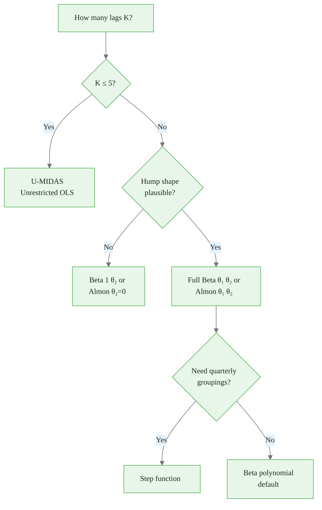

<!-- _class: lead -->

# MIDAS Weight Functions

## Beta Polynomial, Almon, and Step Functions

**Mixed-Frequency Models: MIDAS Regression and Nowcasting**
Module 01 — Guide 02

<!-- Speaker notes: This guide focuses entirely on the weight function — the core innovation in MIDAS. Students should understand the Beta equation and be able to visualize what different parameter values produce. The hands-on notebook (02_weight_function_comparison.ipynb) lets them explore the weight landscape interactively. The key practical outcome: students should know when to use Beta polynomial vs. Almon vs. step functions. -->

---

## Why the Weight Function Is Central

$$y_t = \alpha + \beta \underbrace{\sum_{j=0}^{K-1} w_j(\theta)}_{\text{THE KEY}} x_{mt-j} + \varepsilon_t$$

The weight function $\{w_j(\theta)\}$:
- Determines which time periods matter most
- Encodes the temporal structure of influence
- Is constrained to sum to 1 (for identification)
- Is estimated from data (not imposed)

**Different weight shapes = different economic hypotheses.**

<!-- Speaker notes: The weight function is where MIDAS makes its fundamental contribution. Everything else — the regression structure, the error term — is standard. The weight function is the single innovation that allows mixed frequencies to be combined coherently. This slide establishes why spending an entire guide on weight functions is justified. -->

<div class="callout-key">

The key advantage of MIDAS is preserving high-frequency information that temporal aggregation destroys.

</div>

---

## Four Weight Shapes and Their Meanings

```
Lag 0 (most recent)   →   Lag K-1 (oldest)

1. Declining:     ████████▓▓▓▒▒▒░░░    Recent dominates
2. Uniform:       ▓▓▓▓▓▓▓▓▓▓▓▓▓▓▓▓    All lags equal (= aggregation)
3. Hump-shaped:   ░░▒▒▓▓████▓▓▒▒░░    Middle lags dominate
4. Back-loaded:   ░░░▒▒▒▓▓▓▓▓▓████    Old data dominates (unusual)
```

**In macro applications:** Pattern 1 (declining) is most common.
**Declining + some back-quarter weight:** Typical for GDP ~ IP.

<!-- Speaker notes: These four archetypal shapes cover the realistic range of weight functions. In quarterly GDP nowcasting, the declining pattern dominates: the current quarter's monthly observations carry most weight, with decaying influence from previous quarters. The hump shape occasionally appears when there are reporting lags — if IP is released with a 15-day lag, the most recent month may be less informative than the one before it. Students should think about which shape is most plausible for each economic application before estimating. -->

<div class="callout-insight">

**Insight:** Parsimonious weight functions with 2-3 parameters can capture decay patterns that unrestricted models need 12+ parameters to approximate.

</div>

---

## The Beta Polynomial: Definition

$$w_j(\theta_1, \theta_2) = \frac{f_{\text{Beta}}\!\left(\frac{j+0.5}{K};\, \theta_1, \theta_2\right)}{\sum_{l=0}^{K-1} f_{\text{Beta}}\!\left(\frac{l+0.5}{K};\, \theta_1, \theta_2\right)}$$

where $f_{\text{Beta}}(x;\theta_1,\theta_2) = \frac{x^{\theta_1-1}(1-x)^{\theta_2-1}}{B(\theta_1,\theta_2)}$

**Convention:** Lag $j=0$ (most recent) maps to large $x$, so $\theta_2$ controls the recency weight.

**Parameters:** $\theta_1 > 0$, $\theta_2 > 0$ (two parameters for any $K$)

<!-- Speaker notes: Work through the Beta formula step by step. First, we evaluate the Beta PDF at K equally-spaced points. The midpoint convention (j+0.5)/K avoids singularities when theta < 1. Then we normalize so the weights sum to 1. The convention that maps lag 0 to large x means theta2 controls the weight on recent observations: large theta2 concentrates mass near x=1, which maps to large weights at small j (recent lags). This is the typical declining pattern. -->

<div class="callout-warning">

**Warning:** Always account for the real-time data vintage when evaluating nowcast performance. Using revised data overstates accuracy.

</div>

---

## Beta Polynomial: Key Shapes

<div class="columns">

<div>

**$\theta_1 = 1,\, \theta_2 = 1$:** Uniform
$$\Rightarrow w_j = 1/K \quad \text{(equal-weight aggregation)}$$

**$\theta_1 = 1,\, \theta_2 = 5$:** Strongly declining
$$\Rightarrow \text{Recent months dominate}$$

</div>

<div>

**$\theta_1 = 1.5,\, \theta_2 = 4$:** Typical GDP model
$$\Rightarrow \text{Declining with slight hump}$$

**$\theta_1 = 2,\, \theta_2 = 2$:** Bell-shaped
$$\Rightarrow \text{Middle lags peak}$$

</div>

</div>

**Beta(1,1) = uniform = equal-weight aggregation** is the testable null hypothesis.

<!-- Speaker notes: Beta(1,1) being equal to the uniform distribution is an important result — it means we can formally test the aggregation assumption by testing whether theta1 = theta2 = 1. If the data rejects Beta(1,1) in favor of Beta(1, 5), we have statistical evidence that timing within the quarter matters. This is both a model selection tool and a formal hypothesis test. The theta values (1.5, 4.0) for the typical GDP model are not coincidental — they correspond to a gently declining function with the current quarter receiving about twice the weight of two quarters back. -->

<div class="callout-info">

**Info:** MIDAS models can handle any frequency ratio: monthly-to-quarterly (3:1), daily-to-monthly (~22:1), or even tick-to-daily.

</div>

---

## Beta Polynomial: Visual Gallery

```
K=9 lags (3 quarterly lags × 3 months)

Beta(1, 5)  — Declining:
j:  0    1    2    3    4    5    6    7    8
w: 0.28  0.22  0.17  0.12  0.09  0.06  0.04  0.02  0.01  ✓ sum=1

Beta(1.5, 4) — Typical:
w: 0.22  0.20  0.16  0.14  0.11  0.08  0.05  0.03  0.01  ✓ sum=1

Beta(2, 2) — Bell-shaped:
w: 0.04  0.09  0.14  0.17  0.18  0.17  0.14  0.09  0.04  ✓ sum=1

Beta(1, 1) — Uniform:
w: 0.11  0.11  0.11  0.11  0.11  0.11  0.11  0.11  0.11  ✓ sum=1
```

<!-- Speaker notes: This ASCII visualization is useful for quick intuition. Notice that for Beta(1,5), the first lag (most recent month) gets 28% of the total weight. For Beta(2,2), the peak is at the middle (lag 4 or 5). For Beta(1,1), it's perfectly flat. These patterns can be directly plotted in the notebook using the beta_weights function from Guide 01. Students should experiment with changing theta values and observing how the weight profile changes. -->

---

## Beta Polynomial: Parameter Intuition

$$\text{Beta}(\theta_1, \theta_2):$$

- **Large $\theta_2$, small $\theta_1$:** Front-loaded (recent lags heavy)
- **Large $\theta_1$, small $\theta_2$:** Back-loaded (old lags heavy)
- **$\theta_1 = \theta_2$:** Symmetric around $j = K/2$
- **Both large:** Concentrated at center (narrow bell)
- **Both small:** Concentrated at endpoints (bimodal)

> Intuition: $\theta_2$ is the "recency" parameter. Increasing $\theta_2$ shifts weight toward recent lags.

<!-- Speaker notes: The parameter intuition slide helps students quickly understand what adjusting theta does without having to evaluate the Beta PDF formula. The key heuristic is that theta2 controls recency: higher theta2 = more weight on recent lags. This is because increasing theta2 moves mass in the Beta distribution toward x=1, which by our convention maps to small lag indices (recent observations). Students can use this heuristic when setting starting values for NLS optimization. -->

---

## The Exponential Almon Polynomial

$$w_j(\theta_1, \theta_2) = \frac{\exp(\theta_1 j + \theta_2 j^2)}{\sum_{l=0}^{K-1} \exp(\theta_1 l + \theta_2 l^2)}$$

**Parameters:** $\theta_1, \theta_2 \in \mathbb{R}$ (unconstrained!)

<div class="columns">

<div>

**Advantage over Beta:**
- No positivity constraint on $\theta$
- Easier optimization (no boundary issues)
- Natural for declining patterns: just set $\theta_1 < 0$

</div>

<div>

**Key shapes:**
| $\theta_1$ | $\theta_2$ | Shape |
|-----------|-----------|-------|
| 0 | 0 | Uniform |
| < 0 | 0 | Declining |
| < 0 | < 0 | Hump |
| > 0 | 0 | Back-loaded |

</div>

</div>

<!-- Speaker notes: The Almon polynomial is the other major weight function in the MIDAS literature. Its main practical advantage is that theta parameters are unconstrained real numbers, so the optimizer doesn't hit boundaries. With Beta polynomial, values near zero for theta can cause numerical issues. The exponential form guarantees non-negative weights without any constraint. For declining weights (the common case in macro), set theta1 < 0 and theta2 = 0: weights are proportional to exp(theta1 * j), which is geometrically declining. -->

---

## Almon Polynomial: Hump Shape Detail

With $\theta_1 < 0$ and $\theta_2 < 0$, the Almon polynomial produces a hump:

$$\ln w_j \propto \theta_1 j + \theta_2 j^2 \quad \Rightarrow \quad j^* = -\frac{\theta_1}{2\theta_2}$$

The peak lag is at $j^* = -\theta_1 / (2\theta_2)$.

**Example:** $\theta_1 = -0.1$, $\theta_2 = -0.02$: peak at $j^* = -(-0.1)/(2 \times (-0.02)) = 0.1/0.04 = 2.5$

So the highest weight is around lag 2–3 (second or third-most-recent month).

<!-- Speaker notes: The hump peak formula is a useful diagnostic: before running NLS, you can ask "where should the peak be, economically?" For GDP nowcasting, the peak is probably at lag 0 or 1 (most recent months) — suggesting declining weights. For a model involving data with publication lags, the peak might be at lag 2 (the data released most recently was collected two months ago). This prior can inform starting values for theta. -->

---

## Step Functions: Quarterly Groupings

For $K=12$ lags with $S=4$ quarterly groups:

$$w_j = \delta_s \quad \text{if } j \in \{3(s-1), 3(s-1)+1, 3(s-1)+2\}$$

Groups: $[0,2]$ (current Q), $[3,5]$ (Q-1), $[6,8]$ (Q-2), $[9,11]$ (Q-3)

**Normalized:** $\delta_s \geq 0$,  $\frac{1}{3}\sum_{s=1}^4 \delta_s = 1$

**Parameters:** 3 free parameters ($\delta_4$ determined by constraint)

<div class="code-window">
<div class="code-header">
<div class="dots"><span class="dot-red"></span><span class="dot-yellow"></span><span class="dot-green"></span></div>
<span class="filename">example.py</span>
</div>

```python
# Example: declining quarterly weights
deltas = [0.50, 0.30, 0.15, 0.05]  # unnormalized
# After normalization: [0.50, 0.30, 0.15, 0.05] / (3 * sum * 1/3) ...
```

</div>

<!-- Speaker notes: Step functions are useful when you want quarterly-group interpretability. Instead of smooth weights, you assign one weight to each full quarter of lags. This makes results easy to communicate: "the current quarter's IP has a weight of 50%, last quarter's IP has 30%..." etc. Step functions are also useful for very high frequency ratios (daily data) where you might want monthly groups within each quarter. The downside is the discontinuity at group boundaries, which can occasionally cause numerical issues in optimization. -->

---

## Choosing Your Weight Function



<!-- Speaker notes: This decision tree is a practical guide for applied work. Most macro applications end up at Beta polynomial with 2 parameters. The U-MIDAS branch is relevant when K is small enough that unrestricted estimation is feasible — this happens for monthly-to-monthly forecasting (m=1 within-quarter, K=3-5 lags). The Almon branch is for cases where the Beta polynomial's positivity constraint causes optimizer convergence problems. Walk through a specific example: quarterly GDP, monthly IP, 4 quarters back — that's K=12, definitely need a parameterized family, hump is plausible but declining more likely, so use Beta polynomial. -->

---

## Empirical Weight Functions: What We Find

From GDP nowcasting applications (Ghysels et al.):

**Monthly IP → Quarterly GDP:**
- Best-fitting shape: Beta(1.2, 3.5) — gently declining
- Current quarter receives ~50% of total weight
- One-quarter-back: ~30%, Two-quarters-back: ~15%, Three-back: ~5%

**Daily Returns → Quarterly Returns:**
- Best-fitting shape: Beta(1.0, 5.0) — sharply declining
- Most recent week: ~25% of total weight
- Rapid decay — old data nearly irrelevant

**Key finding:** Higher-frequency regressors have more front-loaded weights.

<!-- Speaker notes: These empirical benchmarks from the literature help students calibrate their own estimates. For monthly-to-quarterly, a gentle decline is typical. For daily-to-quarterly, the decline is sharper because daily data is noisier and more local to the current state. The "most recent week = 25%" for daily models seems low but makes sense: 65 trading days means even the most recent week is just 5/65 = 7.7% of available data. The Beta polynomial concentrates that weight more, giving the most recent week perhaps 20-30%. -->

---

## Implementation Notes

<div class="code-window">
<div class="code-header">
<div class="dots"><span class="dot-red"></span><span class="dot-yellow"></span><span class="dot-green"></span></div>
<span class="filename">example.py</span>
</div>

```python
# Standard Beta polynomial implementation
from scipy.stats import beta as beta_dist
import numpy as np

def beta_weights(n_lags, theta1, theta2):
    j = np.arange(n_lags)
    x = (j + 0.5) / n_lags          # Midpoint evaluation
    raw = beta_dist.pdf(1 - x, theta1, theta2)  # 1-x: lag 0 = large x
    return raw / raw.sum()           # Normalize

# Standard Almon implementation
def almon_weights(n_lags, theta1, theta2):
    j = np.arange(n_lags, dtype=float)
    log_raw = theta1 * j + theta2 * j**2
    log_raw -= log_raw.max()         # Numerical stability
    raw = np.exp(log_raw)
    return raw / raw.sum()

# Verify: all weights sum to 1
for t1, t2 in [(1, 1), (1.5, 4), (2, 2)]:
    w = beta_weights(12, t1, t2)
    assert abs(w.sum() - 1.0) < 1e-10, f"Weights don't sum to 1 for ({t1},{t2})"
print("All weight functions verified.")
```

</div>

<!-- Speaker notes: The log_raw -= log_raw.max() trick in the Almon implementation prevents numerical overflow. This is standard practice for softmax-type computations. Always include the sum-to-1 assertion as a sanity check — a weights bug that fails to normalize will produce coefficient estimates that are off by a constant factor, leading to confusing results. The midpoint evaluation (j+0.5)/n_lags in the Beta function is important when theta < 1 to avoid evaluating Beta(theta < 1) at x=0 or x=1 where the PDF diverges. -->

---

## Summary: Weight Function Selection

| Family | Parameters | Best For | Key Advantage |
|--------|-----------|----------|--------------|
| Beta Polynomial | 2 ($\theta_1, \theta_2 > 0$) | Most macro | Flexible, standard |
| Exponential Almon | 2 ($\theta_1, \theta_2 \in \mathbb{R}$) | When Beta fails | No boundary constraints |
| Step Function | $S-1$ (one per group) | Interpretability | Group-level effects |
| U-MIDAS | $K$ (unrestricted) | Small $K$ | No restriction |

**Default recommendation:** Start with Beta polynomial. Switch to Almon if optimizer struggles.

**Next:** Guide 03 — U-MIDAS: when unrestricted beats restricted MIDAS.

<!-- Speaker notes: The table summarizes the tradeoffs. Beta polynomial is the default for most applications. Almon is the backup. Step functions are for presentations and interpretability. U-MIDAS is for small-K applications where the restriction is unnecessary. In the notebook (02_weight_function_comparison.ipynb), students will compare all four families on the same dataset and measure which produces the best out-of-sample fit. That empirical comparison is the key learning outcome of this guide. -->

---

## Key Formulas

$$\text{Beta:} \quad w_j = \frac{f_B\!\left(\frac{j+0.5}{K};\theta_1,\theta_2\right)}{\sum_l f_B\!\left(\frac{l+0.5}{K};\theta_1,\theta_2\right)}$$

$$\text{Almon:} \quad w_j = \frac{e^{\theta_1 j + \theta_2 j^2}}{\sum_l e^{\theta_1 l + \theta_2 l^2}}$$

$$\text{Step:} \quad w_j = \frac{\delta_{\lfloor j/g \rfloor}}{\sum_s n_s \delta_s}$$

$$\text{Constraint (all):} \quad \sum_{j=0}^{K-1} w_j = 1$$

<!-- Speaker notes: These three equations are the ones to memorize or keep as reference. Each produces a different mapping from (K, theta) to weight vector. In code, you implement these as functions that take n_lags and theta parameters and return a normalized weight array. The normalization constraint is enforced by dividing by the sum, as shown in the implementation slide. -->
