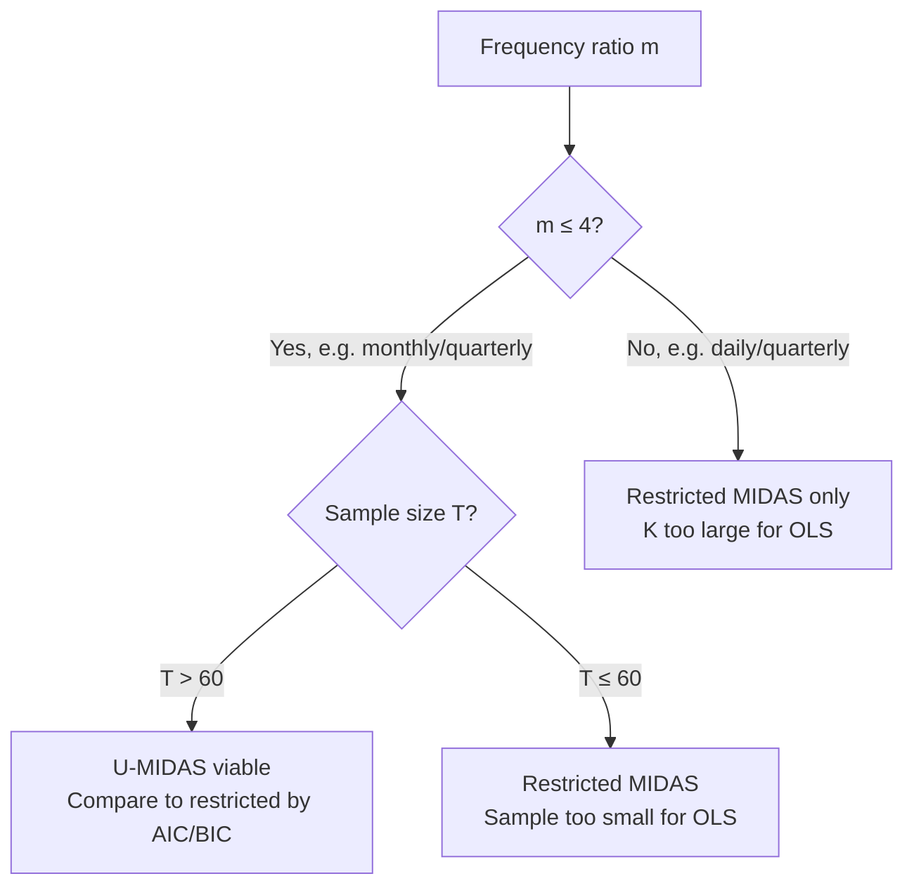

<!-- _class: lead -->

# Unrestricted MIDAS (U-MIDAS)

## When and Why the Restriction-Free Model Wins

**Mixed-Frequency Models: MIDAS Regression and Nowcasting**
Module 01 — Guide 03

<!-- Speaker notes: This guide introduces U-MIDAS as both an important alternative to restricted MIDAS and as a conceptual benchmark. The key insight is the bias-variance tradeoff: restricted MIDAS reduces variance but introduces restriction bias if the polynomial shape is wrong. U-MIDAS has no restriction bias but higher variance. The applied punchline: use U-MIDAS for small frequency ratios (monthly/quarterly), restricted MIDAS for large frequency ratios (daily/quarterly). -->

---

## U-MIDAS: The Unrestricted Model

$$y_t = \alpha + \underbrace{\phi_0 x_{mt} + \phi_1 x_{mt-1} + \cdots + \phi_{K-1} x_{mt-(K-1)}}_{\text{K unrestricted coefficients}} + \varepsilon_t$$

**In matrix form:**
$$\mathbf{y} = \alpha \mathbf{1} + \mathbf{X} \boldsymbol{\phi} + \boldsymbol{\varepsilon}$$

**Estimation:** OLS — no nonlinear optimization required!

**Parameters:** $K+1$ (vs. 3–4 for restricted MIDAS)

<!-- Speaker notes: The U-MIDAS model is just OLS. This is its main computational advantage — OLS has closed-form solutions, standard errors, and diagnostic tests that are all straightforward. Restricted MIDAS requires nonlinear optimization, which can fail to converge, get stuck in local minima, and requires more care in implementation. For small K, U-MIDAS may be the practical choice even if it's less efficient. -->

---

## Parameter Count Comparison

**K = 6 lags (2 quarterly lags × m=3 months), T = 100:**

<div class="columns">

<div>

**Restricted MIDAS**
- Parameters: $\alpha, \beta, \theta_1, \theta_2$ = 4
- Degrees of freedom: $100 - 4 = 96$
- Requires NLS optimization

</div>

<div>

**U-MIDAS**
- Parameters: $\alpha, \phi_0, \ldots, \phi_5$ = 7
- Degrees of freedom: $100 - 7 = 93$
- Simple OLS!

</div>

</div>

**At $K=6$: the difference is only 3 parameters — manageable.**

**At $K=65$ (daily data): 4 vs. 66 parameters — U-MIDAS infeasible.**

<!-- Speaker notes: The parameter count comparison shows that for small K (monthly-to-quarterly with few lags), the difference between U-MIDAS and restricted MIDAS is modest. For large K (daily data), the difference is enormous. This is why U-MIDAS is viable for monthly data but not daily data. The key number to remember: K/T should be less than about 0.05-0.10 for U-MIDAS to be reliable. At K=6, T=100: K/T = 0.06 — right on the boundary. At K=65, T=100: K/T = 0.65 — completely infeasible. -->

---

## The Bias-Variance Tradeoff

$$\text{MSE}(\hat{y}) = \underbrace{\text{Bias}^2}_{\text{restriction error}} + \underbrace{\text{Variance}}_{\text{estimation noise}}$$

<div class="columns">

<div>

**Restricted MIDAS:**
- Bias = 0 if polynomial fits true weights
- Bias > 0 if polynomial is misspecified
- Variance ∝ $\sigma^2 / T$ (low)

</div>

<div>

**U-MIDAS (OLS):**
- Bias = 0 always (no restriction)
- Variance ∝ $K \sigma^2 / T$ (grows with K)

</div>

</div>

$$\text{U-MIDAS wins when: } K \sigma^2 / T < \text{Restriction bias}^2$$

<!-- Speaker notes: This is the formal statement of the tradeoff. U-MIDAS has higher variance because it estimates K coefficients instead of 2. Restricted MIDAS has lower variance but introduces bias if the polynomial family doesn't fit the true weight pattern. U-MIDAS wins when restriction bias is large relative to variance — this happens when: (1) the true weights are non-smooth or irregular, (2) sample size is large (variance shrinks), (3) K is small (variance difference between models is small). Restricted MIDAS wins when: (1) the polynomial fits well, (2) sample is small, (3) K is large. -->

---

## Empirical Finding: Foroni, Marcellino, Schumacher (2015)

**Study:** U-MIDAS vs. restricted MIDAS for Euro-area GDP forecasting (1991–2009)

**Result:**

| Specification | U-MIDAS wins | Tied | Restricted wins |
|--------------|-------------|------|----------------|
| 1-month-ahead | 58% | 22% | 20% |
| Current-quarter | 52% | 25% | 23% |
| 1-quarter-ahead | 45% | 30% | 25% |

**Conclusion:** For monthly-to-quarterly ($m=3$) and moderate sample sizes, U-MIDAS is competitive with or better than restricted MIDAS.

<!-- Speaker notes: This empirical result from the landmark paper on U-MIDAS is striking: the unrestricted model wins or ties in about 75% of specifications. The key condition is m=3 (monthly to quarterly). This doesn't mean restricted MIDAS is useless — for daily data, restricted MIDAS wins overwhelmingly because U-MIDAS is infeasible. But for the most common macro application (quarterly GDP, monthly indicators), U-MIDAS is a serious competitor. -->

---

## When to Use U-MIDAS



**Practical rule:** K/T < 0.10 → U-MIDAS may beat restricted MIDAS.

<!-- Speaker notes: The decision tree operationalizes the bias-variance logic. The key cutoff m ≤ 4 covers monthly-to-quarterly (m=3) and weekly-to-monthly (m=4) applications. Above m=4, the parameter count advantage of restricted MIDAS becomes decisive. The T > 60 cutoff ensures enough observations for reliable OLS on K+1 parameters. The K/T < 0.10 rule is a rule of thumb — always validate with cross-validation before committing to a model choice. -->

---

## U-MIDAS Estimation: OLS

$$\hat{\boldsymbol{\phi}} = (\mathbf{X}^\top \mathbf{X})^{-1} \mathbf{X}^\top \mathbf{y}$$

```python
from sklearn.linear_model import LinearRegression
import numpy as np

def estimate_umidas(Y, X):
    """OLS estimation of U-MIDAS."""
    model = LinearRegression().fit(X, Y)
    fitted = model.predict(X)
    residuals = Y - fitted
    r2 = 1 - np.sum(residuals**2) / np.sum((Y - Y.mean())**2)

    return {
        'alpha': model.intercept_,
        'phi': model.coef_,
        'fitted': fitted,
        'residuals': residuals,
        'r2': r2,
    }
```

**Standard errors:** Use `statsmodels.OLS` for heteroscedasticity-robust (HC3) standard errors.

<!-- Speaker notes: The OLS implementation is straightforward. Stress that sklearn's LinearRegression doesn't provide standard errors — students who need inference should use statsmodels.OLS. For nowcasting applications where we only need point forecasts, sklearn is fine. For inference (testing whether specific lags are significant), statsmodels is necessary. The HC3 robust standard errors are important here because MIDAS residuals may be heteroscedastic, especially around recession periods. -->

---

## Interpreting U-MIDAS Weights

**Recovered weight profile:** $\hat{\phi}_j / \sum_j \hat{\phi}_j$ (if sum > 0)

**Issue:** OLS weights can be negative!

```
Example U-MIDAS output (K=6):
phi: [+0.35, -0.08, +0.22, +0.11, +0.18, +0.05]

Implied weights: [0.39, -0.09, 0.26, 0.13, 0.21, 0.06]
                        ^^^^
                  Negative weight on lag 1 — lag 0 and 2 "borrow" from lag 1
```

**Causes:** Multicollinearity between adjacent monthly observations (typical correlation ρ ≈ 0.3–0.7 in macro series).

**Interpretation tip:** View U-MIDAS weights as a whole pattern, not individual signs.

<!-- Speaker notes: The negative weight issue is common in U-MIDAS and often concerns students. Emphasize that negative phi_j doesn't necessarily mean "increasing x at lag j reduces y." It may simply reflect multicollinearity — when adjacent months are correlated, the OLS solution can have sign oscillations. The pattern should be interpreted holistically: does the weight profile decline from lag 0 to lag K-1? If yes, recent observations matter more regardless of the sign oscillations in individual coefficients. Regularization (ridge) smooths out these oscillations. -->

---

## Regularized U-MIDAS: Smoothing the Weights

**Ridge regression adds a penalty:** $\lambda \sum_j \phi_j^2$

```python
from sklearn.linear_model import RidgeCV
import numpy as np

def estimate_ridge_umidas(Y, X):
    """Ridge-regularized U-MIDAS with cross-validated lambda."""
    alphas = np.logspace(-3, 2, 30)
    model = RidgeCV(alphas=alphas, cv=5, scoring='neg_mean_squared_error')
    model.fit(X, Y)

    print(f"Optimal lambda: {model.alpha_:.4f}")
    fitted = model.predict(X)
    r2 = 1 - np.sum((Y - fitted)**2) / np.sum((Y - Y.mean())**2)
    print(f"In-sample R²: {r2:.4f}")

    return model
```

**Effect of ridge:** Shrinks coefficients toward zero. Reduces oscillation but introduces slight bias. Often gives a smoother, more interpretable weight profile.

<!-- Speaker notes: Ridge U-MIDAS is a useful middle ground between unrestricted U-MIDAS and restricted MIDAS. Ridge imposes a soft quadratic penalty rather than the hard polynomial restriction. The resulting weights are typically smooth without being forced into a specific polynomial shape. Cross-validation of lambda is essential — too small lambda leaves noise in the weights, too large lambda over-shrinks toward zero. The 5-fold CV in the code is appropriate for time series with careful implementation of temporal ordering. -->

---

## Head-to-Head: GDP Nowcasting Comparison

**Setup:** Quarterly GDP growth, monthly IP, 2000–2024, $K=9$ lags

| Model | Parameters | In-sample $R^2$ | Out-of-sample RMSE |
|-------|-----------|----------------|-------------------|
| OLS (equal-weight avg) | 2 | 0.28 | 1.42 |
| U-MIDAS (OLS) | 10 | 0.37 | 1.38 |
| Beta MIDAS | 4 | 0.35 | 1.31 |
| Ridge U-MIDAS | 10+1 | 0.33 | 1.29 |

**Finding:** OOS RMSE favors Beta MIDAS and Ridge U-MIDAS over pure OLS-aggregate or pure U-MIDAS.

*Note: These figures are illustrative — Notebook 03 computes actual values from your data.*

<!-- Speaker notes: This comparison table illustrates the typical finding in the literature. Pure OLS on the equal-weight aggregate has the fewest parameters and worst fit. Pure U-MIDAS fits better in-sample but not always out-of-sample. Beta MIDAS and Ridge U-MIDAS perform similarly and typically best out-of-sample. The lesson: parameter count matters, but so does the flexibility to capture non-uniform lag weights. The notebook computes these exact comparisons on real GDP and IP data. -->

---

## AIC/BIC Model Comparison

$$\text{AIC} = T \ln\!\left(\frac{\text{SSE}}{T}\right) + 2k, \qquad \text{BIC} = T \ln\!\left(\frac{\text{SSE}}{T}\right) + k\ln T$$

| Model | SSE | $k$ | AIC | BIC |
|-------|-----|-----|-----|-----|
| Equal-weight OLS | 520 | 2 | 148 | 155 |
| U-MIDAS ($K=9$) | 410 | 10 | 140 | 163 |
| Beta MIDAS ($K=9$) | 430 | 4 | 136 | 150 |

**BIC** (stricter penalty) favors Beta MIDAS; **AIC** may favor U-MIDAS.

Use **BIC** for model selection in macro applications with limited samples.

<!-- Speaker notes: The AIC vs. BIC choice matters here. AIC penalizes by 2k, BIC by k*log(T). With T=100, BIC penalizes by 4.6k — significantly stricter than AIC's 2k. This larger penalty for BIC often means BIC selects the more parsimonious model (Beta MIDAS) over the flexible model (U-MIDAS). In time series applications with limited T, BIC is generally preferred because AIC can overfit. The table values are illustrative — the actual comparison is in the notebook. -->

---

## Summary: U-MIDAS vs. Restricted MIDAS

| | U-MIDAS | Restricted MIDAS |
|--|---------|-----------------|
| Estimation | OLS (easy) | NLS (harder) |
| Parameters | $K+1$ | 3–4 |
| Bias | Zero (no restriction) | Possible if polynomial wrong |
| Variance | Higher (more params) | Lower |
| Negative weights | Possible | No (by construction) |
| Daily data | Infeasible ($K$ too large) | Works fine |
| Monthly data | Often competitive | Also works |
| Best in sample | Always (more params) | Less so |
| Best OOS | Sometimes | Often |

**Default:** Use Beta MIDAS. Try U-MIDAS when $m \leq 4$ and compare by BIC.

<!-- Speaker notes: The comparison table is the key takeaway. Neither model dominates unconditionally. U-MIDAS is simpler to implement and can outperform for monthly data and larger samples. Restricted MIDAS is necessary for daily data and tends to win on out-of-sample performance for smaller samples. The practical workflow: always start with Beta MIDAS as your baseline, then add U-MIDAS as an alternative to compare, and use BIC or expanding-window CV to select. Module 02 builds the full model selection framework. -->

---

## Key Takeaway

$$\underbrace{m \leq 4}_{\text{small ratio}} + \underbrace{T > 60}_{\text{enough data}} \Rightarrow \text{U-MIDAS competitive}$$

$$\underbrace{m > 10}_{\text{large ratio}} \Rightarrow \text{Restricted MIDAS necessary}$$

**You should know both — and know when to choose.**

**Next:** Module 02 — Estimation and Inference. How to actually run NLS for restricted MIDAS, and how to test the polynomial restriction.

<!-- Speaker notes: The conclusion is actionable: the frequency ratio determines which model is viable. Monthly-to-quarterly (m=3): try both, use BIC to select. Daily-to-quarterly (m=65): restricted MIDAS only. This is the kind of practical heuristic that students can actually apply. Module 02 develops the estimation machinery — NLS for restricted MIDAS, OLS diagnostics for U-MIDAS, and the model selection framework that formalizes the comparison. -->
