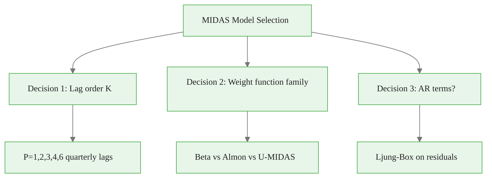
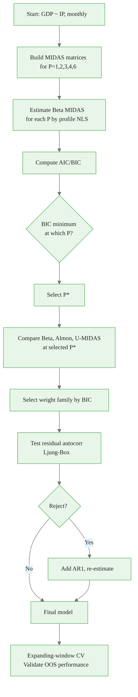

<!-- _class: lead -->

# Model Selection for MIDAS

## Lag Order, Weight Family, and Cross-Validation

**Mixed-Frequency Models: MIDAS Regression and Nowcasting**
Module 02 — Guide 02

<!-- Speaker notes: This guide covers the three model selection decisions in MIDAS: how many lags, which weight function, and whether to include AR terms. Information criteria (AIC/BIC) and expanding-window cross-validation are the two tools. The key finding: BIC typically selects more parsimonious models than AIC for macro applications. Always validate with out-of-sample evaluation before committing to a model. -->

---

## Three Model Selection Decisions



**Tool for all three:** AIC/BIC + expanding-window cross-validation

<!-- Speaker notes: The three decisions are somewhat independent but interact. The lag order K determines how much history is included. The weight function family determines how that history is aggregated. AR terms control residual autocorrelation. In practice, practitioners often make these decisions sequentially: first choose K by BIC, then choose weight function, then test for AR terms. A more principled approach uses cross-validation over all combinations simultaneously, but that's computationally expensive. -->

<div class="callout-key">

The key advantage of MIDAS is preserving high-frequency information that temporal aggregation destroys.

</div>

---

## Information Criteria Recall

$$\text{AIC} = T \ln\!\left(\frac{\text{SSE}}{T}\right) + 2k$$

$$\text{BIC} = T \ln\!\left(\frac{\text{SSE}}{T}\right) + k\ln T$$

**Critical MIDAS insight:** For restricted MIDAS, $k = 4$ regardless of $K$!

The SSE decreases as $K$ grows, but the penalty stays at 4 (or 2k = 8, or k lnT ≈ 18).

So: **BIC selects the $K$ that most reduces SSE per additional "information".**

<!-- Speaker notes: This is the key insight that makes model selection for restricted MIDAS different from for unrestricted regression. When you add more lags K to a restricted Beta MIDAS model, you're not adding more parameters — you're only extending the span of the existing 4-parameter weight function. The SSE can decrease but the AIC/BIC penalty stays constant at 4 (or 8, or 4 ln T). This means the criteria select the largest K that meaningfully improves fit, without the usual penalty for adding parameters. -->

<div class="callout-insight">

**Insight:** Parsimonious weight functions with 2-3 parameters can capture decay patterns that unrestricted models need 12+ parameters to approximate.

</div>

---

## Lag Selection: In Practice

For quarterly GDP ~ monthly IP (K varies from 3 to 18):

| $P$ | $K$ | $k$ | SSE | AIC | BIC |
|-----|-----|-----|-----|-----|-----|
| 1 | 3 | 4 | 54.2 | 136.8 | 155.3 |
| 2 | 6 | 4 | 50.1 | 135.1 | 153.6 |
| 3 | 9 | 4 | 48.3 | 134.5 | 153.0 |
| **4** | **12** | **4** | **47.8** | **134.3** | **152.8** ← min BIC |
| 6 | 18 | 4 | 47.6 | 134.2 | 152.7 |

**Diminishing returns:** After P=4, SSE improvement is tiny. BIC minimum at P=4.

<!-- Speaker notes: This is a typical result for quarterly GDP nowcasting with monthly IP. The SSE decreases as more lags are added, but the improvement becomes negligible after P=4 (4 quarterly lags = 12 monthly lags). BIC identifies P=4 as the optimum because the SSE reduction from P=4 to P=6 is tiny (47.8 vs 47.6) while not changing the parameter count at all. Students should always report this table when presenting MIDAS results — it shows how the lag selection was made. -->

<div class="callout-warning">

**Warning:** Always account for the real-time data vintage when evaluating nowcast performance. Using revised data overstates accuracy.

</div>

---

## Weight Function Family Comparison

For $P=4$ (K=12) selected lags:

| Model | $k$ | SSE | AIC | BIC | OOS RMSE |
|-------|-----|-----|-----|-----|---------|
| OLS-aggregate | 2 | 52.1 | 135.2 | 144.4 | 1.451 |
| Beta MIDAS | 4 | 47.8 | 134.3 | 152.8 | 1.384 |
| Almon MIDAS | 4 | 47.9 | 134.4 | 152.9 | 1.391 |
| U-MIDAS | 13 | 45.2 | 134.8 | 175.6 | 1.417 |

**BIC strongly penalizes U-MIDAS** ($k=13$ vs $k=4$). Beta and Almon are nearly tied.

<!-- Speaker notes: The table shows the typical outcome: OLS-aggregate has worst fit, U-MIDAS has best in-sample fit but worst BIC (due to k=13 parameters), and Beta/Almon MIDAS occupy the middle with best BIC. The out-of-sample RMSE (from expanding-window CV) shows that Beta MIDAS also has the best predictive accuracy. This consistency between BIC and OOS evaluation is reassuring — it validates using BIC as a selection criterion in this setting. -->

<div class="callout-info">

**Info:** MIDAS models can handle any frequency ratio: monthly-to-quarterly (3:1), daily-to-monthly (~22:1), or even tick-to-daily.

</div>

---

## The Expanding Window Protocol

```
Training period grows as each new quarter arrives:

|← Train →|  Test   |
Q1 ... Q50 | Q51     |  Estimate model, forecast Q51
Q1 ... Q51 | Q52     |  Re-estimate, forecast Q52
...
Q1 ... QT-1 | QT     |  Re-estimate, forecast QT

RMSE = sqrt(mean((y_actual - y_forecast)^2))
```

**Why not rolling window?** Expanding window uses all available history — matches real-world behavior where practitioners don't discard old data.

<!-- Speaker notes: The expanding window protocol is the gold standard for evaluating nowcasting and forecasting models. The key feature is that the model is re-estimated at each step using only data that would have been available at that point in time. This means that if a parameter like theta changes over time (structural break), the expanding window captures that evolution. The rolling window (fixed training size) is used when you suspect parameter instability — the expanding window gradually adapts while the rolling window adapts faster. For stable macro relationships like GDP-IP, the expanding window typically works better. -->

---

## AR Term Selection: Ljung-Box Test

After estimating MIDAS, test residuals for serial correlation:

$$Q_{LB}(p) = T(T+2)\sum_{k=1}^p \frac{\hat{\rho}_k^2}{T-k} \sim \chi^2_p \text{ under H}_0$$

<div class="code-window">
<div class="code-header">
<div class="dots"><span class="dot-red"></span><span class="dot-yellow"></span><span class="dot-green"></span></div>
<span class="filename">example.py</span>
</div>

```python
from scipy.stats import chi2

def ljung_box(residuals, p=4):
    T = len(residuals)
    acf = [np.corrcoef(residuals[k:], residuals[:-k])[0,1]
           for k in range(1, p+1)]
    Q = T*(T+2) * sum(r**2/(T-k) for k, r in enumerate(acf, 1))
    p_val = 1 - chi2.cdf(Q, df=p)
    return Q, p_val
```

</div>

**If p-value < 0.10:** Add AR(1) term and re-test.

<!-- Speaker notes: The Ljung-Box test is the standard check for residual autocorrelation in time series models. For MIDAS with quarterly GDP, the residuals are often mildly autocorrelated because GDP itself is serially correlated (AR coefficient ≈ 0.2-0.4). If the test rejects at 10%, add an AR(1) term to the model. This is the MIDAS-AR extension discussed in Module 01 Guide 01. After adding AR(1), re-run Ljung-Box to confirm that the serial correlation is adequately captured. -->

---

## MIDAS-AR Model Selection

Adding AR(1):
$$y_t = \alpha + \rho y_{t-1} + \beta \sum_{j=0}^{K-1} w_j(\theta) x_{mt-j} + \varepsilon_t$$

Parameters: $k = 5$ (α, ρ, β, θ₁, θ₂)

**When to add AR terms:**
- Ljung-Box rejects at 10%
- BIC(MIDAS-AR) < BIC(MIDAS)
- Forecast accuracy improves in expanding-window CV

<!-- Speaker notes: The MIDAS-AR model has one more parameter than plain MIDAS (the AR coefficient rho). The BIC comparison is straightforward: if BIC(MIDAS-AR) < BIC(MIDAS), the AR term is justified. In macro applications, MIDAS-AR usually improves both BIC and out-of-sample RMSE for GDP forecasting because GDP growth has mild positive autocorrelation. The AR(1) MIDAS model is therefore often the preferred specification in practice. -->

---

## Model Selection Workflow



<!-- Speaker notes: This workflow is the practical model selection process. Follow it in order: lag selection first, then weight family, then AR terms. Each step uses BIC to compare. The final validation step (expanding-window CV) is the check that the selected model actually predicts well out of sample. If the OOS RMSE is substantially worse than expected from the information criteria, suspect data snooping or COVID-period contamination. -->

---

## Practical Recommendations

<div class="columns">

<div>

**For macro quarterly GDP:**
- Default: $P=4$ (K=12 monthly lags)
- Weight function: Beta polynomial
- AR terms: Check Ljung-Box
- BIC for lag selection

</div>

<div>

**For financial quarterly returns:**
- Default: $P=4$ (K=65×4 daily lags)
- Weight function: Beta polynomial
  (U-MIDAS infeasible)
- AR terms: Rarely needed
- BIC for lag selection

</div>

</div>

**Always:** Report full model selection table, not just final model.

<!-- Speaker notes: These practical recommendations cover the two most common MIDAS applications. The defaults are informed by the empirical literature. For macro applications (quarterly GDP with monthly indicators), P=4 is the standard choice. For financial applications with daily data (quarterly returns with daily realized volatility), P=4 gives K=260 daily lags — restricted MIDAS with Beta polynomial is the only feasible option. In both cases, report the full model selection table so readers can see the evidence. -->

---

## Summary: Model Selection

| Criterion | When to Use | Pros | Cons |
|-----------|------------|------|------|
| AIC | Predictive focus | Less conservative | Tends to overfit |
| BIC | Parsimony | Consistent | Can underfit |
| OOS RMSE | Forecast evaluation | Direct measure | Time-consuming |

**Recommendation:** Use BIC for specification selection. Use OOS RMSE as final validation.

**For restricted MIDAS:** BIC penalizes K only indirectly (through SSE improvement). For U-MIDAS: BIC penalizes K directly (k grows with K).

<!-- Speaker notes: The comparison table is a useful summary for students. The key practical recommendation: use BIC for model selection because it's consistent (selects the true model as T→∞ under correct specification) and is more conservative than AIC. Then validate the selected model using out-of-sample RMSE before reporting results. In publication-quality work, always report both BIC and OOS RMSE to show the model performs well on both criteria. -->
