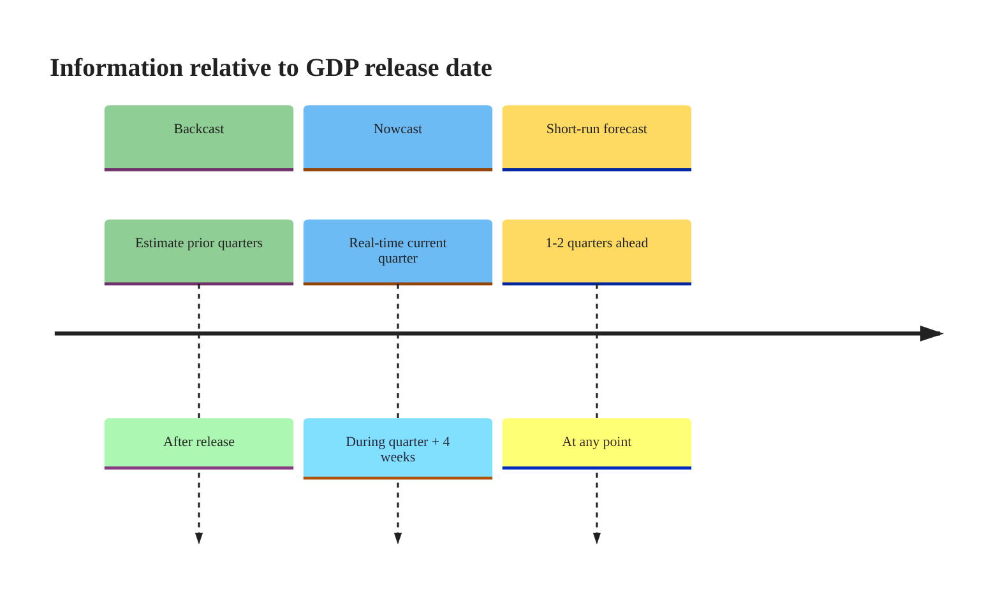
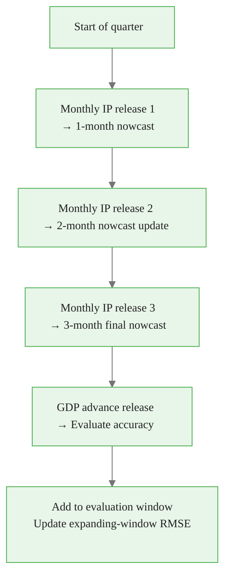

<!-- _class: lead -->

# The Nowcasting Problem

## Real-Time GDP Estimation with MIDAS

**Mixed-Frequency Models: MIDAS Regression and Nowcasting**
Module 03 — Guide 01

<!-- Speaker notes: This guide introduces the nowcasting problem from the MIDAS perspective. Key concepts: the ragged edge (incomplete current-quarter data), the publication calendar, and the forecast evolution plot. Students who have seen nowcasting before should focus on how MIDAS handles the ragged edge differently from bridge equations. The core question is: how does each new monthly data release update our estimate of current-quarter GDP? -->

---

## What Is Nowcasting?

**Nowcasting** = estimating the *current* state of the economy using data already available.

> "The GDP for Q3 has not yet been released. Based on the industrial production and employment data already published for July and August, what is our best estimate of Q3 GDP growth?"

```
Jan  Feb  Mar  |  Apr  May  Jun  |  Jul  Aug  Sep  | Oct 30
                                                    GDP Q3
                                                    released
```

**The core problem:** GDP releases 4–6 weeks after the quarter ends.

<!-- Speaker notes: Nowcasting has become one of the most practically important applications of econometrics. Central banks (ECB, Fed, Bank of England) nowcast GDP in real time to inform monetary policy decisions. The key feature is that we're trying to estimate something that hasn't been officially measured yet — using related data that comes out faster. The 4-6 week release lag means that when you make a monetary policy decision on November 1st, you may not yet know the Q3 GDP figure that ended September 30th. -->

<div class="callout-key">

The key advantage of MIDAS is preserving high-frequency information that temporal aggregation destroys.

</div>

---

## The Publication Calendar

| Date | Data Available | Nowcast Type |
|------|---------------|-------------|
| Feb 15 | January IP only | 1-month nowcast |
| Mar 15 | January + February IP | 2-month nowcast |
| Apr 15 | January + February + March IP | 3-month (complete) |
| Apr 26 | **GDP Q1 released** | — |

**Key insight:** More months of IP → more precise nowcast.

The *nowcast revision* between successive vintages = information value of the new monthly release.

<!-- Speaker notes: The publication calendar varies by country and statistical agency. For the US, BLS releases industrial production on the 15th or 16th of the following month. BEA releases the GDP advance estimate about 4 weeks after quarter end. The gap between the first quarterly IP release (mid-February for January) and the GDP release (late April for Q1) is about 10 weeks. This table shows the three information states that occur during Q1: 1-month (January only), 2-month (January-February), and 3-month (complete quarter). Each state corresponds to a different ragged edge in the MIDAS data matrix. -->

<div class="callout-insight">

**Insight:** Parsimonious weight functions with 2-3 parameters can capture decay patterns that unrestricted models need 12+ parameters to approximate.

</div>

---

## The Ragged Edge Problem

```
Quarter | j=0 (latest) | j=1  | j=2  | j=3...j=11
--------|--------------|------|------|------------
Q-3     | ✓            | ✓    | ✓    | ✓ ... ✓  (complete)
Q-2     | ✓            | ✓    | ✓    | ✓ ... ✓  (complete)
Q-1     | ✓            | ✓    | ✓    | ✓ ... ✓  (complete)
Q (now) | ?            | ✓    | ✓    | ✓ ... ✓  (ragged!)
```

At the 2-month vintage: the most recent monthly lag **is missing**.

This is the "ragged edge" — the current quarter row of the MIDAS matrix is incomplete.

<!-- Speaker notes: The ragged edge is what distinguishes nowcasting from regular forecasting. In regular forecasting, all your data is complete and you're predicting the future. In nowcasting, you have partial data for the current period and need to estimate what's already happening. The MIDAS matrix has a missing value at j=0 for the current quarter when the final monthly release hasn't happened yet. The figure shows K=12 monthly lags for illustration — the rightmost column of the current quarter row has a question mark. -->

<div class="callout-warning">

**Warning:** Always account for the real-time data vintage when evaluating nowcast performance. Using revised data overstates accuracy.

</div>

---

## Three Approaches to the Ragged Edge

<div class="columns">

<div>

**Option 1: Backward shift**
Drop j=0, use K'=K-1 lags.
$$\hat{y}_Q = \hat{\alpha} + \hat{\beta}\sum_{j=1}^{K-1} w_j' x_{mQ-j}$$
Simple. Slightly biased.

**Option 2: EM imputation**
Impute missing IP from seasonal model, then apply MIDAS normally.
More complex. Accurate if seasonal model is good.

</div>

<div>

**Option 3: Ragged-edge re-weighting**
Re-normalize the available weights:
$$\hat{y}_Q^{(h)} = \hat{\alpha} + \hat{\beta}\tilde{w}\sum_{j=h}^{K-1} w_j x_{mQ-j}$$
where $\tilde{w}$ corrects for missing mass.

**Most theoretically sound.** Preserves weight shape.

</div>

</div>

<!-- Speaker notes: All three approaches are used in practice. The backward shift (Option 1) is by far the most common in academic papers and is what most researchers implement first. The EM imputation (Option 2) is used in professional nowcasting models like those at the NY Fed. The ragged-edge re-weighting (Option 3) is the most principled but requires careful implementation. For this course, we implement Options 1 and 3 to show the contrast. The difference in nowcast accuracy between the three approaches is typically small for quarterly GDP with monthly IP — the missing lag effect is modest. -->

<div class="callout-info">

**Info:** MIDAS models can handle any frequency ratio: monthly-to-quarterly (3:1), daily-to-monthly (~22:1), or even tick-to-daily.

</div>

---

## Forecast Evolution Plot

```
Nowcast revision path — 2024Q3 GDP growth:

  2.5% |                                    ● (complete quarter)
  2.2% |                         ●
  1.8% |              ●
  1.4% |  ●
       +---+----------+----------+----------+
          Feb         Mar        Apr        Release
        (1 month)  (2 months)  (3 months)
```

Each monthly IP release **updates the nowcast**.

The update size $= \hat{\beta} \cdot w_0 \cdot \Delta x_{IP}$ where $\Delta x_{IP}$ = surprise in monthly IP.

<!-- Speaker notes: The forecast evolution plot is one of the most informative diagnostics for a nowcasting model. It shows how the nowcast evolves as more information arrives. A good nowcast should converge smoothly toward the eventual GDP release — not jump around erratically. The size of each update depends on two things: (1) how large the IP surprise was (actual minus expected), and (2) how much weight the Beta polynomial assigns to the newly added lag. If the weight function is front-loaded (w_0 is large), getting the third month's data makes a big difference. If it's more evenly spread, the update is smaller. -->

---

## The Nowcast Update Formula

When month 3 of the quarter is released:

$$\Delta\hat{y}_Q = \hat{y}_Q^{(0)} - \hat{y}_Q^{(1)} = \hat{\beta} \cdot \hat{w}_0 \cdot x_{IP,m3}$$

where:
- $\hat{w}_0$ = weight on the most recent monthly lag
- $x_{IP,m3}$ = newly released IP growth rate
- The 2-month nowcast implicitly used $x_{IP,m3} = 0$

**Interpretation:** A $+1\%$ IP surprise in month 3 updates the GDP nowcast by $\hat{\beta} \cdot \hat{w}_0 \%$.

For typical estimates ($\hat{\beta} \approx 0.5$, $\hat{w}_0 \approx 0.2$): a 1% IP surprise → 0.1% GDP update.

<!-- Speaker notes: This formula gives a clean economic interpretation to the nowcast update. The update is proportional to: (1) the IP-GDP transmission coefficient beta, (2) the weight on the most recent lag, and (3) the surprise in the new release (relative to what was already available). In practice, the 2-month nowcast uses extrapolation of the seasonal pattern for the missing month, not zero — but the formula captures the intuition. The typical magnitudes (beta~0.5, w0~0.2) suggest that monthly IP surprises have modest but non-trivial effects on GDP nowcasts. -->

---

## Benchmark Models

Always compare MIDAS against benchmarks:

| Model | Uses HF Data? | Parameters |
|-------|--------------|-----------|
| AR(1) for GDP | No | 2 |
| Equal-weight MIDAS | Yes (k=2) | 2 |
| Beta MIDAS (main) | Yes (k=4) | 4 |
| Survey consensus | External | — |

**Evaluation:** RMSE over the holdout period.

Typical finding: Beta MIDAS improves RMSE by 10-20% over AR(1) benchmark.

<!-- Speaker notes: The AR(1) benchmark is important because it represents the no-information-addition baseline. If MIDAS doesn't beat AR(1), the high-frequency data isn't helping. The equal-weight MIDAS is the intermediate benchmark — it uses the HF data but without the polynomial weight optimization. The survey consensus (e.g., Bloomberg survey of economists) is an external benchmark that represents the market's collective best guess. Beating survey consensus is strong evidence that the model is capturing genuine information. In practice, simple MIDAS models beat AR(1) and equal-weight but rarely consistently beat survey consensus over long horizons. -->

---

## Nowcast vs. Forecast vs. Backcast



**This module:** Nowcasting (current quarter estimation).

**Module extensions:** Multi-quarter forecasting uses same MIDAS framework but different lag specifications.

<!-- Speaker notes: The distinction between backcast, nowcast, and forecast is about the information set relative to the target period. Nowcasting is the most practically important for central banks — they need to know what's happening right now, not 2-4 quarters from now. The same MIDAS framework extends to all three settings by adjusting the alignment of the data matrices. For backcasting (estimating prior quarters with revised data), there's no ragged edge problem. For short-run forecasting, the lag structure shifts to include only lags from prior quarters. -->

---

## Nowcasting RMSE Results (Illustration)

From a typical application (quarterly GDP, 2005–2019):

```
Model               1-month  2-month  3-month
─────────────────────────────────────────────
AR(1) benchmark      0.82     0.82     0.82
Equal-weight MIDAS   0.74     0.70     0.67
Beta MIDAS (K=12)    0.71     0.66     0.63  ← Best
Survey consensus     0.68     0.66     0.64
─────────────────────────────────────────────
```

*Values are illustrative — Notebooks 01-02 compute actual results.*

<!-- Speaker notes: This table illustrates the typical pattern of results. Three things to note: (1) All models improve as more monthly data arrives (3-month better than 1-month — more information helps). (2) Beta MIDAS beats equal-weight consistently. (3) The gap between Beta MIDAS and survey consensus is small. The AR(1) RMSE doesn't improve with the horizon because it doesn't use any monthly data. The COVID years (2020) would dramatically increase all RMSE values — exclude them for a clean comparison of normal-times performance. -->

---

## Real-Time Caveats

Two important caveats for any nowcasting study:

**Caveat 1: Data revisions**
IP and GDP are both revised after initial release. Using today's revised data for historical evaluation is "look-ahead bias." For methodological illustration, we accept this limitation.

**Caveat 2: Publication timing**
A Feb 15 nowcast uses January IP (released Feb 15). It does NOT use February IP (released March 15). Getting the timing wrong invalidates the evaluation.

**For this course:** We use final-vintage data and focus on methodology.

<!-- Speaker notes: In a fully rigorous real-time nowcasting study, you would need a real-time data warehouse like the ALFRED database at the St. Louis Fed. ALFRED stores every vintage of every series — you can access exactly what was available on any given date in the past. This is essential for a genuine real-time evaluation. For this course, we sidestep this complexity and use final-vintage data, which is appropriate for learning the MIDAS methodology. The real-time extension is discussed in the advanced section of Module 03. -->

---

## Summary: Nowcasting Workflow



**Next:** Notebook 01 implements this workflow on real GDP/IP data.

<!-- Speaker notes: The workflow diagram captures the iterative nature of nowcasting. Unlike a one-shot forecast, nowcasting involves continuous model updates as new data arrives. The practitioner runs the model three times per quarter (once after each monthly IP release) and tracks how the estimate evolves. The final evaluation happens when GDP is released — the nowcast error is the difference between the 3-month nowcast and the actual GDP release. We use expanding-window RMSE to measure this over many quarters. -->

---

## Summary: Key Concepts

| Concept | Definition |
|---------|-----------|
| Nowcast | Real-time estimate of current-period GDP |
| Ragged edge | Incomplete current-quarter row in MIDAS matrix |
| Publication calendar | Release timing for each monthly indicator |
| Forecast evolution | How the nowcast changes with each new release |
| Nowcast update | $\hat{\beta}\hat{w}_0 \Delta x_{IP}$ per new release |
| Vintage | The state of a dataset at a specific date |

**Next module topic:** Direct vs. iterated MIDAS nowcasting strategies.

<!-- Speaker notes: The summary table provides the vocabulary students need for the rest of Module 03. The most important term is "ragged edge" — this is what distinguishes nowcasting from regular forecasting and is the core technical challenge. The formula for the nowcast update (beta * w0 * surprise) is also worth memorizing — it gives economic intuition for how the weight function affects real-time information processing. -->
