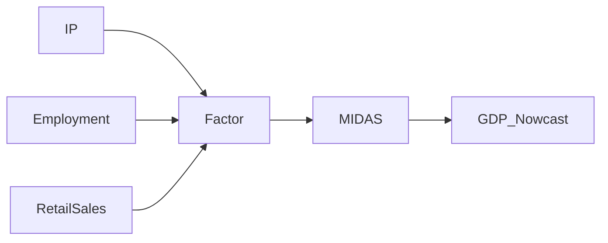

<!-- _class: lead -->

# Mixed-Frequency DFMs

## Kalman Filter and Multi-Indicator Nowcasting

**Mixed-Frequency Models: MIDAS Regression and Nowcasting**
Module 04 — Guide 02

<!-- Speaker notes: This guide extends the static factor model to handle mixed-frequency data. The key innovation is the state-space formulation where quarterly GDP is a noisy aggregate of a monthly factor. The Kalman filter handles the missing quarterly observations cleanly. For the course application, we use a practical two-step approach (PCA + quarterly aggregation) rather than full Kalman implementation. The main conceptual lesson: the MF-DFM nowcast updates each time any indicator is released, with the update size proportional to the loading. -->

---

## The Mixed-Frequency Challenge

Monthly indicators: observed at $t = 1, 2, 3, \ldots, T_{months}$

Quarterly GDP: observed only at $t = 3, 6, 9, \ldots$ (every third month)

**Standard DFM assumption:** All variables observed at same frequency.

**Solution:** Treat quarterly GDP as a monthly series with missing observations at $t = 1, 2, 4, 5, 7, 8, \ldots$

<!-- Speaker notes: The fundamental challenge of mixed-frequency modeling is how to put monthly and quarterly data in the same framework. The elegant solution from the DFM literature is to treat the quarterly variable as a monthly variable observed every third month — with the other months as missing data. The Kalman filter is designed to handle missing observations exactly: when an observation is missing, the filter simply skips the update step and continues with the prior. When the quarterly GDP arrives (every third month), it triggers a measurement update that can substantially revise the factor estimate. -->

---

## State-Space Formulation

**State (monthly):**
$$\mathbf{f}_m = \mathbf{A}\mathbf{f}_{m-1} + \mathbf{u}_m$$

**Observation (mixed):**
$$y_m^{obs} = \mathbf{Z}_m \mathbf{f}_m + \varepsilon_m$$

$\mathbf{Z}_m$ changes each month:
- Monthly indicators: always observed ($\mathbf{Z}_m$ has full rows)
- Quarterly GDP: observed only in month 3 of each quarter

$$\text{GDP}_t^Q = \frac{1}{3}(f_{3t} + f_{3t-1} + f_{3t-2}) + u_t$$

<!-- Speaker notes: The state-space formulation is the key to the mixed-frequency DFM. The state vector f_m evolves at monthly frequency according to a VAR. The observation equation has a time-varying measurement matrix Z_m that includes the quarterly GDP row only in the third month of each quarter. In months 1 and 2 of a quarter, only the monthly indicator equations are active. This is the 'skip-sampling' or 'stock-flow' approach to mixed-frequency modeling. The aggregation constraint (1/3 sum for flow variables) is a specific form of the Z matrix for quarterly GDP. Stock variables like unemployment rate would use a different aggregation. -->

---

## The Kalman Filter: Core Algorithm

```
For each month m = 1, 2, ...:

  Prediction step:
    f_{m|m-1} = A * f_{m-1|m-1}  (prior)
    P_{m|m-1} = A * P_{m-1|m-1} * A' + Q

  Update step (if y_m observed):
    K_m = P_{m|m-1} * Z_m' * (Z_m * P_{m|m-1} * Z_m' + R)^{-1}
    f_{m|m} = f_{m|m-1} + K_m * (y_m - Z_m * f_{m|m-1})
    P_{m|m} = (I - K_m * Z_m) * P_{m|m-1}

  If y_m missing (non-GDP months for quarterly vars):
    f_{m|m} = f_{m|m-1}  (no update)
    P_{m|m} = P_{m|m-1}
```

<!-- Speaker notes: The Kalman filter algorithm proceeds in two steps: prediction and update. The prediction step propagates the current state estimate forward using the VAR dynamics — this is the "prior" before seeing the new data. The update step corrects the prior using the new observation, with the Kalman gain K_m determining how much to weight the new data versus the prior. The critical feature for mixed-frequency is in the "if missing" branch: when the quarterly GDP observation doesn't arrive, we simply skip the update. This means the factor estimate continues to evolve based on the monthly indicators alone, and the uncertainty (P matrix) grows slightly each period without a quarterly update. -->

---

## Course Implementation: Two-Step Approach

Full Kalman filter requires iterative EM estimation (complex).

**Our approach:** PCA factors → quarterly aggregation → MIDAS regression.

```python
# Step 1: Extract monthly factors
F_monthly, Lambda, _ = extract_factors_pca(X_monthly_std, n_factors=2)

# Step 2: Aggregate to quarterly
F_quarterly = quarterly_aggregate(F_monthly, method='last')
# 'last' = value at end of quarter (good for flow variables)

# Step 3: Factor-augmented MIDAS
# Use F_quarterly instead of raw IP in MIDAS regression
Y_aligned, X_factor = build_midas_matrix(GDP, F_quarterly, K=4)
est = estimate_midas(Y_aligned, X_factor)
```

<!-- Speaker notes: The two-step approach trades theoretical optimality for practical simplicity. By aggregating monthly factors to quarterly before running MIDAS, we lose some within-quarter information. However, the MIDAS weight structure at step 3 partly recovers this — by using K=4 quarterly lags of the factor, we preserve the timing structure across quarters. The main limitation is that the two-step approach can't produce within-quarter nowcast updates as new monthly releases arrive. For that, you need the full Kalman filter. For the purposes of this course, the two-step approach is sufficient to illustrate the factor augmentation benefit. -->

---

## Nowcast Update from Factor News

When indicator $i$ is released at value $x_{i,m}$:

**Factor update:**
$$\Delta\hat{f}_m = \hat{K}_{im} \cdot (x_{i,m} - \hat{x}_{i,m|m-1})$$

where $\hat{K}_{im} \propto \hat{\lambda}_i$ is the Kalman gain for indicator $i$.

**GDP nowcast update:**
$$\Delta\hat{y}_t^Q = \hat{\beta}_f \cdot \Delta\hat{f}_m$$

**Total sensitivity per indicator:** $\hat{\beta}_f \cdot \hat{\lambda}_i \cdot K_{gain}$

<!-- Speaker notes: The nowcast update formula shows how information flows from indicator releases to GDP nowcast. When IP is released, it updates the factor estimate by an amount proportional to the IP loading (lambda_IP = 0.72 in our example) times the IP surprise. The GDP nowcast then updates by beta_f times this factor update. This gives a complete decomposition of the nowcast revision into contributions from each indicator release. This is what the New York Fed calls 'news decomposition' — it shows which indicator releases are most informative for the GDP nowcast each month. -->

---

## Factor vs. Single-Indicator MIDAS



vs.


**FA-MIDAS:** More informative predictor, smoother series, less noise.

<!-- Speaker notes: The diagram shows the information flow in the two approaches. In standard MIDAS, only IP enters the regression directly. In factor-augmented MIDAS, IP, employment, and retail sales all contribute to the common factor, which then enters the MIDAS regression. The factor is a noise-reduced version of the business cycle signal — the idiosyncratic components of each indicator average out. This is why FA-MIDAS typically has lower RMSE than single-indicator MIDAS: the factor is a better predictor because it's less noisy. The cost is interpretability: you lose the direct connection between the IP weight function and GDP, replacing it with a factor weight function that's harder to interpret economically. -->

---

## Multi-Indicator MIDAS vs. DFM

<div class="columns">

<div>

**Multi-indicator MIDAS:**
$$y_t = \alpha + \beta_1\tilde{x}_{1t}(\theta_1) + \beta_2\tilde{x}_{2t}(\theta_2) + \varepsilon$$

Parameters: $2(q+1)$ for $q$ indicators.

For $q=3$ indicators: 8 params.

</div>

<div>

**FA-MIDAS:**
$$y_t = \alpha + \beta_f\tilde{f}_t(\theta_f) + \varepsilon$$

Parameters: 4 (regardless of N).

**Advantage:** Works when $N >> 3$.

</div>

</div>

<!-- Speaker notes: The parameter count comparison shows the efficiency advantage of FA-MIDAS. For 3 indicators, multi-indicator MIDAS has 8 parameters while FA-MIDAS has only 4. The difference is small with 3 indicators but becomes dramatic with N=15 or N=20 indicators. With N=20 and K=4 quarterly lags per indicator, multi-indicator MIDAS would require 80+ parameters — infeasible with T=100. FA-MIDAS always has 4 parameters (or 4+q if you include multiple factors), making it suitable for large N. The trade-off is that FA-MIDAS constrains all indicators to affect GDP through the same timing pattern (the MIDAS weight function on the factor). If different indicators have different lead-lag relationships with GDP, multi-indicator MIDAS would capture this while FA-MIDAS would not. -->

---

## Practical Nowcasting Comparison

For a 3-indicator panel (IP, payrolls, S&P 500):

| Model | OOS RMSE | Params | Comment |
|-------|---------|--------|---------|
| AR(1) | 0.850 | 2 | No HF data |
| MIDAS (IP only) | 0.710 | 4 | Standard spec |
| MIDAS (IP + payrolls) | 0.678 | 8 | 2-indicator |
| FA-MIDAS (q=1, 3 inds) | 0.665 | 4 | Factor approach |

*Values are illustrative — Notebooks compute actual results.*

<!-- Speaker notes: The comparison table shows the typical hierarchy of models. Adding employment to IP reduces RMSE from 0.710 to 0.678 — about 4.5% improvement. The factor-augmented model (using all 3 indicators through PCA) further reduces RMSE to 0.665 with only 4 parameters instead of 8. The factor approach is more efficient because it noise-reduces the predictors before the regression. Note that the 3 MIDAS model would use 12+ parameters if you included all K lags for each indicator — the factor approach is much more parsimonious in that comparison. -->

---

## Summary: Mixed-Frequency DFM

| Feature | Implementation |
|---------|---------------|
| Missing quarterly obs | Treated as monthly with gaps |
| Factor evolution | VAR(1) state equation |
| Kalman filter | Optimal update at each release |
| Nowcast update | $\hat{\beta}_f \cdot \hat{\lambda}_i \cdot K_{gain} \cdot \text{surprise}$ |
| Course approach | Two-step: PCA + quarterly aggregation |

**Next:** Guide 03 — Factor-augmented MIDAS implementation and comparison.

<!-- Speaker notes: The summary table captures the key elements of the mixed-frequency DFM. For the course implementation, we use the two-step PCA approach which is practical and produces good results. Students who want to implement the full Kalman filter are directed to the statsmodels state-space module (sm.tsa.statespace), which provides a complete MF-DFM implementation. The key takeaways: factors reduce dimensionality, the Kalman filter handles mixed frequencies, and nowcast updates are proportional to indicator loadings times surprises. -->
