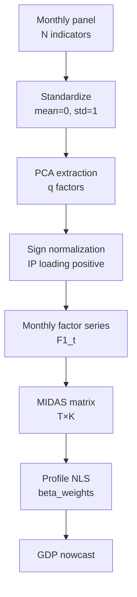
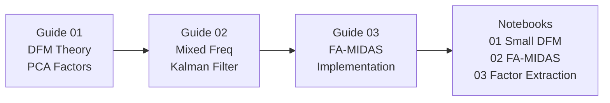

<!-- _class: lead -->

# Factor-Augmented MIDAS

## Combining Dimensionality Reduction with Mixed-Frequency Regression

**Mixed-Frequency Models: MIDAS Regression and Nowcasting**
Module 04 — Guide 03

<!-- Speaker notes: This guide brings together the DFM and MIDAS frameworks into the Factor-Augmented MIDAS (FA-MIDAS) model. The main steps: standardize indicators, extract PCA factor, normalize sign, build MIDAS matrix from factor series, run standard Beta MIDAS. The key implementation detail is sign normalization in the expanding window — without it, the factor can flip sign between steps and destroy the regression. The practical lesson: FA-MIDAS improves on single-indicator MIDAS when N >= 3 and the additional indicators genuinely share a common factor with the target variable. -->

---

## FA-MIDAS Pipeline



<!-- Speaker notes: The pipeline diagram shows the six steps from raw data to nowcast. The most error-prone step is sign normalization — students often forget this and end up with a factor series that flips sign mid-sample during the expanding window. A simple check: the IP loading should be positive (IP rises during expansions, factors capture business cycle). After normalization, the FA-MIDAS estimation is identical to standard Beta MIDAS — we've just replaced the raw IP series with the PCA-extracted factor series. Everything from Module 02 (HAC inference, F-test, bootstrap) applies unchanged. -->

---

## Step 1-2: Extract and Normalize

```python
# Step 1: Standardize panel
from sklearn.preprocessing import StandardScaler
from sklearn.decomposition import PCA

scaler = StandardScaler()
X_std = scaler.fit_transform(monthly_panel)  # (T_months, N)

# Step 2: Extract factor
pca = PCA(n_components=1)
F1 = pca.fit_transform(X_std)  # (T_months, 1)
lambda_hat = pca.components_.T  # (N, 1) loadings

# Step 3: Sign normalization (IP is column 0)
if lambda_hat[0, 0] < 0:
    F1 = -F1
    lambda_hat = -lambda_hat

# Factor is now a pd.Series with monthly index
factor = pd.Series(F1[:, 0], index=monthly_panel.index)
```

<!-- Speaker notes: The code shows the three-line core of FA-MIDAS factor extraction. StandardScaler handles the standardization. PCA() with n_components=1 extracts the first principal component. The sign normalization checks if the IP loading (column 0 in our panel) is positive — if not, we flip both the factor and the loadings. This ensures the factor consistently rises during expansions (positive IP growth) across all expanding-window iterations. Students should implement this sign check before running the expanding-window loop, not just once on the full sample. -->

---

## Step 3-4: Build MIDAS Matrix and Estimate

```python
# Build MIDAS matrix with factor as HF predictor
Y_gdp, X_factor = build_midas_matrix(gdp_growth, factor, K=12)

# Estimate FA-MIDAS (identical to standard MIDAS!)
est = estimate_midas(Y_gdp, X_factor)

print(f"FA-MIDAS: beta={est['beta']:.4f}, "
      f"theta=({est['theta1']:.3f}, {est['theta2']:.3f})")
print(f"Comparison: standard MIDAS beta ≈ 0.52, theta ≈ (1.4, 4.8)")
```

The factor loading $\hat{\beta}_{FA}$ has different units than $\hat{\beta}_{MIDAS}$:
- $\hat{\beta}_{MIDAS}$: GDP growth per % IP growth
- $\hat{\beta}_{FA}$: GDP growth per unit of standardized factor

<!-- Speaker notes: One important conceptual point: the FA-MIDAS beta coefficient has different units than the standard MIDAS beta. Standard MIDAS beta is interpreted as "a 1% increase in IP growth leads to a beta% increase in quarterly GDP growth." FA-MIDAS beta is "a 1 standard deviation increase in the business cycle factor leads to a beta% increase in quarterly GDP growth." The factor is dimensionless (standardized to unit variance), so the interpretation changes. You can recover an approximately interpretable scale by noting that the factor has a loading on IP of lambda_IP ≈ 0.7, so beta_FA * lambda_IP gives the GDP response per unit of IP-equivalent growth. -->

---

## Factor Loadings: Interpretation

```
Factor 1 loadings (Business Cycle Factor):

  IP growth:       +0.72  (strongest, most directly related to GDP)
  Payrolls:        +0.65  (employment leads cycle)
  S&P 500:         +0.48  (markets anticipate cycle)

Variance explained: 54%
```

**Sign convention:** IP loading is positive by normalization.

Negative loading → countercyclical (e.g., VIX, treasury spread).

<!-- Speaker notes: The loadings tell us how each indicator relates to the common factor. IP has the strongest loading (0.72) because it's most directly related to economic output. Payrolls is slightly lower (0.65) because employment is a lagging indicator — it rises after the economy turns up and falls after it turns down. The S&P 500 has a positive but lower loading (0.48) because equity markets are forward-looking — they anticipate the cycle rather than directly measuring current activity. In a richer panel with VIX and credit spreads, these would have negative loadings because they spike during recessions. -->

---

## Expanding-Window Protocol for FA-MIDAS

**Critical implementation details:**

1. **Re-extract factor** at each expanding-window step using only training data
2. **Normalize sign** at each step (not just once)
3. **Project test observation** onto training-period factor space (not re-extract)
4. **Build MIDAS matrix** with the training factor; predict using projected test factor

**Wrong approach:** Extract factor on full sample, then split for CV (look-ahead bias!)

<!-- Speaker notes: The expanding-window protocol for FA-MIDAS is more complex than for standard MIDAS because the factor extraction step must also be inside the loop. The most common mistake is to extract the factor on the full sample first, then use the full-sample factor in the expanding-window CV. This is look-ahead bias because the factor estimated on the full sample uses future data. The correct approach: at each step t, extract the factor using only months 1 to 3t (the training quarters' monthly data), then project the test observation (months 3t+1 to 3t+3) onto the training-period factor space. The projection is x_test @ lambda_hat, where lambda_hat is from the training-period PCA. -->

---

## RMSE Comparison: Three Models

```
Expanding-Window RMSE (T_eval = 70 quarters):

  AR(1) benchmark:     0.850
  MIDAS (IP only):     0.710  [-16.5% vs AR1]
  MIDAS (IP+Payrolls): 0.678  [-20.2% vs AR1]
  FA-MIDAS (q=1, N=3): 0.665  [-21.8% vs AR1]

Diminishing returns: each indicator adds less improvement.
```

*Actual values computed in Notebook 02.*

<!-- Speaker notes: The RMSE table shows the typical pattern of diminishing returns as we add more information. The first indicator (IP) gives the largest improvement (16.5%). Adding payrolls gives another 3.7%. The factor that summarizes all three indicators gives only an additional 1.6%. This diminishing returns pattern is robust across samples and countries — the first indicator does most of the work. The practical implication: if you only have time to implement one model, single-indicator MIDAS with IP is a good choice. FA-MIDAS provides incremental improvement that may be worth the implementation complexity for professional applications. -->

---

## When FA-MIDAS Beats Standard MIDAS

<div class="columns">

<div>

**FA-MIDAS wins when:**
- Additional indicators are genuinely correlated with GDP
- Single indicator is noisy
- N ≥ 3 diverse indicators
- Large T (factor estimation accurate)

</div>

<div>

**Standard MIDAS wins when:**
- Single dominant indicator
- Small N (factor poorly identified)
- Need interpretable weight function
- T small (factor estimation imprecise)

</div>

</div>

**Decision rule:** If adding 2nd indicator to MIDAS reduces RMSE by >3%, try FA-MIDAS.

<!-- Speaker notes: The decision rule provides a practical heuristic. If the second indicator reduces RMSE by more than 3%, there's meaningful common information that the factor approach can exploit. If the improvement is less than 3%, the indicators are largely providing the same information as IP (high correlation), and the factor will not add much. In our GDP-IP-Payrolls example, the improvement from adding payrolls is about 4.5%, so FA-MIDAS is worth trying. If you have access to a third indicator like retail sales, try adding it and see if the improvement continues. -->

---

## Module 04 Summary



**Key takeaways:**
1. PCA extracts common factor from N-indicator panel
2. Bai-Ng selects number of factors
3. FA-MIDAS = standard MIDAS with factor as predictor
4. Sign normalization essential in expanding window
5. Diminishing returns: first 2-3 indicators matter most

<!-- Speaker notes: The module summary diagram shows how the three guides build on each other: theory (Guide 01) → mixed-frequency extension (Guide 02) → implementation (Guide 03) → application in notebooks. The five key takeaways are the most practically important results. Students who remember these five points can implement FA-MIDAS correctly in new applications. The most commonly forgotten point is #4 (sign normalization) — without it, the expanding-window FA-MIDAS will have erratic performance as the factor flips sign. -->
