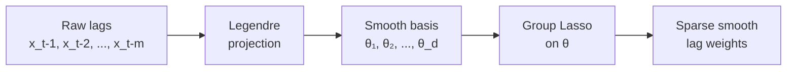
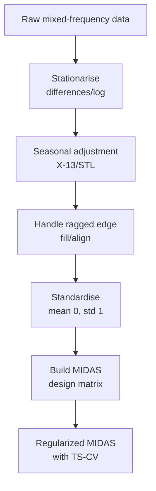
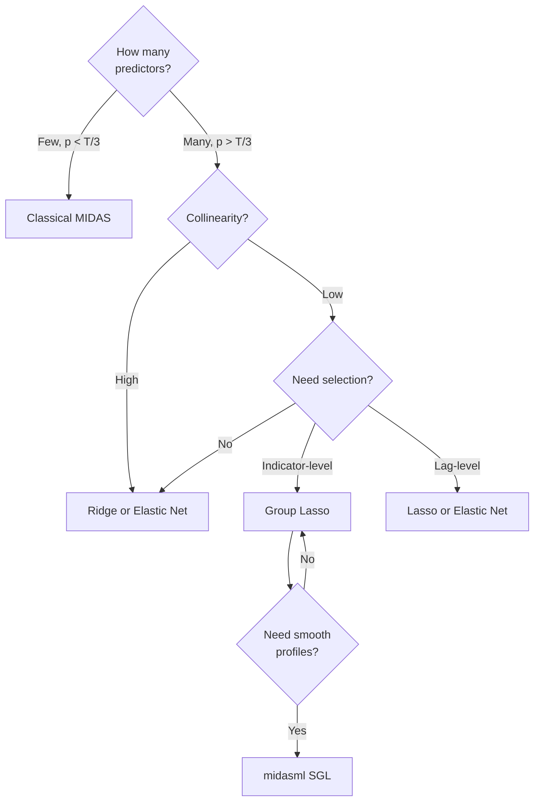

<!-- _class: lead -->

# Regularized MIDAS
## Lasso, Ridge, Elastic Net, and Group Lasso

Module 05 — Machine Learning Extensions

<!-- Speaker notes: Welcome to Module 05. We move from classical MIDAS to the high-dimensional setting where we have many predictors. Regularization solves the ill-posed estimation problem. Today covers four estimators: Ridge, Lasso, Elastic Net, and Group Lasso. -->

---

## The High-Dimensional MIDAS Problem

When we have **many mixed-frequency predictors**, classical MIDAS breaks down:

- K indicators × m high-freq lags each = **K×m regressors**
- Example: 30 monthly series × 12 quarterly lags = **360 regressors**
- Often $p > T$ — OLS is undefined

**Solution: Penalized regression**

$$\hat{\beta} = \arg\min_\beta \left\{ \frac{1}{T}\|y - X\beta\|_2^2 + \text{Penalty}(\beta, \lambda) \right\}$$

<!-- Speaker notes: The core problem is dimensionality. A rich data environment is exactly what forecasters want, but it breaks OLS. The penalty term regularises the solution. Lambda controls the strength. Larger lambda means more shrinkage. -->

---

## Ridge-MIDAS: $\ell_2$ Penalty

$$\hat{\beta}^{\text{Ridge}} = \arg\min_\beta \left\{ \frac{1}{T}\|y - X\beta\|_2^2 + \lambda \|\beta\|_2^2 \right\}$$

**Closed-form solution:** $\hat{\beta} = (X^\top X + \lambda I)^{-1} X^\top y$

<div class="columns">

**Strengths**
- Handles multicollinearity
- Computationally fast
- Stable coefficient estimates

**Limitations**
- Never sets coefficients to zero
- No variable selection
- All predictors always "in"

</div>

<!-- Speaker notes: Ridge adds a squared penalty on coefficients. The solution regularises the eigenvalues of X'X, stabilising estimates when predictors are collinear. Adjacent high-frequency lags are highly correlated, so Ridge is well-suited. The key limitation is no sparsity. -->

---

## Geometric Intuition: Ridge vs Lasso

<div class="columns">

**Ridge constraint: Circle**

$$\|\beta\|_2^2 \leq t$$

OLS contours (ellipses) meet the circle on the edge — coefficients shrink but are **never exactly zero**

**Lasso constraint: Diamond**

$$\|\beta\|_1 \leq t$$

OLS contours meet the diamond at **corners** — one or more coefficients are set **exactly to zero**

</div>

The corner geometry of the $\ell_1$ ball is the key to Lasso's sparsity property.

<!-- Speaker notes: This geometric picture is fundamental. The Ridge ball is smooth — ellipses touch it anywhere. The Lasso diamond has corners at the axes. Ellipses generically hit corners, setting the corresponding coefficient to zero. This is why Lasso does variable selection and Ridge does not. -->

---

## Lasso-MIDAS: $\ell_1$ Penalty

$$\hat{\beta}^{\text{Lasso}} = \arg\min_\beta \left\{ \frac{1}{T}\|y - X\beta\|_2^2 + \lambda \|\beta\|_1 \right\}$$

**Key properties:**
- Performs **simultaneous estimation and selection**
- Solution via coordinate descent (soft thresholding)
- As $\lambda$ increases: more coefficients → zero

$$\mathcal{S}_\lambda(z) = \text{sign}(z)(|z| - \lambda)_+ \quad \text{(soft threshold operator)}$$

In MIDAS: Lasso can select **specific high-frequency lags** while zeroing others.

<!-- Speaker notes: Lasso is more powerful than Ridge for variable selection. The soft-thresholding update has a beautiful form: subtract lambda from the absolute value, threshold at zero. In MIDAS this means we can find that, say, only lags 1-3 of industrial production matter for GDP, with lags 4-12 zeroed out. -->

---

## Lasso Regularization Path

```
Coefficients

^
|   β₁ ─────────╲
|   β₂ ────────────╲___
|   β₃ ──────────────────╲
|   β₄ ──╲_________________
|   β₅ ───────────────────── (never selected)
|_________________________________> log(λ)
  0                          ∞
  (full model)         (null model)
```

Path is computed efficiently for all $\lambda$ values simultaneously.
**Select $\lambda$ via time-series cross-validation** (expanding window, not $k$-fold).

<!-- Speaker notes: The regularization path shows how each coefficient evolves as we increase lambda from 0 (OLS) to infinity (null model). Coefficients enter and exit the model at different lambda values. We read off the CV-optimal lambda and use those coefficients. Always use time-series CV, never random k-fold. -->

---

## Elastic Net MIDAS

Combines Ridge and Lasso via mixing parameter $\alpha_\text{mix} \in [0,1]$:

$$\hat{\beta}^{\text{EN}} = \arg\min_\beta \left\{ \frac{1}{T}\|y-X\beta\|_2^2 + \lambda\left[\alpha_\text{mix}\|\beta\|_1 + \frac{(1-\alpha_\text{mix})}{2}\|\beta\|_2^2\right] \right\}$$

| $\alpha_\text{mix}$ | Estimator |
|---------------------|-----------|
| 1.0 | Pure Lasso |
| 0.5 | Elastic Net |
| 0.0 | Pure Ridge |

**Advantage in MIDAS**: Adjacent lags are correlated — Elastic Net **groups** correlated lags together rather than selecting one arbitrarily.

<!-- Speaker notes: Elastic Net inherits the best of both worlds. When predictors are correlated, pure Lasso has the "arbitrariness" problem: it picks one of several equivalent predictors randomly. Elastic Net uses the Ridge component to keep groups of correlated predictors together or drop them together. For MIDAS, adjacent lags at similar time distances behave similarly. -->

---

## Group Lasso for MIDAS

**Natural group structure**: all $m$ lags of indicator $k$ form group $g_k$

$$\hat{\beta}^{\text{GL}} = \arg\min_\beta \left\{ \frac{1}{T}\|y-X\beta\|_2^2 + \lambda\sum_{g}\sqrt{|g|}\|\beta_g\|_2 \right\}$$

The $\ell_2$ norm within each group → group is either **fully zero** or **all nonzero**

<div class="columns">

**Lasso selection**
- Lag-level sparsity
- May select lag 1, 4, 7 of one series
- Irregular lag profiles

**Group Lasso selection**
- Indicator-level sparsity
- Selects/drops entire series
- Economically interpretable

</div>

<!-- Speaker notes: Group Lasso is the most natural regulariser for MIDAS. We decide which indicators to include, not which individual lags. If industrial production matters, we include all its lags. If not, we drop it entirely. The sqrt(|g|) normalisation ensures fair comparison across group sizes. -->

---

## Sparse Group Lasso

Combines indicator-level and lag-level sparsity:

$$\hat{\beta}^{\text{SGL}} = \arg\min_\beta \left\{\frac{1}{T}\|y-X\beta\|_2^2 + \lambda\left[(1-\alpha)\sum_g\sqrt{|g|}\|\beta_g\|_2 + \alpha\|\beta\|_1\right]\right\}$$

This allows:
- **Group sparsity**: drop entire indicators (Group Lasso term)
- **Within-group sparsity**: zero out specific lags (Lasso term)
- **Smooth lag profiles** (with Legendre basis projection, as in `midasml`)

The `midasml` package implements this with Legendre polynomial basis projection.

<!-- Speaker notes: The midasml package by Babii, Ghysels, and Striaukas combines the economic intuition of MIDAS (smooth lag profiles) with modern regularization (group sparsity). The Legendre basis projects lag coefficients onto orthogonal polynomials before applying the penalty, automatically enforcing smoothness. -->

---

## The midasml Approach

**Key innovation**: Project onto Legendre polynomial basis before penalizing

$$\beta_g = B_g \theta_g, \quad B_g \in \mathbb{R}^{m \times d}$$

where $B_g$ contains Legendre polynomial evaluations at lag points.

```
Standard Lasso:  penalize individual β_j (choppy profiles)
midasml:         penalize θ_g (Legendre coefficients → smooth profiles)
```



<!-- Speaker notes: The Legendre projection is the secret sauce of midasml. Instead of penalizing raw lag coefficients (which can produce jagged, non-monotone profiles), we first project onto a smooth polynomial basis. The Lasso then selects at the polynomial coefficient level, automatically producing smooth lag profiles for selected indicators. -->

---

## Comparing Estimators in Practice

| Estimator | Selection | Collinearity | Smooth Profiles | Speed |
|-----------|-----------|--------------|-----------------|-------|
| Ridge | None | Excellent | Yes | Fast |
| Lasso | Lag-level | Poor | No | Fast |
| Elastic Net | Lag-level | Good | Partial | Fast |
| Group Lasso | Indicator | Good | No | Medium |
| SGL/midasml | Both | Good | Yes | Slow |

**Practical recommendation**: Start with Elastic Net (fast, robust), then try Group Lasso if indicator-level interpretability matters.

<!-- Speaker notes: In practice, Elastic Net with time-series CV is a good default. It's fast, robust, and handles correlated predictors. If you need to know "which indicators matter" rather than "which lags matter," Group Lasso is the right tool. midasml is ideal for research-quality nowcasting where smooth lag profiles are a theoretical requirement. -->

---

## Time-Series Cross-Validation

**Critical**: Never use random $k$-fold CV with time series

```python
from sklearn.model_selection import TimeSeriesSplit

# Expanding window: train grows, test is always future
tscv = TimeSeriesSplit(n_splits=5, gap=1)

# Correct: train on past, validate on future
for train_idx, val_idx in tscv.split(X):
    X_tr, X_val = X[train_idx], X[val_idx]
    # ... fit and evaluate
```

**Gap parameter**: skip observations to avoid look-ahead bias when $h > 1$.

<!-- Speaker notes: Time-series CV is non-negotiable. Random k-fold allows future data to appear in training, which inflates performance estimates dramatically. The TimeSeriesSplit class implements expanding window CV. The gap parameter is important when forecasting h>1 steps ahead: skip h observations between train and val to mimic real-time conditions. -->

---

## Practical Pre-Processing Pipeline



**Key rule**: Always standardise before regularization — penalty treats all predictors equally.

<!-- Speaker notes: Pre-processing matters as much as model choice. Lasso and Ridge are not scale-invariant: a predictor measured in millions will have a tiny coefficient and be effectively never selected unless we standardise first. The pipeline here is the correct order: stationarise, seasonally adjust, handle ragged edges, then standardise. -->

---

## Selecting the Right Estimator



<!-- Speaker notes: Use this decision tree when choosing a regularizer. The most common path is: many predictors, some collinearity, want indicator-level selection → Group Lasso. In research settings, midasml adds the smooth profile constraint that is theoretically motivated by the MIDAS framework. -->

---

## Key Takeaways

1. **Regularization is necessary** when $p$ is large relative to $T$ in MIDAS
2. **Ridge** handles collinearity but gives no selection — use for pure shrinkage
3. **Lasso** performs variable selection but struggles with correlated lags
4. **Elastic Net** is the robust default — combines Ridge and Lasso benefits
5. **Group Lasso** provides economically natural indicator-level selection
6. **midasml** combines smooth lag profiles with group sparsity
7. **Always use time-series CV** (expanding window) for tuning $\lambda$

Next: [Machine Learning Nowcasting](02_ml_nowcasting_slides.md) — tree-based methods

<!-- Speaker notes: Summarize the five key regularizers and their properties. The practical takeaway is: Elastic Net is a safe default, Group Lasso is preferred when interpretability matters. The next guide extends to fully nonlinear ML methods: random forests and gradient boosting. -->

---

<!-- _class: lead -->

## Module 05 — Exercise

Fit Lasso-MIDAS, Ridge-MIDAS, and Elastic Net MIDAS on a dataset of your choice.

Compare:
- Number of selected predictors
- Out-of-sample RMSE (expanding window)
- Coefficient profiles across lags

**Notebook**: `01_lasso_midas.ipynb`

<!-- Speaker notes: The exercise reinforces the conceptual comparison with hands-on code. Students should see that the three methods produce quite different sparsity patterns and compare their forecasting performance. The notebook provides scaffolding. -->
