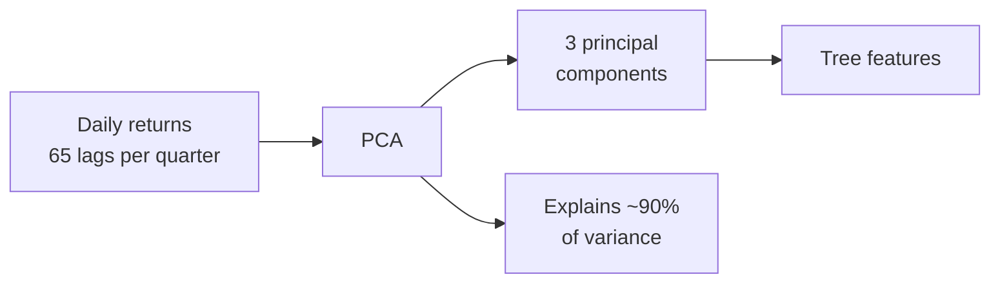
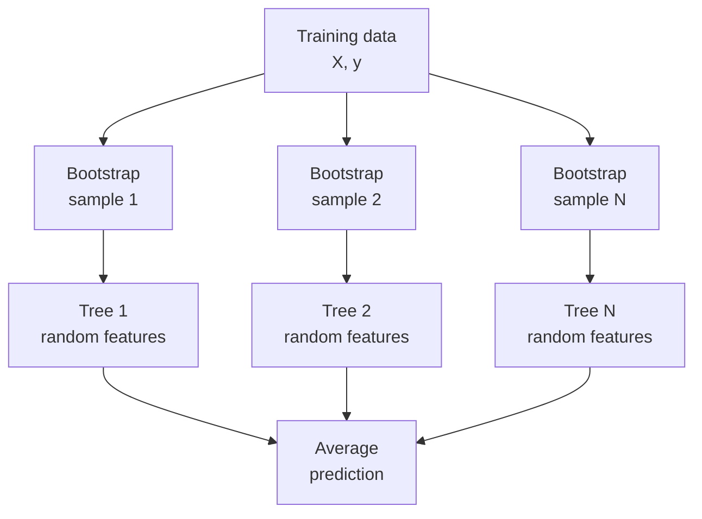
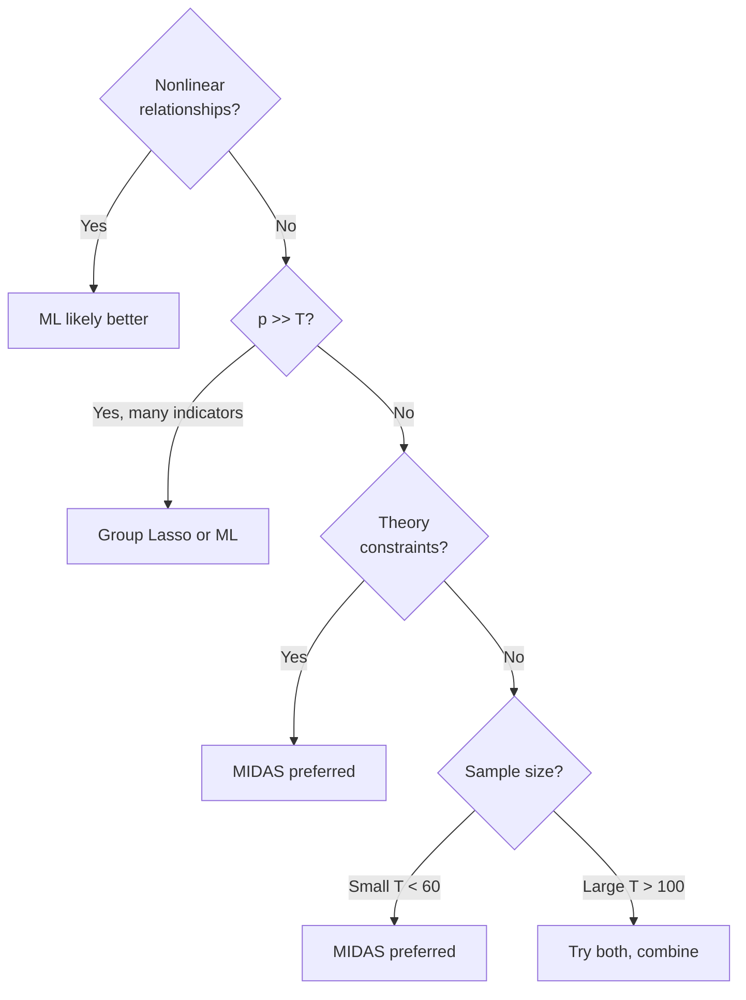

<!-- _class: lead -->

# Machine Learning Nowcasting
## Random Forests and Gradient Boosting with Mixed-Frequency Data

Module 05 — Machine Learning Extensions

<!-- Speaker notes: This guide covers the application of tree-based ML methods to nowcasting. The central challenge is feature engineering: how do we represent mixed-frequency lag windows so that a decision tree can use them effectively? We will cover random forests, XGBoost, LightGBM, and SHAP-based interpretation. -->

---

## Why ML for Nowcasting?

Linear MIDAS assumes: $y_t = \alpha + \sum_{k,j} \beta_{k,j} x_{k,t-j/m} + \varepsilon_t$

But macroeconomic relationships are often **nonlinear**:

- Labour market deterioration during recessions ≠ recovery dynamics
- PMI below 50 has qualitatively different meaning than PMI above 50
- Financial stress regimes amplify macro signals non-proportionally

**Tree-based methods capture these patterns without specification:**
- No predetermined functional form
- Automatic interaction detection
- Robust to outliers and structural breaks

<!-- Speaker notes: The linear MIDAS model is powerful but constrained. The real economy exhibits threshold effects, asymmetries, and interactions that linear models miss. Decision trees naturally detect these: a split at PMI=50 captures the recession threshold without anyone specifying it. The cost is interpretability and potential overfitting, which we manage with ensembles and regularisation. -->

---

## The Feature Engineering Problem

Mixed-frequency data structure:

```
Quarter Q:  [y_Q]
Month M1:   [x_M1]
Month M2:   [x_M2]  ← What does a tree do with this?
Month M3:   [x_M3]
```

**Core problem**: A decision tree expects one feature vector per observation. We need to flatten the temporal structure into that vector.

Three approaches:
1. **Flat stacking** — each lag is a separate feature
2. **Statistical summaries** — aggregate to summary statistics
3. **Temporal embeddings** — PCA / neural compression

<!-- Speaker notes: This is the fundamental challenge. MIDAS regression naturally handles the temporal structure via the weight function. Trees don't have that — they need a flat feature vector. The three approaches differ in complexity and information retention. Let's examine each. -->

---

## Approach 1: Flat Stacking

For each indicator $k$ with $m$ lags, create $m$ features: $x_{k,t-1}, x_{k,t-2}, \ldots, x_{k,t-m}$

<div class="columns">

**Pros**
- Preserves all lag information
- Tree can find optimal lag cutoffs
- No information loss

**Cons**
- Many features: K × m (20 series × 12 lags = 240)
- Highly correlated adjacent features
- Interpretability suffers

</div>

**Best for**: Small K, short m, enough data relative to p.

<!-- Speaker notes: Flat stacking is the conceptually simplest approach. For 20 monthly indicators with 12 lags each, you get 240 features. This is manageable for gradient boosting with regularization, but may overfit with random forests on small samples. The key advantage: the tree can detect exactly which lag matters — lag 2 but not lag 1, for example. -->

---

## Approach 2: Statistical Summary Features

Reduce each lag window to economically meaningful statistics:

$$\text{Window} = [x_{k,t-1}, \ldots, x_{k,t-m}] \rightarrow \{{\mu, \sigma, \text{last}, \text{first}, \text{momentum}, \text{trend}, \ldots}\}$$

```python
features = {
    'mean':         window.mean(),
    'std':          window.std(),
    'last':         window[-1],          # Most recent
    'momentum':     window[-1] - window[0],  # Net change
    'acceleration': np.diff(window).mean(),  # Avg velocity
    'trend':        np.polyfit(range(m), window, 1)[0]
}
```

**Result**: 10 features per indicator instead of 12 — interpretable, robust.

<!-- Speaker notes: Statistical summaries are a middle ground. Instead of all 12 lags, we compute 10 statistics that capture the level, dispersion, direction, and rate of change of the indicator over the lag window. These are economically meaningful: "momentum" is the net change, "acceleration" is whether the change is speeding up. This approach reduces dimensionality while keeping interpretability. -->

---

## Approach 3: PCA Embeddings

For daily data (e.g., 65 trading days per quarter), compress via PCA:



- First PC: **average level** of daily returns
- Second PC: **trend** (start vs end of quarter)
- Third PC: **volatility** clustering within quarter

**Rule of thumb**: $d$ components explaining ≥ 90% variance.

<!-- Speaker notes: For daily data, flat stacking gives 65 features per series just for one quarter — that's 1,300 features for 20 series. PCA compresses this dramatically. The first few principal components usually have clear economic interpretations: average level, trend within period, volatility clustering. Three components typically capture 90% of variance in financial daily series. -->

---

## Random Forest Nowcasting



Two sources of randomness: **row** (bootstrap) and **column** (feature) sampling.

<!-- Speaker notes: Random forests build N trees on bootstrap samples. Each tree uses a random subset of features at each split, decorrelating the trees. The final forecast is the average over all trees, which dramatically reduces variance relative to any single tree. The min_samples_leaf parameter is critical for nowcasting: set it to 3-5 to prevent over-splitting on small economic samples. -->

---

## Key Random Forest Hyperparameters

| Parameter | Role | Recommended |
|-----------|------|-------------|
| `n_estimators` | Number of trees | 200–500 |
| `max_features` | Features per split | `'sqrt'` (classification) or `0.3` |
| `min_samples_leaf` | Min leaf size | 3–5 for macro data |
| `max_depth` | Tree depth | None (unlimited) |
| `n_jobs` | Parallelism | -1 (all cores) |

**Key insight**: More trees is almost always better — more is never harmful, just slower.

<!-- Speaker notes: The most important hyperparameter is min_samples_leaf. Macro datasets often have T=80-120 observations. Setting min_samples_leaf=1 allows leaves with single observations, causing massive overfitting. With min_samples_leaf=3-5, each leaf must represent at least a few quarters of data, preventing memorisation. max_features='sqrt' is standard. -->

---

## XGBoost for Nowcasting

XGBoost adds trees sequentially to correct residuals:

$$\hat{y}^{(k)} = \hat{y}^{(k-1)} + \eta \cdot f_k(X)$$

where $\eta$ is the learning rate and $f_k$ fits residuals of the current ensemble.

**Key regularization parameters:**

| Parameter | Effect |
|-----------|--------|
| `learning_rate` | Shrinks each tree (smaller = better generalisation) |
| `max_depth` | Shallow trees prevent overfit (3–6) |
| `subsample` | Row subsampling per tree (0.7–0.9) |
| `colsample_bytree` | Feature subsampling per tree (0.7–0.9) |
| `reg_alpha` | L1 on leaf weights |
| `reg_lambda` | L2 on leaf weights |

<!-- Speaker notes: XGBoost's sequential nature means it can achieve lower bias than random forests by focusing each new tree on the current errors. The regularization parameters are critical. For macro nowcasting with T=100, use max_depth=3 or 4, learning_rate=0.05, and subsample=0.8. Always use early stopping against a validation set. -->

---

## Early Stopping in Expanding Window

```python
# Expanding window with early stopping
for t in range(min_train, T):
    X_tr, y_tr = X[:t], y[:t]

    # Use last 20% of training as internal validation
    val_size = max(5, int(t * 0.2))
    X_fit = X_tr[:-val_size]
    X_val = X_tr[-val_size:]

    model = xgb.XGBRegressor(
        n_estimators=1000,
        learning_rate=0.05,
        early_stopping_rounds=50
    )
    model.fit(X_fit, y_fit,
              eval_set=[(X_val, y_val)])

    forecasts[t] = model.predict(X[t:t+1])[0]
```

**Critical**: validation data must be **after** training data (no shuffling).

<!-- Speaker notes: Early stopping prevents overfitting by monitoring validation loss during training and stopping when it stops improving. In an expanding window, we use the most recent 20% of the available training data as validation. This is temporally correct: we never use future data. The 50-round patience means we stop if no improvement in 50 consecutive trees. -->

---

## SHAP Values: Interpreting ML Nowcasts

**Problem**: A tree ensemble with 200 trees and 240 features is a black box.

**Solution**: SHAP (SHapley Additive exPlanations)

$$\hat{y} = \phi_0 + \sum_{j=1}^{p} \phi_j$$

where $\phi_j$ is indicator $j$'s contribution to this specific forecast.

<div class="columns">

**Global interpretation**
- Feature importance (mean |SHAP|)
- Which indicators matter most overall?

**Local interpretation**
- Waterfall plot for single forecast
- Why did Q3 2023 forecast differ from baseline?

</div>

<!-- Speaker notes: SHAP provides both global and local interpretability. Global: rank all features by average absolute SHAP value across all forecasts. Local: for a specific quarter, show each feature's contribution as a waterfall. This is enormously useful for communicating results to non-technical audiences: "Our nowcast was revised up because initial jobless claims fell and ISM Manufacturing rose." -->

---

## SHAP Waterfall Example

```
Base forecast: 2.1% GDP growth

+ ISM Manufacturing (lag1): +0.4%  ─────────────────▶
+ Nonfarm Payrolls (lag1): +0.3%  ──────────────▶
+ Initial Claims (lag2): -0.2%    ◀──────────
+ Retail Sales (mean):   +0.1%    ────▶
+ PMI Services (last):   -0.1%    ◀───
+ [15 others]:           +0.0%    (≈ 0)
─────────────────────────────────────────
= Nowcast: 2.6% GDP growth
```

This directly answers: **"What is driving this quarter's forecast?"**

<!-- Speaker notes: The waterfall plot decomposes the forecast into contributions from each feature. The base value is the average forecast over the training period. Each bar shows how much each feature moves the prediction up or down. In this example, ISM Manufacturing and Payrolls are pushing the forecast above baseline, while initial claims are pulling it down slightly. The remaining features are approximately neutral. This is communicable to a central bank audience. -->

---

## Fair Comparison: ML vs MIDAS

Both methods must use identical:
1. Data vintage (same ragged-edge information)
2. Training window (same start/end)
3. Evaluation metric (RMSFE)

**Diebold-Mariano test** for statistical significance:

$$DM = \frac{\bar{d}}{\sqrt{\hat{V}(\bar{d})/T}} \sim t_{T-1}$$

where $d_t = L(e_{1t}) - L(e_{2t})$ is the loss differential and $\hat{V}$ uses Newey-West HAC standard errors.

<!-- Speaker notes: A fair comparison is critical for honest evaluation. The most common mistake is giving ML methods more recent data than MIDAS (because the nowcasting design matrix handling is easier). Both models must face identical information at each forecast origin. The DM test tells us whether the RMSE difference is statistically significant or could be sampling variation. -->

---

## When ML Beats MIDAS



**Practical rule**: Combine ML and MIDAS forecasts — this almost always outperforms either alone.

<!-- Speaker notes: This decision tree summarises when to prefer ML vs MIDAS. The key factors are: nonlinearity (ML wins), many predictors (ML/regularized MIDAS), theory constraints (MIDAS wins), small sample (MIDAS wins). In practice, the safest strategy is to combine both forecasts. The combination puzzle in forecasting literature says equal-weight combinations are hard to beat even with sophisticated weighting schemes. -->

---

## Forecast Combination

```python
# Simple average (often the best combination)
combined = (midas_forecasts + xgb_forecasts) / 2

# OLS-optimal weights (Bates-Granger 1969)
# Constrained: weights ≥ 0, sum to 1
# Estimated on first half, applied to second half
weights = optimal_weights(midas, xgb, actuals_train)
combined = weights[0] * midas + weights[1] * xgb
```

Evidence from forecasting literature:
- Simple average beats individual models 60–70% of the time
- Optimal weights are noisy — prefer simple average with few models
- Trimmed mean (exclude worst model) is robust to outlier models

<!-- Speaker notes: Forecast combination is one of the most robust findings in the forecasting literature. The intuition is diversification: individual models have different biases and error patterns. An average cancels many of these out. The Bates-Granger optimal weights are theoretically superior but estimated with noise; simple average often wins empirically. -->

---

## Key Takeaways

1. **Feature engineering is the key challenge** for ML nowcasting — choose flat stacking, summaries, or PCA based on data size
2. **Random forests** are robust, low-maintenance defaults with high feature count
3. **XGBoost/LightGBM** achieve higher accuracy but require careful regularization and early stopping
4. **SHAP values** make ML forecasts interpretable and communicable
5. **Expanding-window evaluation** is mandatory for valid forecast comparison
6. **Diebold-Mariano test** provides statistical significance for RMSE differences
7. **Combination forecasts** almost always outperform individual models

Next: [XGBoost vs MIDAS Notebook](../notebooks/02_xgboost_vs_midas.ipynb)

<!-- Speaker notes: Key messages: feature engineering is the critical skill; tree methods are powerful but need proper time-series evaluation; SHAP makes black boxes interpretable; combination forecasts are the robust default strategy. The notebook provides a complete hands-on comparison of XGBoost and MIDAS on real macro data. -->

---

<!-- _class: lead -->

## Module 05 — Self Check

Compare Random Forest and XGBoost nowcasts on a macro dataset.

Questions to answer:
1. Which method has lower RMSE? Is the difference DM-significant?
2. What are the top-5 SHAP features for RF?
3. Does combining the forecasts improve on either?

**Exercise**: `01_ml_extensions_self_check.py`

<!-- Speaker notes: The self-check reinforces the comparison framework. Students should run the expanding-window evaluation, compute DM statistics, extract SHAP values, and try the combination. The exercise file provides the data loading and evaluation scaffolding; students implement the model training and comparison. -->
