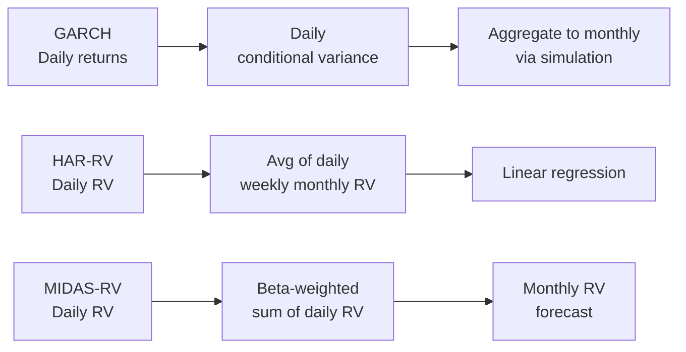

<!-- _class: lead -->

# MIDAS-RV
## Realised Volatility Forecasting with Mixed-Frequency Data

Module 06 — Financial Applications

<!-- Speaker notes: Welcome to Module 06. We now apply MIDAS to financial markets, starting with the canonical application: forecasting realised volatility. The MIDAS-RV model by Ghysels, Santa-Clara, and Valkanov (2005) is one of the most cited papers in financial econometrics. It directly motivated the broader use of mixed-frequency regression in empirical finance. -->

---

## Why Volatility Matters

Volatility $\sigma_t$ is the central input to:

- **Option pricing**: Black-Scholes $C = f(\sigma)$
- **Portfolio optimisation**: Markowitz $\min w^\top \Sigma w$
- **Value-at-Risk**: $\text{VaR} = z_\alpha \cdot \sigma_t \cdot \sqrt{h}$
- **Risk-weighted capital**: Basel III requires forward-looking volatility estimates

**The forecasting problem**: Predict monthly or quarterly volatility using daily information.

This is a **naturally mixed-frequency problem** — MIDAS is the ideal framework.

<!-- Speaker notes: Volatility is unobservable, persistent, and regime-dependent. It's the most important quantity in quantitative finance after the price itself. The natural data structure for volatility forecasting is mixed-frequency: we want a monthly or quarterly forecast, but daily observations of realised volatility are available and highly informative. MIDAS exploits this directly. -->

---

## Realised Volatility as a Proxy

For day $d$ with $n$ intraday returns $r_{d,i}$:

$$RV_d = \sum_{i=1}^{n} r_{d,i}^2$$

**Andersen-Bollerslev theory**: As sampling frequency increases,

$$RV_d \xrightarrow{p} \int_{d-1}^{d} \sigma^2(t) \, dt \quad \text{(integrated variance)}$$

**Monthly RV**: $RV^{(m)}_t = \sum_{d \in \text{month}_t} RV_d$ — sum of daily RV over the month.

MIDAS-RV uses $RV^{(m)}_t$ as the **target** and individual $RV^{(d)}_j$ as **high-frequency predictors**.

<!-- Speaker notes: Realised variance provides a model-free, non-parametric proxy for latent variance. The Andersen-Bollerslev result is fundamental: as we sample more finely (5-min, 1-min, tick), RV converges to the true integrated variance. In practice, 5-minute returns provide a good balance of accuracy and microstructure noise. Monthly RV is the target; the 22 daily RV values within the month are the predictors. -->

---

## The MIDAS-RV Model

$$\log RV^{(m)}_{t+1} = \mu + \phi \sum_{j=0}^{K-1} B(j;\theta_1,\theta_2) \cdot \log RV^{(d)}_{t-j} + \varepsilon_{t+1}$$

where $B(j;\theta_1,\theta_2)$ are Beta polynomial weights summing to 1.

**Three key design choices:**
1. **Log transformation**: $\log RV$ is more normally distributed than $RV$
2. **Beta weights**: 2 parameters replace $K$ unconstrained lag coefficients
3. **K = 22**: One month of daily lags (approx 22 trading days)

<!-- Speaker notes: The log specification is important. RV has a strongly right-skewed distribution. Log-RV is approximately normal, which validates inference. The Beta weights with K=22 daily lags means we estimate just 4 parameters (mu, phi, theta1, theta2) instead of 24 unconstrained lag coefficients. This is the parsimony advantage of MIDAS over U-MIDAS. -->

---

## Beta Weighting Patterns

$$B(j;\theta_1,\theta_2) = \frac{(j/K)^{\theta_1-1}(1-j/K)^{\theta_2-1}}{\sum_k (\ldots)}$$

<div class="columns">

**Shape guide:**

| θ₁, θ₂ | Pattern |
|---------|---------|
| 1, 5 | Geometric decay |
| 1, 1 | Uniform (flat) |
| 2, 5 | Hump-shaped |
| 5, 1 | Reverse decay |

**Empirical finding:**

For equity RV, estimated parameters are typically near $\theta_1 \approx 1, \theta_2 \approx 5$, implying geometric-like decay where most recent daily RV has the highest weight.

</div>

<!-- Speaker notes: The Beta distribution's flexibility is key. With just two parameters, we can represent geometric decay (exponential down-weighting of older observations), uniform weighting (all lags equal), hump-shaped (some intermediate lag matters most), or reverse decay. Empirically for equity markets, θ1≈1 and θ2≈5 captures the rapid decay of predictive information from older daily returns. -->

---

## MIDAS-RV vs GARCH vs HAR-RV



**MIDAS-RV advantage**: Uses daily RV directly without aggregation or simulation. Optimal weights estimated from data.

<!-- Speaker notes: Three main approaches to volatility forecasting. GARCH works at daily frequency and requires simulation to get multi-period forecasts. HAR-RV uses fixed averages (daily, weekly, monthly) as predictors. MIDAS-RV is more flexible: the Beta weights are estimated from data, finding the optimal lag weighting. The direct connection from daily RV to monthly RV without intermediate steps is clean and interpretable. -->

---

## HAR-RV: The Standard Benchmark

$$RV^{(d)}_{t+1} = c + \beta^{(d)} RV^{(d)}_t + \beta^{(w)} \overline{RV}^{(5)}_t + \beta^{(m)} \overline{RV}^{(22)}_t + \varepsilon_{t+1}$$

<div class="columns">

**HAR-RV**
- Simple OLS
- Fixed lag structure
- 3 predictors
- Interpretable
- Works at daily frequency

**MIDAS-RV**
- NLS
- Estimated lag weights
- One predictor (K=22)
- Flexible lag profile
- Works across frequencies

</div>

HAR-RV is harder to beat than it looks — the multi-scale averaging captures long-memory in RV efficiently.

<!-- Speaker notes: HAR-RV is Corsi (2009), one of the most cited empirical finance papers ever. Its trick is using three moving averages (daily, weekly, monthly) to capture the heterogeneous agents in the market: day traders (daily), institutional investors (weekly), fund managers (monthly). The simplicity and effectiveness of HAR-RV makes it a tough benchmark. MIDAS-RV with flexible weights can outperform it, but not always dramatically. -->

---

## NLS Estimation Procedure

```python
from scipy.optimize import minimize

def midas_rv_loss(params, rv_daily, rv_monthly, K=22):
    mu, phi, theta1, theta2 = params
    if theta1 <= 0 or theta2 <= 0:
        return 1e10

    weights = beta_weights(K, theta1, theta2)
    rv_d = np.log(rv_daily + 1e-10)
    rv_m = np.log(rv_monthly + 1e-10)

    T = len(rv_monthly)
    sse = 0.0
    for t in range(T):
        lags = rv_d[t*K:(t+1)*K][::-1]  # Most recent first
        fitted = mu + phi * (weights @ lags)
        sse += (rv_m[t] - fitted)**2
    return sse

result = minimize(midas_rv_loss, [0, 0.5, 1.0, 5.0],
                  args=(rv_d, rv_m, K),
                  method='L-BFGS-B',
                  bounds=[(None,None), (0,2), (0.01,20), (0.01,20)])
```

**Important**: Multiple starts recommended — the NLS objective may have local minima.

<!-- Speaker notes: NLS estimation for MIDAS-RV is straightforward but has a non-convex objective. L-BFGS-B with box constraints is the standard approach. The bounds prevent theta1 and theta2 from going negative (which would be undefined for Beta distribution). The log transformation inside the objective makes the errors more homoscedastic, improving NLS efficiency. Use multiple starting values (at least 5-10) to avoid local minima. -->

---

## Volatility Forecast Evaluation

**Problem**: We never observe "true" volatility $\sigma^2_t$. Only a proxy $RV_t = \sigma^2_t + \text{noise}$.

**MSE** (symmetric): $\frac{1}{T}\sum_t (RV_t - \hat{RV}_t)^2$

**QLIKE** (asymmetric, loss ∝ under-prediction):

$$QLIKE = \frac{1}{T}\sum_t\left(\frac{RV_t}{\hat{RV}_t} - \log\frac{RV_t}{\hat{RV}_t} - 1\right) \geq 0$$

**Key result** (Patton 2011): Under squared error or QLIKE, rankings using noisy proxy $RV_t$ are consistent with rankings using true $\sigma^2_t$. QLIKE is more robust.

<!-- Speaker notes: Volatility forecast evaluation has a subtlety: we evaluate against a proxy (RV), not the true latent variance. Patton's seminal result shows that under squared error or QLIKE loss, using the proxy gives the same ranking as the unobservable true variance. This is called "proxy robustness" — the ranking is consistent even though we can't observe the true target. For practical applications, prefer QLIKE because it penalises under-prediction more, which matters for risk management. -->

---

## Mincer-Zarnowitz Efficiency Test

$$RV_{t+1} = a + b \cdot \hat{RV}_{t+1} + \varepsilon$$

**Efficient forecast**: $H_0: a=0, b=1$ — forecast is unbiased and fully informative.

| Result | Interpretation |
|--------|----------------|
| $a \neq 0$ | Systematic bias (over- or under-prediction) |
| $b < 1$ | Over-fitted / too extreme forecasts |
| $b > 1$ | Under-reactive forecast (too conservative) |
| $b = 0$ | Forecast has no information about future RV |

<!-- Speaker notes: The Mincer-Zarnowitz regression is a classical test of forecast rationality. If a=0 and b=1, the forecast fully captures all available information without systematic bias. b<1 (e.g., 0.7) means the forecast is "too extreme" — high volatility episodes are forecast too high and low periods too low. This often indicates overfitting. b>1 means the model is too conservative — it under-reacts to current information. -->

---

## MIDAS-RV-X: Adding Macro Predictors

When macro-financial conditions matter (crisis periods, tightening cycles):

$$\log RV^{(m)}_{t+1} = \mu + \phi \sum_{j} B_1(j) \log RV^{(d)}_{t-j} + \psi \sum_{l} B_2(l) Z^{(m)}_{t-l} + \varepsilon_{t+1}$$

where $Z^{(m)}$ is a monthly predictor:
- **Default spread** (BAA - AAA yield): captures credit risk regime
- **TED spread** (LIBOR - T-bill): funding liquidity
- **VIX index**: implied volatility (monthly average of daily VIX)

**Empirical finding**: $\psi > 0$ — higher credit/liquidity stress predicts higher future realised volatility.

<!-- Speaker notes: The MIDAS-RV-X extension is motivated by the observation that realised volatility is not just a function of past RV — macro-financial stress conditions predict volatility episodes. The default spread (BAA minus AAA yield) is a classic Bernanke-Gertler predictor of financial stress. When this spread widens, it signals credit stress that typically precedes volatility spikes. The MIDAS-X structure allows each predictor to have its own Beta-weighted lag profile. -->

---

## Empirical Results: S&P 500

Typical expanding-window RMSE ratios (MIDAS-RV / benchmark):

| Horizon | vs GARCH | vs HAR-RV |
|---------|----------|-----------|
| 1 month | 0.85–0.92 | 0.92–0.98 |
| 1 quarter | 0.78–0.88 | 0.88–0.95 |
| 1 year | 0.70–0.82 | 0.85–0.93 |

MIDAS-RV gains are largest at **longer horizons** where the flexible lag profile matters more.

<!-- Speaker notes: These RMSE ratios are from a survey of the empirical literature. MIDAS-RV consistently beats GARCH at all horizons, mainly because GARCH needs to simulate multi-step predictions while MIDAS directly regresses on daily RV. The gains vs HAR-RV are smaller — HAR-RV is a tough benchmark because its three-component structure already provides good multi-scale coverage. Gains are larger at quarterly and annual horizons. -->

---

## Key Takeaways

1. **MIDAS-RV** directly forecasts low-frequency volatility from high-frequency daily RV — no aggregation needed
2. **Beta weights** learn the optimal lag decay profile; empirically, $\theta_1 \approx 1, \theta_2 \approx 5$ (geometric decay)
3. **Log transformation** is essential for normality and improved NLS efficiency
4. **QLIKE loss** is the appropriate evaluation metric — proxy-robust and asymmetric
5. **HAR-RV** is the standard benchmark — hard to beat, especially at short horizons
6. **MIDAS-RV-X** adds monthly macro predictors; default spread is the most common extension

**Next**: [Mixed-Frequency Risk Models](02_mixed_freq_risk_slides.md)

<!-- Speaker notes: Summary of MIDAS-RV. The key practical insight is the log transformation + Beta weights combination. Always use log-RV, always compare against HAR-RV, always evaluate with QLIKE. The MIDAS-RV-X extension is well worth implementing when macro-financial regime predictors are available. The notebook 01_midas_rv_sp500.ipynb provides complete implementation on S&P 500 data. -->

---

<!-- _class: lead -->

## Live Application

**Notebook**: `01_midas_rv_sp500.ipynb`

Implement MIDAS-RV for S&P 500:
1. Compute monthly RV from daily returns
2. Fit MIDAS-RV by NLS, visualise Beta weights
3. Compare RMSE vs HAR-RV and GARCH(1,1)
4. Test forecast efficiency with Mincer-Zarnowitz

<!-- Speaker notes: The notebook uses S&P 500 daily return data from Yahoo Finance (with a local CSV fallback). Students fit the full NLS model, visualise the estimated lag weights, compare with HAR-RV and GARCH, and run the MZ efficiency test. The expected result is that MIDAS-RV outperforms GARCH and is competitive with HAR-RV, with performance advantage increasing at longer horizons. -->
