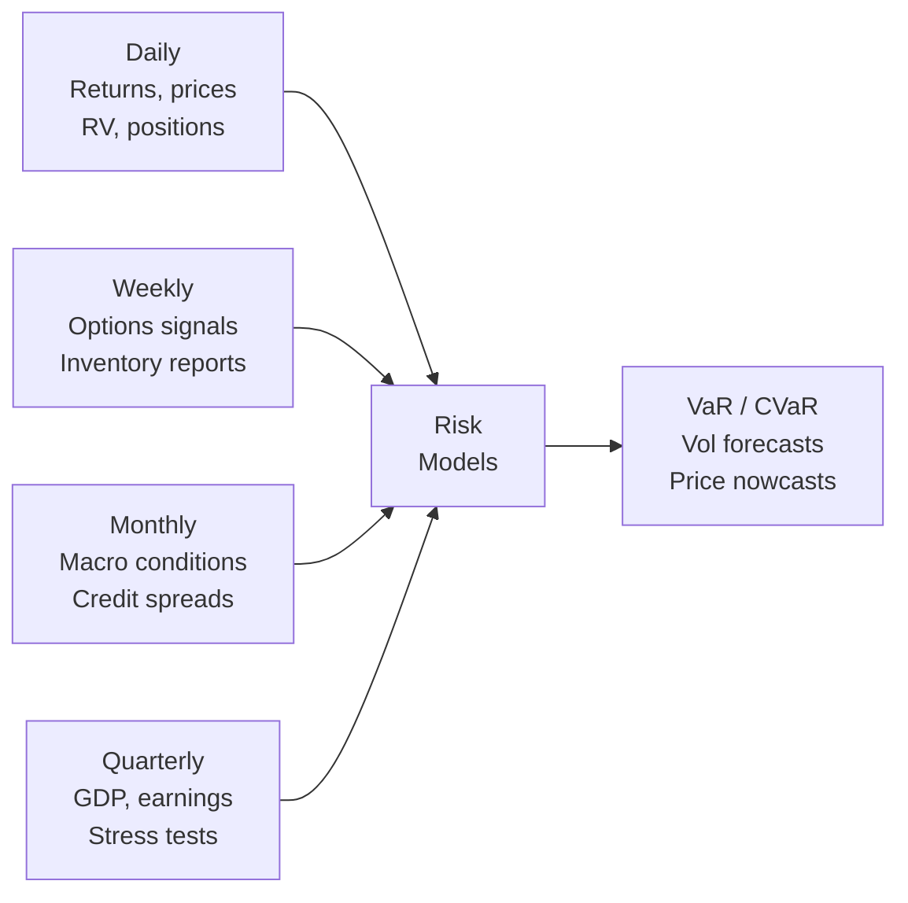

<!-- _class: lead -->

# Mixed-Frequency Risk Models
## VaR, Term Structure Nowcasting, and Commodity Fundamentals

Module 06 — Financial Applications

<!-- Speaker notes: This guide extends MIDAS to three risk management applications: Value-at-Risk with monthly macro conditioning, yield curve nowcasting, and commodity price forecasting with multi-frequency fundamentals. All three share the MIDAS-X structure: high-frequency target variable predicted by multiple mixed-frequency predictors with Beta-polynomial weights. -->

---

## The Mixed-Frequency Risk Information Set

Financial risk exists at multiple temporal scales:



**Classical models** operate at one frequency.
**MIDAS** integrates all frequencies optimally.

<!-- Speaker notes: The key motivation is that risk models should use all available information, regardless of its frequency. A VaR model that ignores the monthly credit spread widening because it only uses daily data will under-predict risk in the lead-up to a financial crisis. MIDAS provides the framework to incorporate all frequency information simultaneously. -->

---

## MIDAS-VaR: Two-Step Approach

**Step 1**: Forecast monthly volatility with MIDAS-RV

$$\hat{\sigma}^{(m)}_t = \left(\mu + \phi \sum_{j=0}^{K_d-1} B(j;\theta) \log RV^{(d)}_{t-j}\right)^{1/2}$$

**Step 2**: Scale to daily VaR

$$\text{VaR}^{1d}_t(\alpha) = \hat{\sigma}^{(m)}_t \cdot \frac{1}{\sqrt{22}} \cdot |z_\alpha|$$

For $\alpha = 1\%$: $z_{0.01} = -2.326$ → VaR = $2.326 \cdot \hat{\sigma}^{(m)}_t / \sqrt{22}$

<!-- Speaker notes: The two-step approach is clean and practical. First, forecast monthly volatility using MIDAS-RV (yesterday's material). Second, convert to daily VaR by scaling by 1/sqrt(22) — the square root of time rule. This assumes i.i.d. daily returns within the month, which is an approximation. For more sophisticated VaR, we can directly model the MIDAS conditional quantile, but the two-step approach is often sufficient for practical applications. -->

---

## VaR Backtest: Kupiec Test

Expected violation rate = $\alpha$ (e.g., 1% for 99% VaR)

$$H_0: \text{Violation rate} = \alpha$$

**Kupiec LR statistic**:

$$LR_{uc} = 2\left[V\log\frac{V/T}{\alpha} + (T-V)\log\frac{1-V/T}{1-\alpha}\right] \sim \chi^2(1)$$

| Result | Interpretation |
|--------|---------------|
| $V/T \approx \alpha$, fail to reject | VaR is well-calibrated |
| $V/T > \alpha$, reject | VaR too optimistic (under-estimates risk) |
| $V/T < \alpha$, reject | VaR too conservative (wastes capital) |

<!-- Speaker notes: The Kupiec test is the most basic VaR backtest. It simply asks: over the evaluation period, what fraction of days did the actual loss exceed our VaR estimate? For 1% VaR, we expect about 1 in 100 days to be a violation. If we see 3% violations, the model is dangerously under-estimating risk. If we see 0.2%, the bank is holding too much capital unnecessarily. The chi-squared test makes this rigorous. -->

---

## VaR Backtest: Christoffersen Independence Test

**Beyond counting violations**: They should not cluster in time.

**Transition probability matrix:**

$$\Pi = \begin{pmatrix} 1-\pi_{01} & \pi_{01} \\ 1-\pi_{11} & \pi_{11} \end{pmatrix}$$

$H_0$: Violations are i.i.d. → $\pi_{01} = \pi_{11}$ (no clustering)

**Failing this test**: Two consecutive violations are more likely than expected — indicates model fails to respond to volatility clusters.

<!-- Speaker notes: The Christoffersen independence test is critical. Even if the overall violation rate is correct (pass Kupiec), the model might be systematically wrong during volatility clusters. If violations cluster in consecutive days (pi_11 >> alpha), the model is failing exactly when risk management matters most — during stress periods. MIDAS-VaR with monthly macro conditioning tends to pass this test better than pure daily models because the macro component provides early warning of elevated-risk regimes. -->

---

## Macro-Conditioned VaR

Standard MIDAS-VaR with macro predictor:

$$\text{VaR}_t = \frac{|z_\alpha|}{\sqrt{22}}\sqrt{\mu + \phi\sum_j B_1(j) RV^{(d)}_{t-j} + \psi \sum_l B_2(l) Z^{(m)}_{t-l}}$$

**Key macro conditioning variables:**
- **Default spread** (BAA - AAA): Credit stress proxy
- **TED spread** (LIBOR - T-bill): Funding liquidity
- **Monthly VIX average**: Implied volatility as forward-looking signal

**Empirical result**: VaR models conditioned on default spread show 20-30% fewer clustered violations during crisis periods.

<!-- Speaker notes: The macro-conditioned VaR is the main contribution of this approach. The default spread (BAA minus AAA corporate yield) is a Bernanke-Gertler measure of credit stress. When it widens — as it did in 2007-08, 2020, etc. — it signals elevated risk ahead. Incorporating this monthly signal into daily VaR through MIDAS allows the model to pre-emptively increase risk estimates before the volatility spike actually occurs. -->

---

## Term Structure Nowcasting

**Objective**: Forecast quarterly yield changes using daily market data

**Nelson-Siegel decomposition**:

$$y(\tau) = \underbrace{\beta_1}_{\text{Level}} + \underbrace{\beta_2 \cdot \frac{1-e^{-\lambda\tau}}{\lambda\tau}}_{\text{Slope}} + \underbrace{\beta_3 \cdot \left(\frac{1-e^{-\lambda\tau}}{\lambda\tau} - e^{-\lambda\tau}\right)}_{\text{Curvature}}$$

**MIDAS applied separately to each factor**:
$$\Delta\beta_{k,t}^{(q)} = \mu_k + \phi_k \sum_j B_k(j) \Delta\beta_{k,t-j}^{(d)} + \varepsilon_{k,t}$$

Then reconstruct yield curve from nowcasted factors.

<!-- Speaker notes: The Nelson-Siegel model decomposes the yield curve into three factors with clear economic interpretations: level (all yields move together), slope (short rates vs long rates — the yield curve shape), and curvature (medium-term rates relative to short and long). Diebold and Li (2006) showed these factors forecast well. MIDAS extends this by using daily factor dynamics to nowcast quarterly changes. -->

---

## Commodity Price Nowcasting

**Crude oil example** — multi-frequency information:

<div class="columns">

**High frequency (daily)**
- Futures prices
- Speculative positions (COT)
- Dollar index
- Equity market returns

**Low frequency (monthly)**
- OPEC output data
- IEA demand revisions
- US production estimates
- Refinery utilisation

</div>

$$\Delta\log P^{(m)}_t = \mu + \phi_1\sum_j B_1(j)\Delta\log P^{(d)}_{t-j} + \phi_2\sum_k B_2(k)\text{EIA}^{(w)}_{t-k} + \phi_3 Z^{(m)}_{t-1} + \varepsilon_t$$

<!-- Speaker notes: Crude oil is the canonical commodity nowcasting application. The daily futures price has high informativeness about near-term supply-demand balance. The weekly EIA inventory report is the most market-moving single data release for crude oil — inventory draws signal tight supply, builds signal surplus. Monthly OPEC output figures are the fundamental supply variable. MIDAS-X naturally incorporates all three frequencies with separate Beta weighting for each. -->

---

## Weekly EIA Inventory Signal

The EIA petroleum inventory report (released every Wednesday) is the most important weekly data release for crude oil:

$$\text{EIA\_surprise}_t = \text{EIA\_actual}_t - \text{EIA\_expected}_t$$

These weekly surprises provide the highest-frequency fundamental signal:

```python
# Map weekly surprises to monthly period
# Weight: most recent weeks get highest weight via Beta polynomial
def weekly_to_monthly_midas(weekly_surprise, K_weeks=4, theta1=1, theta2=3):
    """MIDAS aggregation of weekly EIA surprises to monthly."""
    weights = beta_weights(K_weeks, theta1, theta2)
    return weights @ weekly_surprise[-K_weeks:][::-1]
```

<!-- Speaker notes: The EIA weekly petroleum report is released every Wednesday at 10:30am EST. The surprise (actual minus Bloomberg consensus) moves crude oil prices by 1-3% on the release day. Over a month, there are 4-5 such reports. MIDAS weighting determines how to aggregate these 4-5 weekly surprises into a single monthly predictor — typically recent reports get higher weight. The Beta polynomial provides the flexibility to estimate this weighting from data. -->

---

## Three Applications: Unified Framework

```mermaid
graph TD
    A[MIDAS-X Framework<br>y_low = μ + Σ_k φ_k · Σ_j B_k(j) · x_high_k_tj + ε] --> B[MIDAS-VaR<br>Target: Daily VaR<br>Predictor: Daily RV + Monthly macro]
    A --> C[Term Structure Nowcast<br>Target: Quarterly NS factor<br>Predictor: Daily NS factor]
    A --> D[Commodity Nowcast<br>Target: Monthly oil price<br>Predictors: Daily ret + Weekly EIA + Monthly OPEC]
```

All use Beta polynomial weighting. All estimated by NLS with time-series CV.

<!-- Speaker notes: The unified framework shows that all three applications are instances of MIDAS-X. The choice of target variable, predictors, and frequencies changes, but the estimation method (NLS with Beta weights, time-series CV for tuning) is identical. This is the power of the MIDAS framework: one general methodology, many applications. -->

---

## Backtesting Risk Models

For VaR backtesting, three tests are standard (Basel III requires these):

| Test | What it checks | Statistic |
|------|---------------|-----------|
| Kupiec (1995) | Correct violation rate | $\chi^2(1)$ |
| Christoffersen (1998) | Independence of violations | $\chi^2(1)$ |
| DQ test (Engle-Manganelli) | No predictability in violations | $F$-stat |

**Basel III traffic light:**
- Green: Fewer than 5 violations in 250 days (1.0-2.0%)
- Yellow: 5-9 violations (2.0-3.6%)
- Red: 10+ violations (>4.0%) — increased capital multiplier

<!-- Speaker notes: The Basel III traffic light system has real consequences. Banks must maintain a multiplier (typically 3) on their VaR-based capital requirement. If backtesting shows too many violations (red zone), the multiplier increases to 4, raising capital requirements by 33%. If too few violations (implying over-conservative VaR), no regulatory consequence but excessive capital tied up. MIDAS-VaR aims for the green zone. -->

---

## Practical Implementation Checklist

For financial MIDAS applications:

1. **Data alignment**: Adjust for market holidays, roll dates, settlement conventions
2. **Stationarity**: Work with returns or differences; yields can be levels (I(1)) or changes (I(0))
3. **Log transformation**: Use $\log RV$, $\log P$ for positive quantities; $\Delta\log P$ for prices
4. **Outlier treatment**: Consider robust estimation (LAD instead of OLS) for commodity data
5. **Regime awareness**: Financial data has clear regimes — test for structural breaks
6. **Backtesting**: Always evaluate VaR models over a full business cycle (at least 2008-2009)

<!-- Speaker notes: The practical checklist summarises the key implementation decisions. Data alignment is often the trickiest part: crude oil futures trade on slightly different calendar from equity markets. Log transformation is critical for RV and prices. For backtesting, you must include the 2008 crisis period — a model that looks good from 2010-2019 but wasn't evaluated in 2008 is not reliably calibrated for tail events. -->

---

## Key Takeaways

1. **MIDAS-VaR** incorporates monthly macro conditions into daily VaR via MIDAS-RV as intermediate step
2. **Kupiec and Christoffersen tests** evaluate VaR calibration and independence of violations
3. **Macro conditioning** (default spread, TED spread) pre-emptively raises VaR estimates before volatility spikes
4. **Term structure nowcasting** applies MIDAS to Nelson-Siegel factors extracted from the yield curve
5. **Commodity nowcasting** combines daily futures, weekly inventory reports, and monthly fundamentals in MIDAS-X
6. All three applications use the same Beta polynomial framework — only the frequencies and predictors differ

**Next**: `01_midas_rv_sp500.ipynb`

<!-- Speaker notes: The key message is that MIDAS provides a unified framework for all these financial risk applications. The specific application determines what goes in (which frequencies, which predictors), but the statistical machinery is identical. Next, the notebook applies MIDAS-RV to S&P 500 data, giving students hands-on experience with the full estimation and evaluation pipeline for financial volatility. -->

---

<!-- _class: lead -->

## Notebooks for Module 06

1. `01_midas_rv_sp500.ipynb` — MIDAS-RV for S&P 500 realised volatility
2. `02_commodity_nowcasting.ipynb` — Crude oil mixed-frequency nowcasting
3. `03_var_mixed_frequency.ipynb` — MIDAS-VaR with Kupiec and Christoffersen backtests

<!-- Speaker notes: Three notebooks covering the three applications from the guides. The S&P 500 notebook is the most complete — it has real data, full NLS estimation, HAR-RV comparison, and QLIKE evaluation. The commodity notebook focuses on feature engineering for multi-frequency data. The VaR notebook implements the full backtesting framework including Basel III traffic light assessment. -->
