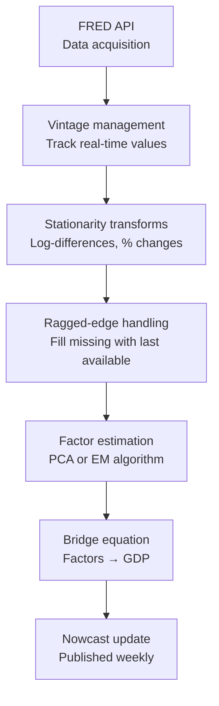

# GDP Nowcasting in Practice: Fed and ECB Approaches

> **Reading time:** ~20 min | **Module:** 07 — Macro Applications | **Prerequisites:** Module 6


## Learning Objectives

<div class="flow">
<div class="flow-step mint">1. Load Ragged Data</div>
<div class="flow-arrow">&#8594;</div>
<div class="flow-step amber">2. Estimate MIDAS</div>
<div class="flow-arrow">&#8594;</div>
<div class="flow-step blue">3. Generate Nowcast</div>
<div class="flow-arrow">&#8594;</div>
<div class="flow-step lavender">4. Update as Data Arrives</div>
</div>


<div class="callout-key">

**Key Concept Summary:** GDP is released with a lag of 3–5 weeks after quarter-end (advance estimate), with revisions for up to three years thereafter. During the quarter, policymakers, traders, and businesses need to trac...

</div>

By the end of this guide you will be able to:

1. Describe the institutional nowcasting frameworks used by the NY Fed and ECB
2. Explain real-time data challenges: ragged edges, revisions, and publication lags
3. Implement a simplified GDP nowcasting model incorporating real-time data vintages
4. Design a nowcasting pipeline from data acquisition to model output

---

## 1. The GDP Nowcasting Problem

GDP is released with a lag of 3–5 weeks after quarter-end (advance estimate), with revisions for up to three years thereafter. During the quarter, policymakers, traders, and businesses need to track economic momentum in real time. This is the nowcasting problem.

### 1.1 The Information Flow in GDP Nowcasting

Consider Q3 GDP (July–September). The information available evolves as:

<div class="callout-insight">

**Insight:** Real-time nowcasting is fundamentally different from pseudo out-of-sample backtesting. The ragged-edge data structure means your model sees different information at different points within a quarter.

</div>


```
July:        July employment, July ISM, July retail sales
August:      July IP (with lag), August employment, August ISM
September:   August IP, September employment (partial), survey data
October:     September IP, September retail sales
Late October: GDP Advance Estimate released
```

A nowcasting model ingests each new data release and updates its GDP estimate in real time.

### 1.2 Why MIDAS is Suited for GDP Nowcasting

- GDP is quarterly; most useful predictors are monthly (payrolls, IP, retail sales) or daily (financial conditions)
- Publication lags create "ragged edges" — different variables are available at different points in the quarter
- MIDAS handles temporal aggregation directly without imposing artificial temporal structure
- The Beta polynomial weights provide a parsimonious representation of how monthly information aggregates to quarterly GDP

---

## 2. The NY Fed GDP Nowcast

<div class="callout-warning">

**Warning:** Pseudo out-of-sample exercises that do not properly account for the real-time data vintage will overstate nowcast accuracy. Always use the ragged-edge structure that would have been available at each historical nowcast date.

</div>


### 2.1 Architecture

The Federal Reserve Bank of New York publishes weekly GDP nowcasts using a Dynamic Factor Model (DFM) framework (Giannone, Reichlin, Small 2008). Key features:

1. **State space representation**: A common latent factor drives all series, observed at mixed frequencies
2. **Kalman filter**: Handles ragged edges by treating missing observations as missing data in the state space
3. **Automated data pipeline**: Downloads new releases, updates the Kalman filter, publishes revised nowcast within hours

### 2.2 Simplified NY Fed Structure



### 2.3 MIDAS-Based Alternative

A MIDAS alternative to the NY Fed's DFM:

$$\Delta \log \text{GDP}_t = \mu + \sum_{k=1}^{K} \phi_k \sum_{j=0}^{m_k-1} B_k(j;\theta_k) x_{k,t-j/m_k} + \varepsilon_t$$

where each $x_{k}$ is a high-frequency indicator at frequency $m_k$ relative to quarterly GDP. This is a multi-predictor MIDAS (U-MIDAS or regularized MIDAS for many predictors).

---

## 3. Real-Time Data Challenges

### 3.1 Vintage Data

Economic data is subject to revision. The value published in month $t+1$ for variable $x_t$ may differ from the value published in $t+6$ (first revision) or $t+18$ (annual revision). For a realistic nowcasting model:

- Train only on data available as of each forecast date (avoid look-ahead bias)
- Use a vintage database such as ALFRED (Archival FRED) or the St. Louis Fed's vintage data


<span class="filename">example.py</span>
</div>

<div class="code-window">
<div class="code-header">
<div class="dots"><span class="dot-red"></span><span class="dot-yellow"></span><span class="dot-green"></span></div>

```python
import pandas_datareader.data as web
from datetime import date

def get_vintage_data(series_id, vintage_date, start='2000-01-01'):
    """
    Download FRED series as it appeared on a specific vintage date.
    Uses the ALFRED vintage database.
    """
    try:
        # ALFRED allows historical vintage downloads via observation_start, realtime_start/end
        df = web.DataReader(
            series_id, 'fred',
            start=start,
            end=vintage_date
        )
        return df
    except Exception as e:
        print(f"ALFRED unavailable: {e}")
        return None
```

</div>
</div>

### 3.2 Ragged Edges

At any point during a quarter, the information set is "ragged" — some indicators are available through month $m$, others only through month $m-1$:

```
Variable      | Jan  | Feb  | Mar  | Apr (quarter end)
──────────────|──────|──────|──────|────────────────────
Nonfarm payrolls | ✓  |  ✓  |  ✓  | available Apr 5
IP               | ✓  |  ✓  |      | available Apr 17  ← ragged!
Retail Sales     | ✓  |  ✓  |      | available Apr 15  ← ragged!
GDP Advance      |     |     |      | available Apr 28
```

**Handling ragged edges in MIDAS**:


<span class="filename">example.py</span>
</div>

<div class="code-window">
<div class="code-header">
<div class="dots"><span class="dot-red"></span><span class="dot-yellow"></span><span class="dot-green"></span></div>

```python
def handle_ragged_edge(df, target_date, method='last'):
    """
    Handle ragged-edge data by filling missing recent observations.

    Parameters
    ----------
    df : DataFrame — monthly data with potential NaN at recent end
    target_date : datetime — current forecast date
    method : str — 'last' (carry forward), 'zero' (assume no change),
                   'ar' (simple AR prediction)

    Returns
    -------
    df_filled : DataFrame — filled monthly data
    """
    df_filled = df.copy()

    for col in df.columns:
        series = df_filled[col]
        last_obs = series.last_valid_index()

        if last_obs is None:
            continue

        # Find months between last observation and target
        missing_dates = pd.date_range(
            start=last_obs + pd.DateOffset(months=1),
            end=pd.Period(target_date, 'M').to_timestamp(),
            freq='MS'
        )

        if len(missing_dates) == 0:
            continue

        if method == 'last':
            # Carry last observed value forward
            for d in missing_dates:
                df_filled.loc[d, col] = series[last_obs]

        elif method == 'zero':
            # Assume no change (zero for differenced series)
            for d in missing_dates:
                df_filled.loc[d, col] = 0.0

        elif method == 'ar':
            # Fit AR(1) on available data and extrapolate
            y_avail = series.dropna().values
            if len(y_avail) >= 4:
                rho = np.corrcoef(y_avail[:-1], y_avail[1:])[0, 1]
                mu = np.mean(y_avail)
                last_val = y_avail[-1]
                for i, d in enumerate(missing_dates):
                    pred = mu + rho * (last_val - mu)
                    df_filled.loc[d, col] = pred
                    last_val = pred

    return df_filled
```

</div>
</div>

### 3.3 Publication Lags

Each data release has a specific publication calendar:

| Indicator | Publication Lag | Source |
|-----------|----------------|--------|
| Nonfarm Payrolls | First Friday of month following | BLS |
| Industrial Production | ~2 weeks after month-end | Federal Reserve |
| Retail Sales | ~2 weeks after month-end | Census Bureau |
| Consumer Confidence | Last Tuesday of reference month | Conference Board |
| PMI/ISM | First business day following | ISM |
| GDP Advance | ~4 weeks after quarter-end | BEA |

A production-grade nowcasting system uses a **publication calendar** to know exactly what information is available at each forecast date.

---

## 4. GDP Nowcasting Model: Multi-MIDAS

### 4.1 Building the Model

A practical MIDAS-based GDP nowcast uses 5-8 monthly indicators:


<span class="filename">example.py</span>
</div>

<div class="code-window">
<div class="code-header">
<div class="dots"><span class="dot-red"></span><span class="dot-yellow"></span><span class="dot-green"></span></div>

```python
NOWCAST_VARIABLES = {
    'PAYEMS': {'description': 'Nonfarm Payrolls', 'transform': 'pct_change'},
    'INDPRO': {'description': 'Industrial Production Index', 'transform': 'pct_change'},
    'RETAILSL': {'description': 'Retail Sales', 'transform': 'pct_change'},
    'UMCSENT': {'description': 'Consumer Sentiment', 'transform': 'diff'},
    'NAPM': {'description': 'ISM Manufacturing PMI', 'transform': 'diff'},
    'HOUST': {'description': 'Housing Starts', 'transform': 'pct_change'},
}
```

</div>
</div>

For each quarterly observation, construct the MIDAS design matrix by stacking monthly lags.

### 4.2 Nowcast Updating Schedule

A nowcast should be updated every time a new release arrives. Define a **news impact** measure:

$$\text{News Impact} = \hat{y}_{t|S_1} - \hat{y}_{t|S_0}$$

where $S_0$ is the information set before the release and $S_1$ is after. This decomposition traces how each new data release contributed to the revision in the nowcast.

```python
def news_impact(y_nowcast_before, y_nowcast_after, release_name):
    """
    Compute news impact of a single data release on the nowcast.

    Parameters
    ----------
    y_nowcast_before : float — nowcast before release
    y_nowcast_after : float — nowcast after release
    release_name : str — name of the released indicator

    Returns
    -------
    dict — news impact summary
    """
    impact = y_nowcast_after - y_nowcast_before
    direction = 'positive' if impact > 0 else 'negative'
    return {
        'release': release_name,
        'impact': impact,
        'direction': direction,
        'nowcast_before': y_nowcast_before,
        'nowcast_after': y_nowcast_after
    }
```

---

## 5. ECB Approach: The Nowcasting Lab

The ECB's Euro Area nowcasting framework (Bańbura et al. 2013) uses a large-scale DFM similar to the NY Fed but tailored to Euro Area data:

1. **Country-level factors**: Separate factor extraction for Germany, France, Italy, Spain
2. **Soft vs hard data**: Survey indicators (PMI, ZEW) as early signals; hard data (IP, retail) as confirmation
3. **Real-time assessment**: Track "news" from each national statistical office release
4. **Multiple frequencies**: Daily financial data, monthly surveys and hard data, quarterly GDP

### 5.1 Comparison of Approaches

| Feature | NY Fed DFM | ECB DFM | MIDAS-Based |
|---------|-----------|---------|-------------|
| Model class | State space | State space | Regression |
| Ragged edges | Kalman filter | Kalman filter | Ad-hoc filling |
| Parameters | Many | Many | Few |
| Uncertainty | Formal | Formal | Bootstrap |
| New data updates | Fast | Fast | Re-estimate |
| Interpretability | Low | Low | High |

---

## 6. Evaluation Framework for GDP Nowcasts

### 6.1 Pseudo-Real-Time Evaluation

Use "pseudo-real-time" evaluation to mimic the real-time nowcasting environment:

1. At each forecast date, use only data available as of that date
2. Evaluate against the first-released (advance) GDP estimate (not the final revised)
3. Track RMSFE across forecast horizons (beginning/middle/end of quarter)

```python
def pseudo_real_time_eval(model_func, data_vintages, gdp_advance, horizons):
    """
    Pseudo-real-time evaluation framework.

    Parameters
    ----------
    model_func : callable — nowcasting model(X, y) → forecast
    data_vintages : dict — {date: DataFrame} real-time data snapshots
    gdp_advance : Series — advance GDP estimates (first releases)
    horizons : list — months from quarter-end to forecast date

    Returns
    -------
    results : DataFrame — RMSFE by horizon
    """
    results = {}
    for h, vintage_date in zip(horizons, data_vintages.keys()):
        X_rt, y_rt = prepare_real_time_data(data_vintages[vintage_date])
        forecast = model_func(X_rt, y_rt)
        actual = gdp_advance.get(vintage_date)
        if actual is not None:
            results[h] = {'forecast': forecast, 'actual': actual,
                         'error': actual - forecast}
    return pd.DataFrame(results).T
```

### 6.2 Real-Time vs Ex-Post Evaluation

A common pitfall: evaluating nowcasts against revised GDP rather than advance GDP. Since the model was built to forecast the available GDP estimate at the time, it should be evaluated against the data it was forecasting.

---

## 7. Key References

<div class="callout-danger">

**Danger:** Never use future information when constructing the high-frequency regressor matrix. In a real-time nowcasting context, you only have data up to the current date -- using the full quarter of monthly data when nowcasting mid-quarter is a look-ahead bias that invalidates your results.

</div>


- Giannone, D., Reichlin, L., & Small, D. (2008). Nowcasting: The real-time informational content of macroeconomic data. *Journal of Monetary Economics*, 55(4), 665–676.
- Bańbura, M., et al. (2013). Now-casting and the real-time data flow. In *Handbook of Economic Forecasting*, vol. 2A, pp. 195–237.
- Aaronson, D., et al. (2016). The Federal Reserve Bank of New York Staff Nowcast. *FRBNY Staff Report* No. 791.
- Andreou, E., Ghysels, E., & Kourtellos, A. (2013). Should macroeconomic forecasters use daily financial data? *JBES*, 31(2), 240–251.

---

## Summary

GDP nowcasting in practice requires:

1. **Data infrastructure**: Real-time data vintages, publication calendars, automated ingestion
2. **Ragged edge handling**: Carry-forward, zero-fill, or AR projection for missing recent observations
3. **Temporal aggregation**: MIDAS or DFM to aggregate mixed-frequency information
4. **News decomposition**: Track contributions from each data release to revisions
5. **Proper evaluation**: Pseudo-real-time with advance GDP as target, not revised GDP

Next: [Inflation and Labour Market Nowcasting](02_inflation_labour_guide.md)


---

## Conceptual Practice Questions

**Practice Question 1:** How does the ragged-edge problem affect the reliability of real-time nowcasts compared to pseudo out-of-sample exercises?

**Practice Question 2:** What is the key difference between direct and iterated multi-step forecasts in a MIDAS context?


---

## Cross-References

<a class="link-card" href="./02_inflation_labour_guide.md">
  <div class="link-card-title">02 Inflation Labour</div>
  <div class="link-card-description">Related guide in this module.</div>
</a>

<a class="link-card" href="./02_inflation_labour_slides.md">
  <div class="link-card-title">02 Inflation Labour — Companion Slides</div>
  <div class="link-card-description">Slide deck covering the key points.</div>
</a>

