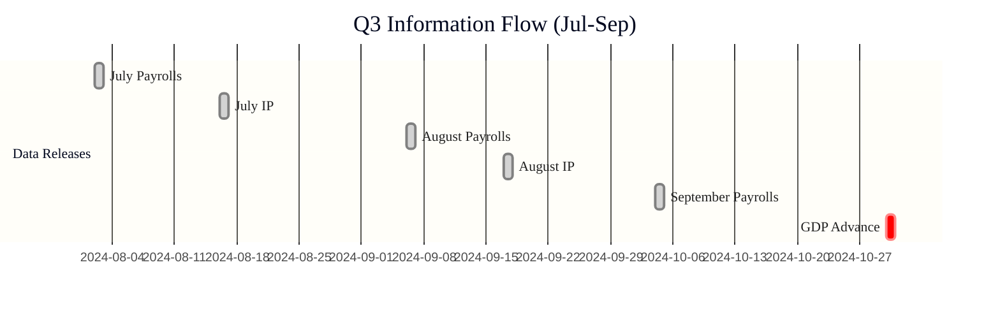
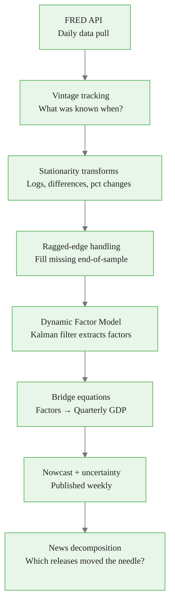
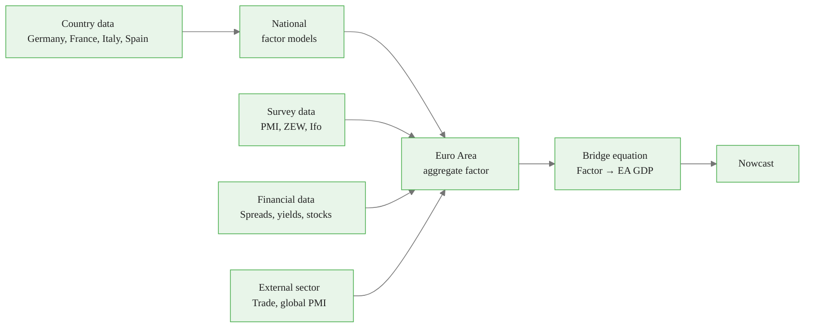
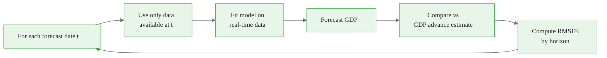

<!-- _class: lead -->

# GDP Nowcasting in Practice
## Fed and ECB Approaches, Real-Time Data, and Pipeline Architecture

Module 07 — Macroeconomic Applications

<!-- Speaker notes: This guide covers how the world's leading central banks actually do GDP nowcasting. We focus on the NY Fed's approach, the real-time data challenges that make nowcasting hard, and how to design a practical nowcasting pipeline. The emphasis is on the engineering and institutional knowledge needed to build a production-grade system. -->

---

## The GDP Nowcasting Problem

**GDP is released 4–5 weeks after quarter-end.**

During the quarter, policymakers, investors, and businesses need to track economic momentum in real time.



Nowcasting = updating the GDP estimate continuously as new data arrives.

<!-- Speaker notes: GDP is the most important economic indicator but is known with a long delay. The Federal Reserve's policy meetings happen every 6-8 weeks, and the Fed needs to know current economic conditions, not what happened last quarter. This drives the nowcasting problem: use all available monthly (and daily) data to estimate the current quarter's GDP growth in real time. -->

<div class="callout-key">

The key advantage of MIDAS is preserving high-frequency information that temporal aggregation destroys.

</div>

---

## The NY Fed GDP Nowcast Architecture



Published every Friday at 11am ET. Consumed by markets within seconds.

<!-- Speaker notes: The NY Fed's nowcast framework was developed by Giannone, Reichlin, and Small (2008). It processes about 40 data series including employment, industrial production, retail sales, housing starts, and financial conditions. The Kalman filter handles the ragged edge naturally — missing observations are treated as unobserved states in the state space model. The news decomposition tells policymakers exactly which data release caused each forecast revision. -->

<div class="callout-insight">

**Insight:** Parsimonious weight functions with 2-3 parameters can capture decay patterns that unrestricted models need 12+ parameters to approximate.

</div>

---

## Real-Time Data: The Ragged Edge

Not all indicators are available at the same time:

```
Series          | Jan | Feb | Mar | Current (Apr 15)
────────────────|─────|─────|─────|──────────────────────
ISM Mfg PMI     |  ✓  |  ✓  |  ✓  | ✓ (released Apr 1)
Nonfarm Payrolls|  ✓  |  ✓  |  ✓  | ✓ (released Apr 5)
Retail Sales    |  ✓  |  ✓  |  ✓  |   (released Apr 16!)
Industrial Prod |  ✓  |  ✓  |  ✓  |   (released Apr 17!)
GDP Q1          |     |     |     |   (released Apr 25!)
```

**The ragged edge**: At any point during a quarter, some variables have more recent observations than others.

<!-- Speaker notes: The ragged edge is the fundamental practical challenge in nowcasting. On April 15, payrolls and PMI are available for March, but retail sales and industrial production are not yet. The model must produce a nowcast using this incomplete information set. The approach: fill missing recent observations with a simple assumption (carry-forward, zero, or AR projection), then apply the MIDAS model to the filled data. -->

<div class="callout-warning">

**Warning:** Always account for the real-time data vintage when evaluating nowcast performance. Using revised data overstates accuracy.

</div>

---

## Ragged-Edge Solutions

**Three approaches for missing recent observations:**

<div class="columns">

**Carry-forward (simplest)**
```python
# Fill NaN with last observed value
df.fillna(method='ffill')
```
Works for level variables; not for growth rates.

**Zero-fill**
```python
# Assume no change in differences
df.fillna(0)
```
Works for differenced/growth rate variables.

</div>

**AR projection (best):**
Fit AR(1) on available history, predict missing values.

**Formal approach**: State-space model with Kalman filter (NY Fed standard).

<!-- Speaker notes: For MIDAS models, the ragged edge requires a practical decision before building the design matrix. The carry-forward approach is problematic for growth rate variables — if we don't know March payrolls, we shouldn't assume February's growth rate continues. Zero-fill (assume no change from the last known value) is more appropriate for differenced series. AR projection uses the time series structure to make a principled guess about missing values. The Kalman filter is the gold standard but requires more engineering effort. -->

<div class="callout-info">

**Info:** MIDAS models can handle any frequency ratio: monthly-to-quarterly (3:1), daily-to-monthly (~22:1), or even tick-to-daily.

</div>

---

## Vintage Data: The Revision Problem

Economic data is **revised** repeatedly after initial release:

| GDP Estimate | Date | Value |
|-------------|------|-------|
| Advance | Oct 28, 2023 | 4.9% |
| Second | Nov 29, 2023 | 5.2% |
| Third | Dec 21, 2023 | 4.9% |
| Annual revision | Jul 2024 | 4.9% |

**For nowcasting evaluation**: Use data as it appeared at the forecast date — not the final revised value. This requires a **vintage database** (ALFRED at FRED).

<!-- Speaker notes: Data revisions are a crucial but often overlooked issue. If we train a nowcasting model on revised data but evaluate it in real time, we're giving the model unfair advantages. The initial payrolls number is often revised significantly in subsequent months. ALFRED (Archival FRED) allows downloading data as it appeared on any specific date, enabling genuine real-time evaluation. This is essential for comparing competing models on a level playing field. -->

---

## Publication Calendar: Knowing What You Know

A production nowcasting system maintains a publication calendar:

<div class="code-window">
<div class="code-header">
<div class="dots"><span class="dot-red"></span><span class="dot-yellow"></span><span class="dot-green"></span></div>
<span class="filename">example.py</span>
</div>

```python
PUBLICATION_CALENDAR = {
    'PAYEMS': {
        'lag_days': 4,  # First Friday after reference month
        'reference': 'monthly',
    },
    'INDPRO': {
        'lag_days': 17,  # ~2.5 weeks after month-end
        'reference': 'monthly',
    },
    'RETAILSL': {
        'lag_days': 15,  # ~2 weeks after month-end
        'reference': 'monthly',
    },
    'NAPM': {
        'lag_days': 1,  # First business day of following month
        'reference': 'monthly',
    },
}
```

</div>

On any forecast date $t$, the system computes what each variable's latest vintage is.

<!-- Speaker notes: A publication calendar is the backbone of a real-time nowcasting system. It tells the data ingestion layer exactly what to expect and when. Without it, you might accidentally use a data point that wasn't available at the forecast time — a form of look-ahead bias. ISM PMI is released on the first business day of the following month, so by April 1 you have March PMI. But industrial production for March is only released around April 17. These lags are deterministic and can be hard-coded. -->

---

## News Decomposition: What Moved the Nowcast?

For each new data release, compute the impact on the nowcast:

$$\underbrace{\hat{y}_{t|S_{\text{after}}}}_{\text{Updated nowcast}} - \underbrace{\hat{y}_{t|S_{\text{before}}}}_{\text{Previous nowcast}} = \underbrace{\hat{\beta}_k \cdot (x_k^{\text{new}} - x_k^{\text{expected}})}_{\text{News impact}}$$

**Example**: March payrolls released +300k vs expected +200k
- Surprise: +100k = positive news
- Impact on GDP nowcast: $+0.3\%$ annual growth

<!-- Speaker notes: The news decomposition is one of the most powerful outputs of a nowcasting model. It answers the question: "our nowcast moved up by 0.2% today — which data release caused that?" For communication with policymakers or clients, this is essential. The impact equals the regression coefficient times the surprise (actual minus consensus). This is exact for linear models like MIDAS; for nonlinear ML methods it requires SHAP or similar. -->

---

## MIDAS vs DFM for GDP Nowcasting

| Aspect | MIDAS | DFM (NY Fed) |
|--------|-------|-------------|
| Number of variables | 5–15 (parsimony) | 30–100 (information) |
| Ragged-edge handling | Ad hoc filling | Kalman filter (formal) |
| Latent factors | No | Yes (K factors) |
| Uncertainty quantification | Bootstrap/sim | State space covariance |
| Update frequency | Per release | Per release |
| Interpretability | High | Low |
| Implementation complexity | Low | High |

**Practical recommendation**: Start with MIDAS for understanding; scale to DFM for production systems with many series.

<!-- Speaker notes: Both MIDAS and DFM are used in practice. The NY Fed uses DFM; some private sector institutions use MIDAS-based approaches. The key trade-off is between interpretability (MIDAS wins) and information efficiency (DFM wins with many series). For a 5-10 variable model, MIDAS and DFM perform similarly. With 40+ series, DFM's joint factor extraction across all series becomes important. -->

---

## ECB Nowcasting Lab Architecture



Key ECB innovations: country-level disaggregation; soft data (surveys) as early signal; tracking "news" by country and indicator type.

<!-- Speaker notes: The ECB's approach, documented by Bańbura, Giannone, Modugno, and Reichlin (2013), is more complex than the NY Fed's because the Euro Area is a collection of heterogeneous economies. Germany and France release data at different times and with different lags. The multi-country factor model aggregates information from all four major economies into a common Euro Area factor, which then drives the bridge equation for EA GDP. The survey data (PMI, ZEW, Ifo) is particularly valuable in Europe because hard data is released with longer lags than in the US. -->

---

## Pseudo-Real-Time Evaluation

**How to fairly evaluate a nowcasting model:**



**Critical**: Compare against the advance GDP estimate, not the final revised value.

<!-- Speaker notes: Pseudo-real-time evaluation is essential for honest model comparison. The two most common mistakes: (1) using revised data for predictors during the training period, and (2) evaluating against the final revised GDP rather than the advance estimate. If you train on revised data, your model learns from information that wasn't available at the forecast time. If you evaluate against revised GDP, you're penalising the nowcast for missing revisions that happened years later. -->

---

## RMSFE by Nowcast Horizon

Nowcast accuracy improves as more information arrives during the quarter:

```
RMSFE
 │
2│  ●  early quarter (month 1 of quarter)
 │
1│     ●  mid-quarter (month 2)
 │
0.5│         ●  late quarter (month 3)
 └─────────────────────────────────────> Months through quarter
   Jan       Feb       Mar        GDP release
```

**Key insight**: The largest accuracy gains come from early-quarter releases (first payrolls, first PMI).

<!-- Speaker notes: This U-shaped pattern of improving accuracy is characteristic of all nowcasting models. At the start of a quarter, the model relies on the previous quarter's data plus very early releases (month 1 of the current quarter). As the quarter progresses and more data arrives, uncertainty decreases. The biggest single improvements often come from the first payrolls release (since employment is the largest GDP driver) and the first PMI (which is available on the first business day of the following month). -->

---

## Key Takeaways

1. **GDP nowcasting** requires real-time data management, not just econometrics
2. **Ragged edges** are handled by carry-forward, zero-fill, AR projection, or Kalman filter
3. **Vintage data** is essential for fair evaluation — use data as it appeared, not as revised
4. **Publication calendars** determine what information is available at each forecast date
5. **News decomposition** explains revisions: surprise × coefficient = impact
6. **MIDAS** is interpretable and practical; **DFM** scales better to 40+ series
7. **Pseudo-real-time evaluation** with advance GDP is the gold standard for model assessment

**Next**: `01_simplified_nyfed_nowcast.ipynb` — build a simplified NY Fed-style GDP nowcast

<!-- Speaker notes: The key practical messages: data engineering is as important as econometrics in nowcasting. You need real-time data, vintage tracking, a publication calendar, and proper evaluation methodology before the model even matters. The MIDAS framework is accessible and interpretable, making it ideal for learning and for smaller-scale applications where DFMs are over-engineered. -->

---

<!-- _class: lead -->

## Module 07 — Macro Applications

Three notebooks, progressing through the three main macro nowcasting problems:

1. `01_simplified_nyfed_nowcast.ipynb` — GDP
2. `02_inflation_nowcasting.ipynb` — CPI and PCE
3. `03_labour_market_nowcasting.ipynb` — Payrolls and unemployment

<!-- Speaker notes: The three notebooks cover the three most important macro nowcasting applications: GDP, inflation, and the labour market. Each uses MIDAS with real data and builds toward a practical nowcasting system. Start with the GDP notebook as it contains the most complete pipeline. -->
