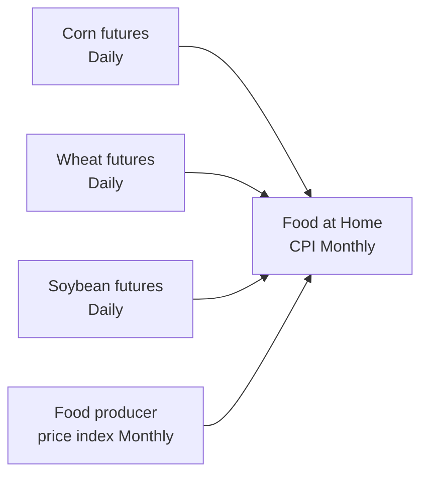
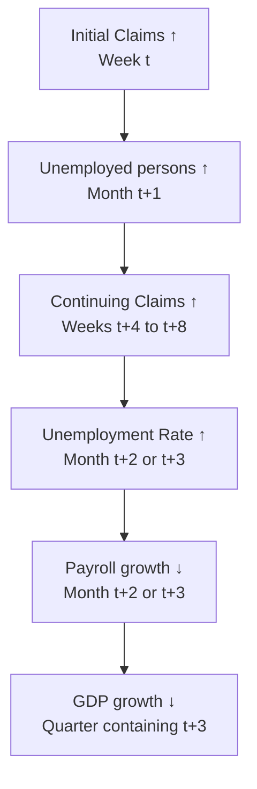

<!-- _class: lead -->

# Inflation and Labour Market Nowcasting
## Daily Commodity Prices, Weekly Claims, and Mixed-Frequency Signals

Module 07 — Macroeconomic Applications

<!-- Speaker notes: This guide covers two more macro nowcasting applications: inflation and the labour market. These two applications have distinct high-frequency predictors — daily commodity prices for inflation, and weekly jobless claims for labour market conditions. Both fit naturally into the MIDAS-X framework. -->

---

## Inflation: A Multi-Component Problem

CPI components have very different nowcastability:

| Component | Weight | High-freq predictor | Daily R² |
|-----------|--------|-------------------|----------|
| Energy | 7% | Oil, gas prices | ~0.75 |
| Food at home | 8.5% | Agricultural futures | ~0.45 |
| Core goods | 22% | PPI goods, import prices | ~0.35 |
| Core services | 57% | ??? | ~0.10 |

**Energy and food are easy; core services are hard.**

Strategy: **Bottom-up** nowcasting — separate model for each component, aggregate with weights.

<!-- Speaker notes: CPI has four main components with very different characteristics. Energy prices have daily predictors that are highly correlated with the energy CPI — crude oil today predicts energy CPI next month with R²≈0.75. Core services, which is more than half of CPI, has almost no good daily predictor. The best we can do for core services is an AR(1) model. The bottom-up approach is therefore natural: use MIDAS for the predictable components and AR for the rest. -->

---

## Energy Inflation MIDAS

Monthly energy CPI growth from daily commodity prices:

$$\pi^E_t = \mu + \phi_1\sum_{j=0}^{K-1} B_1(j)\Delta\log P^{\text{oil}}_{t-j/d} + \phi_2\sum_{j=0}^{K-1} B_2(j)\Delta\log P^{\text{gas}}_{t-j/d} + \varepsilon_t$$

**Why this works well:**
- Energy prices adjust daily to supply/demand news
- CPI energy reflects actual consumer prices (gas stations, utilities)
- Monthly CPI energy ≈ monthly average of daily energy prices

**Typical results:**
- MIDAS energy RMSE: ~0.3% (monthly)
- AR benchmark RMSE: ~0.8%
- Improvement: ~60%

<!-- Speaker notes: The energy CPI is essentially a weighted average of gasoline and natural gas prices. These are set in commodity markets daily. The monthly CPI energy component reflects what consumers actually paid during the month, which is closely tracked by daily EIA gasoline price surveys and futures prices. This is why the R² is so high — the predictors and target are measuring almost the same thing at different frequencies. MIDAS MIDAS the aggregation cleanly. -->

---

## Food Inflation: Agricultural Futures Signal

Food CPI (at-home component) is predicted by agricultural commodity futures:

**Key challenge**: Futures prices lead retail food prices by 2-4 months (supply chain transmission lag).

Use MIDAS with 2-4 month daily lags to capture this lead-lag structure.

<!-- Speaker notes: Food inflation transmission is slower than energy. A corn price spike in May due to drought concerns may not show up in grocery store prices until July or August, as processors, manufacturers, and retailers absorb and pass through costs over time. The MIDAS model captures this transmission lag through the Beta weights — if the optimal theta2 is small (flat profile), it means the transmission is slow and uniform across lags. If theta2 is large (rapid decay), recent prices dominate. -->

---

## Core Services: The Hard Part

Core services (rent, medical care, education) = 57% of CPI

**No good daily predictor exists.**

Best available monthly indicators:
- Zillow Observed Rent Index (now-to-March CPI rent)
- AHE (Average Hourly Earnings) for labour-intensive services
- Health insurance cost surveys (very lagged)

**Practical recommendation**: Use an AR(1) for core services. The MIDAS gains from including indicators are small (< 0.05% RMSE improvement) and not worth the complexity.

<!-- Speaker notes: Core services is the humbling component of inflation nowcasting. Rent accounts for about 34% of CPI and is the biggest single component. Zillow's rental index provides a real-time signal for market rents, but CPI rent reflects existing lease renewals (which are slow-moving), so the correlation is significant but noisy. For super-core services (excluding shelter), the Bernanke-Blanchard finding is that wage growth is the best predictor. But wages are monthly, so no frequency benefit from MIDAS here. -->

---

## Labour Market: Claims → Payrolls

Initial jobless claims provide the earliest weekly signal of labour market conditions:

**4-week lead**: Claims for the reference week (week containing 12th of month) are available within 10 days. BLS payrolls released 3-4 weeks later.

<!-- Speaker notes: Initial jobless claims is one of the most valuable high-frequency labour market indicators. It's released every Thursday at 8:30am, providing a weekly reading on the labour market. The relationship is inverse and lagged: high claims today predict lower payrolls next month. The reference week for the BLS payrolls survey is the week containing the 12th of the month. Claims data for that same week are available about 10 days later, well before the payrolls report. -->

---

## Claims-Payrolls MIDAS Model

$$\Delta\text{Payrolls}^{(m)}_t = \mu + \phi\sum_{k=0}^{3} B(k;\theta_1,\theta_2)\text{Claims}^{(w)}_{t-k} + \varepsilon_t$$

**Key parameters:**
- $K=4$: 4 weekly claims reports per month
- $\phi < 0$: Negative relationship (high claims → fewer payrolls)
- $\theta_1 \approx 1, \theta_2 \approx 1$ empirically: approximately uniform weights across 4 weeks
- MIDAS vs simple average: modest gain (~5% RMSE reduction)

**Enhanced model adds**: ADP private employment, ISM manufacturing employment PMI, continuing claims level.

<!-- Speaker notes: The 4-week window is natural — there are exactly 4 (sometimes 5) weekly claims reports for each reference month. The Beta weights with theta1≈theta2≈1 (approximately uniform) are common: all four weekly readings contribute roughly equally to predicting that month's payrolls. The main gain from MIDAS vs simple average is flexibility to up-weight the reference-week claims when the reference week is early vs late in the month. -->

---

## Labour Market: Multi-Indicator MIDAS

Beyond claims, three additional signals improve the payrolls nowcast:

**ADP Private Employment**
- Released 2 days before payrolls
- Survey of ~460,000 US businesses
- Correlation with payrolls: ~0.85

**ISM Employment PMI**
- Released on payrolls week
- Diffusion index: >50 = expansion
- Leads payrolls by ~1 month

Combined MIDAS-X:
$$\Delta P_t = \mu + \phi_1\sum B_1 \cdot\text{Claims} + \phi_2 \cdot\text{ADP}_{t-1} + \phi_3 \cdot\text{ISM-Emp}_{t-1} + \varepsilon_t$$

<!-- Speaker notes: The three-indicator model provides a substantial improvement over claims alone. ADP, released 2 days before payrolls, is the most powerful single predictor — but it's available very late in the information cycle. The ISM employment index is available earlier (first business day of the following month) and provides valuable early confirmation. Claims remain important even when ADP is available because they capture week-by-week dynamics within the month. -->

---

## The Claims-Unemployment Chain

MIDAS models for each arrow in this chain, composing to a full labour market nowcasting system.

<!-- Speaker notes: The claims-to-GDP chain has multiple steps, each with a lag. Initial claims lead continuing claims by about 4-8 weeks. Continuing claims lead the unemployment rate by about 1-2 months (as workers exhaust their benefit weeks and leave the UI system). The unemployment rate leads payrolls by about 1 month through the Okun's Law channel. And employment drives GDP consumption and income with a near-contemporaneous relationship. MIDAS models each of these transitions with appropriate lag structures. -->

---

## Bottom-Up vs Top-Down Inflation Nowcasting

**Bottom-up (recommended)**
1. Nowcast energy CPI with MIDAS-oil
2. Nowcast food CPI with MIDAS-agri
3. Nowcast core goods with PPI MIDAS
4. AR(1) for core services
5. Aggregate: $\hat{\pi} = \sum w_i \hat{\pi}_i$

**Pros:**
- Component-specific predictors
- Better for explaining composition

**Top-down (simpler)**
1. Stack all predictors in one MIDAS-X
2. Forecast aggregate CPI directly

**Pros:**
- Simpler
- Captures cross-component correlations

Both approaches typically achieve similar aggregate RMSFE. **Use bottom-up for communication.**

<!-- Speaker notes: The choice between bottom-up and top-down depends on the use case. If you need to explain "what drove the CPI miss this month," bottom-up is essential — you can say "energy overshot our forecast by 0.3%, food was in line, core was slightly below." For pure forecast accuracy, top-down is often competitive because it uses regularization to filter out noisy component predictors. Hybrid: use bottom-up for the 3 predictable components, then adjust for core with the top-down residuals. -->

---

## Evaluation: Beyond RMSFE

For inflation and labour market nowcasts, additional metrics:

| Metric | Question |
|--------|----------|
| RMSFE | How accurate overall? |
| Bias | Systematic over/under-prediction? |
| Sign accuracy | Are direction calls correct? |
| Recession precision/recall | Are labour downturns identified correctly? |
| Historical revision analysis | Is "now" forecast stable or volatile? |

**Sign accuracy** is especially important for labour market nowcasts used in policy:
- Correctly calling a payrolls miss (< +150k) vs beat (> +250k) matters more than the exact number

<!-- Speaker notes: For policy applications, accuracy on the distribution matters more than point RMSE. If the Fed is making a rate decision, what matters is "will payrolls be strong enough to justify a hike" — not the exact number. Sign accuracy (did we get the direction right?) and threshold accuracy (did we correctly identify beats vs misses vs in-line?) are more policy-relevant than RMSE. Similarly for inflation: "will CPI be above or below 2.5%" is the policy-relevant question, not the exact basis points. -->

---

## Key Takeaways

1. **Inflation** has component-level heterogeneity: energy/food are predictable (high-freq signals exist), core services are not
2. **Energy CPI** is the most predictable component — daily oil/gas prices provide R²~0.75
3. **Labour market**: Weekly claims are the most timely signal; ADP and ISM employment add value
4. **Claims-payrolls MIDAS** with 4 weekly lags captures the 1-month lead-lag structure
5. **Bottom-up aggregation** is preferred for inflation nowcasting (interpretability)
6. **Sign accuracy** and threshold accuracy are more policy-relevant than RMSFE for these variables

**Notebooks**: `02_inflation_nowcasting.ipynb`, `03_labour_market_nowcasting.ipynb`

<!-- Speaker notes: The key practical messages: focus MIDAS resources on the components where high-frequency data has high information content (energy, food, employment claims). For core services, accept that AR(1) is the state of the art and complexity doesn't help. In communication, always translate technical metrics (RMSFE) into policy-relevant terms (probability of being above/below threshold, recession detection accuracy). -->

---

<!-- _class: lead -->

## Summary: Module 07 Applications

**GDP**: Monthly IP, payrolls, retail sales → quarterly growth. Ragged-edge handling essential.

**Inflation**: Daily energy prices → energy CPI. Weekly PPI → core goods. AR for services.

**Labour market**: Weekly claims → monthly payrolls. ADP + ISM for supplementary signals.

All three use the MIDAS-X framework. The differences are only in the choice of predictors and target variable.

<!-- Speaker notes: Module 07 demonstrates the breadth of MIDAS applications in macroeconomics. The same framework handles GDP, inflation, and labour market nowcasting with only superficial changes to the predictor set. This generality is the main strength of the MIDAS approach: once you understand one application, you can apply it to any mixed-frequency problem by identifying the appropriate high-frequency predictors for your target variable. -->
