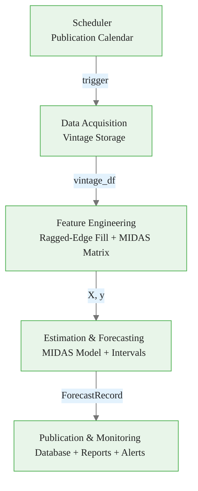
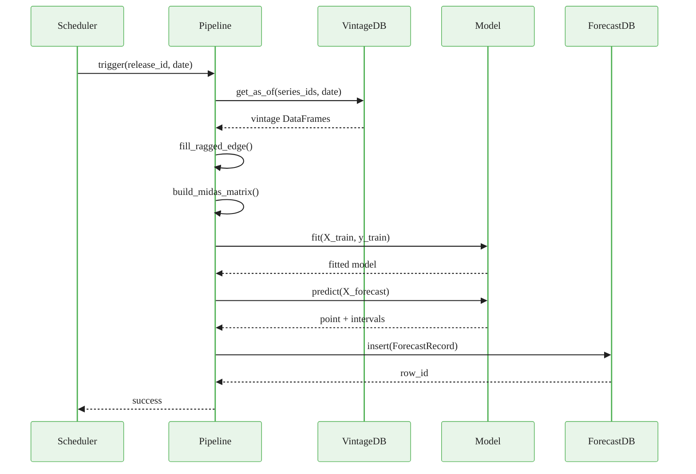

<!-- _class: lead -->

# Pipeline Architecture for Real-Time Nowcasting

## Module 08 — Production Systems

Mixed-Frequency Models: MIDAS Regression and Nowcasting

<!-- Speaker notes: Welcome to Module 08. Up to this point every notebook has assumed data are clean and available on demand. Today we shift to production reality: pipelines that run automatically, handle revisions, and must never silently fail. This deck maps the architecture before you build it in the notebooks. -->

---

## Research vs Production

| Concern | Research Script | Production Pipeline |
|---------|----------------|---------------------|
| Data availability | All series present | Ragged edge on every run |
| Revisions | Ignored | Tracked by vintage date |
| Scheduling | Run manually | Triggered by release calendar |
| Failures | Exception → crash | Retry, alert, continue |
| Audit trail | None | Full reproducibility |
| Latency | Minutes OK | <60 s target |

<!-- Speaker notes: The gap between a research notebook and a production nowcasting system is almost entirely operational, not statistical. The model equations are the same. What changes is everything around the equations: how data arrive, how failures are handled, and how results are stored for later audit. -->

<div class="callout-key">

The key advantage of MIDAS is preserving high-frequency information that temporal aggregation destroys.

</div>

---

## Five-Layer Architecture



Each layer has **one responsibility**. Failures are caught at layer boundaries.

<!-- Speaker notes: This diagram is the skeleton of every nowcasting system described in academic literature, including the NY Fed and ECB implementations. The names of components differ but the five-layer structure is universal. Each arrow is a well-defined interface — change one layer without touching the others. -->

<div class="callout-insight">

**Insight:** Parsimonious weight functions with 2-3 parameters can capture decay patterns that unrestricted models need 12+ parameters to approximate.

</div>

---

## Layer 1 — Scheduler

The pipeline must run **every time new data are published**, not on a fixed clock.

<div class="code-window">
<div class="code-header">
<div class="dots"><span class="dot-red"></span><span class="dot-yellow"></span><span class="dot-green"></span></div>
<span class="filename">example.py</span>
</div>

```python
@dataclass
class Release:
    series_id: str        # "PAYEMS"
    release_date: date    # first Friday of the month
    pub_lag_days: int     # days after reference period end
    frequency: str        # "monthly"
    priority: int         # higher → run immediately
```

</div>

The scheduler polls the `PublicationCalendar` hourly and fires the pipeline for each release event not yet processed.

<!-- Speaker notes: A common mistake is to schedule the pipeline on the first of each month. But payrolls release on the first Friday, CPI in the second or third week, and GDP in the last week of the month after the quarter ends. A calendar-driven trigger is the only correct approach. -->

<div class="callout-warning">

**Warning:** Always account for the real-time data vintage when evaluating nowcast performance. Using revised data overstates accuracy.

</div>

---

## Standard Publication Lags

| Series | Mnemonic | Lag (days) | Frequency |
|--------|----------|------------|-----------|
| ISM PMI | NAPM | 1 | Monthly |
| Nonfarm Payrolls | PAYEMS | 4 | Monthly |
| Initial Claims | ICSA | 5 | Weekly |
| Retail Sales | RETAILSL | 14 | Monthly |
| Industrial Production | INDPRO | 16 | Monthly |
| CPI All Items | CPIAUCSL | 16 | Monthly |
| Advance GDP | GDPC1 | 28 | Quarterly |

These lags define the **information flow** that creates the ragged edge.

<!-- Speaker notes: These numbers are approximate medians. The exact day varies by month and year. For a production system you should fetch the actual release schedule from the BLS, BEA, and Federal Reserve release calendars, or use the FRED API's series/release endpoint which provides next-release metadata. -->

<div class="callout-info">

**Info:** MIDAS models can handle any frequency ratio: monthly-to-quarterly (3:1), daily-to-monthly (~22:1), or even tick-to-daily.

</div>

---

## Layer 2 — Vintage Storage

**Vintage**: a complete snapshot of a series as of a specific date.

```
vintages table
────────────────────────────────────────────
series_id | obs_date   | vintage_date | value
────────────────────────────────────────────
PAYEMS    | 2024-09-01 | 2024-10-04  | 159.1
PAYEMS    | 2024-09-01 | 2024-11-01  | 159.4   ← revised
PAYEMS    | 2024-10-01 | 2024-11-01  | 160.2
```

Query: "What did we know on 2024-10-15?" → `vintage_date <= 2024-10-15`

**Rule**: rows are never modified. Revisions create new rows.

<!-- Speaker notes: The immutability rule is what makes honest evaluation possible. If you update the old row in place you destroy the ability to reconstruct any past nowcast. SQLite with INSERT OR IGNORE on the natural key enforces immutability. The as-of query then gives you the latest vintage available at any date you specify. -->

---

## As-Of Query (Pseudo-Real-Time)

<div class="code-window">
<div class="code-header">
<div class="dots"><span class="dot-red"></span><span class="dot-yellow"></span><span class="dot-green"></span></div>
<span class="filename">example.py</span>
</div>

```python
def get_as_of(series_id: str, as_of_date: date) -> pd.Series:
    df = pd.read_sql("""
        SELECT obs_date, value FROM vintages
        WHERE series_id = ?
          AND vintage_date <= ?          -- only data available then
        ORDER BY obs_date, vintage_date DESC
    """, conn, params=(series_id, as_of_date))
    return (df
        .drop_duplicates("obs_date", keep="first")  # latest vintage
        .set_index("obs_date")["value"])
```

</div>

This single query powers **pseudo-real-time evaluation**: no look-ahead bias.

<!-- Speaker notes: This query is the heart of the system. Notice the vintage_date <= as_of_date filter — it excludes any revision that happened after the forecast date. The drop_duplicates keeps the latest vintage that was available at that time. Running this for every date in your evaluation window gives a genuine pseudo-real-time OOS assessment. -->

---

## Layer 3 — Ragged-Edge Filling

At any forecast date $t$, indicator $i$ may be missing its latest period.

Three production-safe fill methods:

<div class="columns">

**Carry Forward** (default)
Repeat the last observed value. Works well when the series is persistent (slow-moving).

**Zero Fill**
Fill with zero. Appropriate for growth-rate series where zero is the prior.

**AR(1) Projection**
Fit OLS AR(1) on the last 24 observations, extrapolate forward. Costs more compute, more accurate for trending series.

</div>

<!-- Speaker notes: All three methods are defensible. Carry-forward is the most common in practice because it introduces no model error in the fill itself — you are simply repeating the last observation. AR(1) projection is preferred by some central banks for series with strong momentum. Zero-fill is rarely used for levels but is common for return series. -->

---

## Ragged-Edge Illustration

```
Forecast date: 2024-10-15

Series        Oct  Sep  Aug  Jul  Jun
────────────────────────────────────────
PAYEMS    [  ?  |  ●  |  ●  |  ●  |  ●  ]  pub lag = 4 days
INDPRO    [  ?  |  ?  |  ●  |  ●  |  ●  ]  pub lag = 16 days
RETAILSL  [  ?  |  ?  |  ●  |  ●  |  ●  ]  pub lag = 14 days
GDP (Q3)  [  ●  |  ●  |  ●  |  ●  |  ●  ]  released Oct 28

● = observed,  ? = missing → fill before building MIDAS matrix
```

<!-- Speaker notes: This is what the feature matrix looks like on October 15. Payrolls has September but not October. Industrial Production has only through August. GDP for Q3 is not yet released — it comes on October 28. The ragged-edge filler extends each series to the current period using the chosen method, so the MIDAS matrix has no missing values before it enters the estimator. -->

---

## Layer 4 — Estimation

The estimator receives a complete feature matrix $X \in \mathbb{R}^{T \times (K \cdot N)}$ and target $y \in \mathbb{R}^T$.

**Model registry** maps config strings to sklearn estimators:

```python
MODEL_REGISTRY = {
    "elasticnet": ElasticNetCV,
    "ridge":      RidgeCV,
    "lasso":      LassoCV,
}
```

Every run produces a `ForecastRecord` with:
- Point forecast + 80% / 95% prediction intervals
- Number of training observations
- News decomposition (per-indicator surprise contributions)
- Run timestamp for audit

<!-- Speaker notes: The model registry pattern means you can switch from ElasticNet to Ridge by changing one line in the YAML config without touching pipeline code. This is essential for A/B testing model variants in production. The ForecastRecord is a frozen dataclass — once created it cannot be mutated, which prevents accidental overwrites during a pipeline run. -->

---

## Prediction Intervals

<div class="columns">

**Parametric**
Assume $\varepsilon \sim \mathcal{N}(0, \hat{\sigma}^2)$.
$$\hat{y} \pm t_{n-p,\,\alpha/2} \cdot \hat{\sigma}$$
Fast. Requires normality.

**Residual Bootstrap**
Resample training residuals $B=500$ times, re-fit, re-forecast.
$$[\hat{q}_{\alpha/2},\, \hat{q}_{1-\alpha/2}]$$
Slower. Distribution-free.

</div>

In production, use **parametric intervals** for latency and **bootstrap intervals** for the monthly accuracy report.

<!-- Speaker notes: Both methods have their place. The parametric interval is O(1) extra computation and is fine for the live forecast that needs to appear within 60 seconds of data ingestion. The bootstrap interval takes 30-60 seconds of additional compute but gives a more honest coverage assessment. Run the bootstrap offline overnight and attach it to the monthly report. -->

---

## Layer 5 — Publication

Every forecast is written to the `forecasts` table:

```
forecasts table
──────────────────────────────────────────────
forecast_date | target_period | point_forecast | lower_95 | upper_95
──────────────────────────────────────────────
2024-10-04    | 2024-Q3       | 2.71           | 1.83     | 3.59
2024-10-16    | 2024-Q3       | 2.85           | 1.98     | 3.72
2024-10-25    | 2024-Q3       | 2.91           | 2.07     | 3.75
```

One row per run. Rows are never updated — revisions produce new rows.

<!-- Speaker notes: Notice the same quarter is nowcast three times as new data arrive. The forecast evolves from 2.71 to 2.91 as more information becomes available. The database stores all three rows, which lets you plot the nowcast evolution chart that is the standard output of any central bank nowcasting publication. -->

---

## Orchestrator Flow



<!-- Speaker notes: This sequence diagram maps directly to the NowcastingPipeline.run() method in the guide. Each arrow is a method call with a well-defined interface. If any step raises an exception, the Scheduler logs the failure and sends an alert — the pipeline does not crash permanently, it retries on the next trigger. -->

---

## Configuration as Code

All pipeline parameters live in a single YAML file:

```yaml
pipeline:
  target_series_id: "GDPC1"
  series_ids: [PAYEMS, INDPRO, RETAILSL, NAPM, CPIAUCSL]
  n_lags: 12
  fill_method: "carry_forward"
  model: "elasticnet"

scheduler:
  poll_interval_seconds: 3600
  timezone: "America/New_York"
```

Benefits: version control, diff-able, reproducible runs, no magic numbers in code.

<!-- Speaker notes: The YAML config is the contract between the operations team and the data science team. The ops team can change the poll interval or output directory without touching Python code. The data science team can add a new indicator by adding one line to the series_ids list. Everything else adapts automatically. Environment variables like FRED_API_KEY are expanded at load time, never stored in the config file. -->

---

## Revision Handling

When a data revision arrives:

1. **New vintage row inserted** for the revised observation
2. **Existing rows untouched** — immutability preserved
3. **Revision surprise** computed: $\text{surprise}_i = x_i^{\text{revised}} - x_i^{\text{preliminary}}$
4. **News decomposition** updated: $\Delta \hat{y} = \hat{\beta}_i \cdot \text{surprise}_i$
5. **New forecast record** created with the revised inputs

The nowcast revision from a data revision is **the same calculation** as a news decomposition from a new release.

<!-- Speaker notes: This is an elegant property of linear MIDAS models. Whether the nowcast changes because a new data point arrived or because an old data point was revised, the contribution to the forecast change is always coefficient times surprise. The news decomposition framework handles both cases with the same formula. -->

---

## Deployment Checklist

- [ ] `requirements.txt` with pinned versions
- [ ] API keys in environment variables (not config files)
- [ ] SQLite databases in version-controlled `data/` directory (schema only, not rows)
- [ ] Structured JSON logging
- [ ] `/health` endpoint returning last-run timestamp
- [ ] Alert on consecutive failures (e.g. 3 in a row)
- [ ] Monthly accuracy report comparing nowcast to first release GDP

<!-- Speaker notes: This checklist is what separates a production pipeline from a demo. The health endpoint is particularly important — without it, a silently failed pipeline may go unnoticed for days. Configure your monitoring system to alert if the health endpoint reports a last-run timestamp older than 48 hours on a trading day. -->

---

## Summary

<div class="columns">

**Five layers, one responsibility each**
Scheduler → Acquisition → Features → Estimation → Publication

**Two immutability rules**
Vintage rows never modified. Forecast rows never modified.

**One config file**
All parameters in YAML, secrets in environment variables.

**One audit guarantee**
Any past forecast is exactly reproducible from the vintage database.

</div>

Next: Notebook 01 — build this pipeline end-to-end on synthetic macro data.

<!-- Speaker notes: The architecture in this deck is intentionally minimal — it fits in a single Python file. Real central bank systems have many more layers (data validation, automated testing, multi-model ensemble management, web dashboards). But every additional layer is built on top of these five fundamentals. Get these right and the extensions are straightforward. -->
