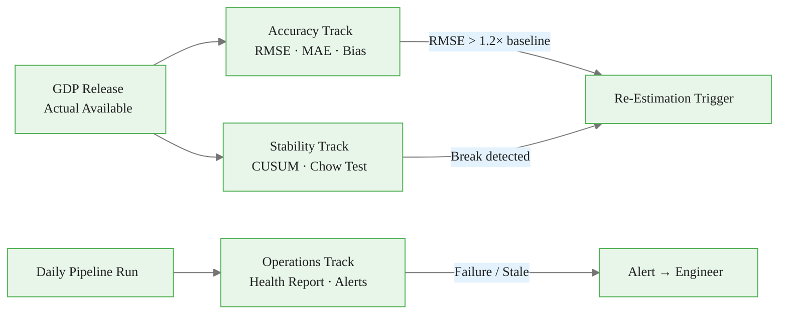

<!-- _class: lead -->

# Model Monitoring and Reporting

## Module 08 — Production Systems

Mixed-Frequency Models: MIDAS Regression and Nowcasting

<!-- Speaker notes: A model deployed without monitoring is a liability. This deck covers the three monitoring tracks every production nowcasting system needs: accuracy tracking, structural stability testing, and operational health. By the end of this deck you will have the tools to answer: is my model still working, and how would I know if it stopped? -->

---

## Why Models Fail Silently

A MIDAS model fit in 2019 exploits statistical regularities observed since 2000.

**What can change:**
- Supply chain disruptions alter the industrial-production-to-GDP link
- Remote-work shift permanently changes the claims-payrolls relationship
- Policy regime changes alter the response of consumption to income

**What does NOT change:**
- The code
- The YAML config
- The forecast numbers — which keep being published

**Monitoring is the only safeguard.**

<!-- Speaker notes: The 2020 COVID shock is the canonical example of silent model failure. Every macro model trained on 2000-2019 data was optimised for a world that no longer existed. Models that had monitoring systems caught the RMSE spike in Q1 2020 immediately. Those without monitoring kept publishing forecasts with no indication of degradation. Silent failure is worse than loud failure. -->

<div class="callout-key">

The key advantage of MIDAS is preserving high-frequency information that temporal aggregation destroys.

</div>

---

## Three Monitoring Tracks



<!-- Speaker notes: These three tracks run on different schedules. The accuracy track runs once per quarter when GDP is released. The stability track runs once per quarter with the same trigger but examines model coefficients rather than forecast errors. The operations track runs every time the pipeline executes — typically 15-30 times per quarter as new releases arrive. -->

<div class="callout-insight">

**Insight:** Parsimonious weight functions with 2-3 parameters can capture decay patterns that unrestricted models need 12+ parameters to approximate.

</div>

---

## Accuracy Track: Rolling Metrics

After each GDP release, compute over the **last 8 quarters** (2 years):

$$\text{RMSE}_t = \sqrt{\frac{1}{W} \sum_{q=t-W+1}^{t} (\hat{y}_q - y_q)^2}$$

$$\text{Bias}_t = \frac{1}{W} \sum_{q=t-W+1}^{t} (\hat{y}_q - y_q)$$

<div class="columns">

**Warning signals**
- RMSE rising trend over 4+ quarters
- Bias consistent sign over 6+ quarters
- MAE spike (outlier vs drift)

**Not warning signals**
- Single-quarter RMSE spike (COVID, GFC)
- Bias reverting within 2 quarters
- RMSE above average in recessions

</div>

<!-- Speaker notes: Eight quarters is a deliberate choice. Two years is long enough to average out single-event shocks but short enough to detect genuine drift within a business cycle. If you use 20 quarters the rolling window will be dominated by the training-period performance and will rarely signal anything. If you use 4 quarters, random variation will trigger too many false alarms. -->

<div class="callout-warning">

**Warning:** Always account for the real-time data vintage when evaluating nowcast performance. Using revised data overstates accuracy.

</div>

---

## Bias Testing

Test $H_0$: $\mathbb{E}[\hat{y} - y] = 0$ (no systematic bias).

$$t = \frac{\bar{e}}{s_e / \sqrt{n}} \sim t_{n-1}$$

where $\bar{e}$ = mean error, $s_e$ = standard deviation of errors.

<div class="code-window">
<div class="code-header">
<div class="dots"><span class="dot-red"></span><span class="dot-yellow"></span><span class="dot-green"></span></div>
<span class="filename">example.py</span>
</div>

```python
result = test_forecast_bias(errors, alpha=0.05)
# {'mean_error': -0.21, 't_stat': -2.8, 'p_value': 0.008,
#  'reject_null': True,
#  'interpretation': 'BIAS DETECTED: reject unbiasedness.'}
```

</div>

**Action rule**: Alert if `reject_null` is True for **two consecutive months**.

<!-- Speaker notes: One rejection can be a false positive — with alpha=0.05 you expect 5% of tests to reject even when the model is unbiased. Two consecutive rejections is much less likely to occur by chance. The two-month rule balances sensitivity against false alarms. For an even more conservative trigger, use a Bonferroni correction on the two tests: require each individual p-value below 0.025. -->

<div class="callout-info">

**Info:** MIDAS models can handle any frequency ratio: monthly-to-quarterly (3:1), daily-to-monthly (~22:1), or even tick-to-daily.

</div>

---

## Structural Break: Chow Test

**When**: You suspect a break at a known date (e.g. COVID-19 onset, policy change).

$$F = \frac{(RSS_R - RSS_{U1} - RSS_{U2}) / k}{(RSS_{U1} + RSS_{U2}) / (n - 2k)} \sim F(k,\, n-2k)$$

| Term | Meaning |
|------|---------|
| $RSS_R$ | Pooled regression residual sum of squares |
| $RSS_{U1}, RSS_{U2}$ | Subperiod regression RSS |
| $k$ | Number of parameters |

Reject $H_0$ (stable coefficients) if $p < 0.05$.

<!-- Speaker notes: The Chow test requires you to specify the break date in advance. If you test many candidate dates without correction, you inflate the Type I error rate — this is the Nerlove-Wallis critique. A practical solution: only test at economically motivated dates (recession onset, major policy announcements) or use the CUSUM test which does not require a pre-specified date. -->

---

## Structural Break: CUSUM Test

**When**: You do not know whether or when a break occurred.

The CUSUM of recursive residuals is:
$$W_r = \frac{1}{\hat{\sigma}} \sum_{t=k+1}^{r} w_t, \quad r = k+1, \ldots, n$$

where $w_t$ are standardised one-step-ahead prediction errors from recursive OLS.

**Decision rule**: Reject parameter stability if $W_r$ crosses the $\pm c_\alpha \sqrt{n-k}$ boundaries.

For $\alpha = 0.05$: $c_{0.05} = 0.948$.

<!-- Speaker notes: The CUSUM test is a sequential test — it examines every possible break date simultaneously without the multiple-testing problem of the Chow test. The recursive residuals are computed by fitting OLS on observations 1 to t-1 and predicting observation t. If the coefficients are constant, these residuals should be white noise and the cumulative sum should stay within the boundary bands. -->

---

## CUSUM Illustration

```
    W_r
  3 |          ╭──────────────────────────
    |     ╭────╯              ↑ upper boundary
  1 |─────╯
    |                   ← CUSUM path
 -1 |
    |                         ↓ lower boundary
 -3 |─ ─ ─ ─ ─ ─ ─ ─ ─ ─ ─ ─ ─ ─ ─ ─ ─ ─
    ├──────────────────────────────────── t
    k                         n

    ✓ CUSUM within bands → no structural break
    ✗ CUSUM crosses band → structural break detected
```

<!-- Speaker notes: In this illustration the CUSUM path stays within the bands, so there is no evidence of structural change. In practice, the path tends to drift upward when the model overpredicts (positive residuals accumulate) or downward when it underpredicts. A sharp single crossing often corresponds to a one-off shock. A gradual drift that eventually crosses the boundary suggests a slow-moving structural change like a regime shift. -->

---

## Re-Estimation Triggers

<div class="code-window">
<div class="code-header">
<div class="dots"><span class="dot-red"></span><span class="dot-yellow"></span><span class="dot-green"></span></div>
<span class="filename">example.py</span>
</div>

```python
trigger = ReEstimationTrigger(
    backtest_rmse=0.45,    # from initial backtest
    rmse_threshold=0.20,   # 20% above baseline
    calendar_quarters=4,   # minimum: re-estimate annually
)

result = trigger.check(current_rmse=0.58, cusum_break=False)
# {'should_reestimate': True,
#  'reason': 'performance (RMSE 0.58 > threshold 0.54 for 2 periods)'}
```

</div>

Three independent trigger types — any one fires re-estimation:

1. **Calendar**: every 4 quarters
2. **Performance**: RMSE > 120% of backtest for 2 periods
3. **Structural break**: CUSUM test crosses boundary

<!-- Speaker notes: The 20% threshold is a reasonable default but should be calibrated to your specific series. For GDP nowcasting where the backtest RMSE is already small (0.3-0.5%), a 20% increase is meaningful. For commodity price nowcasting where baseline RMSE is much higher, you might use a 10% threshold. The calendar trigger is the safety net — even if the performance and structural break tests never fire, you re-estimate annually to incorporate the most recent data. -->

---

## Nowcast Evolution Chart

Standard output at the NY Fed, ECB, and Bundesbank.

Shows how the Q3 2024 GDP nowcast evolved from **July** (first data) to **October** (advance release):

```
  GDP %   ───────────────────────────────────
    3.5 |           ╭───●───●
        |       ╭───╯           95% band
    2.5 |   ╭───╯
        |───╯                 ── advance GDP (actual)
    1.5 |
        ├────────────────────────────────── date
        Jul    Aug    Sep    Oct
        PMI  Payroll  IP   Advance
```

Each `●` is a pipeline run triggered by a data release.

<!-- Speaker notes: The nowcast evolution chart is the primary communication tool for a central bank nowcasting team. The audience — typically policy committees — wants to see not just what the current forecast is, but how confident the model was throughout the quarter and how quickly it converged. A model that converges slowly (wide band until late October) is less useful than one that narrows quickly after payrolls and IP. -->

---

## News Decomposition Waterfall

Explains *why* the nowcast changed between two consecutive runs.

$$\Delta \hat{y} = \sum_i \hat{\beta}_i \cdot \underbrace{(x_i - \mathbb{E}[x_i])}_{\text{surprise}_i}$$

```
Previous nowcast: 2.71%

PAYEMS   ─────────────────────────────────► +0.18
INDPRO   ──────────────────► +0.09
RETAILSL ──────────────► +0.06
ISM_PMI  ◄──── -0.03
CPI      ◄──────────────── -0.07

Current nowcast: 2.94%  (revision = +0.23%)
```

Strong payrolls report was the dominant contributor.

<!-- Speaker notes: The news decomposition is more useful to communication teams than raw forecast numbers. Instead of saying "our forecast went from 2.71% to 2.94%," you can say "the strong September payrolls report added 0.18 percentage points to our GDP growth estimate." This maps the abstract statistical output to recognisable economic events, which builds credibility with policy audiences who may not understand MIDAS regressions but do understand employment reports. -->

---

## Rolling RMSE Chart

Track model accuracy over time. Benchmark against a no-change (random walk) forecast.

```
RMSE
0.7 |                  ← backtest RMSE benchmark = 0.45
0.5 |── threshold ─────────────────────────────
    |    ●   ●              ●   ●
0.3 |● ●   ●   ● ●  ●  ●     ●
    |
    ├──────────────────────────────────── quarter
    2020   2021   2022   2023   2024

    ●  Rolling 8-quarter RMSE
    ── Re-estimation threshold (baseline × 1.20)
```

<!-- Speaker notes: Plot the re-estimation threshold as a horizontal dashed line. When the rolling RMSE dots cross this line, the chart becomes self-explanatory to any audience: the model is performing worse than expected, and re-estimation is warranted. Colour the dots green below the threshold and red above it for an even clearer visual. -->

---

## Daily Health Report Structure

```
============================================================
NOWCASTING PIPELINE HEALTH REPORT
Run timestamp : 2024-10-04T09:23:14Z
Forecast date : 2024-10-04
Target period : 2024-Q3
============================================================

CURRENT NOWCAST
  Point estimate : +2.940%
  80% interval   : [+2.250%, +3.630%]
  95% interval   : [+1.830%, +4.050%]
  Training obs   : 87

ROLLING ACCURACY (last 8 quarters)
  RMSE : 0.4312
  MAE  : 0.3817
  Bias : +0.0234

BIAS TEST
  No significant bias detected. p-value = 0.412

CUSUM STABILITY
  No structural break detected.

RE-ESTIMATION
  Trigger : no trigger
  Action  : No action
============================================================
```

<!-- Speaker notes: This health report should be generated and logged after every pipeline run. In production, email it to the team every morning. The report is intentionally text-based (not a dashboard) because it can be read in an email client, saved as a flat file, and diffed between dates. A dashboard is valuable for exploration but the plain-text report is the primary audit artifact. -->

---

## Alert Severity Table

| Alert | Condition | Severity | Action |
|-------|-----------|----------|--------|
| Pipeline failure | Exception in any layer | Critical | Check logs, re-run |
| Stale forecast | No new forecast >48h | High | Check scheduler + data |
| RMSE spike | >2× backtest RMSE | High | Inspect recent releases |
| Sustained bias | t-test rejects H0 twice | Medium | Check revision pattern |
| CUSUM break | Test crosses boundary | Medium | Run Chow test |
| Missing indicator | Series unavailable | Medium | Carry-forward, flag |

**Critical** = wake someone up. **High** = same-day response. **Medium** = next working day.

<!-- Speaker notes: Alert fatigue is a real risk. If too many medium alerts fire routinely, engineers start ignoring all alerts including the critical ones. Keep the critical alert threshold high — only pipeline-killing failures. The medium alerts are informational: they feed into the quarterly model review rather than requiring immediate action. Log everything; page on critical only. -->

---

## Model Comparison Dashboard

When running multiple model variants:

```python
comparison = model_comparison_table(
    model_errors={
        "elasticnet":   en_errors,
        "ridge":        ridge_errors,
        "equal_weight": combo_errors,
    },
    baseline="elasticnet",
)
```

| model | rmse | mae | dm_pvalue | significantly_better |
|-------|------|-----|-----------|----------------------|
| equal_weight | 0.391 | 0.318 | 0.041 | True |
| elasticnet | 0.431 | 0.352 | — | — |
| ridge | 0.448 | 0.371 | 0.623 | False |

<!-- Speaker notes: The Diebold-Mariano test with Newey-West standard errors is the correct way to compare model forecast accuracy. Using the naive t-test on squared errors would give anti-conservative p-values because forecast errors are serially correlated. The DM test accounts for this correlation. A p-value of 0.041 for the equal-weight combination says: at the 5% level, the combination significantly outperforms the ElasticNet alone. Promote it to production. -->

---

## Summary

<div class="columns">

**Accuracy track**
Rolling RMSE/MAE/bias computed quarterly. Alert if RMSE exceeds 120% of backtest benchmark for two periods.

**Stability track**
CUSUM test quarterly. Chow test at motivated break dates. Trigger immediate re-estimation on break.

**Operations track**
Daily health report after every run. Structured alert rules with defined severity and actions.

**Key outputs**
Nowcast evolution chart, news decomposition waterfall, rolling RMSE chart, model comparison table.

</div>

Next: Notebook 02 — build an interactive monitoring dashboard.

<!-- Speaker notes: The monitoring framework described here is the minimum viable monitoring for a production nowcasting system. It is intentionally lightweight — everything can be implemented in standard Python with numpy, pandas, scipy, and matplotlib. More sophisticated systems add Bayesian model comparison, sequential probability ratio tests, and machine-learning anomaly detection. But start with the fundamentals in this deck before adding complexity. -->
