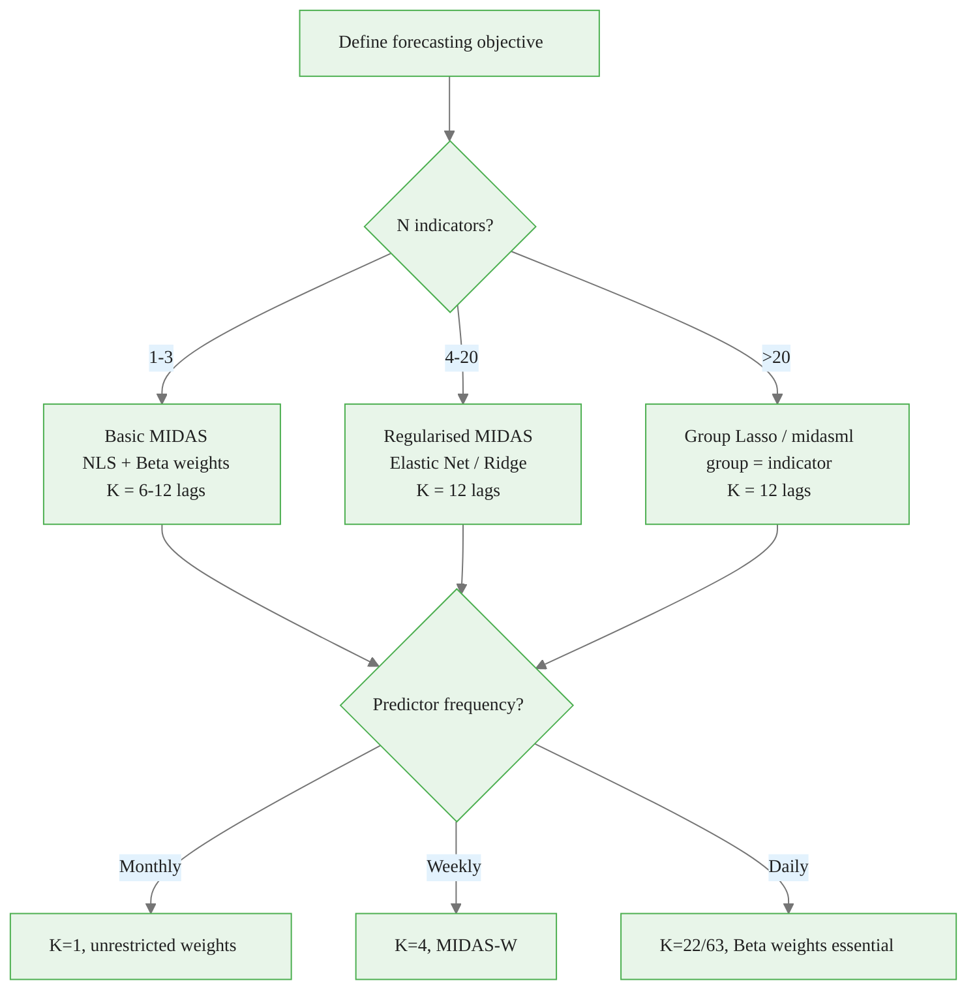
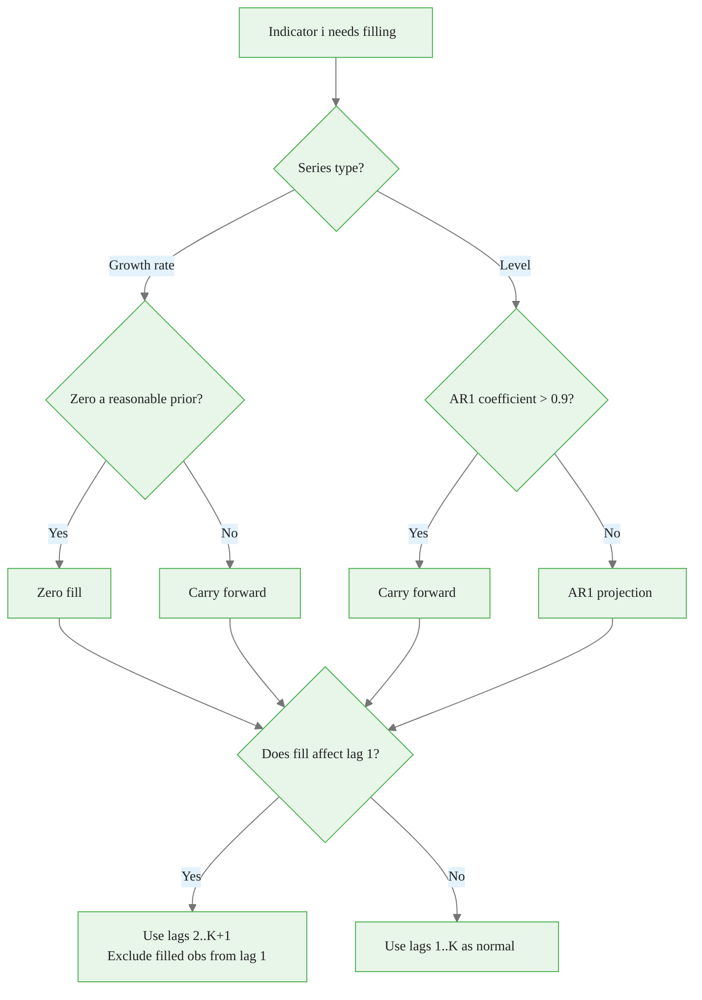
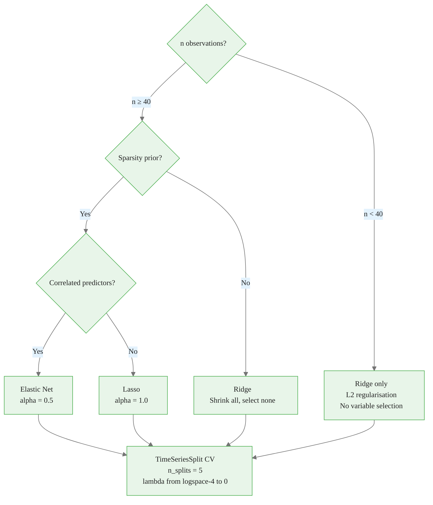
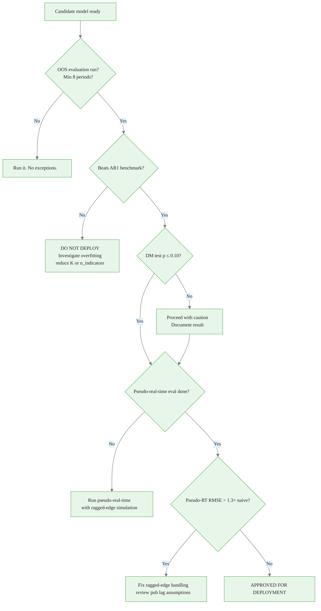
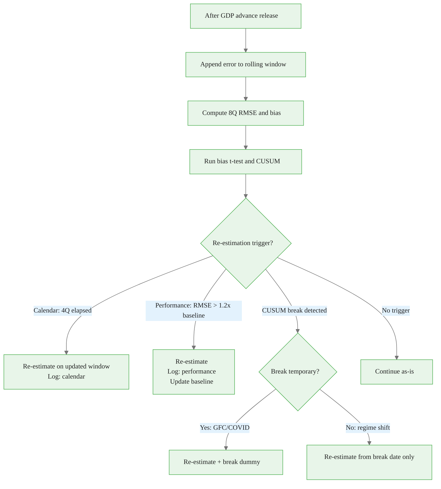

<!-- _class: lead -->

# Decision Flowcharts for Production Nowcasting

## Module 08 — Production Systems

Mixed-Frequency Models: MIDAS Regression and Nowcasting

<!-- Speaker notes: This deck consolidates the key decision points from the entire course into a set of actionable flowcharts. Think of it as the reference card you reach for when you sit down to build a new nowcasting model or diagnose a production issue. We cover model specification, ragged-edge strategy, estimation approach, evaluation gates, and production maintenance decisions. -->

---

## The Five Decision Trees

1. **Model Specification** — indicators, lags, weight function
2. **Ragged-Edge Strategy** — per-indicator fill method
3. **Estimation** — regularisation family and CV design
4. **Evaluation Gates** — production readiness checks
5. **Production Maintenance** — re-estimation and retirement

These trees are not sequential — you cycle through them throughout the model lifecycle.

<!-- Speaker notes: A common mistake is to treat model building as a one-time event: specify, estimate, deploy, done. In reality it is a cycle. You revisit the specification tree whenever new indicators become available. You revisit the estimation tree whenever the training window grows substantially. You run the evaluation gate every quarter. Think of these trees as the recurring decision rituals of a nowcasting team. -->

<div class="callout-key">

The key advantage of MIDAS is preserving high-frequency information that temporal aggregation destroys.

</div>

---

## Tree 1: Model Specification



<!-- Speaker notes: The number of indicators is the primary branching point because it determines the dimensionality of the problem and therefore the appropriate regularisation strategy. With 1-3 indicators NLS estimation with Beta weights is feasible and interpretable. With 20+ indicators you need automatic selection because manual specification of which indicators matter is infeasible. -->

<div class="callout-insight">

**Insight:** Parsimonious weight functions with 2-3 parameters can capture decay patterns that unrestricted models need 12+ parameters to approximate.

</div>

---

## Weight Function Selection

| Situation | Recommendation | Rationale |
|-----------|---------------|-----------|
| $K \leq 4$ lags | Unrestricted OLS | $K$ free params is fine |
| $K = 5$–$12$ lags, monthly predictor | Unrestricted OLS | Still tractable |
| $K = 12$–$22$ lags, daily predictor | Beta polynomial | 22 params → 2 |
| $K > 22$ lags | Beta polynomial | Regularisation essential |
| Monotone decay expected (daily RV) | Beta$(1, \theta_2)$ | Forces monotone decay |

**Decision rule**: use Beta weights when $K > 12$ or when economic theory implies monotone decay.

<!-- Speaker notes: The Beta polynomial replaces K free lag coefficients with 2 shape parameters. When K is small, this restriction may bind unnecessarily and cost forecasting accuracy. When K is large, the restriction is essential — you cannot estimate 22 separate lag coefficients from 60 quarterly observations. The break-even point is roughly K=12: above that, Beta weights almost always help. -->

<div class="callout-warning">

**Warning:** Always account for the real-time data vintage when evaluating nowcast performance. Using revised data overstates accuracy.

</div>

---

## Tree 2: Ragged-Edge Fill Strategy



<!-- Speaker notes: The key insight here is that the fill strategy decision should be made separately for each indicator based on its statistical properties, not as a global setting. The practical default is carry-forward for everything, but a modelling team that wants to squeeze out additional accuracy will differentiate by series type. The lag-shift option in the bottom row is an advanced technique that avoids letting a filled value dominate the most informative lag position. -->

<div class="callout-info">

**Info:** MIDAS models can handle any frequency ratio: monthly-to-quarterly (3:1), daily-to-monthly (~22:1), or even tick-to-daily.

</div>

---

## Fill Method Quick Reference

| Series | Persistence | Fill method |
|--------|-------------|-------------|
| CPI (level) | Very high | Carry forward |
| IP growth (MoM %) | Low | Zero fill |
| Unemployment rate | High | Carry forward |
| ISM PMI (level) | Low | AR1 projection |
| Oil return (daily %) | Very low | Zero fill |
| Treasury yield (daily) | High | Carry forward |
| Payrolls (level) | High | Carry forward |
| Payroll growth (MoM %) | Low | Zero fill |

**Default**: carry-forward for all series. Override only with documented justification.

<!-- Speaker notes: This table is the quick-lookup version of the decision tree on the previous slide. In a production system, the fill method for each series should be stored in the configuration file, not hard-coded. This makes it auditable and easy to change in response to analysis. Document the justification for any non-default choice in a comment next to the config entry. -->

---

## Tree 3: Estimation and Regularisation



<!-- Speaker notes: With fewer than 40 observations you should not use Lasso or Elastic Net. The CV estimate of lambda will be very unstable with only 5-8 training folds and the resulting model will either be fully sparse (all zeros) or barely regularised depending on random variation. Ridge is much more stable in this regime because it has a closed-form solution and the optimal lambda can be estimated more reliably. -->

---

## Cross-Validation Rules for Time Series

**Never use random k-fold CV for time series.**

<div class="code-window">
<div class="code-header">
<div class="dots"><span class="dot-red"></span><span class="dot-yellow"></span><span class="dot-green"></span></div>
<span class="filename">example.py</span>
</div>

```python
# WRONG: shuffles time order
from sklearn.model_selection import KFold
cv = KFold(n_splits=5, shuffle=True)

# CORRECT: respects temporal order
from sklearn.model_selection import TimeSeriesSplit
cv = TimeSeriesSplit(n_splits=5, gap=1)
```

</div>

<div class="columns">

**TimeSeriesSplit with gap=1**
- Fold 1: train [1..T/5], test [T/5+2]
- Fold 2: train [1..2T/5], test [2T/5+2]
- ...
- The gap prevents using t to predict t+1 with the same data that were used to fit at t+1

**Minimum fold size**
$$n_{\min} = \max(40,\; 3 \cdot K \cdot N)$$
where $K$ = lags, $N$ = indicators.

</div>

<!-- Speaker notes: The gap parameter in TimeSeriesSplit is crucial but often forgotten. Without it, the test observation immediately follows the last training observation. This is fine for random processes but creates subtle leakage in macro data where monthly series have strong autocorrelation. With gap=1, you skip one observation between the end of training and the test observation, which is the correct protocol for a 1-step-ahead forecast. -->

---

## Tree 4: Evaluation Gates



<!-- Speaker notes: The 1.3x threshold for pseudo-real-time versus naive OOS RMSE is empirically motivated. In well-calibrated systems, the pseudo-real-time RMSE is typically 5-20% higher than naive because preliminary data is noisier than revised data. If you see a 50% or greater degradation, something is wrong with the ragged-edge handling, often an incorrectly assumed publication lag that means the model thinks data are available when they are not. -->

---

## The Pseudo-Real-Time Standard

**Naive OOS evaluation** (incorrect):
- Use final revised data as inputs
- Fit on $t=1,...,T_0$, predict $t=T_0+1,...,T$
- Inflates apparent accuracy by using data that did not exist at forecast time

**Pseudo-real-time evaluation** (correct):
- At each forecast date $\tau$, use only data available as of $\tau$
- Apply the ragged-edge fill as it would have been applied in production
- Compare to **advance** GDP release (first published figure), not final revised

$$\text{RMSE}^{\text{prt}} = \sqrt{\frac{1}{T-T_0} \sum_{t=T_0+1}^{T} (\hat{y}_t^{(\tau_t)} - y_t^{\text{advance}})^2}$$

<!-- Speaker notes: The advance GDP release is used as the target, not the final revised figure. This is because in production you would be evaluated against the first published number — that is what appears in the newspapers and what policymakers react to. The final revised GDP (which incorporates benchmark revisions and methodology changes) was not available at the time of the forecast and cannot be what you were trying to forecast. -->

---

## Tree 5: Production Maintenance



<!-- Speaker notes: The distinction between a temporary break and a regime shift matters for the re-estimation strategy. COVID-19 was an extraordinary shock that subsequently partially reversed — many macroeconomic relationships that appeared broken in 2020 recovered by 2021-22. Adding a 2020 dummy and re-estimating on the full sample is often better than discarding the pre-2020 data entirely. A genuine regime shift (like the post-1980 Great Moderation or the post-2022 inflation regime) warrants using only post-break data. -->

---

## Retirement Criteria

**Retire the model if ALL three conditions hold for 4 consecutive quarters:**

1. OOS RMSE > 2× AR(1) benchmark RMSE
2. Re-estimation (calendar, performance, and structural break) does not recover performance
3. A structurally different model (DFM, ML ensemble) achieves DM test $p < 0.05$

**Before retiring**, document:
- Training window used at deployment
- Date and magnitude of performance deterioration
- Which triggers fired and what re-estimation was attempted
- Reason for retirement decision

**Keep the model code and all forecast records.** Future research may analyse the retirement.

<!-- Speaker notes: Retirement documentation is important for institutional memory. A model that was retired in 2020 because of COVID may be worth reviving in a later period. The documentation tells the next team: this is why we stopped, these are the conditions under which performance might recover, and this is the full record of what the model did. Without documentation, the institutional knowledge is lost when the original team members move on. -->

---

## Diagnostic Quick Reference

| Symptom | First check | Likely cause |
|---------|-------------|--------------|
| OOS RMSE >> in-sample | Data leakage test | Scaler fit on full sample |
| OOS RMSE ≥ AR benchmark | Overfitting check | K too large, n too small |
| Pseudo-RT >> naive RMSE | Pub lag verification | Wrong lag assumption |
| Beta NLS fails to converge | Multiple start points | Poor initialisation |
| Bias growing over time | Bias by period | Structural break |
| RMSE stable, bias drifting | Revision analysis | Systematic data revision |
| Missing forecast (stale) | Scheduler logs | Data source unavailable |
| High RMSE spike then recovery | Single outlier check | One-off shock (not break) |

<!-- Speaker notes: This table is the cheat-sheet version of all the diagnostic decision trees in this module. Print it out and keep it next to your monitor. Most production issues fall into one of these eight categories. The first check column gives you the specific action to take — run that check before going deeper into the codebase. This prevents the common mistake of spending hours debugging code when the real issue is a mis-specified publication lag in the YAML config. -->

---

## Summary Checklist

<div class="columns">

**Before deployment**
- [ ] Indicator set justified economically
- [ ] K chosen by frequency ratio
- [ ] Fill method documented per series
- [ ] Expanding-window OOS ≥ 8 periods
- [ ] Beats AR(1) benchmark, DM p ≤ 0.10
- [ ] Pseudo-real-time RMSE < 1.3× naive

**After deployment**
- [ ] Re-estimation triggers configured
- [ ] Baseline RMSE stored in config
- [ ] Daily health report generating
- [ ] Alert routing tested end-to-end
- [ ] Recovery procedure documented
- [ ] Quarterly review scheduled

</div>

<!-- Speaker notes: These two checklists mark the transition from the data science phase to the operations phase of the model lifecycle. Everything on the left is the responsibility of the data scientist. Everything on the right is the responsibility of the MLOps or platform engineer — though in smaller teams, these roles often overlap. Neither list is optional. Skipping any item creates a silent risk that will materialise at the worst possible time. -->

---

## Course Synthesis

The five modules leading to this point have built up:

| Module | Concept | Production use |
|--------|---------|---------------|
| M01–02 | MIDAS fundamentals + NLS | Core estimator in Layer 4 |
| M03 | Beta polynomial weights | Feature in any K>12 model |
| M04 | DFMs | Alternative to MIDAS for large N |
| M05 | Regularised MIDAS + ML | Model registry options |
| M06 | Financial MIDAS | Risk and volatility applications |
| M07 | Macro applications | GDP/CPI/payrolls use cases |
| M08 | **Production systems** | **Wraps all of the above** |

<!-- Speaker notes: Module 08 is the integration point for everything that came before. The pipeline architecture wraps the estimators from M01-02, the regularisation strategies from M05, and the use cases from M06-07. The monitoring framework is universal — it applies regardless of whether the underlying model is a basic MIDAS, a Group Lasso, or an ML ensemble. The decision trees in this deck are the practical codification of everything the course has taught. -->

---

## You Now Have a Complete Framework

**What you can build:**
- A production nowcasting pipeline from scratch
- Multi-indicator MIDAS for GDP, CPI, and payrolls
- MIDAS-RV and MIDAS-VaR for financial risk
- Monitoring and alerting infrastructure

**What you can decide:**
- Which indicators, lags, and weights to use
- When to re-estimate or retire a model
- How to handle missing data in production
- Whether your model is actually better than AR(1)

<!-- Speaker notes: The goal of this course was not to teach you one specific model. It was to give you the full stack: the statistical foundations, the implementation patterns, the evaluation protocols, and the production architecture. With these tools you can adapt to any mixed-frequency forecasting problem, not just the examples in the notebooks. The decision trees in this deck are your guide for the problems this course never explicitly covered. Congratulations on completing Module 08. -->
