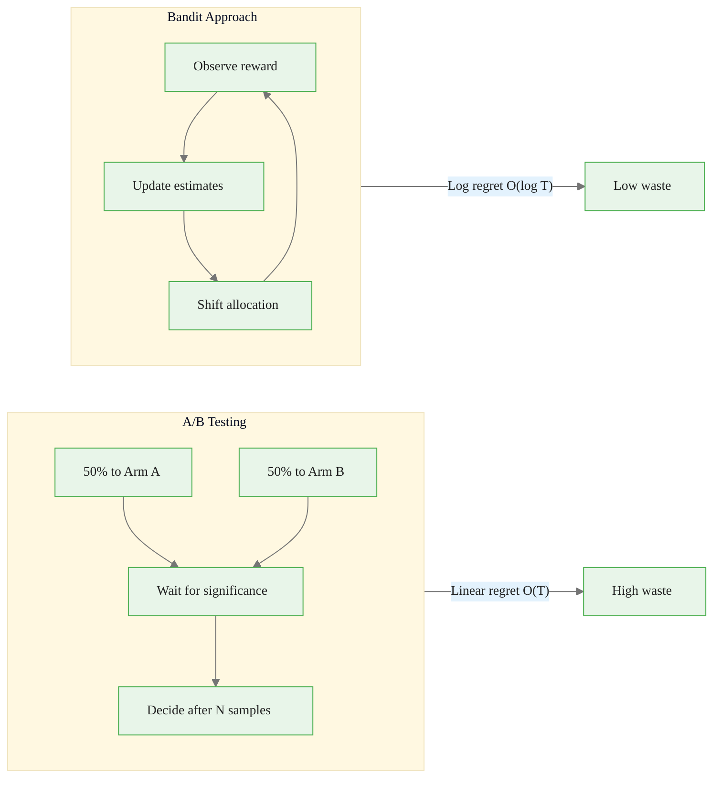
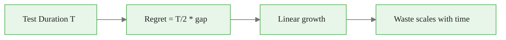
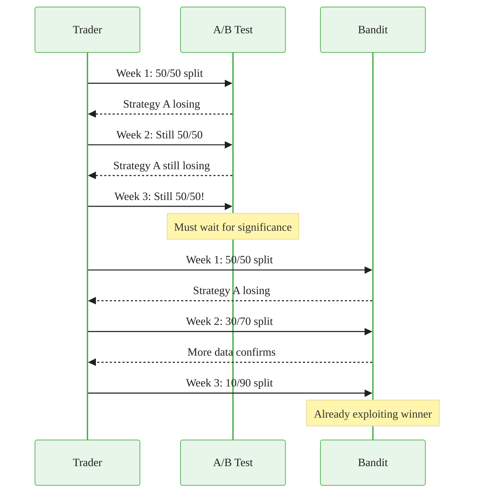
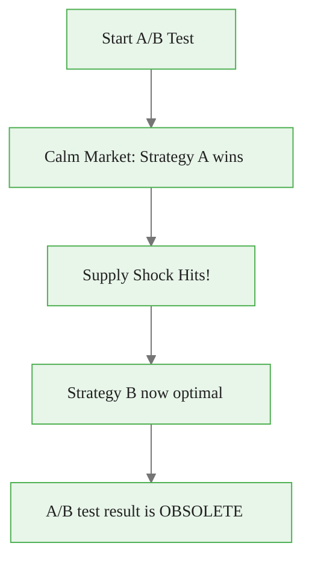
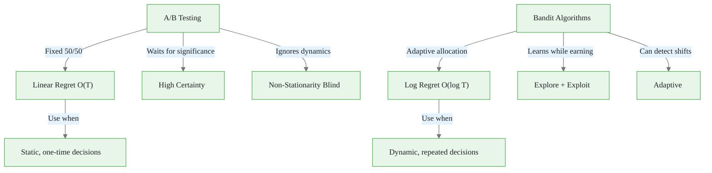

<!-- _class: lead -->

# The Limits of A/B Testing

## Module 0: Foundations
### Multi-Armed Bandits for Commodity Trading

<!-- Speaker notes: Welcome to the opening deck of our multi-armed bandits course. We start by examining why A/B testing -- the gold standard for comparing options -- falls short in dynamic settings like commodity trading. By the end, you will understand the core problem that motivates the entire course: fixed allocation wastes capital. -->

---

## In Brief

A/B testing allocates traffic **evenly** between options until statistical significance is reached.

> **Problem:** You keep sending 50% of traffic to the inferior option even after it's clearly losing.

In commodity trading, this means continuing to allocate capital to **underperforming strategies** while evidence accumulates.

<!-- Speaker notes: The key takeaway here is that A/B testing prioritizes statistical certainty over efficiency. In a commodity context, the 50/50 split means you are literally losing money on the inferior strategy for the entire test duration. This is the "regret" concept we will formalize later. -->

<div class="callout-key">

Bandits learn AND earn simultaneously -- the core advantage over traditional A/B testing.

</div>

---

## Key Insight

> **A/B testing is a snapshot; bandits are a steering wheel.**

- A/B tests prioritize **certainty** over **efficiency**
- They minimize false positives but **maximize opportunity cost**
- In dynamic environments like commodity markets, you need to **learn AND earn simultaneously**

<!-- Speaker notes: This analogy is worth emphasizing. A/B tests take a snapshot and wait -- bandits continuously steer. Ask the audience: would you rather wait 4 weeks to know which trading strategy is better, or start shifting capital within days? That is the core value proposition of bandit algorithms. -->

<div class="callout-insight">

**Insight:** The exploration-exploitation tradeoff is not a fixed ratio -- it should adapt as uncertainty decreases over time.

</div>

---

## A/B Test vs Bandit: Allocation Over Time

```
A/B TESTING (Fixed Allocation)
Time:      0%    25%    50%    75%   100%
           |------|------|------|------|
Option A:  50%    50%    50%    50%    50%   <-- Always 50% even if losing
Option B:  50%    50%    50%    50%    50%

BANDIT (Adaptive Allocation)
Time:      0%    25%    50%    75%   100%
           |------|------|------|------|
Option A:  50%    35%    20%    10%     5%   <-- Reduces losing arm quickly
Option B:  50%    65%    80%    90%    95%   <-- Exploits winner sooner
```

<!-- Speaker notes: Walk through the ASCII diagram line by line. Emphasize that the bandit approach does not sacrifice learning -- it still explores, just less over time. The key visual contrast is the flat lines (A/B) versus the converging lines (bandit). In dollar terms, if each percentage point is $10K of capital, the bandit approach saves tens of thousands in opportunity cost. -->

<div class="callout-warning">

**Warning:** Non-stationary reward distributions violate bandit assumptions. Always implement change detection in production systems.

</div>

---

## Cumulative Regret Comparison

```
A/B Test:  ████████████████████ (wastes ~40-45% of traffic)
Bandit:    ██████░░░░░░░░░░░░░░ (wastes ~15-20% of traffic)
```



<!-- Speaker notes: The regret bars are a simplified visual. The crucial distinction is growth rate: A/B test regret grows linearly with time (the longer you test, the more you waste), while bandit regret grows logarithmically (it slows down). This O(T) vs O(log T) gap is the mathematical foundation for why bandits outperform in sequential settings. -->

<div class="callout-info">

**Info:** The regret of the best bandit algorithms grows logarithmically with time, compared to linearly for A/B testing.

</div>

---

## Formal Definition: A/B Test Framework

**Test statistic (two-proportion z-test):**

$$z = \frac{\hat{p}_B - \hat{p}_A}{\sqrt{\hat{p}(1 - \hat{p})\left(\frac{2}{n}\right)}}$$

Reject $H_0$ if $|z| > z_{\alpha/2}$ (e.g., 1.96 for $\alpha = 0.05$).

<!-- Speaker notes: This is the standard two-proportion z-test. Walk through each component: the numerator is the observed difference, the denominator is the standard error under the null hypothesis. The key limitation is that n must be predetermined -- you cannot peek at the data and stop early without inflating your false positive rate. This rigidity is exactly what bandits avoid. -->

---

## Sample Size Formula

$$n = \frac{2(z_{\alpha/2} + z_\beta)^2 \cdot \bar{p}(1-\bar{p})}{(p_B - p_A)^2}$$

Where:
- $\bar{p} = (p_A + p_B)/2$ (pooled proportion)
- $\beta$ = Type II error rate ($1 - \text{power}$)

<!-- Speaker notes: This formula determines how many observations you need per variant. Notice the denominator: small effect sizes require enormous sample sizes. For commodity trading, where differences between strategies may be subtle (e.g., 1-2% Sharpe difference), this means thousands of trades -- during which you are allocating 50% to the loser. -->

---

## The Cost of A/B Testing

During the entire test duration $T$, you allocate $T/2$ observations to the inferior arm:

$$R(T) = \frac{T}{2} \cdot |\mu_A - \mu_B|$$

> This regret is **linear in T** -- the longer you test, the more you waste.



<!-- Speaker notes: This is the punchline of the deck. Linear regret means the cost of testing scales directly with time. If the gap between strategies is $50K/month and you test for 3 months, you waste approximately $75K on the inferior strategy. Bandits reduce this to logarithmic growth, which is dramatically cheaper. -->

---

## Intuitive Explanation: Restaurant Delivery

<div class="columns">
<div>

### A/B Testing Approach
- Week 1-4: Order from each 50/50
- Week 5: Analyze, achieve significance
- **Result:** Bad food 50% of the time for a month

</div>
<div>

### Bandit Approach
- Week 1: Try each 50/50
- Week 2: Good one clearly better, shift 70/30
- Week 3: Strong evidence, shift 85/15
- **Result:** Good food ~75% of the time AND learned

</div>
</div>

<!-- Speaker notes: This analogy makes the abstract concept concrete. Everyone has experienced choosing between restaurants. The A/B approach forces you to eat bad food half the time for weeks. The bandit approach lets you shift toward the good restaurant as soon as evidence starts accumulating. Use this to build intuition before the mathematical treatment. -->

---

## Commodity Trading Example

You have two crude oil trading strategies:

| Approach | Behavior | Consequence |
|----------|----------|-------------|
| **A/B test** | 50% capital to losing strategy for weeks | Massive opportunity cost |
| **Bandit** | Shifts capital to winner within days | Small exploratory bets maintained |



<!-- Speaker notes: The sequence diagram shows the contrast in real time. Note the A/B test is locked at 50/50 for all three weeks even as evidence accumulates. The bandit shifts from 50/50 to 30/70 to 10/90. In dollar terms, if we are allocating $1M total, the bandit saves roughly $200K of exposure to the losing strategy over 3 weeks. -->

---

## Code: A/B Test Regret Setup

<div class="code-window">
<div class="code-header">
<div class="dots"><span class="dot-red"></span><span class="dot-yellow"></span><span class="dot-green"></span></div>
<span class="filename">example.py</span>
</div>

```python
import numpy as np
import matplotlib.pyplot as plt

def ab_test_simulation(p_A=0.05, p_B=0.08, n_trials=10000):
    """Simulate A/B test showing wasted traffic."""
    arms = np.array([p_A, p_B])
    best_arm = np.argmax(arms)
    # A/B test: always 50/50 allocation
    choices = np.random.choice([0, 1], size=n_trials)
    rewards = np.random.binomial(1, arms[choices])
    return arms, best_arm, choices
```

</div>

<!-- Speaker notes: This first code slide sets up the simulation. We define two arms with known probabilities (5% vs 8% conversion). The A/B test randomly assigns each trial to arm 0 or 1 with equal probability. Note the simplicity -- this is the entire A/B test logic. The next slide calculates regret from these choices. -->

---

## Code: Regret Calculation and Visualization

<div class="code-window">
<div class="code-header">
<div class="dots"><span class="dot-red"></span><span class="dot-yellow"></span><span class="dot-green"></span></div>
<span class="filename">example.py</span>
</div>

```python
def calculate_ab_regret(arms, best_arm, choices):
    """Calculate and plot cumulative regret."""
    optimal_reward = arms[best_arm]
    actual_rewards = arms[choices]
    regret = optimal_reward - actual_rewards
    cumulative_regret = np.cumsum(regret)

    plt.figure(figsize=(10, 4))
    plt.plot(cumulative_regret, linewidth=2)
    plt.xlabel('Trial Number')
    plt.ylabel('Cumulative Regret')
    plt.title('A/B Test Waste: Regret Grows Linearly')
    plt.grid(alpha=0.3)
    return cumulative_regret
```

</div>

<!-- Speaker notes: We split the simulation into two slides for readability. This function computes the per-trial regret (best arm reward minus chosen arm reward) and accumulates it. The resulting plot shows a straight line going up -- that is linear regret. Every trial on the inferior arm adds to the total. With bandits, this line curves and flattens. -->

---

<!-- _class: lead -->

# Common Pitfalls

<!-- Speaker notes: Now we cover four common mistakes that practitioners make with A/B testing. Each one is especially damaging in commodity trading where capital is at stake. These pitfalls motivate why we need adaptive methods. -->

---

## Pitfall 1: The Peeking Problem

> Checking results before reaching predetermined sample size and stopping early.

- Inflates Type I error from 5% to **20-30%**
- Random walks cross significance thresholds spuriously

**Commodity example:** You test two gold trading signals, see one ahead after 500 trades, stop the test. The signal degrades over the next month -- it was just luck.

<!-- Speaker notes: Peeking is the most common A/B testing mistake. Every time you check, you give the random walk another chance to cross the significance threshold by chance. After 5 peeks, your effective alpha can be 20-30%. In commodity trading, this means you may adopt a strategy that appeared to work but was just noise. Sequential testing methods (like bandits) handle this naturally because they are designed for continuous monitoring. -->

---

## Pitfall 2: Simpson's Paradox

> A trend appears in subgroups but **reverses** when groups are combined.

Aggregating across different market conditions can **hide regime-dependent performance**.

**Commodity example:** Strategy A beats B during both high-vol and low-vol periods, but appears **worse overall** because you tested it more during unfavorable conditions.

<!-- Speaker notes: Simpson's paradox is subtle and dangerous. In commodity markets, different regimes (trending vs mean-reverting, high-vol vs low-vol) can completely reverse which strategy is better. If your test period is unevenly split across regimes, the aggregate result can be misleading. Contextual bandits (Module 3) address this by conditioning on market state. -->

---

## Pitfall 3: Fixed Horizon Fallacy

> Believing you must wait until predetermined sample size even when one option is clearly dominant.

- "Clearly losing" often emerges within 10-20% of planned samples
- You waste the remaining **80%** gathering unnecessary precision

**Commodity example:** After 200 natural gas trades, one strategy is down 15% and the other is up 12%. A/B testing says wait for 800 more trades.

<!-- Speaker notes: This is the flip side of peeking. Strict A/B testing says you cannot stop early, even when the evidence is overwhelming. In commodity trading with real money at stake, waiting for statistical significance while losing $50K/week on the inferior strategy is irrational. Bandit algorithms naturally stop exploring arms that are clearly inferior. -->

---

## Pitfall 4: Non-Stationarity Blindness

> Assuming true parameters remain constant throughout the test.



**Commodity example:** You test wheat inventory strategies during calm markets. Then a drought hits -- the optimal strategy flips entirely.

<!-- Speaker notes: This is perhaps the most damaging pitfall for commodity traders. Markets are inherently non-stationary: supply shocks, policy changes, seasonal effects, and regime shifts constantly alter which strategy is optimal. An A/B test assumes the world stays the same during the test -- a dangerous assumption. Module 6 covers non-stationary bandits specifically for this problem. -->

---

## Connections

<div class="columns">
<div>

### Builds On
- Basic probability and statistics
- Hypothesis testing fundamentals
- Statistical power and sample size

</div>
<div>

### Leads To
- Multi-armed bandit algorithms
- Regret analysis and guarantees
- Online learning and adaptive experimentation
- Contextual bandits

</div>
</div>

<!-- Speaker notes: This deck establishes the problem that the rest of the course solves. Module 1 introduces the first bandit algorithms (epsilon-greedy, UCB, softmax) that address the fixed-allocation limitation. Module 2 adds Bayesian approaches (Thompson Sampling) for even more efficient exploration. Module 6 tackles non-stationarity directly. -->

---

## Practice: Sample Size Trap

You test two commodity trading algorithms:
- Algorithm A: true Sharpe = 1.2
- Algorithm B: true Sharpe = 1.5

After 500 trades each, B is clearly outperforming (p=0.03).

> **Question:** What is the opportunity cost of continuing the A/B test to 1,000 trades per algorithm?

<!-- Speaker notes: Walk through the calculation: the gap is 0.3 Sharpe units. Over 500 additional trades per algorithm, allocating 50% to the inferior one means roughly 250 trades at 0.3 Sharpe deficit. This exercise makes the cost of A/B testing concrete and personal. The answer should motivate wanting a better approach. -->

---

## Practice: Regret Calculator

```python
def calculate_regret(arm_means, choices, rewards=None):
    """Calculate cumulative regret for a sequence of arm choices."""
    # TODO: Implement this
    pass

# Test case: Three strategies, round-robin allocation
arm_means = [0.05, 0.08, 0.06]
ab_test_choices = [0, 1, 2] * 1000
regret = calculate_regret(arm_means, ab_test_choices)
# Should show regret accumulating linearly
```

**Expected:** For round-robin across K arms, regret grows as $T \cdot (\mu^* - \bar{\mu})$

<!-- Speaker notes: This is a self-check exercise. Students should implement the regret calculation: for each choice, compute the gap between the best arm mean and the chosen arm mean, then cumulate. The key insight is that round-robin (equal allocation) produces linear regret, just like A/B testing. Encourage students to plot the result and observe the straight line. -->

---

## Visual Summary



<!-- Speaker notes: This visual summary captures the entire deck in one diagram. Left side: A/B testing with its limitations. Right side: bandits with their advantages. The bottom row gives the decision rule -- use A/B for one-shot decisions, bandits for repeated sequential decisions. Most commodity trading falls squarely in the bandit territory. -->
