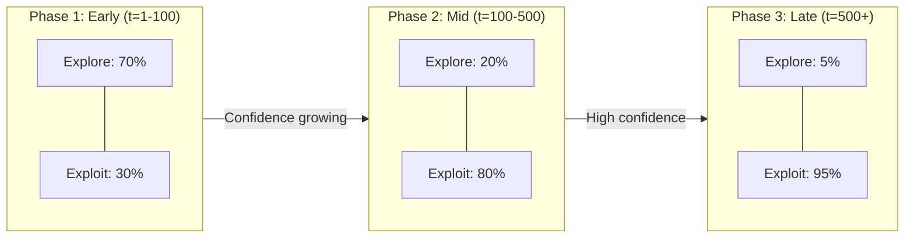
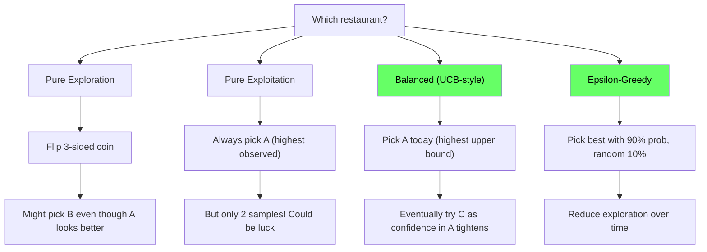
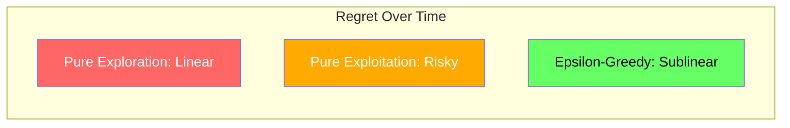
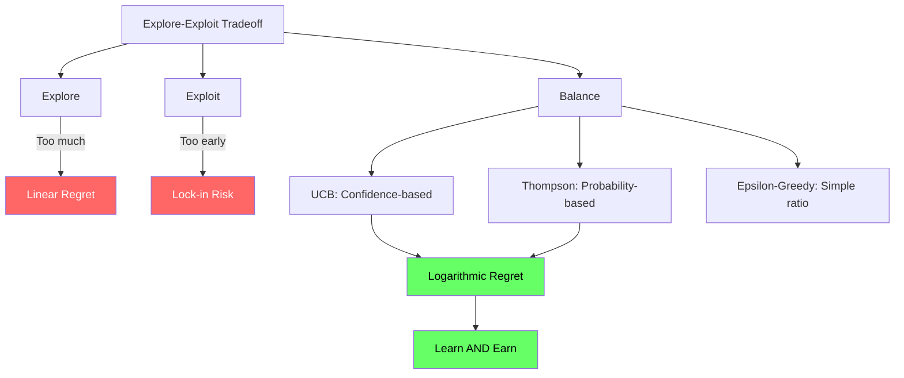

<!-- _class: lead -->

# The Explore-Exploit Tradeoff

## Module 0: Foundations
### Multi-Armed Bandits for Commodity Trading

<!-- Speaker notes: This deck covers the most fundamental concept in bandit theory: the explore-exploit tradeoff. Every sequential decision maker faces this tension. By the end, students should understand regret bounds, the restaurant dilemma analogy, and how different strategies handle the tradeoff differently. -->

---

## In Brief

Every sequential decision involves a fundamental tension:

| | Explore | Exploit |
|---|---------|---------|
| **Action** | Try uncertain options to learn their value | Choose currently-best option for immediate reward |
| **Risk** | Wastes time on inferior options | Locks into suboptimal choices based on limited data |

> You must balance **learning** and **earning** -- and the optimal balance changes over time.

<!-- Speaker notes: This table is the conceptual foundation of the entire course. Exploration gathers information but costs immediate reward. Exploitation earns now but risks missing better options. The key insight is that the optimal balance shifts: explore more early when uncertainty is high, exploit more later when you have confidence. Every algorithm we study offers a different mechanism for managing this balance. -->

---

## The Explore-Exploit Spectrum

```
Pure Exploration          Balanced              Pure Exploitation
(Random)               (Adaptive)              (Greedy)
    |--------------------|--------------------|

Learn everything,    Learn AND earn      Earn now,
earn nothing         simultaneously      learn nothing
```

<!-- Speaker notes: Neither extreme is optimal. Pure exploration wastes resources on arms you already know are bad. Pure exploitation risks locking into a suboptimal arm based on insufficient data. The algorithms in Module 1 (epsilon-greedy, UCB, softmax) each offer a different way to stay in the balanced middle zone. -->

---

## How the Balance Shifts Over Time



- **Early:** High uncertainty, need data -- try all sectors equally
- **Mid:** Confidence growing -- focus on winners, occasional experiments
- **Late:** High confidence -- mostly exploit, rare exploration for regime shifts

<!-- Speaker notes: Walk through the three phases. In commodity trading terms: early on you try allocating to energy, metals, and agriculture roughly equally. As data accumulates and metals consistently outperforms, you shift more capital there. Eventually you are 95% metals with small exploratory positions in other sectors to detect regime changes. The exact percentages depend on the algorithm used. -->

---

## Regret Accumulation by Strategy

```
Pure Exploration:   ████████████████████  [Linear forever]
Pure Exploitation:  ████░░░░░░░░░░░░░░░░  [High early, then flat]
Balanced Strategy:  ████████░░░░░░░░░░░░  [Logarithmic growth]
                    ^
                    Efficient learning phase
```

<!-- Speaker notes: This ASCII chart shows three regret trajectories. Pure exploration never stops wasting effort on bad arms. Pure exploitation can get lucky (flat after correct initial guess) or unlucky (linear if wrong). The balanced strategy has an initial learning phase where regret accumulates, then slows dramatically. Logarithmic regret is the gold standard we aim for. -->

---

## Formal Definition: Multi-Armed Bandit Problem

You face $K$ arms with unknown expected reward $\mu_k$. At each time step $t$:

1. Choose arm $a(t) \in \{1, 2, \ldots, K\}$
2. Observe reward $r(t) \sim P(\text{reward} \mid \text{arm} = a(t))$
3. Update estimates of arm values

**Goal:** Minimize cumulative regret over horizon $T$.

<!-- Speaker notes: This is the formal problem statement that underlies everything in the course. K arms represent K options (commodity sectors, trading strategies, etc.). At each time step you pick one, observe a stochastic reward, and update your beliefs. The goal is to minimize the gap between what you earned and what you could have earned with perfect knowledge. Note that you only observe the reward for the arm you chose -- you never see what the other arms would have paid. This is the "partial feedback" property. -->

---

## Regret Definitions

**Instantaneous regret** at time $t$:

$$\delta(t) = \mu^* - \mu_{a(t)}$$

where $\mu^* = \max_k \mu_k$ is the best arm's expected reward.

**Cumulative regret** over $T$ rounds:

$$R(T) = \sum_{t=1}^{T} \delta(t) = T \cdot \mu^* - \sum_{t=1}^{T} \mu_{a(t)}$$

> The difference between what you **could** have earned and what you **actually** earned.

<!-- Speaker notes: Instantaneous regret is the per-round cost of not playing the best arm. Cumulative regret adds these up over all rounds. The key insight: regret is always non-negative and never decreases. A good algorithm makes instantaneous regret approach zero over time, which means cumulative regret grows slowly. The Lai-Robbins lower bound tells us that the best possible growth rate is O(log T). -->

---

## Regret Bounds by Strategy

| Strategy | Regret Bound | Growth |
|----------|-------------|--------|
| Random exploration | $O(T)$ | Linear, unbounded |
| Pure exploitation | $O(T)$ | Linear if wrong initial guess |
| Epsilon-greedy | $O(T)$ | Linear due to constant exploration |
| UCB algorithm | $O(\log T)$ | Logarithmic, near-optimal |
| Thompson Sampling | $O(\log T)$ | Logarithmic, often better constants |

> Logarithmic regret means average regret per round $\to 0$ as $T \to \infty$.

<!-- Speaker notes: This table is a key reference. Note that fixed epsilon-greedy has linear regret because it never stops exploring at rate epsilon. Decaying epsilon can achieve sublinear regret. UCB and Thompson Sampling achieve the optimal logarithmic rate. We will derive and implement each of these in Module 1 and Module 2. The practical implication: for long-running commodity strategies, the difference between linear and logarithmic regret can be millions of dollars. -->

---

## Intuitive Explanation: The Restaurant Dilemma

Three restaurants near your office:

| Restaurant | Visits | Satisfaction |
|-----------|--------|-------------|
| A | 2 times | 2/2 = 100% |
| B | 10 times | 7/10 = 70% |
| C | Never tried | ??? |

**Today's lunch: which do you pick?**

<!-- Speaker notes: This is the most memorable analogy in the course. Pause and let the audience think. Restaurant A looks great but only 2 data points -- could be luck. Restaurant B is reliable with 10 visits. Restaurant C is completely unknown. This maps directly to the bandit problem: do you exploit B (known good), explore A (possibly great but uncertain), or explore C (total unknown)? Each algorithm we study gives a different answer. -->

---

## Four Approaches to Lunch



<!-- Speaker notes: Walk through each approach. Pure exploration ignores what you know. Pure exploitation trusts tiny samples too much. UCB accounts for uncertainty -- restaurant A has a wide confidence interval due to only 2 visits, so its upper bound is high. Epsilon-greedy is simple: usually pick the best, occasionally try something random. Note that UCB and epsilon-greedy (green) are the balanced approaches that achieve good regret. -->

---

## Commodity Trading Version

You allocate weekly capital across three sectors:

| Sector | Trades | Avg Return | Volatility | Sharpe-like Score |
|--------|--------|-----------|-----------|-------------------|
| Energy | 50 | +2.1%/wk | 12% | 0.175 |
| Metals | 45 | +1.8%/wk | 8% | 0.225 |
| Agriculture | 5 | +3.0%/wk | 15% | 0.200 |

<!-- Speaker notes: This translates the restaurant dilemma to commodity trading. Energy has the most data but mediocre risk-adjusted returns. Metals has strong risk-adjusted returns with good sample size. Agriculture looks promising but only 5 trades -- is 3.0% return real or just noise? The volatility column adds a dimension the restaurant example lacked: we care about risk-adjusted returns, not just raw returns. -->

---

## The Dilemma

- **Exploit Metals?** Highest observed Sharpe, reasonable sample size
- **Explore Agriculture?** Tantalizing high return, but only 5 samples
- **Abandon Energy?** Lowest score, but maybe just a bad stretch

> **Bandit answer:** Allocate most capital to Metals (exploit), keep testing Agriculture (explore uncertain high-reward), occasionally try Energy (check if regime changed).

<!-- Speaker notes: The bandit answer is nuanced: it does not abandon any option entirely. Most capital goes to the current best (metals), but a meaningful allocation tests agriculture (high uncertainty, potentially high reward), and a small allocation monitors energy (in case conditions change). This is exactly what UCB and Thompson Sampling produce automatically. The exact split depends on the algorithm and its parameters. -->

---

## Code: Strategy Comparison Setup

```python
import numpy as np
import matplotlib.pyplot as plt

def compare_strategies(arm_means, n_rounds=1000, epsilon=0.1):
    """Compare pure exploration, exploitation, and balanced."""
    K = len(arm_means)
    best_arm = np.argmax(arm_means)

    strategies = {
        'Pure Exploration': lambda t: np.random.choice(K),
        'Pure Exploitation': lambda t: np.argmax(Q),
        'Epsilon-Greedy': lambda t: (
            np.random.choice(K) if np.random.rand() < epsilon
            else np.argmax(Q)
        )
    }
```

<!-- Speaker notes: This code sets up the three strategies we want to compare. Pure exploration picks randomly, pure exploitation always picks the arm with the highest estimated value, and epsilon-greedy mixes. Note that Q (the value estimates) is defined in the next slide's simulation loop. We split the code across two slides for readability. -->

---

## Code: Running the Simulation

```python
    results = {}
    for name, policy in strategies.items():
        Q = np.zeros(K)   # Estimated values
        N = np.zeros(K)   # Visit counts
        regret = np.zeros(n_rounds)
        for t in range(n_rounds):
            arm = policy(t)
            reward = np.random.randn() + arm_means[arm]
            N[arm] += 1
            Q[arm] += (reward - Q[arm]) / N[arm]
            regret[t] = arm_means[best_arm] - arm_means[arm]
        results[name] = np.cumsum(regret)
    return results
```

<!-- Speaker notes: The simulation loop pulls each arm, observes a noisy reward (Gaussian with the true mean), updates the running average, and records regret. The incremental mean update Q[arm] += (reward - Q[arm]) / N[arm] is a key pattern -- it avoids storing all past rewards. Run with arm_means = [0.15, 0.25, 0.18] to see the three regret curves diverge dramatically. -->

---

## What You'll See

- **Pure exploration:** Regret grows linearly (wastes time on bad arms forever)
- **Pure exploitation:** High early regret if unlucky initial samples, then flat
- **Epsilon-greedy:** Regret grows sublinearly, much better than extremes



<!-- Speaker notes: The visual summary highlights the three trajectories. Pure exploration (red) is worst because it never learns. Pure exploitation (orange) is risky -- it might get lucky or might lock into a bad arm. Epsilon-greedy (green) reliably achieves sublinear regret by balancing learning and earning. In Module 1 we will see that UCB and Thompson Sampling do even better. -->

---

<!-- _class: lead -->

# Common Pitfalls

<!-- Speaker notes: Four pitfalls that practitioners encounter when trying to balance exploration and exploitation. Each one is illustrated with a commodity trading example to make it concrete. -->

---

## Pitfall 1: Premature Exploitation

> Switching to pure exploitation too early based on limited data.

Small samples have high variance. The arm that looks best after 10 trials might not be the true best.

**Commodity example:** After 10 wheat trades (+5% avg) and 10 corn trades (+2% avg), you go 100% wheat. True wheat mean is 2.5% -- you locked in the wrong choice.

> **Fix:** Use confidence intervals (UCB) or probability distributions (Thompson Sampling).

<!-- Speaker notes: This is the most common beginner mistake. With only 10 samples, the standard error is enormous. The observed 5% for wheat could easily be noise. UCB addresses this by adding an uncertainty bonus that shrinks with more data. Thompson Sampling addresses it by sampling from the full posterior distribution. Both naturally prevent premature lock-in. -->

---

## Pitfall 2: Excessive Exploration

> Continuing to explore equally even after strong evidence emerges.

Every exploration trial on a known-inferior arm is wasted regret.

**Commodity example:** After 500 energy trades (8% Sharpe) and 500 metals trades (15% Sharpe), you still allocate 50/50. Each energy trade costs ~7 percentage points of expected Sharpe.

> **Fix:** Decreasing exploration rates or confidence-based exploration (UCB).

<!-- Speaker notes: The opposite of premature exploitation. After 500 trades each, the confidence intervals are tight. Continuing to allocate equally is throwing money away. Fixed epsilon-greedy suffers from this: even after 10,000 rounds, it still explores at rate epsilon. Decaying epsilon or UCB naturally reduce exploration as confidence grows. -->

---

## Pitfall 3: Ignoring Non-Stationarity

> Assuming arm means stay constant forever.

Market regimes change. The best commodity sector in low-inflation might be worst in high-inflation.

**Commodity example:** Gold has lowest Sharpe 2015-2020. You allocate 5%. Then 2021-2023 inflation surge -- gold becomes best performer. Historical estimates are stale.

> **Fix:** Sliding windows, discounted regret, or change-detection algorithms.

<!-- Speaker notes: Standard bandit algorithms assume stationary rewards. But commodity markets have clear regime shifts: inflation cycles, supply disruptions, policy changes. If you accumulate 5 years of data, the recent 6 months might be far more relevant. Module 6 covers non-stationary bandits that use discount factors, sliding windows, or change-point detection to handle this. -->

---

## Pitfall 4: Confusing Regret and Reward

| Objective | Focus | Strategy |
|-----------|-------|----------|
| **Regret minimization** | Relative to best arm | Stick with highest EV, verify |
| **Reward maximization** | Absolute returns | Might chase high-variance payoffs |

**Example:**
- Arm A: mean = 10, variance = 1 (consistent)
- Arm B: mean = 9, variance = 100 (wild)

Reward maximizer might try B for huge payoffs. Regret minimizer sticks with A.

<!-- Speaker notes: This distinction matters for portfolio construction. Regret minimization says pick the arm with the highest expected value and verify it -- this leads to consistent, lower-variance strategies. Reward maximization might chase volatile outliers hoping for a lucky draw. Most commodity traders should think in terms of regret minimization (matching the best available strategy) rather than absolute reward maximization (chasing the biggest single payoff). -->

---

## Connections

<div class="columns">
<div>

### Builds On
- Expected value and variance
- Sequential decision making
- Limits of A/B testing (Guide 1)

</div>
<div>

### Leads To
- Epsilon-greedy (Module 1)
- UCB (Module 1)
- Thompson Sampling (Module 2)
- Non-stationary bandits (Module 6)

</div>
</div>

**Related:** Reinforcement learning (stateless RL), Information theory, Optimal stopping, Bayesian optimization

<!-- Speaker notes: This deck provides the conceptual foundation for everything that follows. Module 1 implements the three main algorithms. Module 2 adds the Bayesian perspective. Module 6 handles the non-stationarity that commodity markets exhibit. The connection to reinforcement learning is important: bandits are the simplest RL problem (one state, multiple actions). -->

---

## Practice: The Horizon Effect

You're retiring in 3 months and want to maximize commodity trading profit.

> **Question:** How should your explore-exploit balance differ from someone with a 30-year horizon?

**Hint:** Think about the **value of information**. If you learn gold is better than oil in month 3, how many months can you exploit that?

<!-- Speaker notes: Short horizons mean less time to exploit discovered information, so exploration is less valuable. The 3-month trader should mostly exploit current best estimates. The 30-year trader should explore aggressively early because any discovered advantage compounds over decades. This connects to the formal concept of "value of perfect information" covered in the Decision Theory deck. -->

---

## Practice: Regret Decomposition

```python
def decompose_regret(arm_means, choices, Q_estimates):
    """Decompose regret into exploration vs exploitation components."""
    # exploration_regret: choosing non-greedy arms
    # exploitation_regret: greedy choices with wrong estimates
    pass

# Expected: Early regret = mostly exploitation mistakes (bad estimates)
#           Later regret = mostly exploration (epsilon parameter)
```

<!-- Speaker notes: This exercise helps students understand that regret comes from two sources: choosing to explore (intentional cost) and exploiting the wrong arm due to bad estimates (unintentional cost). Early in a simulation, most regret comes from wrong estimates. Later, most comes from the exploration parameter. Understanding this decomposition helps with parameter tuning. -->

---

## Visual Summary



<!-- Speaker notes: This visual captures the entire deck. The two extremes (too much exploration, too early exploitation) both lead to poor outcomes in red. The balanced approaches (UCB, Thompson, epsilon-greedy) achieve logarithmic regret in green. The takeaway is that good algorithms automatically manage this balance -- you do not need to manually tune the explore-exploit ratio. -->
