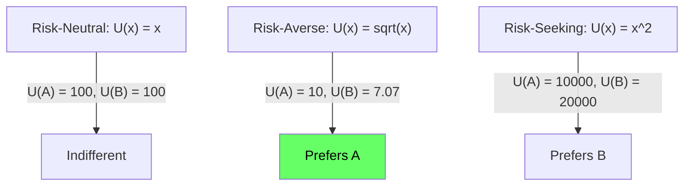
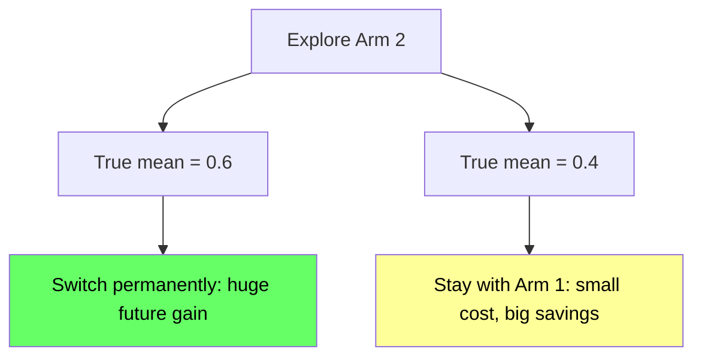
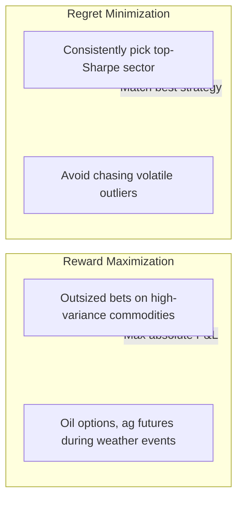
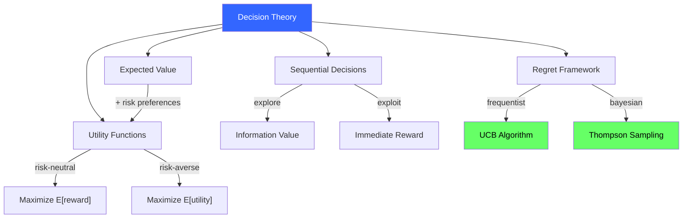

<!-- _class: lead -->

# Decision Theory Basics

## Module 0: Foundations
### Multi-Armed Bandits for Commodity Trading

<!-- Speaker notes: This deck covers the mathematical foundations underpinning bandit algorithms: expected value, utility functions, Sharpe ratio, value of information, and the Bayesian vs frequentist perspectives. These concepts recur throughout the course. Take your time with the utility function section -- it is the bridge between raw returns and risk-adjusted decision making. -->

---

## In Brief

Decision theory provides the mathematical foundation for choosing actions under uncertainty.

Key concepts for bandits and commodity trading:

| Concept | What It Does |
|---------|-------------|
| **Expected value** | What you'll earn on average |
| **Utility** | How you value different outcomes |
| **Sequential decisions** | Choices now affect future information |
| **Regret minimization** | Compare to best possible strategy in hindsight |

<!-- Speaker notes: This table maps four abstract concepts to their practical meaning. Each one becomes a building block for bandit algorithms. Expected value drives arm selection. Utility captures risk preferences. Sequential decisions introduce the explore-exploit tradeoff. Regret minimization provides the objective function we optimize. -->

---

## Key Insight

> **Decision theory formalizes intuition.**

- "I'm not touching volatility trades" = implicit expected utility with risk aversion
- "I'll try a small position to see how it performs" = valuing information acquisition

Decision theory makes these tradeoffs **explicit and mathematically tractable**.

<!-- Speaker notes: Every trader makes decisions that implicitly encode decision theory concepts. When a trader says they prefer steady 8% returns over volatile 12% returns, they are expressing a concave utility function. When they take a small exploratory position, they are assigning value to information. Decision theory just makes these intuitions precise enough to implement in algorithms. -->

---

## Expected Value (Risk-Neutral)

$$E[X] = \sum x \cdot P(X = x) \quad \text{(discrete)}$$

$$E[X] = \int x \cdot f(x)\, dx \quad \text{(continuous)}$$

**In bandits:** Expected reward of arm $k$ is $\mu_k = E[r \mid \text{arm } k]$.

<!-- Speaker notes: Expected value is the weighted average of outcomes. In the bandit context, each arm has a true expected reward mu_k that we are trying to learn. A risk-neutral agent simply picks the arm with the highest expected value. The challenge is that we do not know mu_k -- we must estimate it from observations. The quality of our estimates determines the quality of our decisions. -->

---

## Commodity Trading Example

Crude oil P&L calculation:

| Outcome | Probability | Return | Expected |
|---------|------------|--------|----------|
| Price up | 40% | +\$5/barrel | +\$2.00 |
| Flat | 30% | \$0 | \$0.00 |
| Price down | 30% | -\$3/barrel | -\$0.90 |
| **Total** | | | **+\$1.10/barrel** |

$$E[\text{P\&L}] = \sum (\text{return}_i \times \text{probability}_i) = \$1.10$$

<!-- Speaker notes: Walk through the calculation row by row. The expected P&L is positive ($1.10/barrel), so a risk-neutral trader would take this trade. But notice the downside: there is a 30% chance of losing $3/barrel. A risk-averse trader might skip this trade despite the positive expected value. This motivates utility functions on the next slide. -->

---

## Utility Functions

Most traders are **risk-averse**: they prefer certain outcomes over risky bets with the same expected value.

| Risk Profile | Utility Function | Shape |
|-------------|-----------------|-------|
| Risk-neutral | $U(x) = x$ | Linear |
| Risk-averse | $U(x) = \sqrt{x}$ or $\log(x)$ | Concave |
| Risk-seeking | $U(x) = x^2$ | Convex |

**Expected utility:** $EU = \sum U(x_i) \cdot P(x_i)$

<!-- Speaker notes: Utility functions map monetary outcomes to subjective value. A concave utility function means the pain of losing $100 is greater than the pleasure of gaining $100 -- this is risk aversion. In bandit algorithms, utility functions determine how we define "reward." Using raw returns assumes risk neutrality. Using Sharpe ratio or drawdown-penalized returns embeds risk aversion into the bandit's objective. Module 5 covers reward design for commodity trading in detail. -->

---

## Risk Aversion in Action

**Would you rather have:**
- **Option A:** \$100 for sure
- **Option B:** 50% chance of \$200, 50% chance of \$0

Both have $E[X] = \$100$.

<!-- Speaker notes: This classic example makes risk aversion concrete. Under square-root utility, the certain $100 has utility 10, while the gamble has expected utility 0.5*sqrt(200) + 0.5*sqrt(0) = 7.07. The risk-averse agent strongly prefers the certain outcome. Most institutional commodity traders are risk-averse -- they prefer consistent returns over volatile ones with the same average. This is why Sharpe ratio is the standard metric. -->

---

## Sharpe Ratio: Risk-Adjusted Returns

$$\text{Sharpe} = \frac{\mu - r_f}{\sigma}$$

Where $\mu$ = expected return, $r_f$ = risk-free rate, $\sigma$ = return volatility.

**In bandit terms:** Arms have both mean ($\mu_k$) and variance ($\sigma^2_k$).

| Arm | Mean | Volatility | Sharpe |
|-----|------|-----------|--------|
| A | 10% | 20% | 0.5 |
| B | 8% | 10% | **0.8** |

Risk-neutral bandit: Prefers A. Risk-adjusted bandit: Prefers **B**.

<!-- Speaker notes: Sharpe ratio is the most common risk-adjusted return metric in finance. It penalizes volatility by dividing excess return by standard deviation. In our bandit framework, using Sharpe as the reward signal rather than raw returns fundamentally changes which arms get selected. Strategy B returns less but is much more consistent -- the risk-adjusted bandit correctly identifies it as superior. Module 5 covers reward design for commodity bandits in detail. -->

---

<!-- _class: lead -->

# Sequential Decision Making Under Uncertainty

<!-- Speaker notes: This section bridges from static expected value calculations to the dynamic setting where your decisions today affect what information you have tomorrow. This is the key insight that separates bandit problems from simple optimization. -->

---

## The Value of Information

Exploring an uncertain arm has **two types** of value:

1. **Immediate reward:** Expected payoff this round
2. **Information value:** Learning reduces future uncertainty

$$\text{VPI}_k = E[\text{future regret reduction} \mid \text{learn true } \mu_k]$$

<!-- Speaker notes: Value of Perfect Information (VPI) quantifies how much you would pay to learn an arm's true reward before making future decisions. The key insight: information is only valuable if it might change your behavior. If you would pick arm 1 regardless of arm 2's value, then learning about arm 2 has zero VPI. This concept motivates UCB (which explores arms with high uncertainty) and Thompson Sampling (which naturally explores proportional to the probability an arm is optimal). -->

---

## Should You Explore?

**Setup:**
- Arm 1: Known $\mu_1 = 0.5$ (1000 pulls)
- Arm 2: Estimated $\mu_2 = 0.55$, but only 10 pulls

**Information value reasoning:**
- If true mean is 0.6 --> switch permanently --> huge gain
- If true mean is 0.4 --> stick with Arm 1 --> small cost now, big savings later
- Expected info value likely exceeds immediate regret risk

<!-- Speaker notes: Walk through the decision tree. If arm 2's true mean is 0.6, exploring saves massive future regret by discovering a better arm. If arm 2's true mean is 0.4, exploring costs one round of regret but saves you from making a permanent mistake. The asymmetry is key: the upside of discovering a better arm is large (compounded over all future rounds), while the downside is small (one round of suboptimal play). This is why algorithms like UCB explore uncertain arms even when their point estimate is lower. -->

---

## Commodity Example: Information Value

- High confidence: energy trades return 12% annually (100 trades)
- Weak confidence: agriculture strategy returns 15% (5 trades)

> The potential 3% gain, multiplied by **future years of trading**, makes exploration valuable even if the next few agriculture trades lose money.

<!-- Speaker notes: Make the numbers concrete. If you trade for 10 more years and agriculture truly returns 3% more annually, that is 30% of cumulative performance left on the table. A few losing exploratory trades now is a tiny price to pay. This is why short-horizon traders should explore less (fewer future rounds to exploit discoveries) and long-horizon traders should explore more. -->

---

## Bayesian vs Frequentist Perspectives

### Frequentist View
- Arm means are **fixed but unknown**
- Estimate with sample averages
- Confidence intervals quantify uncertainty
- **Bandit:** UCB algorithm

### Bayesian View
- Arm means are **random variables** with priors
- Observations update via Bayes' rule
- Posterior distributions quantify belief
- **Bandit:** Thompson Sampling

<!-- Speaker notes: Both frameworks are valid and lead to different bandit algorithms. The frequentist approach (UCB) constructs confidence intervals and acts optimistically. The Bayesian approach (Thompson Sampling) maintains probability distributions and samples from them. In practice, Thompson Sampling often performs better empirically, while UCB has cleaner theoretical guarantees. Module 1 covers UCB, Module 2 covers Thompson Sampling. -->

---

## Frequentist vs Bayesian: Commodity Example

**Frequentist:**
- "Based on 50 gold trades, I estimate return = 8% +/- 3% (95% CI)"
- "I'm 95% confident the true mean is in [5%, 11%]"

**Bayesian:**
- "My prior belief: gold returns are Normal(6%, 4%)"
- "After 50 trades with avg 8%, my posterior is Normal(7.5%, 2%)"
- "I now believe there's a 73% chance gold beats 6%"

> Both are valid; Bayesian makes incorporating prior knowledge easier.

<!-- Speaker notes: The frequentist says "the true mean is fixed, and my interval captures it with 95% probability." The Bayesian says "I have a distribution of beliefs about the true mean, and I update it with each observation." The Bayesian approach is natural for incorporating analyst views, seasonal patterns, or domain expertise into the prior. This is why Thompson Sampling is popular in finance -- you can encode prior beliefs about commodity returns. -->

---

<!-- _class: lead -->

# Regret Minimization vs Reward Maximization

<!-- Speaker notes: This section clarifies the objective function for bandit algorithms. Most of the course uses regret minimization, but it is important to understand the alternative and when each is appropriate. -->

---

## Two Objectives

**Reward maximization:**

$$\text{maximize} \sum_{t=1}^{T} r_t$$

**Regret minimization:**

$$\text{minimize} \; R(T) = T \cdot \mu^* - \sum_{t=1}^{T} r_t$$

<!-- Speaker notes: Reward maximization cares about absolute total reward. Regret minimization cares about the gap between your performance and the best single arm. These are related but not identical. In most bandit theory and this course, we use regret minimization because it provides cleaner bounds and is more meaningful for comparing algorithms. -->

---

## Why They Differ

Three arms with means [10, 9, 8]. After 100 pulls:
- Arm 1: $\hat{\mu} = 10.1 \pm 0.5$
- Arm 2: $\hat{\mu} = 9.0 \pm 0.5$
- Arm 3: $\hat{\mu} = 8.0 \pm 2.0$ (high variance, few samples)

| Objective | Action | Reasoning |
|-----------|--------|-----------|
| Reward maximizer | Explore Arm 3 | Hoping for lucky high-variance payoff |
| Regret minimizer | Ignore Arm 3 | Upper bound below Arm 1; exploit Arm 1 |

<!-- Speaker notes: The reward maximizer might pull arm 3 hoping for a +12 outlier. The regret minimizer notes that even arm 3's upper confidence bound (8 + 2*2 = 12) barely beats arm 1's estimate, and the expected cost per pull is 2 units of regret. For commodity traders, regret minimization is usually the right objective -- it means consistently matching the best available strategy rather than gambling on volatile outliers. -->

---

## Commodity Context

<!-- Speaker notes: Speculators who trade options or event-driven strategies might prefer reward maximization -- they want the biggest possible payoff. Systematic traders and portfolio allocators should prefer regret minimization -- they want to consistently match or beat the best available strategy. Most of this course focuses on regret minimization, which maps to systematic commodity trading. -->

---

## Horizon Effects

### Short Horizon (T = 100)
- Information has limited future value
- Exploration should be **minimal**
- Focus on exploitation with high-confidence estimates

### Long Horizon (T = 100,000)
- Information compounds over many rounds
- Early exploration is **cheap** (amortizes)
- Worth thorough exploration to find best arm

> Optimal exploration scales roughly as $\sqrt{T}$ in many algorithms.

<!-- Speaker notes: The horizon determines how much exploration is worthwhile. Short horizons mean you cannot afford to waste rounds on exploration because there is little time left to exploit discoveries. Long horizons mean early exploration is essentially free because the cost is amortized over thousands of future rounds. UCB automatically adjusts for this through the log(t) term in the confidence bound. Thompson Sampling adjusts through posterior concentration. -->

---

## How Commodity Traders Actually Decide

1. **Estimate expected returns** (fundamental analysis, historical data)
2. **Estimate uncertainty** (volatility, correlation, model confidence)
3. **Apply risk constraints** (VaR limits, position sizing, stop-losses)
4. **Optimize allocation** (maximize Sharpe, minimize regret)
5. **Monitor and adapt** (update estimates, rebalance, detect regime changes)

<!-- Speaker notes: This 5-step process is what every systematic commodity trader does, whether they realize it or not. The bandit framework formalizes steps 1-5 into a single algorithm. Steps 1-2 are arm estimation. Step 3 maps to utility functions and guardrails (Module 5). Step 4 is the arm selection policy. Step 5 is the update rule and non-stationarity handling (Module 6). -->

---

## Trading Steps Map to Bandit Concepts

| Trading Step | Bandit Concept |
|--------------|----------------|
| Estimate expected returns | Arm mean estimation ($\hat{\mu}_k$) |
| Estimate uncertainty | Confidence bounds or posterior variance |
| Risk constraints | Utility function (risk aversion) |
| Allocation | Arm selection policy |
| Monitor and adapt | Non-stationary bandits, change detection |

<!-- Speaker notes: This mapping table is a key reference for the course. Every time you encounter a new bandit concept, refer back to this table to understand its trading interpretation. For example, when we cover LinUCB in Module 3, the context vector is the market state (volatility, term structure, inventory levels) that informs the "estimate expected returns" step. -->

---

## Example Decision: WTI vs Brent

A crude oil trader asks: "Should I increase my WTI position or rotate to Brent?"

**Bandit translation:**
- **Arms:** WTI, Brent, cash
- **Rewards:** Risk-adjusted returns (Sharpe ratio)
- **Uncertainty:** Recent volatility, correlation shifts, sample size
- **Horizon:** 1 month trading window
- **Objective:** Maximize Sharpe (regret minimization)

> Use UCB or Thompson Sampling with Sharpe-ratio rewards and 1-month horizon.

<!-- Speaker notes: This concrete example shows how to frame a real trading decision as a bandit problem. The three arms are WTI crude, Brent crude, and cash (the risk-free option). Rewards are Sharpe ratios. The 1-month horizon means exploration should be limited -- focus on exploiting current estimates. If the trader had a 1-year horizon, more exploration would be warranted. This framework generalizes to any multi-asset allocation decision. -->

---

## Notation Reference

| Symbol | Meaning |
|--------|---------|
| $K$ | Number of arms |
| $T$ | Time horizon |
| $a(t)$ | Arm chosen at time $t$ |
| $\mu_k$ | True expected reward of arm $k$ |
| $\mu^*$ | Best arm's expected reward |
| $R(T)$ | Cumulative regret |
| $U(x)$ | Utility function |
| $\sigma^2_k$ | Variance of arm $k$'s rewards |

<!-- Speaker notes: Keep this notation reference handy throughout the course. All subsequent decks use this notation consistently. The most important symbols to internalize are mu_k (true arm reward), mu-star (best arm), and R(T) (cumulative regret). Everything else builds on these. -->

---

## Key Takeaways

1. **Expected value** is the average outcome; **utility** captures risk preferences
2. **Sequential decisions** have both immediate payoffs and information value
3. **Regret minimization** focuses on matching best arm; **reward maximization** on absolute returns
4. **Bayesian methods** use distributions; **frequentist** use confidence intervals
5. **Horizon length** determines optimal exploration intensity
6. Commodity trading is full of bandit-like decisions

<!-- Speaker notes: These six takeaways summarize the entire deck. If students remember nothing else, they should remember that decision theory formalizes the intuitions they already have about risk and uncertainty, and that bandit algorithms are just automated implementations of sound decision theory. The Bayesian vs frequentist choice determines which algorithm family you use (UCB vs Thompson Sampling). -->

---

## Visual Summary

<!-- Speaker notes: This flowchart maps decision theory concepts to the algorithms we will study. Expected value plus risk preferences leads to utility functions. Sequential decisions create the explore-exploit tradeoff. The regret framework branches into frequentist (UCB) and Bayesian (Thompson Sampling) approaches. Both achieve logarithmic regret -- the choice between them depends on whether you want to encode prior beliefs (Bayesian) or prefer distribution-free guarantees (frequentist). -->
