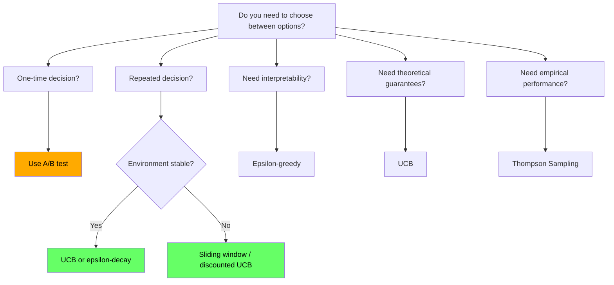
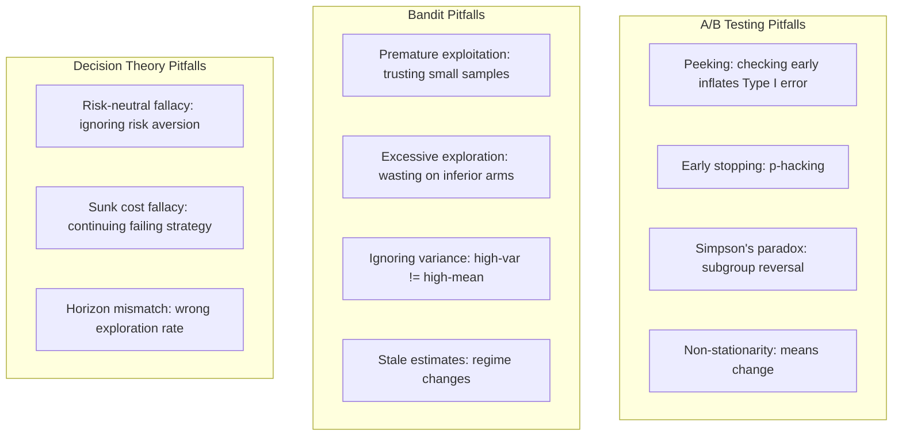
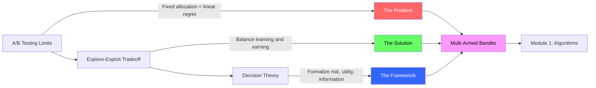

<!-- _class: lead -->

# Module 0 Quick Reference: Foundations

## Cheatsheet
### Multi-Armed Bandits for Commodity Trading

<!-- Speaker notes: This cheatsheet summarizes all key concepts from Module 0: A/B testing limits, explore-exploit tradeoff, and decision theory basics. Bookmark this for quick reference throughout the course. -->

---

## A/B Testing vs Bandits

| Aspect | A/B Testing | Multi-Armed Bandits |
|--------|-------------|---------------------|
| **Allocation** | Fixed 50/50 split | Adaptive, shifts to winner |
| **Goal** | Statistical certainty | Minimize regret while learning |
| **Regret growth** | $O(T)$ -- linear | $O(\log T)$ -- logarithmic |
| **Best for** | Static environments | Dynamic environments |
| **Sample efficiency** | Low | High |
| **Non-stationarity** | Fails | Can adapt |

<!-- Speaker notes: This comparison table is the core message of Module 0. A/B testing is appropriate for one-time decisions in static environments. Bandits are appropriate for repeated decisions in dynamic environments -- which describes most commodity trading scenarios. The regret growth rate difference (linear vs logarithmic) is the mathematical foundation for the entire course. -->

---

## When to Use Which



<!-- Speaker notes: Use this decision flowchart when choosing between A/B testing and bandit approaches. One-time decisions with no time pressure suit A/B testing. Repeated decisions in stable environments suit standard bandits (UCB, epsilon-decay). Non-stationary environments need adaptive bandits (sliding window, discounted). If interpretability is paramount, epsilon-greedy is simplest to explain. -->

---

## A/B Test Formulas

### Sample Size (Per Variant)

$$n = \frac{2(z_{\alpha/2} + z_\beta)^2 \cdot \bar{p}(1-\bar{p})}{(p_B - p_A)^2}$$

**Example:** Detect 0.05 to 0.08 conversion (60% relative lift):

$$n = \frac{2(1.96 + 0.84)^2 \cdot 0.065 \cdot 0.935}{(0.03)^2} \approx 1{,}954 \text{ per variant}$$

<!-- Speaker notes: This formula tells you how many observations per variant you need for an A/B test. The key driver is the effect size in the denominator -- smaller differences require much larger samples. For commodity trading, if the Sharpe difference between strategies is small (e.g., 0.1), you may need thousands of trades to detect it with an A/B test, during which half your capital is on the inferior strategy. -->

---

## Test Statistic

**Two-Proportion Z-Test:**

$$z = \frac{\hat{p}_B - \hat{p}_A}{\sqrt{\hat{p}(1-\hat{p}) \cdot (1/n_A + 1/n_B)}}$$

where $\hat{p} = \frac{x_A + x_B}{n_A + n_B}$ is the pooled proportion.

Reject $H_0$ if $|z| > z_{\alpha/2}$ (e.g., 1.96 for $\alpha = 0.05$).

<!-- Speaker notes: The z-test compares two proportions under the null hypothesis that they are equal. The pooled proportion provides the standard error estimate. Reject the null when the observed difference is large relative to the standard error. In bandit terms, this test is run once at the end of a fixed-horizon experiment. Bandits skip this entirely by continuously adapting allocation. -->

---

## Explore-Exploit Key Definitions

**Instantaneous regret** at time $t$:
$$\delta(t) = \mu^* - \mu_{a(t)}$$

**Cumulative regret** over $T$ rounds:
$$R(T) = \sum_{t=1}^{T} \delta(t) = T \cdot \mu^* - \sum_{t=1}^{T} r_t$$

**Average regret per round:**
$$\bar{R}(T) = R(T) / T$$

> Good algorithms achieve $\bar{R}(T) \to 0$ as $T \to \infty$.

<!-- Speaker notes: Three levels of regret measurement. Instantaneous regret is the per-round cost. Cumulative regret is the running total. Average regret is cumulative divided by rounds. The key benchmark is that average regret should converge to zero -- meaning the algorithm eventually finds and sticks with the best arm. Algorithms achieving O(log T) cumulative regret have average regret O(log T / T) which goes to zero. -->

---

## Regret Bounds by Algorithm

| Algorithm | Regret Bound | When to Use |
|-----------|--------------|-------------|
| Random exploration | $O(T)$ | Never (baseline only) |
| Pure exploitation | $O(T)$ | Never (unless oracle) |
| Epsilon-greedy (fixed) | $O(T)$ | Simple, interpretable |
| Epsilon-greedy (decay) | $O(T^{2/3})$ | Better than fixed |
| UCB | $O(\sqrt{KT \log T})$ | Theoretically optimal |
| Thompson Sampling | $O(\sqrt{KT})$ | Often best in practice |

<!-- Speaker notes: This table is a key reference for algorithm selection. Note that fixed epsilon-greedy still has linear regret. Only decaying epsilon, UCB, and Thompson Sampling achieve sublinear bounds. The practical advice: start with Thompson Sampling unless you need theoretical guarantees (use UCB) or simplicity (use decaying epsilon-greedy). Module 1 implements all three. -->

---

## Decision Theory Essentials

### Expected Value and Utility

$$E[X] = \sum x_i \cdot P(X = x_i)$$

$$EU = \sum U(x_i) \cdot P(x_i)$$

| Risk Profile | Utility | Shape |
|-------------|---------|-------|
| Risk-neutral | $U(x) = x$ | Linear |
| Risk-averse | $U(x) = \sqrt{x}$ or $\log(x)$ | Concave |
| Risk-seeking | $U(x) = x^2$ | Convex |

<!-- Speaker notes: Expected utility extends expected value by weighting outcomes through a utility function. Risk-averse traders (most institutional) use concave utilities that penalize losses more than they reward gains. This maps directly to reward design in Module 5: using Sharpe ratio or drawdown-penalized returns as bandit rewards embeds risk aversion into the algorithm. -->

---

## Sharpe Ratio

$$\text{Sharpe} = \frac{\mu - r_f}{\sigma}$$

**Example:**
- Strategy A: 10% return, 20% vol --> Sharpe = 0.5
- Strategy B: 8% return, 10% vol --> Sharpe = **0.8**
- Risk-averse trader prefers B

<!-- Speaker notes: The Sharpe ratio is the most common reward metric for commodity bandit applications. It normalizes returns by volatility, making it a natural risk-adjusted reward signal. When we design bandits for commodity trading in Module 5, Sharpe-based rewards are the default starting point. -->

---

## Multi-Armed Bandit Notation

| Symbol | Meaning |
|--------|---------|
| $K$ | Number of arms |
| $T$ | Time horizon (total rounds) |
| $a(t)$ | Arm chosen at time $t$ |
| $r(t)$ | Reward received at time $t$ |
| $\mu_k$ | True expected reward of arm $k$ |
| $\mu^*$ | Best arm: $\max_k \mu_k$ |
| $\hat{\mu}_k$ | Estimated reward of arm $k$ |
| $N_k(t)$ | Pull count for arm $k$ by time $t$ |
| $R(T)$ | Cumulative regret |
| $\delta_k$ | Suboptimality gap: $\mu^* - \mu_k$ |

<!-- Speaker notes: This notation table is used consistently throughout all 38 decks in the course. Keep it handy. The most critical symbols are K (number of arms), T (horizon), mu_k (true reward), mu-star (best arm reward), and R(T) (cumulative regret). All algorithm derivations reference these. -->

---

## Mapping Trading Decisions to Bandits

| Trading Decision | Bandit Formulation |
|------------------|-------------------|
| Sector allocation | Arms = commodity sectors |
| Strategy selection | Arms = trading strategies |
| Contract choice | Arms = futures contracts |
| Signal testing | Arms = alpha signals |
| Execution venue | Arms = exchanges/brokers |

<!-- Speaker notes: Every row in this table is a real-world bandit application. Sector allocation (energy vs metals vs agriculture) is the running example throughout the course. Strategy selection (trend-following vs mean-reversion) is covered in Module 5. Signal testing is covered in Module 8 (prompt routing for research signals). The point is that the bandit framework is general -- it applies to any sequential multi-option decision. -->

---

## Reward Definitions and Time Horizons

**Reward options:**
- Absolute return: $r_t = (P_\text{close} - P_\text{open}) / P_\text{open}$
- Risk-adjusted: $r_t = \text{Sharpe over window}$
- Binary: $r_t = 1$ if profitable, 0 otherwise

**Time horizons:**

| Style | T (trades) |
|-------|-----------|
| Day trading | 100-1000/month |
| Swing trading | 50-200/quarter |
| Portfolio allocation | 12-52/year |

<!-- Speaker notes: The choice of reward and horizon dramatically affects algorithm behavior. Binary rewards work with Beta-Bernoulli Thompson Sampling. Continuous returns work with Normal-Normal conjugates. Shorter horizons (day trading) generate more data points and favor rapid-adapting algorithms. Longer horizons (portfolio allocation) have fewer data points and benefit more from prior information. -->

---

## Common Pitfalls Checklist



<!-- Speaker notes: This comprehensive pitfall checklist covers all three guides in Module 0. The A/B testing pitfalls motivate using bandits. The bandit pitfalls motivate careful algorithm selection and parameter tuning. The decision theory pitfalls are cognitive biases that affect even experienced traders. Refer back to this checklist when debugging real-world implementations. -->

---

## Quick Code: A/B Test Sample Size

```python
from scipy.stats import norm
import numpy as np

def ab_sample_size(p_A, p_B, alpha=0.05, power=0.8):
    """Sample size needed per variant."""
    z_alpha = norm.ppf(1 - alpha/2)  # 1.96 for 0.05
    z_beta = norm.ppf(power)          # 0.84 for 0.80
    p_bar = (p_A + p_B) / 2
    n = 2 * (z_alpha + z_beta)**2 * p_bar * (1 - p_bar) / (p_B - p_A)**2
    return int(np.ceil(n))

n = ab_sample_size(0.05, 0.08)
print(f"Need {n} per variant, {2*n} total")
```

<!-- Speaker notes: Copy-paste this function to calculate A/B test sample sizes. Try different effect sizes to see how sample requirements explode for small differences. For example, detecting a 0.05 vs 0.06 difference requires roughly 15,000 per variant. This demonstrates why A/B testing is impractical for subtle strategy differences in commodity trading. -->

---

## Quick Code: Cumulative Regret

```python
def cumulative_regret(arm_means, choices):
    """Regret for a sequence of arm choices."""
    best_mean = max(arm_means)
    chosen_means = [arm_means[a] for a in choices]
    regret = [best_mean - m for m in chosen_means]
    return np.cumsum(regret)

arm_means = [0.15, 0.25, 0.18]  # Energy, Metals, Ag
choices = [0, 1, 0, 1, 1, 2, 1, 1]
regret = cumulative_regret(arm_means, choices)
print(f"Total regret: {regret[-1]:.3f}")
```

<!-- Speaker notes: This utility function calculates cumulative regret for any sequence of arm choices. Use it to evaluate and compare different algorithms. The example shows a simple sequence of 8 choices across 3 commodity sectors. Plot the result to see the regret curve. You will use this function throughout the course for evaluation. -->

---

## Quick Code: Epsilon-Greedy

```python
def epsilon_greedy(Q, epsilon=0.1):
    """Choose arm using epsilon-greedy policy."""
    if np.random.rand() < epsilon:
        return np.random.randint(len(Q))  # Explore
    else:
        return np.argmax(Q)  # Exploit

Q = [0.15, 0.25, 0.18]
arm = epsilon_greedy(Q, epsilon=0.1)
print(f"Chose arm {arm}")
```

<!-- Speaker notes: The simplest bandit algorithm in 6 lines. With probability epsilon, pick a random arm (explore). Otherwise, pick the arm with the highest estimated value (exploit). This is a preview of Module 1 where we implement full epsilon-greedy with decaying epsilon and compare it to UCB and softmax. -->

---

## Resources for Going Deeper

**Textbooks:**
- *Bandit Algorithms* by Lattimore & Szepesvari
- *Introduction to Multi-Armed Bandits* by Slivkins (free)

**Classic papers:**
- Lai & Robbins (1985): Asymptotically optimal allocation
- Auer et al. (2002): UCB algorithm and finite-time analysis
- Agrawal & Goyal (2012): Thompson Sampling analysis

<!-- Speaker notes: Lattimore and Szepesvari is the comprehensive reference for bandit theory. Slivkins is free online and more accessible. The three classic papers are the theoretical foundations: Lai-Robbins establishes the lower bound, Auer et al. introduces UCB with finite-time guarantees, and Agrawal-Goyal proves Thompson Sampling is competitive. These are optional deep dives for theoretically inclined students. -->

---

## Next Steps

1. Complete the three notebooks in this module
2. Try the exercises to practice calculations
3. Move to **Module 1** to implement your first bandit algorithm (epsilon-greedy)
4. Bookmark this cheatsheet -- reference it throughout the course

> **Ready to build?** Start with `notebooks/01_ab_test_simulation.ipynb`

<!-- Speaker notes: Module 0 provides the conceptual foundation. Module 1 is where we start writing algorithms. Encourage students to complete the notebooks before moving on -- the exercises build the intuition that makes the algorithms in Module 1 much easier to understand. The cheatsheet should be their constant companion throughout the course. -->

---

## Visual Summary: Module 0 Foundations



<!-- Speaker notes: This diagram maps the three Module 0 guides to their roles in the course narrative. Guide 1 establishes the problem (A/B testing waste). Guide 2 introduces the solution concept (explore-exploit balance). Guide 3 provides the mathematical framework (decision theory). Together they motivate and prepare you for Module 1 where we implement actual bandit algorithms. -->
