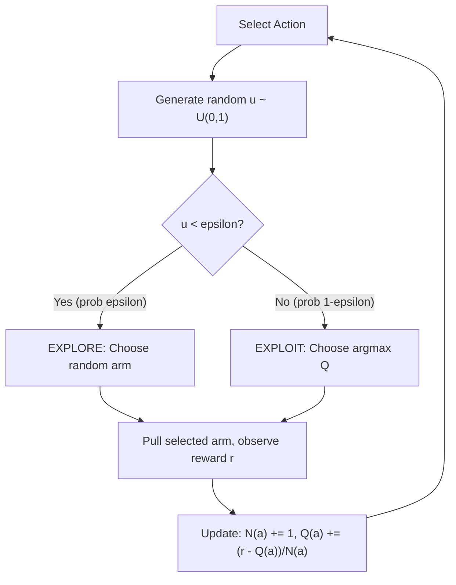
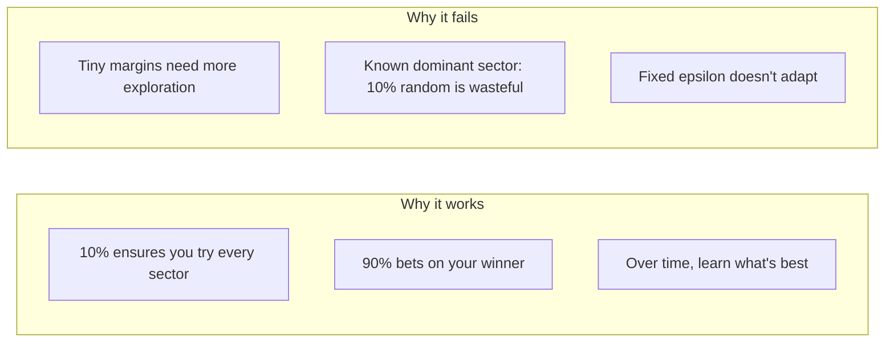
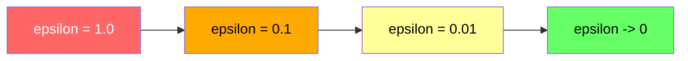
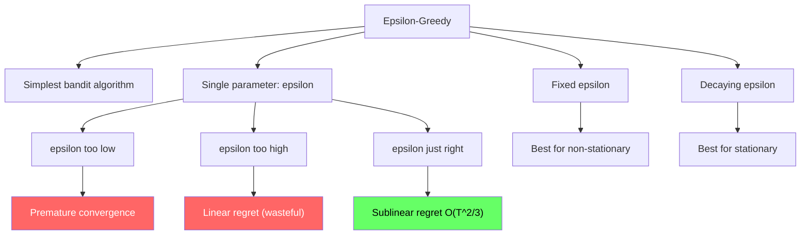

<!-- _class: lead -->

# Epsilon-Greedy Algorithm

## Module 1: Bandit Algorithms
### Multi-Armed Bandits for Commodity Trading

<!-- Speaker notes: This deck covers Epsilon-Greedy Algorithm. Set the context for the audience and explain how this topic fits into the broader course on multi-armed bandits for commodity trading. -->
---

## In Brief

The simplest bandit algorithm:

- With probability $\varepsilon$: **explore** (choose a random arm)
- With probability $1 - \varepsilon$: **exploit** (choose the arm with highest estimated reward)

> A single tunable parameter controls the explore-exploit balance.

<!-- Speaker notes: This opening summary sets the context for the entire deck. Read the key quote aloud and pause to let it sink in. The goal is to establish the core problem or concept before diving into details. -->
---

## How It Works



$\varepsilon = 0.1$ means: 10% exploration, 90% exploitation

<!-- Speaker notes: The diagram on How It Works illustrates the key relationships visually. Walk through the flow step by step, pointing out decision points and outcomes. Visual representations like this help students build mental models of the concepts. -->
---

## Arm Selection Over Time (5 arms, arm 3 is best)

```
Time:     0---------------------------T
Arm 1:    ##........................    (explored early, abandoned)
Arm 2:    .#........................    (explored early, abandoned)
Arm 3:    ........#################    (best arm, exploited heavily)
Arm 4:    ..#.......................    (explored, abandoned)
Arm 5:    ....#.....................    (explored, abandoned)
```

<!-- Speaker notes: This code example for Arm Selection Over Time (5 arms, arm 3 is best) is production-ready. Walk through the implementation, noting any important design patterns or potential modifications for different use cases. -->
---

## Formal Definition

**At each time step $t$:**

1. **Select action:**

$$a_t = \begin{cases} \text{random arm from } \{1,\ldots,K\} & \text{with probability } \varepsilon \\ \arg\max_a \hat{Q}(a) & \text{with probability } 1-\varepsilon \end{cases}$$

2. **Observe reward:** $r_t \sim R(a_t)$

3. **Update estimates:**
$$N(a_t) \leftarrow N(a_t) + 1$$
$$\hat{Q}(a_t) \leftarrow \hat{Q}(a_t) + \frac{r_t - \hat{Q}(a_t)}{N(a_t)}$$

<!-- Speaker notes: This is the formal mathematical treatment. Walk through each symbol and equation carefully, connecting back to the intuitive explanation from the previous slides. Do not rush this slide -- pause after each equation to ensure comprehension. -->
---

## Expected Regret

$$E[R_T] = O\left(\varepsilon \cdot T + \frac{K \cdot \Delta^2}{\varepsilon}\right)$$

Where $\Delta$ = gap between best and second-best arm.

| Term | Source | Meaning |
|------|--------|---------|
| $\varepsilon \cdot T$ | Random exploration | Cost of pulling random arms |
| $K \cdot \Delta^2 / \varepsilon$ | Insufficient exploration | Cost of not knowing which arm is best |

**Optimal:** $\varepsilon^* \approx O\left((K/T)^{1/3}\right)$ gives regret $O(T^{2/3})$

<!-- Speaker notes: This comparison table on Expected Regret is a key reference. Walk through each row, highlighting the most important distinctions. Students should understand when to use each option based on the criteria shown. -->
---

## Intuitive Explanation: Commodity Trader

**Every week, flip a weighted coin:**

- **Heads (10%):** Try a random commodity sector
- **Tails (90%):** Go all-in on whichever sector has made you the most money



<!-- Speaker notes: This analogy makes the abstract concept concrete. Tell the story naturally and let the audience connect it to the formal definition. Good analogies are worth lingering on -- they are what students remember months later. -->
---

## Epsilon Decay: The Fix

| Phase | Epsilon | Behavior |
|-------|---------|----------|
| Early | $\varepsilon = 1$ | Explore everything |
| Middle | $\varepsilon = 0.1$ | Mostly exploit, some exploration |
| Late | $\varepsilon = 1/\sqrt{t} \to 0$ | Almost pure exploitation |



<!-- Speaker notes: The diagram on Epsilon Decay: The Fix illustrates the key relationships visually. Walk through the flow step by step, pointing out decision points and outcomes. Visual representations like this help students build mental models of the concepts. -->
---

## Code: Core Implementation

```python
import numpy as np

class EpsilonGreedyBandit:
    def __init__(self, k_arms, epsilon=0.1):
        self.k = k_arms
        self.epsilon = epsilon
        self.q_estimates = np.zeros(k_arms)
        self.action_counts = np.zeros(k_arms)
```

<!-- Speaker notes: Code continues on the next slide. This first part sets up the structure. -->

---

## Code: Core Implementation (continued)

```python
    def select_action(self):
        if np.random.random() < self.epsilon:
            return np.random.randint(self.k)   # Explore
        else:
            return np.argmax(self.q_estimates)  # Exploit

    def update(self, action, reward):
        self.action_counts[action] += 1
        n = self.action_counts[action]
        self.q_estimates[action] += (reward - self.q_estimates[action]) / n
```

<!-- Speaker notes: Walk through the code line by line. Highlight the key design decisions and explain why each parameter or function call matters. This code is copy-paste ready -- students can use it directly in their own projects. -->
---

## Code: Decaying Epsilon Variant

```python
class DecayingEpsilonGreedy(EpsilonGreedyBandit):
    def __init__(self, k_arms, epsilon_fn=lambda t: 1/np.sqrt(t+1)):
        super().__init__(k_arms, epsilon=1.0)
        self.epsilon_fn = epsilon_fn
        self.t = 0

    def select_action(self):
        self.epsilon = self.epsilon_fn(self.t)
        self.t += 1
        return super().select_action()

# Usage
bandit = EpsilonGreedyBandit(k_arms=5, epsilon=0.1)
for t in range(1000):
    action = bandit.select_action()
    reward = get_reward(action)
    bandit.update(action, reward)
```

<!-- Speaker notes: Walk through the code line by line. Highlight the key design decisions and explain why each parameter or function call matters. This code is copy-paste ready -- students can use it directly in their own projects. -->
---

<!-- _class: lead -->

# Common Pitfalls

<!-- Speaker notes: Transition slide for the Common Pitfalls section. Pause briefly to let the audience absorb the previous content before moving into this new topic area. -->
---

## Pitfall 1: Fixed Epsilon Doesn't Adapt

> Using $\varepsilon = 0.1$ for all $T$ means 10% of pulls are random **forever**.

Regret grows linearly ($\varepsilon \cdot T$ term dominates).

**Fix:** Decaying epsilon
```python
epsilon = lambda t: min(1.0, 10 / np.sqrt(t + 1))
```

**Exception:** Fixed $\varepsilon$ is correct for non-stationary environments where the best arm changes.

<!-- Speaker notes: Walk through Pitfall 1: Fixed Epsilon Doesn't Adapt carefully. Emphasize why this mistake is common and how to recognize it in practice. The commodity trading example makes it concrete -- ask if anyone has encountered this in their own work. -->
---

## Pitfall 2: Epsilon Too High

> $\varepsilon = 0.5$ means half your pulls are random, even after identifying the best arm.

**Symptom:** Regret curve never flattens, keeps growing linearly.

**Fix:** Start with $\varepsilon \in [0.05, 0.2]$ for most problems.

<!-- Speaker notes: Walk through Pitfall 2: Epsilon Too High carefully. Emphasize why this mistake is common and how to recognize it in practice. The commodity trading example makes it concrete -- ask if anyone has encountered this in their own work. -->
---

## Pitfall 3: Epsilon Too Low

> $\varepsilon = 0.01$ means you only explore 1% of the time.

**Symptom:** Regret flattens quickly but at a high value (stuck on suboptimal arm).

**Fix:** Ensure $\varepsilon \cdot T \geq K$ (explore each arm at least once in expectation).

<!-- Speaker notes: Walk through Pitfall 3: Epsilon Too Low carefully. Emphasize why this mistake is common and how to recognize it in practice. The commodity trading example makes it concrete -- ask if anyone has encountered this in their own work. -->
---

## Pitfall 4: Ignoring Ties

> If two arms have identical $\hat{Q}$ values, `argmax` picks the first one.

```python
# WRONG: biases toward lower-indexed arms
return np.argmax(self.q_estimates)

# CORRECT: break ties randomly
max_q = np.max(self.q_estimates)
max_actions = np.where(self.q_estimates == max_q)[0]
return np.random.choice(max_actions)
```

<!-- Speaker notes: Walk through Pitfall 4: Ignoring Ties carefully. Emphasize why this mistake is common and how to recognize it in practice. The commodity trading example makes it concrete -- ask if anyone has encountered this in their own work. -->
---

## Pitfall 5: Wrong Update Rule

```python
# CORRECT (sample mean) -- for stationary problems
q_new = q_old + (reward - q_old) / n

# INCORRECT for stationary (exponential MA with alpha=0.1)
q_new = q_old + 0.1 * (reward - q_old)  # Forgets old data
```

> EMA is better for **non-stationary** rewards (arm distributions change over time).

<!-- Speaker notes: Walk through Pitfall 5: Wrong Update Rule carefully. Emphasize why this mistake is common and how to recognize it in practice. The commodity trading example makes it concrete -- ask if anyone has encountered this in their own work. -->
---

## Connections

<div class="columns">
<div>

### Builds On
- Basic probability (expectation, variance)
- Law of large numbers
- Explore-exploit tradeoff

</div>
<div>

### Leads To
- UCB (removes need for epsilon)
- Thompson Sampling (Bayesian alternative)
- Decaying exploration schedules
- A/B testing as baseline

</div>
</div>

<!-- Speaker notes: The connections section shows how this topic links to the rest of the course. Highlight the 'Builds On' prerequisites to remind students of what they should already know, and use 'Leads To' to create anticipation for upcoming modules. -->
---

## Practice: Pull Count Estimation

**Q:** $\varepsilon$-greedy with $\varepsilon = 0.1$, $T = 10{,}000$ steps, 5 arms. How many pulls per arm?

| Arm | Expected Pulls |
|-----|---------------|
| Best arm | $(0.9 \times 10{,}000) + (0.1 \times 10{,}000 / 5) = 9{,}200$ |
| Each other arm | $0.1 \times 10{,}000 / 5 = 200$ |

<!-- Speaker notes: This is a self-check exercise. Give students 2-3 minutes to think through the problem before discussing. The key learning outcome is reinforcing the concepts just covered with hands-on reasoning. -->
---

## Practice: Commodity Sector Allocation

5 commodity sectors, $T = 252$ trading days. How to set $\varepsilon$?

```python
# Conservative: decay from 20% to 1%
epsilon = lambda t: max(0.01, 0.2 * (1 - t/252))

# Aggressive: pure explore 50 days, then pure exploit
epsilon = lambda t: 1.0 if t < 50 else 0.0

# Balanced: 1/sqrt(t) decay
epsilon = lambda t: min(0.2, 10 / np.sqrt(t + 1))
```

<!-- Speaker notes: This is a self-check exercise. Give students 2-3 minutes to think through the problem before discussing. The key learning outcome is reinforcing the concepts just covered with hands-on reasoning. -->
---

## Visual Summary



<!-- Speaker notes: This visual summary captures the key relationships from the entire deck. Walk through each branch of the diagram, connecting back to the main concepts covered. This slide works well as a reference -- encourage students to screenshot it for later review. -->