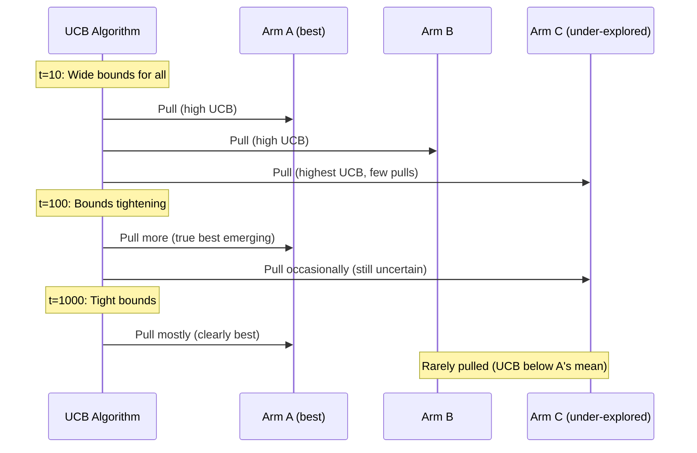
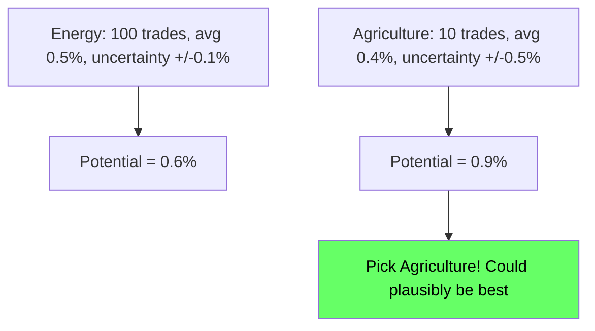
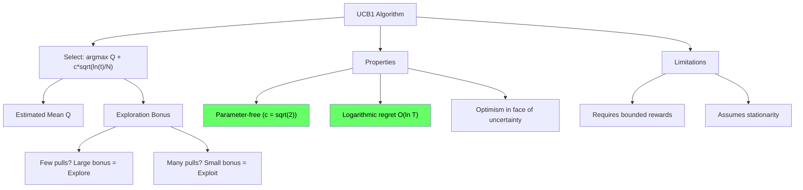

<!-- _class: lead -->

# Upper Confidence Bound (UCB1)

## Module 1: Bandit Algorithms
### Multi-Armed Bandits for Commodity Trading

<!-- Speaker notes: This deck covers Upper Confidence Bound (UCB1). Set the context for the audience and explain how this topic fits into the broader course on multi-armed bandits for commodity trading. -->
---

## In Brief

UCB1 selects the arm with the highest **upper confidence bound**:

$$a_t = \arg\max_a \left[\hat{Q}(a) + c\sqrt{\frac{\ln t}{N(a)}}\right]$$

> **Optimism in the face of uncertainty:** Always bet on arms that *could plausibly* be the best.

<!-- Speaker notes: This opening summary sets the context for the entire deck. Read the key quote aloud and pause to let it sink in. The goal is to establish the core problem or concept before diving into details. -->
---

## Visual: Confidence Bounds at t=100

```
Arm 1: mu=0.5, N=80     |====*====|              UCB = 0.55
Arm 2: mu=0.6, N=15     |========*========|      UCB = 0.82  <-- SELECTED
Arm 3: mu=0.7, N=5      |============*===========| UCB = 1.08
Arm 4: mu=0.3, N=50     |==*==|                  UCB = 0.37
```

- Arm 3 has highest mean (0.7) but few pulls -- huge bonus
- Arm 1 has many pulls -- tight confidence, no bonus needed

<!-- Speaker notes: This code example for Visual: Confidence Bounds at t=100 is production-ready. Walk through the implementation, noting any important design patterns or potential modifications for different use cases. -->
---

## How UCB Evolves Over Time



<!-- Speaker notes: The diagram on How UCB Evolves Over Time illustrates the key relationships visually. Walk through the flow step by step, pointing out decision points and outcomes. Visual representations like this help students build mental models of the concepts. -->
---

## Formal Definition

**At each time step $t > K$:**

1. **Select action:**
$$a_t = \arg\max_a \left[\hat{Q}(a) + c\sqrt{\frac{\ln t}{N(a)}}\right]$$

2. **Observe reward:** $r_t \sim R(a_t)$

3. **Update:**
$$N(a_t) \leftarrow N(a_t) + 1$$
$$\hat{Q}(a_t) \leftarrow \hat{Q}(a_t) + \frac{r_t - \hat{Q}(a_t)}{N(a_t)}$$

<!-- Speaker notes: This is the formal mathematical treatment. Walk through each symbol and equation carefully, connecting back to the intuitive explanation from the previous slides. Do not rush this slide -- pause after each equation to ensure comprehension. -->
---

## The UCB Bonus Term

$$U(a, t) = c\sqrt{\frac{\ln t}{N(a)}}$$

Three key properties:

| Property | Effect |
|----------|--------|
| Decreases with $N(a)$ | More pulls = smaller bonus = less exploration |
| Increases with $t$ | More total time = more budget to explore |
| Logarithmic in $t$ | Exploration slows down over time |

<!-- Speaker notes: This comparison table on The UCB Bonus Term is a key reference. Walk through each row, highlighting the most important distinctions. Students should understand when to use each option based on the criteria shown. -->
---

## Regret Bound

UCB1 achieves **logarithmic regret**:

$$E[R_T] \leq \sum_{a: \Delta_a > 0} \frac{8 \ln T}{\Delta_a} + \left(1 + \frac{\pi^2}{3}\right)\sum_a \Delta_a$$

Where $\Delta_a = \mu^* - \mu_a$ is the suboptimality gap.

**Simplified:** $E[R_T] = O(\sqrt{KT \ln T})$ worst case

> UCB1 regret is $O(\ln T)$ vs epsilon-greedy's $O(T^{2/3})$

<!-- Speaker notes: The mathematical treatment of Regret Bound formalizes what we discussed intuitively. Walk through each variable and equation, relating them back to the commodity trading context. Ensure the audience follows the notation before moving on. -->
---

## Why This Bonus? Hoeffding's Inequality

$$P(|\hat{Q}(a) - \mu(a)| \geq u) \leq 2\exp(-2N(a)u^2)$$

Setting failure probability $p = 1/t^2$ and solving for $u$:

$$u \approx \sqrt{\frac{\ln t}{N(a)}}$$

> With high probability, the true mean $\mu(a)$ is within $\sqrt{\ln(t)/N(a)}$ of $\hat{Q}(a)$.

UCB uses the **upper** bound: assume each arm is as good as it *could plausibly be*.

<!-- Speaker notes: The mathematical treatment of Why This Bonus? Hoeffding's Inequality formalizes what we discussed intuitively. Walk through each variable and equation, relating them back to the commodity trading context. Ensure the audience follows the notation before moving on. -->
---

## Intuitive Explanation: Optimistic Trader

For each commodity sector, estimate its potential:

$$\text{Potential} = \text{historical avg return} + \text{uncertainty bonus}$$



After many pulls of Agriculture, its uncertainty shrinks and true performance dominates.

<!-- Speaker notes: This analogy makes the abstract concept concrete. Tell the story naturally and let the audience connect it to the formal definition. Good analogies are worth lingering on -- they are what students remember months later. -->
---

## Why UCB Beats Epsilon-Greedy

| Aspect | Epsilon-Greedy | UCB1 |
|--------|----------------|------|
| **Exploration** | Random (wastes pulls) | Directed (pulls informative arms) |
| **Hyperparameters** | Requires tuning $\varepsilon$ | Parameter-free ($c = \sqrt{2}$) |
| **Regret** | $O(T^{2/3})$ | $O(\ln T)$ |
| **Assumptions** | None | Bounded rewards, stationarity |
| **Cold start** | Explores immediately | Must pull each arm once |

<!-- Speaker notes: This comparison table on Why UCB Beats Epsilon-Greedy is a key reference. Walk through each row, highlighting the most important distinctions. Students should understand when to use each option based on the criteria shown. -->
---

## Code: Core Implementation

```python
import numpy as np

class UCB1:
    def __init__(self, k_arms, c=np.sqrt(2)):
        self.k = k_arms
        self.c = c
        self.q_estimates = np.zeros(k_arms)
        self.action_counts = np.zeros(k_arms)
        self.t = 0

    def select_action(self):
        self.t += 1
        if self.t <= self.k:
            return self.t - 1  # Pull each arm once first
```

<!-- Speaker notes: Code continues on the next slide. This first part sets up the structure. -->

---

## Code: Core Implementation (continued)

```python
        ucb_values = self.q_estimates + self.c * np.sqrt(
            np.log(self.t) / (self.action_counts + 1e-10)
        )
        return np.argmax(ucb_values)

    def update(self, action, reward):
        self.action_counts[action] += 1
        n = self.action_counts[action]
        self.q_estimates[action] += (reward - self.q_estimates[action]) / n
```

<!-- Speaker notes: Walk through the code line by line. Highlight the key design decisions and explain why each parameter or function call matters. This code is copy-paste ready -- students can use it directly in their own projects. -->
---

## Code: Usage and Variants

```python
# Standard UCB1
ucb = UCB1(k_arms=5)
for t in range(1000):
    action = ucb.select_action()
    reward = get_reward(action)
    ucb.update(action, reward)

# Conservative (less exploration)
ucb = UCB1(k_arms=5, c=1.0)

# Aggressive (more exploration)
ucb = UCB1(k_arms=5, c=2.0)

# Standard (theory-optimal)
ucb = UCB1(k_arms=5, c=np.sqrt(2))
```

<!-- Speaker notes: Walk through the code line by line. Highlight the key design decisions and explain why each parameter or function call matters. This code is copy-paste ready -- students can use it directly in their own projects. -->
---

<!-- _class: lead -->

# Common Pitfalls

<!-- Speaker notes: Transition slide for the Common Pitfalls section. Pause briefly to let the audience absorb the previous content before moving into this new topic area. -->
---

## Pitfall 1: Division by Zero

> If $N(a) = 0$, the bonus $\sqrt{\ln(t)/0} = \infty$.

**Fix:** Initialize by pulling each arm once, or add small constant:
```python
ucb_values = q + c * np.sqrt(np.log(t) / (counts + 1e-10))
```

<!-- Speaker notes: Walk through Pitfall 1: Division by Zero carefully. Emphasize why this mistake is common and how to recognize it in practice. The commodity trading example makes it concrete -- ask if anyone has encountered this in their own work. -->
---

## Pitfall 2: Unbounded Rewards

> UCB1 theory assumes rewards in $[0, 1]$. Heavy tails break the theory.

**Symptom:** A single large reward gives an arm a huge $\hat{Q}$ that never shrinks.

**Fix:**
- Normalize: `r_norm = (r - r_min) / (r_max - r_min)`
- Use UCB-V (variance-aware UCB)
- Clip extreme outliers

<!-- Speaker notes: Walk through Pitfall 2: Unbounded Rewards carefully. Emphasize why this mistake is common and how to recognize it in practice. The commodity trading example makes it concrete -- ask if anyone has encountered this in their own work. -->
---

## Pitfall 3: Wrong Time Index

```python
# WRONG -- bonus shrinks too fast
ucb = q + c * np.sqrt(np.log(counts) / counts)

# CORRECT -- uses total time t
ucb = q + c * np.sqrt(np.log(t) / counts)
```

> $\ln(t)$ ensures the bonus grows (slowly) with total time, encouraging continuous exploration.

<!-- Speaker notes: Walk through Pitfall 3: Wrong Time Index carefully. Emphasize why this mistake is common and how to recognize it in practice. The commodity trading example makes it concrete -- ask if anyone has encountered this in their own work. -->
---

## Pitfall 4: Non-Stationary Problems

> If reward distributions change over time, UCB keeps trusting old estimates.


**Fix:** Sliding window or discounted UCB:
```python
q_new = (1 - alpha) * q_old + alpha * reward  # Exponential recency
```

<!-- Speaker notes: Walk through Pitfall 4: Non-Stationary Problems carefully. Emphasize why this mistake is common and how to recognize it in practice. The commodity trading example makes it concrete -- ask if anyone has encountered this in their own work. -->
---

## When UCB Wins vs Loses

<div class="columns">
<div>

### UCB Wins
- Stationary environments
- Bounded rewards
- Long time horizons
- No hyperparameter tuning needed

</div>
<div>

### UCB Loses
- Non-stationary (regime changes)
- Unbounded or heavy-tailed rewards
- Short horizons (simplicity matters)
- Domain knowledge available for $\varepsilon$

</div>
</div>

<!-- Speaker notes: The mathematical treatment of When UCB Wins vs Loses formalizes what we discussed intuitively. Walk through each variable and equation, relating them back to the commodity trading context. Ensure the audience follows the notation before moving on. -->
---

## Connections

<div class="columns">
<div>

### Builds On
- Hoeffding's inequality
- Confidence intervals
- Optimism under uncertainty

</div>
<div>

### Leads To
- UCB-V (variance-aware)
- Bayes-UCB
- Thompson Sampling
- LinUCB (contextual)

</div>
</div>

<!-- Speaker notes: The connections section shows how this topic links to the rest of the course. Highlight the 'Builds On' prerequisites to remind students of what they should already know, and use 'Leads To' to create anticipation for upcoming modules. -->
---

## Practice: Why Logarithmic Bonus?

**Q:** Why $\ln(t)$ instead of just $t$ in the bonus?

| Choice | Effect |
|--------|--------|
| $\sqrt{t/N}$ | Grows without bound -- infinite exploration |
| Constant | Stops too early -- premature convergence |
| $\sqrt{\ln(t)/N}$ | Grows slowly -- exploitation dominates asymptotically |

> Logarithmic growth is the sweet spot between too much and too little exploration.

<!-- Speaker notes: This is a self-check exercise. Give students 2-3 minutes to think through the problem before discussing. The key learning outcome is reinforcing the concepts just covered with hands-on reasoning. -->
---

## Visual Summary



<!-- Speaker notes: This visual summary captures the key relationships from the entire deck. Walk through each branch of the diagram, connecting back to the main concepts covered. This slide works well as a reference -- encourage students to screenshot it for later review. -->