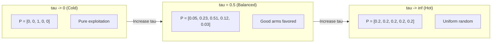
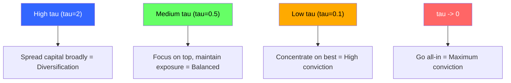
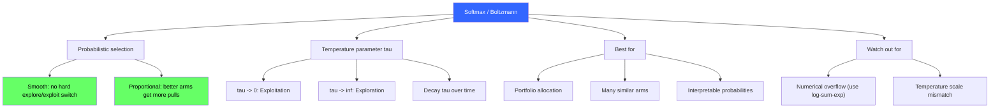

<!-- _class: lead -->

# Softmax (Boltzmann) Exploration

## Module 1: Bandit Algorithms
### Multi-Armed Bandits for Commodity Trading

<!-- Speaker notes: This deck covers Softmax (Boltzmann) Exploration. Set the context for the audience and explain how this topic fits into the broader course on multi-armed bandits for commodity trading. -->
---

## In Brief

Softmax selects arms **probabilistically**, with probabilities proportional to estimated values:

$$\pi(a) = \frac{\exp(\hat{Q}(a) / \tau)}{\sum_{a'} \exp(\hat{Q}(a') / \tau)}$$

> Instead of the hard explore-exploit switch of epsilon-greedy, softmax **smoothly** allocates more pulls to better arms.

<!-- Speaker notes: This opening summary sets the context for the entire deck. Read the key quote aloud and pause to let it sink in. The goal is to establish the core problem or concept before diving into details. -->
---

## Key Insight

> Softmax solves a key limitation of epsilon-greedy: a terrible arm and a mediocre arm are equally likely to be explored.

Softmax is smarter -- it explores **in proportion to how promising** each arm looks.

Temperature $\tau$ plays the same role as $\varepsilon$, but with a smoother effect.

<!-- Speaker notes: This is the single most important idea in the deck. Make sure the audience understands and remembers this insight. Consider asking the audience to restate it in their own words before proceeding. -->
---

## Temperature Controls the Distribution



With $\hat{Q} = [0.2, 0.5, 0.7, 0.3, 0.1]$

<!-- Speaker notes: The diagram on Temperature Controls the Distribution illustrates the key relationships visually. Walk through the flow step by step, pointing out decision points and outcomes. Visual representations like this help students build mental models of the concepts. -->
---

## Softmax vs Epsilon-Greedy

$\hat{Q} = [0.1, 0.3, 0.8, 0.4, 0.2]$, 5 arms

| Algorithm | Arm 1 | Arm 2 | Arm 3 | Arm 4 | Arm 5 |
|-----------|-------|-------|-------|-------|-------|
| $\varepsilon$-greedy ($\varepsilon = 0.2$) | 0.04 | 0.04 | **0.84** | 0.04 | 0.04 |
| Softmax ($\tau = 0.3$) | 0.01 | 0.08 | **0.80** | 0.10 | 0.02 |

> Softmax gives more probability to arm 4 ($\hat{Q}=0.4$) than arm 1 ($\hat{Q}=0.1$), while epsilon-greedy treats them equally during exploration.

<!-- Speaker notes: This comparison table on Softmax vs Epsilon-Greedy is a key reference. Walk through each row, highlighting the most important distinctions. Students should understand when to use each option based on the criteria shown. -->
---

## Formal Definition

**Selection probabilities (numerically stable):**

$$\pi(a) = \frac{\exp((\hat{Q}(a) - Q_{\max}) / \tau)}{\sum_{a'} \exp((\hat{Q}(a') - Q_{\max}) / \tau)}$$

**Temperature behavior:**

| $\tau$ | Behavior | Probability |
|--------|----------|-------------|
| $\tau \to 0$ | Pure exploitation | $\pi(a^*) \to 1$ |
| $\tau = 1$ | Balanced (default) | Moderate spread |
| $\tau \to \infty$ | Pure exploration | $\pi(a) \to 1/K$ |

<!-- Speaker notes: This is the formal mathematical treatment. Walk through each symbol and equation carefully, connecting back to the intuitive explanation from the previous slides. Do not rush this slide -- pause after each equation to ensure comprehension. -->
---

## Decaying Temperature

$$\tau(t) = \frac{\tau_0}{\log(t + 2)}$$

- **Early:** $\tau$ high = explore broadly
- **Late:** $\tau$ low = exploit best arm

**Regret:** $E[R_T] = O(T^{2/3})$ with optimal temperature schedule (same as epsilon-greedy).

<!-- Speaker notes: The mathematical treatment of Decaying Temperature formalizes what we discussed intuitively. Walk through each variable and equation, relating them back to the commodity trading context. Ensure the audience follows the notation before moving on. -->
---

## Intuitive Explanation: Portfolio Allocation

5 sectors, \$100K to allocate, $\tau = 0.5$:

| Sector | Est. Return | Allocation |
|--------|-------------|-----------|
| Energy | 0.1% | \$1K (1%) |
| Metals | 0.3% | \$8K (8%) |
| Agriculture | 0.8% | \$80K (80%) |
| Livestock | 0.4% | \$10K (10%) |
| Softs | 0.2% | \$2K (2%) |

> Good-but-not-best sectors get proportionally more capital than terrible ones.

<!-- Speaker notes: This analogy makes the abstract concept concrete. Tell the story naturally and let the audience connect it to the formal definition. Good analogies are worth lingering on -- they are what students remember months later. -->
---

## Temperature as Risk Tolerance



<!-- Speaker notes: The diagram on Temperature as Risk Tolerance illustrates the key relationships visually. Walk through the flow step by step, pointing out decision points and outcomes. Visual representations like this help students build mental models of the concepts. -->
---

## Code: Core Implementation

```python
import numpy as np

class SoftmaxBandit:
    def __init__(self, k_arms, tau=1.0):
        self.k = k_arms
        self.tau = tau
        self.q_estimates = np.zeros(k_arms)
        self.action_counts = np.zeros(k_arms)
```

<!-- Speaker notes: Code continues on the next slide. This first part sets up the structure. -->

---

## Code: Core Implementation (continued)

```python
    def select_action(self):
        q_max = np.max(self.q_estimates)
        exp_values = np.exp((self.q_estimates - q_max) / self.tau)
        probs = exp_values / np.sum(exp_values)
        return np.random.choice(self.k, p=probs)

    def update(self, action, reward):
        self.action_counts[action] += 1
        n = self.action_counts[action]
        self.q_estimates[action] += (reward - self.q_estimates[action]) / n
```

<!-- Speaker notes: Walk through the code line by line. Highlight the key design decisions and explain why each parameter or function call matters. This code is copy-paste ready -- students can use it directly in their own projects. -->
---

## Code: Decaying Temperature and Gradient Bandit

```python
class DecayingSoftmax(SoftmaxBandit):
    def __init__(self, k_arms, tau_fn=lambda t: 1.0 / np.log(t + 2)):
        super().__init__(k_arms, tau=1.0)
        self.tau_fn = tau_fn
        self.t = 0

    def select_action(self):
        self.tau = self.tau_fn(self.t)
        self.t += 1
        return super().select_action()
```

**Gradient Bandit** learns preferences $H(a)$ instead of values $\hat{Q}(a)$ using gradient ascent.

<!-- Speaker notes: Walk through the code line by line. Highlight the key design decisions and explain why each parameter or function call matters. This code is copy-paste ready -- students can use it directly in their own projects. -->
---

<!-- _class: lead -->

# Common Pitfalls

<!-- Speaker notes: Transition slide for the Common Pitfalls section. Pause briefly to let the audience absorb the previous content before moving into this new topic area. -->
---

## Pitfall 1: Numerical Overflow

> $\exp(\hat{Q}/\tau)$ overflows if $\hat{Q}$ is large or $\tau$ is very small.

```python
# WRONG (can overflow)
probs = np.exp(q / tau) / np.sum(np.exp(q / tau))

# CORRECT (log-sum-exp trick)
q_max = np.max(q)
exp_q = np.exp((q - q_max) / tau)
probs = exp_q / np.sum(exp_q)
```

> Constant cancels: $\exp(q/\tau) / \sum\exp(q'/\tau) = \exp((q-\max)/\tau) / \sum\exp((q'-\max)/\tau)$

<!-- Speaker notes: Walk through Pitfall 1: Numerical Overflow carefully. Emphasize why this mistake is common and how to recognize it in practice. The commodity trading example makes it concrete -- ask if anyone has encountered this in their own work. -->
---

## Pitfall 2: Wrong Temperature Scale

> Using $\tau = 1$ when $\hat{Q}$ values are in $[0, 1000]$ instead of $[0, 1]$.

**Diagnostic:**
```python
q_range = q.max() - q.min()
effective_scale = q_range / tau
# Target: 1 < effective_scale < 5
# < 1: too much exploration (random)
# > 5: too much exploitation (deterministic)
```

<!-- Speaker notes: Walk through Pitfall 2: Wrong Temperature Scale carefully. Emphasize why this mistake is common and how to recognize it in practice. The commodity trading example makes it concrete -- ask if anyone has encountered this in their own work. -->
---

## Pitfall 3: Temperature Too Low = Premature Convergence

$\tau = 0.01$ makes softmax almost deterministic (like argmax).

**Symptom:** One arm gets >99% of pulls, others are never explored.

## Pitfall 4: Temperature Too High = Random Search

$\tau = 10$ when $\hat{Q} \in [0, 1]$ makes all probabilities nearly equal.

**Symptom:** Arm selection frequencies are uniform.

<!-- Speaker notes: Walk through Pitfall 3: Temperature Too Low = Premature Convergence carefully. Emphasize why this mistake is common and how to recognize it in practice. The commodity trading example makes it concrete -- ask if anyone has encountered this in their own work. -->
---

## Three-Way Comparison

| Feature | $\varepsilon$-Greedy | UCB1 | Softmax |
|---------|----------|------|---------|
| **Selection** | Discrete | Deterministic | Smooth |
| **Exploration** | Uniform random | Confidence-based | Value-proportional |
| **Hyperparameters** | $\varepsilon$ | $c$ ($\sqrt{2}$) | $\tau$ |
| **Regret** | $O(T^{2/3})$ | $O(\ln T)$ | $O(T^{2/3})$ |
| **Assumptions** | None | Bounded rewards | Consistent scale |
| **Best for** | Non-stationary | Stationary | Portfolio allocation |

<!-- Speaker notes: This comparison table on Three-Way Comparison is a key reference. Walk through each row, highlighting the most important distinctions. Students should understand when to use each option based on the criteria shown. -->
---

## When to Use Softmax

<div class="columns">
<div>

### Softmax Wins
- Smooth exploration needed
- Many arms with similar values
- Interpretable selection probabilities
- Consistent reward scale

</div>
<div>

### Softmax Loses
- Need theoretical guarantees (use UCB)
- Unbounded/heavy-tailed rewards
- Don't want hyperparameter tuning
- Need fast cold-start

</div>
</div>

<!-- Speaker notes: This two-column comparison for When to Use Softmax highlights important trade-offs. Walk through both sides, noting when each approach is preferred. The contrast format helps students make informed decisions in their own work. -->
---

## Connections

<div class="columns">
<div>

### Builds On
- Boltzmann distribution (statistical mechanics)
- Logistic regression (multi-class sigmoid)
- Gibbs sampling

</div>
<div>

### Leads To
- Policy gradient methods (REINFORCE, PPO)
- Gradient bandit algorithm
- Contextual softmax
- Temperature annealing

</div>
</div>

<!-- Speaker notes: The connections section shows how this topic links to the rest of the course. Highlight the 'Builds On' prerequisites to remind students of what they should already know, and use 'Leads To' to create anticipation for upcoming modules. -->
---

## Practice: Computing Probabilities

$\hat{Q} = [0.1, 0.5, 0.9]$, $\tau = 1$:

$$\exp(0.1) = 1.11, \quad \exp(0.5) = 1.65, \quad \exp(0.9) = 2.46$$

$$\text{Sum} = 5.22$$

$$\pi = [0.21, 0.32, 0.47]$$

With $\tau = 0.1$: $\pi \approx [0.0003, 0.018, 0.982]$ -- nearly deterministic!

<!-- Speaker notes: This is a self-check exercise. Give students 2-3 minutes to think through the problem before discussing. The key learning outcome is reinforcing the concepts just covered with hands-on reasoning. -->
---

## Visual Summary



<!-- Speaker notes: This visual summary captures the key relationships from the entire deck. Walk through each branch of the diagram, connecting back to the main concepts covered. This slide works well as a reference -- encourage students to screenshot it for later review. -->