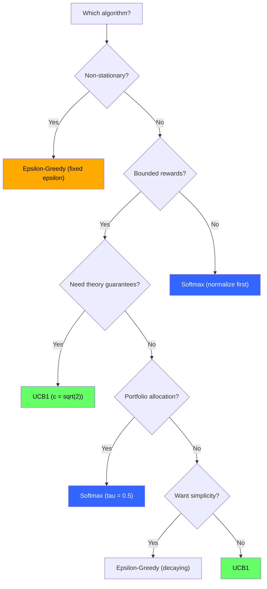
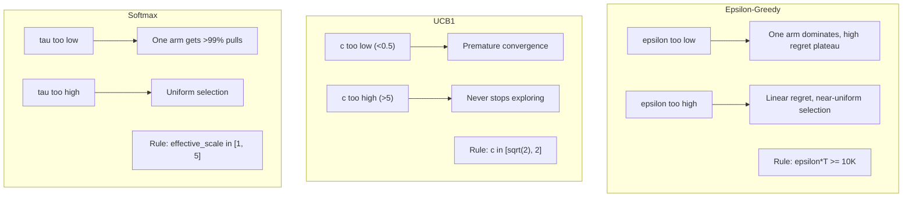
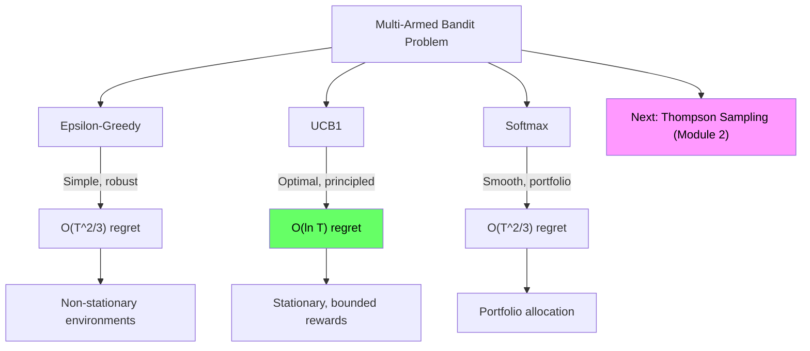

<!-- _class: lead -->

# Core Bandit Algorithms Cheatsheet

## Module 1: Bandit Algorithms
### Quick Reference

<!-- Speaker notes: This deck covers Core Bandit Algorithms Cheatsheet. Set the context for the audience and explain how this topic fits into the broader course on multi-armed bandits for commodity trading. -->
---

## Algorithm Comparison

| Algorithm | Selection Rule | Hyperparameters | Regret | Best For |
|-----------|---------------|-----------------|--------|----------|
| **$\varepsilon$-Greedy** | Random w.p. $\varepsilon$, else argmax | $\varepsilon \in [0,1]$ | $O(T^{2/3})$ | Non-stationary, simplicity |
| **UCB1** | $\arg\max[\hat{Q} + c\sqrt{\ln t / N}]$ | $c$ (default $\sqrt{2}$) | $O(\ln T)$ | Stationary, bounded |
| **Softmax** | Sample from $\exp(\hat{Q}/\tau)$ | $\tau > 0$ | $O(T^{2/3})$ | Portfolio, smooth |

<!-- Speaker notes: This comparison table on Algorithm Comparison is a key reference. Walk through each row, highlighting the most important distinctions. Students should understand when to use each option based on the criteria shown. -->
---

## Decision Guide



<!-- Speaker notes: The diagram on Decision Guide illustrates the key relationships visually. Walk through the flow step by step, pointing out decision points and outcomes. Visual representations like this help students build mental models of the concepts. -->
---

## Epsilon-Greedy Formulas

```python
# Action selection
if random() < epsilon:
    action = random_arm()       # Explore
else:
    action = argmax(Q)          # Exploit

# Update
N[a] += 1
Q[a] += (reward - Q[a]) / N[a]

# Decaying epsilon
epsilon_t = min(1.0, C / sqrt(t + 1))  # C in [1, 10]
```

**Optimal:** $\varepsilon^* \approx (K/T)^{1/3}$

**Regret:** $E[R_T] = \varepsilon T + K\Delta^2/\varepsilon$

<!-- Speaker notes: This slide connects theory to implementation for Epsilon-Greedy Formulas. Start with the mathematical formulation, then show how each term maps to a line of code. This bridge between theory and practice is one of the most valuable aspects of the course. -->
---

## UCB1 Formulas

```python
# Action selection (after pulling each arm once)
ucb_values = Q + c * sqrt(log(t) / (N + 1e-10))
action = argmax(ucb_values)

# Update (same as epsilon-greedy)
N[a] += 1
Q[a] += (reward - Q[a]) / N[a]
```

**Standard:** $c = \sqrt{2}$

**Regret:** $E[R_T] \leq \sum_a \frac{8 \ln T}{\Delta_a} + O(1)$

<!-- Speaker notes: This slide connects theory to implementation for UCB1 Formulas. Start with the mathematical formulation, then show how each term maps to a line of code. This bridge between theory and practice is one of the most valuable aspects of the course. -->
---

## Softmax Formulas

```python
# Action selection (numerically stable)
q_max = max(Q)
exp_q = exp((Q - q_max) / tau)
probs = exp_q / sum(exp_q)
action = random_choice(K, p=probs)

# Decaying temperature
tau_t = tau_0 / log(t + 2)
```

**Temperature:** $\tau \to 0$: argmax, $\tau \to \infty$: uniform, $\tau = 1$: balanced

<!-- Speaker notes: This slide connects theory to implementation for Softmax Formulas. Start with the mathematical formulation, then show how each term maps to a line of code. This bridge between theory and practice is one of the most valuable aspects of the course. -->
---

## Regret Bounds Comparison

| Algorithm | Gap-Dependent | Worst-Case |
|-----------|---------------|------------|
| $\varepsilon$-Greedy | $O(K/\varepsilon + \varepsilon T)$ | $O(T^{2/3})$ |
| UCB1 | $O(\sum_a \ln T / \Delta_a)$ | $O(\sqrt{KT \ln T})$ |
| Softmax | $O(\sum_a 1/\Delta_a^2)$ | $O(T^{2/3})$ |
| Thompson Sampling | $O(\sum_a \ln T / \Delta_a)$ | $O(\sqrt{KT})$ |

**Lower bound:** No algorithm can beat $\Omega(\sqrt{KT})$

> UCB1 and Thompson Sampling are **near-optimal**.

<!-- Speaker notes: This comparison table on Regret Bounds Comparison is a key reference. Walk through each row, highlighting the most important distinctions. Students should understand when to use each option based on the criteria shown. -->
---

## Hyperparameter Tuning



<!-- Speaker notes: The diagram on Hyperparameter Tuning illustrates the key relationships visually. Walk through the flow step by step, pointing out decision points and outcomes. Visual representations like this help students build mental models of the concepts. -->
---

## Common Pitfalls: All Algorithms

**Tie-breaking:**
```python
# WRONG: Always picks first arm when tied
action = argmax(values)

# CORRECT: Random tie-breaking
max_val = max(values)
best = [a for a in range(K) if values[a] == max_val]
action = random.choice(best)
```

**Update rule:**
```python
# Stationary: sample mean
N[a] += 1; Q[a] += (r - Q[a]) / N[a]

# Non-stationary: exponential moving average
Q[a] = 0.9 * Q[a] + 0.1 * r
```

<!-- Speaker notes: Walk through Common Pitfalls: All Algorithms carefully. Emphasize why this mistake is common and how to recognize it in practice. The commodity trading example makes it concrete -- ask if anyone has encountered this in their own work. -->
---

## Algorithm-Specific Pitfalls

| Algorithm | Pitfall | Fix |
|-----------|---------|-----|
| $\varepsilon$-Greedy | Fixed $\varepsilon$ in stationary env | Use decaying $\varepsilon(t)$ |
| UCB1 | Division by zero ($N=0$) | Pull each arm once first |
| UCB1 | $\ln(N)$ instead of $\ln(t)$ | Use total time $t$ |
| UCB1 | Unbounded rewards | Normalize to $[0,1]$ |
| Softmax | Numerical overflow | Subtract max before exp |
| Softmax | Wrong temperature scale | Check effective_scale |

<!-- Speaker notes: Walk through Algorithm-Specific Pitfalls carefully. Emphasize why this mistake is common and how to recognize it in practice. The commodity trading example makes it concrete -- ask if anyone has encountered this in their own work. -->
---

## Minimal Code Templates

<div class="columns">
<div>

**Epsilon-Greedy (10 lines):**
```python
class EpsilonGreedy:
    def __init__(self, K, eps=0.1):
        self.Q = np.zeros(K)
        self.N = np.zeros(K)
        self.eps = eps
    def select(self):
        if np.random.rand() < self.eps:
            return np.random.randint(len(self.Q))
        return np.argmax(self.Q)
    def update(self, a, r):
        self.N[a] += 1
        self.Q[a] += (r-self.Q[a])/self.N[a]
```

</div>
<div>

**UCB1 (12 lines):**
```python
class UCB1:
    def __init__(self, K, c=np.sqrt(2)):
        self.Q = np.zeros(K)
        self.N = np.zeros(K)
        self.c, self.t = c, 0
    def select(self):
        self.t += 1
        if self.t <= len(self.Q):
            return self.t - 1
        ucb = self.Q + self.c * np.sqrt(
            np.log(self.t)/(self.N+1e-10))
        return np.argmax(ucb)
    def update(self, a, r):
        self.N[a] += 1
        self.Q[a] += (r-self.Q[a])/self.N[a]
```

</div>
</div>

<!-- Speaker notes: Walk through the code line by line. Highlight the key design decisions and explain why each parameter or function call matters. This code is copy-paste ready -- students can use it directly in their own projects. -->
---

## Commodity Trading Examples

```python
# Energy Sector Selection (UCB1)
bandit = UCB1(K=5)  # WTI, Brent, NatGas, HeatOil, Gasoline
for day in range(252):
    commodity = bandit.select()
    ret = get_daily_return(commodity)
    bandit.update(commodity, normalize_to_01(ret))

# Cross-Asset Hedging (Epsilon-Greedy)
bandit = EpsilonGreedy(K=4, eps=0.1)  # Futures, Options, Swaps, Basis
for week in range(52):
    instrument = bandit.select()
    var = -compute_portfolio_variance(instrument)
    bandit.update(instrument, var)

# Adaptive Basket (Softmax)
bandit = Softmax(K=10, tau=0.5)
probs = bandit.get_probabilities()  # Use as portfolio weights
```

<!-- Speaker notes: This code example for Commodity Trading Examples is production-ready. Walk through the implementation, noting any important design patterns or potential modifications for different use cases. -->
---

## Quick Diagnostic Checklist

| Symptom | Check |
|---------|-------|
| Regret not decreasing | $\varepsilon/\tau/c$ too high? |
| One arm dominates | $\varepsilon/\tau/c$ too low? |
| Uniform selection | $\varepsilon/\tau$ too high, or arms truly similar |
| NaN / inf values | Softmax overflow? UCB division by zero? |

<!-- Speaker notes: This checklist is a practical tool for real-world application. Suggest students save or print this for reference when implementing their own systems. Walk through each item briefly, explaining why it matters. -->
---

## Visual Summary



<!-- Speaker notes: This visual summary captures the key relationships from the entire deck. Walk through each branch of the diagram, connecting back to the main concepts covered. This slide works well as a reference -- encourage students to screenshot it for later review. -->