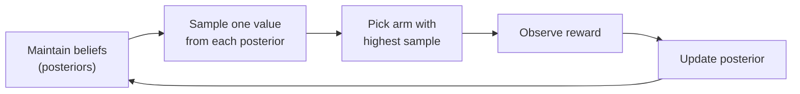
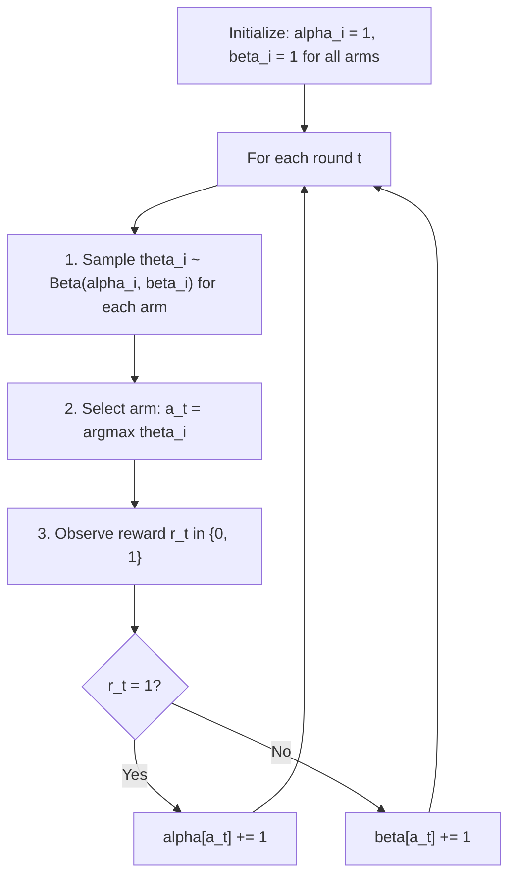
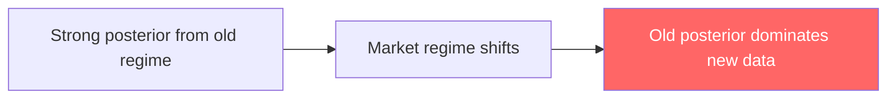
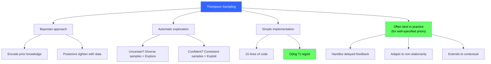

<!-- _class: lead -->

# Thompson Sampling

## Module 2: Bayesian Bandits
### Multi-Armed Bandits for Commodity Trading

<!-- Speaker notes: This deck covers Thompson Sampling. Set the context for the audience and explain how this topic fits into the broader course on multi-armed bandits for commodity trading. -->
---

## In Brief

Thompson Sampling maintains a **probability distribution** (belief) over each arm's true reward, **samples** a plausible reward from each distribution, and selects the arm with the highest sample.

> Exploration and exploitation happen **automatically** through posterior-guided randomness -- no parameters to tune.

<!-- Speaker notes: This opening summary sets the context for the entire deck. Read the key quote aloud and pause to let it sink in. The goal is to establish the core problem or concept before diving into details. -->
---

## Key Insight

Instead of deterministically choosing (like UCB), Thompson Sampling asks:

> "Given what I know, what **could** each arm's true reward be?"



Wide beliefs = diverse samples = more exploration
Tight beliefs = consistent samples = more exploitation

<!-- Speaker notes: This is the single most important idea in the deck. Make sure the audience understands and remembers this insight. Consider asking the audience to restate it in their own words before proceeding. -->
---

## Posterior Evolution Over Time

```
Round 1: Wide, uncertain beliefs
Beta(1,1)   Beta(1,1)   Beta(1,1)    -- Uniform, no data
  Arm A       Arm B       Arm C

Round 100: Beliefs concentrating
Beta(55,46) Beta(61,40) Beta(48,53)  -- B emerging as best
  Arm A       Arm B       Arm C

Round 500: Truth revealed
Beta(245,256) Beta(298,203) Beta(231,270)
   Arm A         Arm B         Arm C     -- B clearly best
```

> Posteriors narrow. Samples concentrate. Exploration fades naturally.

<!-- Speaker notes: This code example for Posterior Evolution Over Time is production-ready. Walk through the implementation, noting any important design patterns or potential modifications for different use cases. -->
---

## Formal Definition: Beta-Bernoulli

For each arm $i$, maintain: $\theta_i \sim \text{Beta}(\alpha_i, \beta_i)$



**Regret:** $O(\log T)$ for Bernoulli rewards -- asymptotically optimal for this case (Agrawal & Goyal, 2012). For general reward distributions, optimality guarantees require additional assumptions.

<!-- Speaker notes: This is the formal mathematical treatment. Walk through each symbol and equation carefully, connecting back to the intuitive explanation from the previous slides. Do not rush this slide -- pause after each equation to ensure comprehension. -->
---

## Intuitive Explanation

Each signal makes its **best case** based on current evidence:

| Signal | Record | Claim This Round |
|--------|--------|-----------------|
| A | 55 wins, 46 losses | "I'm 54% accurate!" |
| B | 61 wins, 40 losses | "I'm 62% accurate!" |
| C | 48 wins, 53 losses | "I'm 51% accurate!" |

> Pick B (highest claim). Tomorrow, new samples -- sometimes C gets lucky and you try it, collecting more data.

**Commodity context:** Each commodity is a trading signal. Weekly returns are "wins" or "losses." Thompson Sampling allocates capital by sampling plausible returns.

<!-- Speaker notes: This analogy makes the abstract concept concrete. Tell the story naturally and let the audience connect it to the formal definition. Good analogies are worth lingering on -- they are what students remember months later. -->
---

## Code: 15 Lines for State-of-the-Art

```python
import numpy as np
from scipy.stats import beta

class ThompsonSampling:
    def __init__(self, n_arms):
        self.n_arms = n_arms
        self.alpha = np.ones(n_arms)  # Prior successes
        self.beta = np.ones(n_arms)   # Prior failures

    def select_arm(self):
        samples = beta.rvs(self.alpha, self.beta)
        return np.argmax(samples)

    def update(self, arm, reward):
        if reward == 1:
            self.alpha[arm] += 1
        else:
            self.beta[arm] += 1
```

> That's it. 15 lines for a state-of-the-art bandit algorithm.

<!-- Speaker notes: Walk through the code line by line. Highlight the key design decisions and explain why each parameter or function call matters. This code is copy-paste ready -- students can use it directly in their own projects. -->
---

## Code: Usage

```python
bandit = ThompsonSampling(n_arms=3)
true_probs = [0.4, 0.6, 0.45]

for t in range(1000):
    arm = bandit.select_arm()
    reward = np.random.binomial(1, true_probs[arm])
    bandit.update(arm, reward)

print(f"Alpha: {bandit.alpha}")
print(f"Beta:  {bandit.beta}")
print(f"Means: {bandit.alpha / (bandit.alpha + bandit.beta)}")
```

<!-- Speaker notes: Walk through the code line by line. Highlight the key design decisions and explain why each parameter or function call matters. This code is copy-paste ready -- students can use it directly in their own projects. -->
---

<!-- _class: lead -->

# Common Pitfalls

<!-- Speaker notes: Transition slide for the Common Pitfalls section. Pause briefly to let the audience absorb the previous content before moving into this new topic area. -->
---

## Pitfall 1: Wrong Prior for Reward Type

Match the prior to the likelihood:

| Reward Type | Distribution | Prior |
|------------|-------------|-------|
| Binary (win/loss) | Bernoulli | Beta |
| Continuous (returns) | Gaussian | Normal |
| Counts (events) | Poisson | Gamma |

> Commodity returns are Gaussian, not Bernoulli. Use Normal-Normal conjugacy for continuous rewards.

<!-- Speaker notes: Walk through Pitfall 1: Wrong Prior for Reward Type carefully. Emphasize why this mistake is common and how to recognize it in practice. The commodity trading example makes it concrete -- ask if anyone has encountered this in their own work. -->
---

## Pitfall 2: Non-Stationarity

> Posteriors keep accumulating evidence from the past, even when regimes change.



**Fixes:**
- Exponential discounting: `alpha[arm] *= 0.99` each period
- Sliding window: only use last N observations
- Change detection: reset posteriors on distribution shift

<!-- Speaker notes: Walk through Pitfall 2: Non-Stationarity carefully. Emphasize why this mistake is common and how to recognize it in practice. The commodity trading example makes it concrete -- ask if anyone has encountered this in their own work. -->
---

## Pitfall 3: Overly Strong Priors

| Prior | Effective Sample Size | Behavior |
|-------|----------------------|----------|
| Beta(1, 1) | 0 observations | Data dominates quickly |
| Beta(10, 10) | 18 observations | Slow to learn |
| Beta(100, 100) | 198 observations | Very slow |

> Use Beta(1,1) unless you have genuine prior information. Strong priors slow learning dramatically.

<!-- Speaker notes: Walk through Pitfall 3: Overly Strong Priors carefully. Emphasize why this mistake is common and how to recognize it in practice. The commodity trading example makes it concrete -- ask if anyone has encountered this in their own work. -->
---

## Connections

<div class="columns">
<div>

### Builds On
- Decision theory and regret (Module 0)
- Epsilon-greedy and UCB (Module 1)
- Bayesian posterior updating

</div>
<div>

### Leads To
- Contextual Thompson Sampling (Module 3)
- Non-stationary bandits (Module 6)
- Bayesian optimization

</div>
</div>

**Math:** Conjugate priors, posterior predictive, information-directed sampling.

<!-- Speaker notes: The connections section shows how this topic links to the rest of the course. Highlight the 'Builds On' prerequisites to remind students of what they should already know, and use 'Leads To' to create anticipation for upcoming modules. -->
---

## Practice: Exploration Decay

Instrument Thompson Sampling to track **exploration rate** = fraction of times the empirically-best arm is NOT selected.

```
Expected: exploration rate decays roughly as 1/t
```

> In live trading, you want exploration to fade but never fully stop (in case regimes change).

<!-- Speaker notes: This is a self-check exercise. Give students 2-3 minutes to think through the problem before discussing. The key learning outcome is reinforcing the concepts just covered with hands-on reasoning. -->
---

## Visual Summary



<!-- Speaker notes: This visual summary captures the key relationships from the entire deck. Walk through each branch of the diagram, connecting back to the main concepts covered. This slide works well as a reference -- encourage students to screenshot it for later review. -->