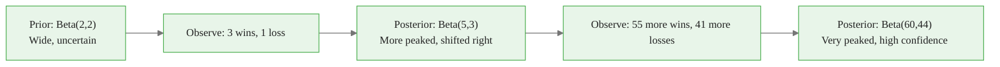
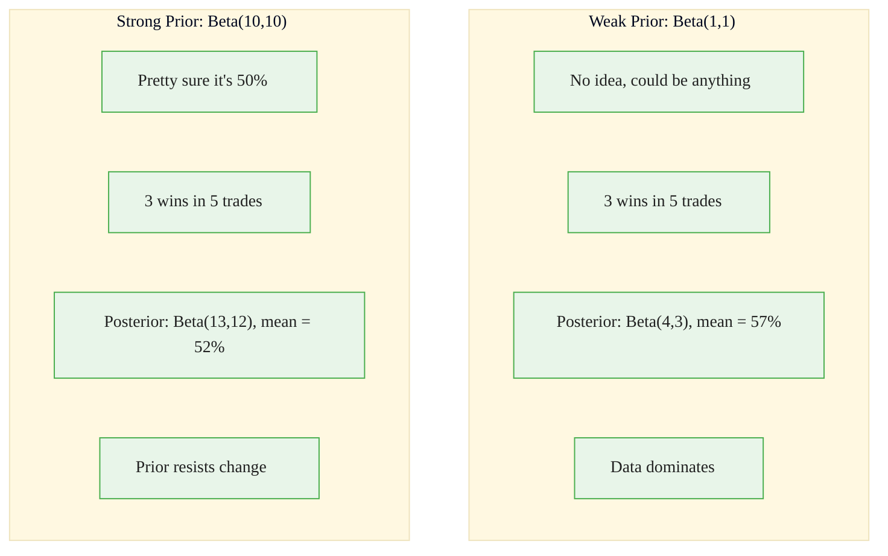
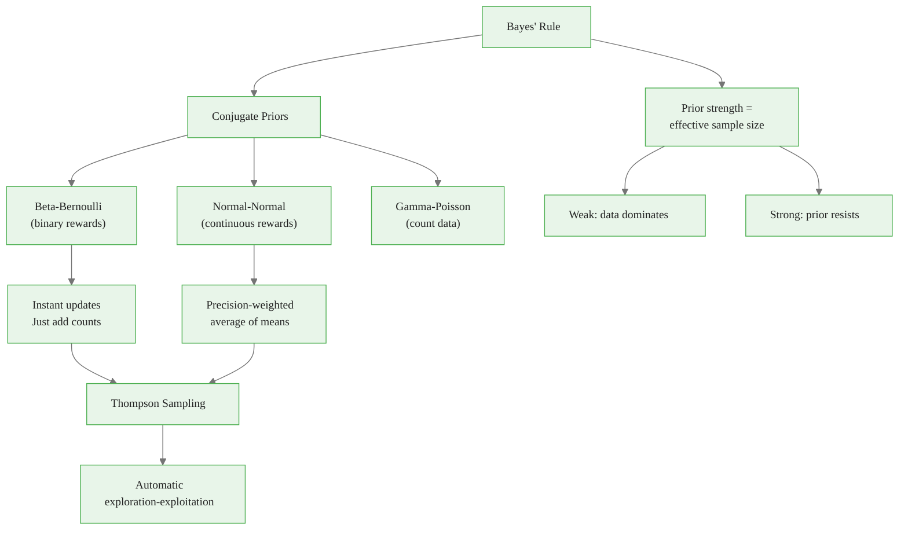

<!-- _class: lead -->

# Posterior Updating with Conjugate Priors

## Module 2: Bayesian Bandits
### Multi-Armed Bandits for Commodity Trading

<!-- Speaker notes: This deck covers Posterior Updating with Conjugate Priors. Set the context for the audience and explain how this topic fits into the broader course on multi-armed bandits for commodity trading. -->
---

## In Brief

Posterior updating: combine **prior belief** with **new evidence** using Bayes' rule to produce a **posterior belief**.

> With conjugate priors, this update has a **closed-form solution** -- no MCMC needed.

For Thompson Sampling, conjugate priors make posterior updates **instant and exact**.

<!-- Speaker notes: This opening summary sets the context for the entire deck. Read the key quote aloud and pause to let it sink in. The goal is to establish the core problem or concept before diving into details. -->

<div class="callout-key">

Bandits learn AND earn simultaneously -- the core advantage over traditional A/B testing.

</div>

---

> 💡 **Key Insight:** $$\text{Posterior} \propto \text{Likelihood} \times \text{Prior}$$

**Beta-Bernoulli example:**
- Prior: $\text{Beta}(\alpha, \beta)$
- Observe $k$ successes in $n$ trials
- Posterior: $\text{Beta}(\alpha + k, \beta + n - k)$

> No integrals, no sampling, no numerical optimization. Just arithmetic.

<!-- Speaker notes: This is the single most important idea in the deck. Make sure the audience understands and remembers this insight. Consider asking the audience to restate it in their own words before proceeding. -->

<div class="callout-insight">

**Insight:** The exploration-exploitation tradeoff is not a fixed ratio -- it should adapt as uncertainty decreases over time.

</div>

---

## Visual: Posterior Evolution



**Sequential updating:** Each observation updates the posterior, which becomes the prior for the next observation.

<!-- Speaker notes: The diagram on Visual: Posterior Evolution illustrates the key relationships visually. Walk through the flow step by step, pointing out decision points and outcomes. Visual representations like this help students build mental models of the concepts. -->

<div class="callout-warning">

**Warning:** Non-stationary reward distributions violate bandit assumptions. Always implement change detection in production systems.

</div>

---

## Common Conjugate Pairs

| Likelihood | Conjugate Prior | Posterior Update |
|------------|-----------------|------------------|
| Bernoulli($\theta$) | Beta($\alpha, \beta$) | Beta($\alpha + k, \beta + n - k$) |
| Normal($\mu, \sigma^2$), known $\sigma^2$ | Normal($\mu_0, \sigma_0^2$) | Normal($\mu_1, \sigma_1^2$) |
| Poisson($\lambda$) | Gamma($\alpha, \beta$) | Gamma($\alpha + \sum x_i, \beta + n$) |
| Exponential($\lambda$) | Gamma($\alpha, \beta$) | Gamma($\alpha + n, \beta + \sum x_i$) |

<!-- Speaker notes: This comparison table on Common Conjugate Pairs is a key reference. Walk through each row, highlighting the most important distinctions. Students should understand when to use each option based on the criteria shown. -->

<div class="callout-info">

**Info:** The regret of the best bandit algorithms grows logarithmically with time, compared to linearly for A/B testing.

</div>

---

## Beta-Bernoulli: The Workhorse

**Prior:** $\theta \sim \text{Beta}(\alpha_0, \beta_0)$

**Posterior:** $\theta \mid \text{data} \sim \text{Beta}(\alpha_0 + k, \beta_0 + n - k)$

**Key statistics:**
- Mean: $\frac{\alpha}{\alpha + \beta}$
- Variance: $\frac{\alpha\beta}{(\alpha+\beta)^2(\alpha+\beta+1)}$
- Mode: $\frac{\alpha - 1}{\alpha + \beta - 2}$ for $\alpha, \beta > 1$

<!-- Speaker notes: The mathematical treatment of Beta-Bernoulli: The Workhorse formalizes what we discussed intuitively. Walk through each variable and equation, relating them back to the commodity trading context. Ensure the audience follows the notation before moving on. -->
---

## Normal-Normal: For Continuous Rewards

**Prior:** $\mu \sim N(\mu_0, \sigma_0^2)$

**Data:** $x_1, \ldots, x_n \sim N(\mu, \sigma^2)$ with known $\sigma^2$

**Posterior:** $\mu \mid \text{data} \sim N(\mu_1, \sigma_1^2)$

$$\tau_1 = \tau_0 + n\tau \quad \text{where } \tau_0 = 1/\sigma_0^2, \;\tau = 1/\sigma^2$$

$$\mu_1 = \frac{\tau_0 \cdot \mu_0 + n \cdot \tau \cdot \bar{x}}{\tau_1}$$

> Posterior mean = precision-weighted average of prior mean and sample mean.

<!-- Speaker notes: The mathematical treatment of Normal-Normal: For Continuous Rewards formalizes what we discussed intuitively. Walk through each variable and equation, relating them back to the commodity trading context. Ensure the audience follows the notation before moving on. -->
---

## Intuitive Explanation: Prior Strength



> Prior strength = effective sample size. Beta($\alpha, \beta$) acts like $\alpha + \beta - 2$ observations.

<!-- Speaker notes: This analogy makes the abstract concept concrete. Tell the story naturally and let the audience connect it to the formal definition. Good analogies are worth lingering on -- they are what students remember months later. -->
---

## Code: Beta-Bernoulli Update

<div class="code-window">
<div class="code-header">
<div class="dots"><span class="dot-red"></span><span class="dot-yellow"></span><span class="dot-green"></span></div>
<span class="filename">example.py</span>
</div>

```python
import numpy as np
from scipy.stats import beta
import matplotlib.pyplot as plt

class BetaBernoulli:
    def __init__(self, alpha=1, beta_param=1):
        self.alpha = alpha
        self.beta = beta_param

    def update(self, successes, failures):
        self.alpha += successes
        self.beta += failures

    def sample(self, n=1):
        return beta.rvs(self.alpha, self.beta, size=n)

    def mean(self):
        return self.alpha / (self.alpha + self.beta)
```

</div>

<!-- Speaker notes: Walk through the code line by line. Highlight the key design decisions and explain why each parameter or function call matters. This code is copy-paste ready -- students can use it directly in their own projects. -->
---

## Code: Normal-Normal Update

<div class="code-window">
<div class="code-header">
<div class="dots"><span class="dot-red"></span><span class="dot-yellow"></span><span class="dot-green"></span></div>
<span class="filename">example.py</span>
</div>

```python
class NormalNormal:
    def __init__(self, mu_0=0, sigma_0=1, sigma_data=1):
        self.mu = mu_0
        self.sigma = sigma_0
        self.sigma_data = sigma_data

    def update(self, observations):
        tau_0 = 1 / self.sigma**2
        tau = 1 / self.sigma_data**2
        n = len(observations)
        x_bar = np.mean(observations)

        tau_1 = tau_0 + n * tau
        self.mu = (tau_0 * self.mu + n * tau * x_bar) / tau_1
        self.sigma = np.sqrt(1 / tau_1)

    def sample(self, n=1):
        return np.random.normal(self.mu, self.sigma, size=n)
```

</div>

<!-- Speaker notes: Walk through the code line by line. Highlight the key design decisions and explain why each parameter or function call matters. This code is copy-paste ready -- students can use it directly in their own projects. -->
---

<!-- _class: lead -->

# Common Pitfalls

<!-- Speaker notes: Transition slide for the Common Pitfalls section. Pause briefly to let the audience absorb the previous content before moving into this new topic area. -->
---

## Pitfall 1: Confusing Beta Parameters

> Beta($\alpha, \beta$) doesn't directly give you mean and variance.

To get Beta with mean $\mu$ and strength $n$:
- $\alpha = n\mu$
- $\beta = n(1 - \mu)$

**Example:** Prior centered at 0.6 with strength 10:
- $\alpha = 10 \times 0.6 = 6$, $\beta = 10 \times 0.4 = 4$
- Beta(6, 4) has mean 0.6, like seeing 8 observations

<!-- Speaker notes: Walk through Pitfall 1: Confusing Beta Parameters carefully. Emphasize why this mistake is common and how to recognize it in practice. The commodity trading example makes it concrete -- ask if anyone has encountered this in their own work. -->
---

## Pitfall 2: Unknown Variance in Gaussian Case

> Normal-Normal conjugacy assumes **known** observation variance $\sigma^2$.

If $\sigma^2$ is unknown:
- Use Normal-Gamma conjugacy (prior on both $\mu$ and $\sigma^2$)
- Or empirical Bayes (plug in sample variance)

**Commodity context:** Returns have time-varying volatility. Use rolling window for $\hat{\sigma}^2$.

<!-- Speaker notes: Walk through Pitfall 2: Unknown Variance in Gaussian Case carefully. Emphasize why this mistake is common and how to recognize it in practice. The commodity trading example makes it concrete -- ask if anyone has encountered this in their own work. -->
---

## Pitfall 3: Stale Posteriors in Non-Stationary Settings

> Posteriors keep adding evidence forever, even when the world changes.

**Fixes:**

| Method | How It Works |
|--------|-------------|
| Exponential discount | $\alpha \leftarrow \alpha \times 0.99$ each period |
| Sliding window | Only track last N observations |
| Change detection | Reset posteriors when shift detected |

<!-- Speaker notes: Walk through Pitfall 3: Stale Posteriors in Non-Stationary Settings carefully. Emphasize why this mistake is common and how to recognize it in practice. The commodity trading example makes it concrete -- ask if anyone has encountered this in their own work. -->
---

## Connections

<div class="columns">
<div>

### Builds On
- Bayes' rule, conjugate families
- Bayesian commodity forecasting

</div>
<div>

### Leads To
- Thompson Sampling
- Bayesian regression (contextual bandits)
- State-space models (Kalman filtering)

</div>
</div>

**Key math:** Exponential families, sufficient statistics, sequential Bayes.

<!-- Speaker notes: The connections section shows how this topic links to the rest of the course. Highlight the 'Builds On' prerequisites to remind students of what they should already know, and use 'Leads To' to create anticipation for upcoming modules. -->
---

## Practice: Hand Calculation

Start with Beta(2, 3). Observe: success, success, failure, success.

| After | Posterior | Mean |
|-------|----------|------|
| Start | Beta(2, 3) | 0.40 |
| Success | Beta(3, 3) | 0.50 |
| Success | Beta(4, 3) | 0.57 |
| Failure | Beta(4, 4) | 0.50 |
| Success | Beta(5, 4) | 0.56 |

<!-- Speaker notes: This is a self-check exercise. Give students 2-3 minutes to think through the problem before discussing. The key learning outcome is reinforcing the concepts just covered with hands-on reasoning. -->
---

## Visual Summary



<!-- Speaker notes: This visual summary captures the key relationships from the entire deck. Walk through each branch of the diagram, connecting back to the main concepts covered. This slide works well as a reference -- encourage students to screenshot it for later review. -->