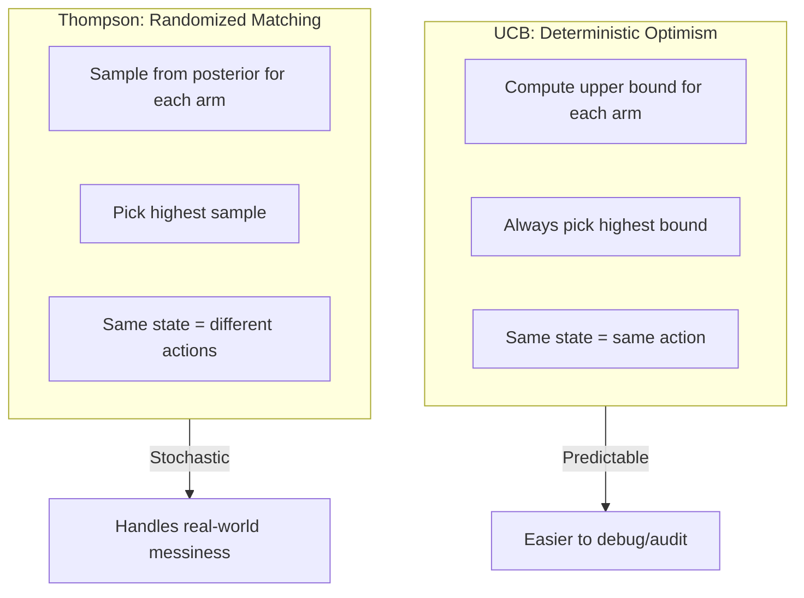
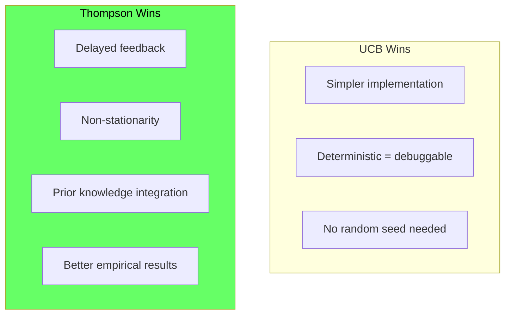
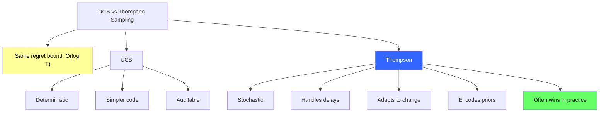

<!-- _class: lead -->

# Thompson Sampling vs UCB
## Theory and Practice

## Module 2: Bayesian Bandits
### Multi-Armed Bandits for Commodity Trading

<!-- Speaker notes: This deck covers Thompson Sampling vs UCB. Set the context for the audience and explain how this topic fits into the broader course on multi-armed bandits for commodity trading. -->
---

## Two Leading Algorithms

Both achieve **logarithmic regret**, but explore differently:

| | UCB | Thompson Sampling |
|---|-----|-------------------|
| **Philosophy** | Deterministic optimism | Randomized probability matching |
| **Selection** | Pick highest plausible value | Sample beliefs, pick highest sample |
| **Exploration** | Wide confidence bounds | Wide posteriors give diverse samples |

<!-- Speaker notes: This comparison table on Two Leading Algorithms is a key reference. Walk through each row, highlighting the most important distinctions. Students should understand when to use each option based on the criteria shown. -->
---

## Visual: How They Differ

```
UCB Confidence Bounds (deterministic):
Arm A: [0.45 ====*==== 0.55]  UCB = 0.55
Arm B: [0.48 ===*=== 0.58]    UCB = 0.58  <-- ALWAYS picks B
Arm C: [0.40 =====*===== 0.60] UCB = 0.60

Thompson Sampling Posteriors (stochastic):
Round 1: sample A=0.51, B=0.54, C=0.48 --> Pick B
Round 2: sample A=0.49, B=0.50, C=0.53 --> Pick C
Round 3: sample A=0.52, B=0.56, C=0.47 --> Pick B
```

> UCB commits until bounds shift. Thompson continuously randomizes.

<!-- Speaker notes: This code example for Visual: How They Differ is production-ready. Walk through the implementation, noting any important design patterns or potential modifications for different use cases. -->
---

## Exploration Mechanisms



<!-- Speaker notes: The diagram on Exploration Mechanisms illustrates the key relationships visually. Walk through the flow step by step, pointing out decision points and outcomes. Visual representations like this help students build mental models of the concepts. -->
---

## Formal Comparison

**UCB1:**
$$a_t = \arg\max_i \left[\hat{\mu}_i + \sqrt{\frac{2\ln t}{n_i}}\right]$$

**Thompson Sampling (Beta-Bernoulli):**
$$\hat{\theta}_i \sim \text{Beta}(\alpha_i, \beta_i), \quad a_t = \arg\max_i \hat{\theta}_i$$

**Both achieve:** $E[R_T] = O(\log T)$

Thompson's bound was proven later (2010s vs 2000s), but they're **asymptotically equivalent**.

<!-- Speaker notes: This is the formal mathematical treatment. Walk through each symbol and equation carefully, connecting back to the intuitive explanation from the previous slides. Do not rush this slide -- pause after each equation to ensure comprehension. -->
---

## Full Comparison Table

| Criterion | UCB1 | Thompson Sampling |
|-----------|------|-------------------|
| Exploration | Deterministic optimism | Probability matching |
| Tuning | $c$ (often $\sqrt{2}$) | Prior (often Beta(1,1)) |
| Delayed feedback | Poorly | Naturally |
| Non-stationary | Requires modification | Discount posteriors |
| Contextual extension | LinUCB (complex) | Contextual TS (natural) |
| Empirical performance | Good | **Often better** |
| Interpretability | "Most optimistic option" | "Sample plausible worlds" |
| Reproducibility | Deterministic | Needs random seed |

<!-- Speaker notes: This comparison table on Full Comparison Table is a key reference. Walk through each row, highlighting the most important distinctions. Students should understand when to use each option based on the criteria shown. -->
---

## Probability Matching Property

Thompson Sampling satisfies:

$$P(\text{select arm } i \mid \text{data}) = P(\text{arm } i \text{ is best} \mid \text{data})$$

> The probability of selecting an arm **equals** the probability it's the optimal arm.

UCB does NOT satisfy this -- it's deterministic. This property makes Thompson Sampling **Bayesian-optimal** in certain formulations.

<!-- Speaker notes: The mathematical treatment of Probability Matching Property formalizes what we discussed intuitively. Walk through each variable and equation, relating them back to the commodity trading context. Ensure the audience follows the notation before moving on. -->
---

<!-- _class: lead -->

# When to Use Which

<!-- Speaker notes: Transition slide for the When to Use Which section. Pause briefly to let the audience absorb the previous content before moving into this new topic area. -->
---

## Choose UCB When

- You need **determinism** (reproducibility, auditing)
- **Immediate feedback** (rewards arrive instantly)
- Simple reward distributions
- **Theoretical guarantees** are paramount

> **Commodity example:** High-frequency trading where every decision must be explainable for compliance.

<!-- Speaker notes: Cover Choose UCB When at a steady pace. Highlight the key points and connect them to the broader course themes. Check for audience questions before moving to the next slide. -->
---

## Choose Thompson Sampling When

- **Delayed or batched feedback** (weekly rebalancing)
- **Non-stationary environments** (regime changes)
- **Contextual decisions** (features like volatility, seasonality)
- **Prior information** available (fundamental analysis)
- **Empirical performance** matters most

> **Commodity example:** Portfolio allocation with weekly rebalancing and market regime shifts.

<!-- Speaker notes: Cover Choose Thompson Sampling When at a steady pace. Highlight the key points and connect them to the broader course themes. Check for audience questions before moving to the next slide. -->
---

## Practical Trade-offs



<!-- Speaker notes: The diagram on Practical Trade-offs illustrates the key relationships visually. Walk through the flow step by step, pointing out decision points and outcomes. Visual representations like this help students build mental models of the concepts. -->
---

## Delayed Feedback

**UCB:** Breaks down. If you pull arm A but reward arrives 10 rounds later, how do you update?

**Thompson:** Naturally handles batched updates. Pull arm A multiple times, update posterior with all rewards at once.

> **Winner: Thompson Sampling** (decisively)

<!-- Speaker notes: Cover Delayed Feedback at a steady pace. Highlight the key points and connect them to the broader course themes. Check for audience questions before moving to the next slide. -->
---

## Non-Stationary Environments

**UCB:** Accumulates all past data forever. Requires modification (sliding window, discounted UCB).

**Thompson:** Just discount posteriors:
```python
alpha *= 0.99  # Exponential decay
beta *= 0.99
```

> **Winner: Thompson Sampling** (easier adaptation)

<!-- Speaker notes: This code example for Non-Stationary Environments is production-ready. Walk through the implementation, noting any important design patterns or potential modifications for different use cases. -->
---

## Prior Knowledge Integration

**UCB:** No natural way to incorporate beliefs. Ad-hoc count initialization.

**Thompson:** Priors are fundamental:
```python
# Believe arm has ~60% success from fundamentals
alpha[arm] = 6   # Beta(6, 4)
beta[arm] = 4
```

> **Winner: Thompson Sampling** (Bayesian framework)

<!-- Speaker notes: This code example for Prior Knowledge Integration is production-ready. Walk through the implementation, noting any important design patterns or potential modifications for different use cases. -->
---

## Why Thompson Dominates in Commodity Trading

1. **Weekly/Monthly rebalancing** = batched updates (Thompson's strength)
2. **Regime changes** = non-stationarity (discount posteriors)
3. **Fundamental priors** = supply/demand views (Bayesian priors)
4. **Noisy signals** = high-variance returns (probabilistic approach)
5. **Contextual features** in Module 3 (natural extension)

<!-- Speaker notes: Cover Why Thompson Dominates in Commodity Trading at a steady pace. Highlight the key points and connect them to the broader course themes. Check for audience questions before moving to the next slide. -->
---

## Empirical Evidence

**Chapelle & Li (2011):**
- Tested on 6 real-world datasets
- Thompson matched or beat UCB on all
- Biggest wins in non-stationary and delayed-feedback settings

**Industry adoption:**
- Google, Meta: Thompson for content recommendations
- E-commerce: Thompson for pricing and promotions
- Reason: Better under real-world messiness

<!-- Speaker notes: Cover Empirical Evidence at a steady pace. Highlight the key points and connect them to the broader course themes. Check for audience questions before moving to the next slide. -->
---

## Commodity Sector Rotation Example

<div class="columns">
<div>

### UCB Approach
- Track mean weekly returns
- Compute UCB for each sector
- Go all-in on highest UCB
- **Problem:** If energy has high UCB from volatility, locked in

</div>
<div>

### Thompson Approach
- Maintain Gaussian posterior per sector
- Sample plausible return from each
- Allocate to highest sample
- **Advantage:** Stochasticity naturally diversifies

</div>
</div>

<!-- Speaker notes: This two-column comparison for Commodity Sector Rotation Example highlights important trade-offs. Walk through both sides, noting when each approach is preferred. The contrast format helps students make informed decisions in their own work. -->
---

## Practice: Side-by-Side Comparison

4-arm Bernoulli bandit, true probs = [0.4, 0.5, 0.45, 0.48].

Run both algorithms for 1000 rounds. Compare:
- Cumulative regret
- Fraction of time on each arm
- Exploration rate over time

<!-- Speaker notes: This is a self-check exercise. Give students 2-3 minutes to think through the problem before discussing. The key learning outcome is reinforcing the concepts just covered with hands-on reasoning. -->
---

## Practice: Non-Stationary Test

3-arm Gaussian bandit, means shift every 200 rounds:
- Rounds 0-199: $\mu = [0.01, 0.02, 0.015]$
- Rounds 200-399: $\mu = [0.02, 0.01, 0.015]$ (swap!)
- Rounds 400-599: $\mu = [0.015, 0.015, 0.025]$

> Compare standard UCB, discounted UCB, and discounted Thompson. Which adapts fastest?

<!-- Speaker notes: This is a self-check exercise. Give students 2-3 minutes to think through the problem before discussing. The key learning outcome is reinforcing the concepts just covered with hands-on reasoning. -->
---

## Visual Summary



<!-- Speaker notes: This visual summary captures the key relationships from the entire deck. Walk through each branch of the diagram, connecting back to the main concepts covered. This slide works well as a reference -- encourage students to screenshot it for later review. -->