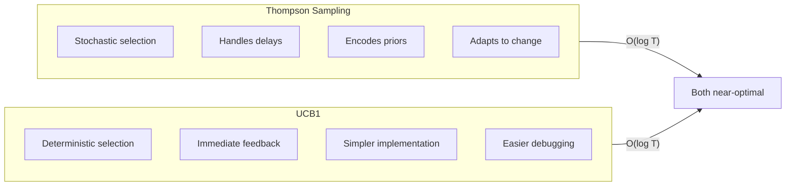
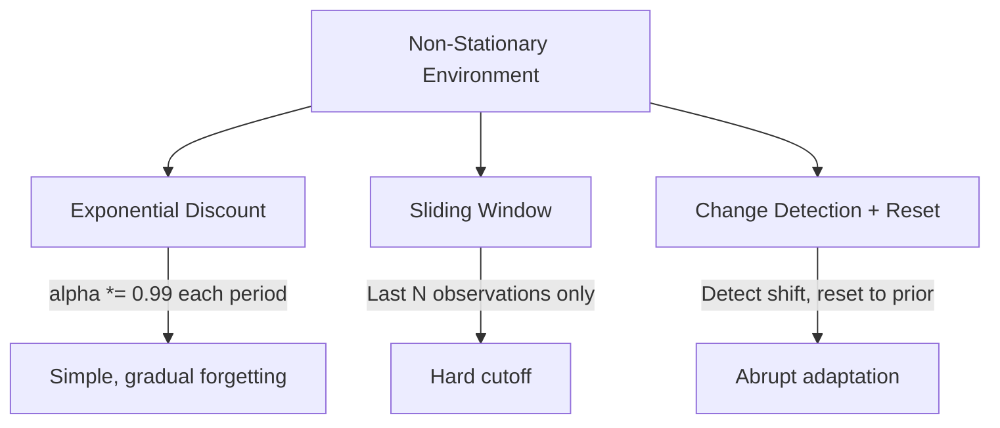
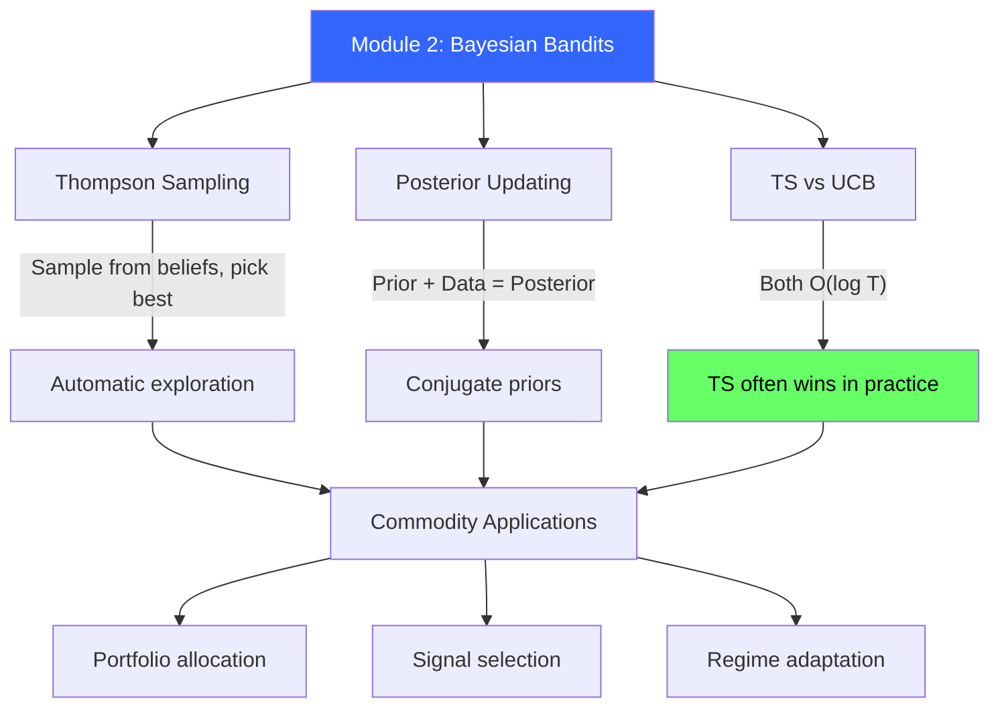

<!-- _class: lead -->

# Bayesian Bandits Cheatsheet

## Module 2 Quick Reference
### Multi-Armed Bandits for Commodity Trading

<!-- Speaker notes: This deck covers Bayesian Bandits Cheatsheet. Set the context for the audience and explain how this topic fits into the broader course on multi-armed bandits for commodity trading. -->
---

## Thompson Sampling: Beta-Bernoulli

```python
# Initialize
alpha = np.ones(K)  # Successes + 1
beta = np.ones(K)   # Failures + 1

# Each round
samples = np.random.beta(alpha, beta)
arm = np.argmax(samples)

# Update
if reward == 1:
    alpha[arm] += 1
else:
    beta[arm] += 1
```

<!-- Speaker notes: This code example for Thompson Sampling: Beta-Bernoulli is production-ready. Walk through the implementation, noting any important design patterns or potential modifications for different use cases. -->
---

## Thompson Sampling: Gaussian

```python
# Initialize
mu = np.zeros(K)        # Posterior means
sigma = np.ones(K)      # Posterior std devs
sigma_data = 0.1        # Known observation noise

# Each round
samples = np.random.normal(mu, sigma)
arm = np.argmax(samples)

# Update (Normal-Normal conjugacy)
tau_post = 1/sigma[arm]**2 + 1/sigma_data**2
mu[arm] = (mu[arm]/sigma[arm]**2 + reward/sigma_data**2) / tau_post
sigma[arm] = np.sqrt(1 / tau_post)
```

<!-- Speaker notes: This code example for Thompson Sampling: Gaussian is production-ready. Walk through the implementation, noting any important design patterns or potential modifications for different use cases. -->
---

## Conjugate Prior Table

| Likelihood | Parameter | Prior | Update |
|------------|-----------|-------|--------|
| Bernoulli($\theta$) | $\theta \in [0,1]$ | Beta($\alpha, \beta$) | Beta($\alpha+k, \beta+n-k$) |
| Normal($\mu, \sigma^2$) | $\mu$, known $\sigma^2$ | Normal($\mu_0, \sigma_0^2$) | Precision-weighted mean |
| Poisson($\lambda$) | $\lambda > 0$ | Gamma($\alpha, \beta$) | Gamma($\alpha + \sum x, \beta + n$) |

<!-- Speaker notes: This comparison table on Conjugate Prior Table is a key reference. Walk through each row, highlighting the most important distinctions. Students should understand when to use each option based on the criteria shown. -->
---

## Posterior Update Formulas

**Beta-Bernoulli:**
$$\text{Beta}(\alpha_0 + k, \;\beta_0 + n - k)$$

Mean: $\alpha/(\alpha + \beta)$, Variance: $\alpha\beta / [(\alpha+\beta)^2(\alpha+\beta+1)]$

**Normal-Normal:**
$$\tau_1 = \tau_0 + n\tau, \quad \mu_1 = \frac{\tau_0\mu_0 + n\tau\bar{x}}{\tau_1}, \quad \sigma_1^2 = 1/\tau_1$$

<!-- Speaker notes: The mathematical treatment of Posterior Update Formulas formalizes what we discussed intuitively. Walk through each variable and equation, relating them back to the commodity trading context. Ensure the audience follows the notation before moving on. -->
---

## Thompson vs UCB Quick Reference



<!-- Speaker notes: The diagram on Thompson vs UCB Quick Reference illustrates the key relationships visually. Walk through the flow step by step, pointing out decision points and outcomes. Visual representations like this help students build mental models of the concepts. -->
---

## Prior Choices

<div class="columns">
<div>

### Uninformative
```python
# Uniform
alpha, beta = 1, 1

# Wide Gaussian
mu_0, sigma_0 = 0, 10
```

</div>
<div>

### Informative
```python
# Beta with mean mu, strength n
alpha = n * mu
beta = n * (1 - mu)

# Example: 60% win rate, strength 10
alpha, beta = 6, 4  # Beta(6,4)
```

</div>
</div>

<!-- Speaker notes: This code example for Prior Choices is production-ready. Walk through the implementation, noting any important design patterns or potential modifications for different use cases. -->
---

## Non-Stationary Adaptations



```python
# Exponential discounting
gamma = 0.99
alpha *= gamma
beta *= gamma
# Then update normally
alpha[arm] += reward
beta[arm] += 1 - reward
```

<!-- Speaker notes: The diagram on Non-Stationary Adaptations illustrates the key relationships visually. Walk through the flow step by step, pointing out decision points and outcomes. Visual representations like this help students build mental models of the concepts. -->
---

## Commodity Trading Applications

**Portfolio Allocation (Gaussian):**
```python
mu = np.array([0.0, 0.0, 0.0])       # WTI, Gold, Corn
sigma = np.array([0.05, 0.05, 0.05])  # Prior uncertainty
samples = np.random.normal(mu, sigma)
allocate_to = np.argmax(samples)
```

**Signal Selection (Bernoulli):**
```python
alpha = np.ones(4)  # Momentum, Mean-Rev, Carry, Breakout
beta = np.ones(4)
signals = np.random.beta(alpha, beta)
follow = np.argmax(signals)
```

<!-- Speaker notes: This code example for Commodity Trading Applications is production-ready. Walk through the implementation, noting any important design patterns or potential modifications for different use cases. -->
---

## Key Intuitions

| Concept | Intuition |
|---------|-----------|
| Why sampling works | Uncertain posteriors = diverse samples = exploration |
| Why conjugacy matters | Closed-form = instant updates = no MCMC |
| Why Thompson beats UCB | Stochasticity helps with delays and non-stationarity |
| When to discount | Commodity markets are non-stationary ($\gamma \approx 0.99$) |

<!-- Speaker notes: This comparison table on Key Intuitions is a key reference. Walk through each row, highlighting the most important distinctions. Students should understand when to use each option based on the criteria shown. -->
---

## Implementation Checklist

- [ ] Choose conjugate prior matching likelihood
- [ ] Initialize with weak priors (unless prior knowledge)
- [ ] Sample from posterior each round
- [ ] Select arm with highest sample
- [ ] Update posterior with observed reward
- [ ] Handle non-stationarity (discount or window)
- [ ] Track posterior evolution for debugging
- [ ] Set random seed for reproducibility

<!-- Speaker notes: This checklist is a practical tool for real-world application. Suggest students save or print this for reference when implementing their own systems. Walk through each item briefly, explaining why it matters. -->
---

## Debugging Tips

1. **Plot posteriors every N rounds** -- are they concentrating?
2. **Track exploration rate** -- should decay over time
3. **Check for degenerate posteriors** -- very small variance = overconfidence
4. **Compare to empirical means** -- posteriors should converge
5. **Set random seed** for reproducibility

<!-- Speaker notes: Cover Debugging Tips at a steady pace. Highlight the key points and connect them to the broader course themes. Check for audience questions before moving to the next slide. -->
---

## Visual Summary



<!-- Speaker notes: This visual summary captures the key relationships from the entire deck. Walk through each branch of the diagram, connecting back to the main concepts covered. This slide works well as a reference -- encourage students to screenshot it for later review. -->