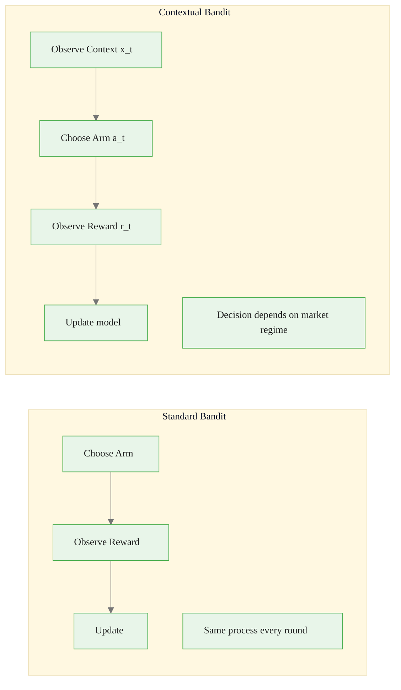
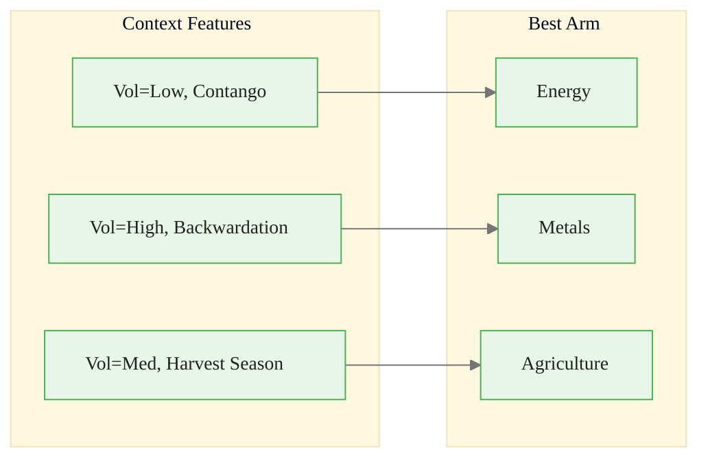
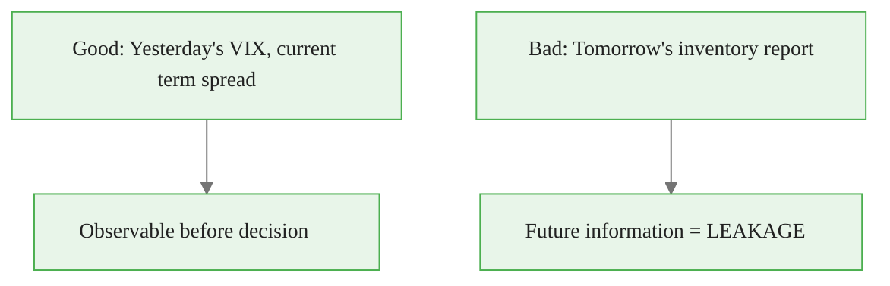
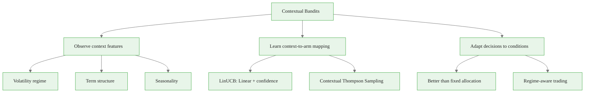

<!-- _class: lead -->

# Contextual Bandit Framework

## Module 3: Contextual Bandits
### Multi-Armed Bandits for Commodity Trading

<!-- Speaker notes: This deck covers Contextual Bandit Framework. Set the context for the audience and explain how this topic fits into the broader course on multi-armed bandits for commodity trading. -->
---

## In Brief

A contextual bandit observes **features about the current situation** (context) before choosing an action.

| Standard Bandit | Contextual Bandit |
|----------------|-------------------|
| "Arm 2 is best on average" | "Arm 2 is best when volatility is high and in contango" |

> Context makes decisions **situational**.

<!-- Speaker notes: This opening summary sets the context for the entire deck. Read the key quote aloud and pause to let it sink in. The goal is to establish the core problem or concept before diving into details. -->

<div class="callout-key">

Bandits learn AND earn simultaneously -- the core advantage over traditional A/B testing.

</div>

---

## Standard vs Contextual



Context vector: $x_t = [\text{volatility}, \text{term\_structure}, \text{seasonality}]$

<!-- Speaker notes: The diagram on Standard vs Contextual illustrates the key relationships visually. Walk through the flow step by step, pointing out decision points and outcomes. Visual representations like this help students build mental models of the concepts. -->

<div class="callout-insight">

**Insight:** The exploration-exploitation tradeoff is not a fixed ratio -- it should adapt as uncertainty decreases over time.

</div>

---

## Context-to-Action Mapping



The bandit learns **which allocation works in which state**.

<!-- Speaker notes: The diagram on Context-to-Action Mapping illustrates the key relationships visually. Walk through the flow step by step, pointing out decision points and outcomes. Visual representations like this help students build mental models of the concepts. -->

<div class="callout-warning">

**Warning:** Non-stationary reward distributions violate bandit assumptions. Always implement change detection in production systems.

</div>

---

## Formal Definition

At each round $t$:

1. **Observe context:** $x_t \in \mathbb{R}^d$
2. **Choose arm:** $a_t \in \{1, \ldots, K\}$ based on $x_t$
3. **Observe reward:** $r_t \sim P(r \mid x_t, a_t)$
4. **Update model:** Learn $f(x, a) \to E[r \mid x, a]$

**Regret:**

$$\text{Regret}(T) = \sum_{t=1}^{T} [r_t^* - r_t]$$

where $r_t^* = \max_a E[r \mid x_t, a]$ is the best possible reward given context $x_t$.

<!-- Speaker notes: This is the formal mathematical treatment. Walk through each symbol and equation carefully, connecting back to the intuitive explanation from the previous slides. Do not rush this slide -- pause after each equation to ensure comprehension. -->

<div class="callout-info">

**Info:** The regret of the best bandit algorithms grows logarithmically with time, compared to linearly for A/B testing.

</div>

---

## Intuitive Explanation

**Standard bandit:** "Energy earns 8% annually on average" -- always overweight energy.

**Contextual bandit:** "Energy earns 12% when VIX < 15 and in contango, but loses money in backwardation with VIX > 25" -- switch based on regime.

> Like a doctor prescribing based on patient features instead of the same drug for everyone.

<!-- Speaker notes: This analogy makes the abstract concept concrete. Tell the story naturally and let the audience connect it to the formal definition. Good analogies are worth lingering on -- they are what students remember months later. -->
---

## Code: Simple Contextual Bandit

<div class="code-window">
<div class="code-header">
<div class="dots"><span class="dot-red"></span><span class="dot-yellow"></span><span class="dot-green"></span></div>
<span class="filename">example.py</span>
</div>

```python
import numpy as np

class ContextualBandit:
    def __init__(self, n_arms, context_dim):
        self.n_arms = n_arms
        self.contexts = [[] for _ in range(n_arms)]
        self.rewards = [[] for _ in range(n_arms)]

    def predict(self, context, arm):
        if len(self.rewards[arm]) == 0:
            return 0.0
        return np.mean(self.rewards[arm])  # Simplified
```

</div>

<!-- Speaker notes: Code continues on the next slide. This first part sets up the structure. -->

---

## Code: Simple Contextual Bandit (continued)

<div class="code-window">
<div class="code-header">
<div class="dots"><span class="dot-red"></span><span class="dot-yellow"></span><span class="dot-green"></span></div>
<span class="filename">example.py</span>
</div>

```python
    def choose_arm(self, context):
        predictions = [self.predict(context, a)
                       for a in range(self.n_arms)]
        return np.argmax(predictions)

    def update(self, context, arm, reward):
        self.contexts[arm].append(context)
        self.rewards[arm].append(reward)
```

</div>

<!-- Speaker notes: Walk through the code line by line. Highlight the key design decisions and explain why each parameter or function call matters. This code is copy-paste ready -- students can use it directly in their own projects. -->
---

<!-- _class: lead -->

# Common Pitfalls

<!-- Speaker notes: Transition slide for the Common Pitfalls section. Pause briefly to let the audience absorb the previous content before moving into this new topic area. -->
---

## Five Key Pitfalls

| Pitfall | Problem | Fix |
|---------|---------|-----|
| Irrelevant features | Adds noise, slows learning | Feature selection |
| Scale mismatch | High-magnitude features dominate | Standardize: $(x - \mu)/\sigma$ |
| Overfitting | Memorizes noise | Regularization, fewer features |
| Context leakage | Future info in current context | Only use lagged features |
| No exploration | Greedy = suboptimal convergence | Use UCB or Thompson with context |

<!-- Speaker notes: Walk through Five Key Pitfalls carefully. Emphasize why this mistake is common and how to recognize it in practice. The commodity trading example makes it concrete -- ask if anyone has encountered this in their own work. -->
---

## Context Leakage



> **Rule:** Only use lagged or contemporaneous data, never future data.

<!-- Speaker notes: The diagram on Context Leakage illustrates the key relationships visually. Walk through the flow step by step, pointing out decision points and outcomes. Visual representations like this help students build mental models of the concepts. -->
---

## Connections

<div class="columns">
<div>

### Builds On
- UCB and Thompson Sampling (Module 1-2)
- Regression fundamentals
- Bayesian updating

</div>
<div>

### Leads To
- Content optimization (Module 4)
- Regime-aware commodity trading (Module 5)
- Non-stationary bandits (Module 6)
- Full RL (sequential state transitions)

</div>
</div>

**Key distinction:** Contextual bandit context is exogenous (not affected by actions). RL state depends on previous actions.

<!-- Speaker notes: The connections section shows how this topic links to the rest of the course. Highlight the 'Builds On' prerequisites to remind students of what they should already know, and use 'Leads To' to create anticipation for upcoming modules. -->
---

## Visual Summary



<!-- Speaker notes: This visual summary captures the key relationships from the entire deck. Walk through each branch of the diagram, connecting back to the main concepts covered. This slide works well as a reference -- encourage students to screenshot it for later review. -->