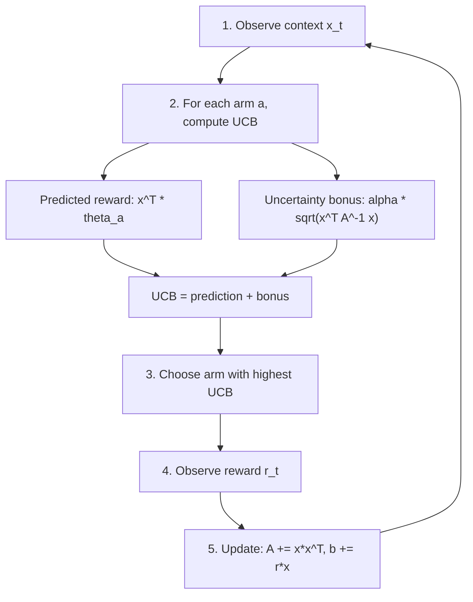
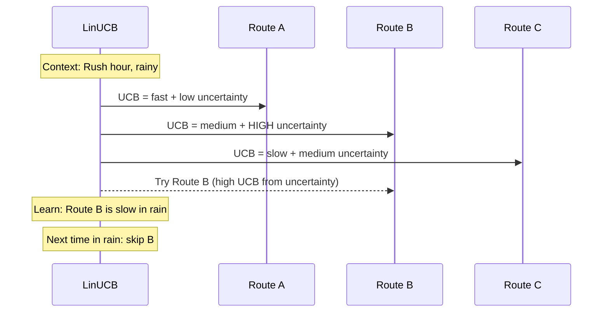
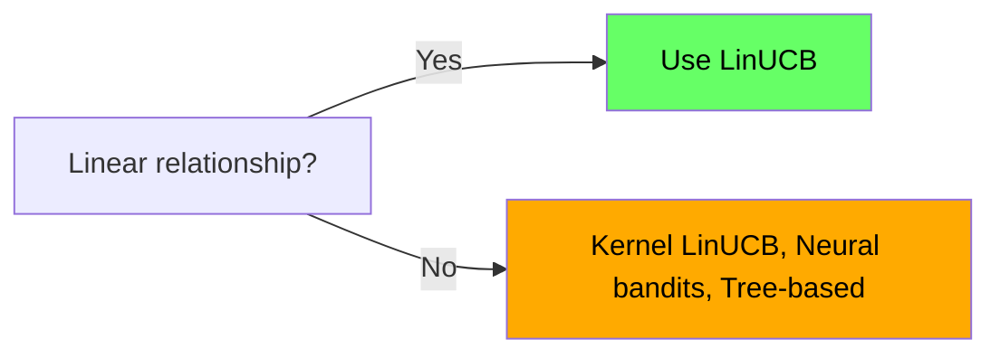
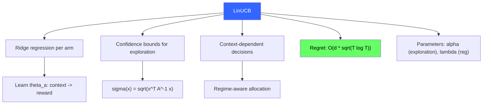

<!-- _class: lead -->

# LinUCB Algorithm

## Module 3: Contextual Bandits
### Multi-Armed Bandits for Commodity Trading

<!-- Speaker notes: This deck covers LinUCB Algorithm. Set the context for the audience and explain how this topic fits into the broader course on multi-armed bandits for commodity trading. -->
---

## In Brief

LinUCB extends UCB1 to contextual settings:

1. **Linear model:** $E[r \mid x, a] = x^T\theta_a$
2. **Ridge regression** for prediction with uncertainty
3. **Confidence bounds** for exploration

$$\text{UCB}_a(x_t) = x_t^T\hat{\theta}_a + \alpha \cdot \sigma_a(x_t)$$

<!-- Speaker notes: This opening summary sets the context for the entire deck. Read the key quote aloud and pause to let it sink in. The goal is to establish the core problem or concept before diving into details. -->
---

## How LinUCB Works



<!-- Speaker notes: The diagram on How LinUCB Works illustrates the key relationships visually. Walk through the flow step by step, pointing out decision points and outcomes. Visual representations like this help students build mental models of the concepts. -->
---

## Confidence Ellipsoid

```
Initial (wide uncertainty):          After 100 rounds (narrow):
    Reward                               Reward
      |     /\                             |    /\
      |    /  \                            |   /  \
      |   /    \                           |  /____\
      |  /      \                          |/        \___
      | /        \                         Context
      |/__________\___
       Context

Wider uncertainty --> larger exploration bonus --> more exploration
```

> Contexts far from previous observations get wider confidence intervals.

<!-- Speaker notes: This code example for Confidence Ellipsoid is production-ready. Walk through the implementation, noting any important design patterns or potential modifications for different use cases. -->
---

## Formal Definition

**Initialize:** For each arm $a$:
- $A_a = \lambda I$ ($d \times d$ identity scaled by $\lambda$)
- $b_a = \mathbf{0}$ ($d$-dimensional vector)

**At each round $t$:**

$$\hat{\theta}_a = A_a^{-1} b_a$$
$$\sigma_a(x_t) = \sqrt{x_t^T A_a^{-1} x_t}$$
$$\text{UCB}_a = x_t^T \hat{\theta}_a + \alpha \cdot \sigma_a(x_t)$$

Choose $a_t = \arg\max_a \text{UCB}_a$, then update:

$$A_{a_t} \leftarrow A_{a_t} + x_t x_t^T, \quad b_{a_t} \leftarrow b_{a_t} + r_t x_t$$

<!-- Speaker notes: This is the formal mathematical treatment. Walk through each symbol and equation carefully, connecting back to the intuitive explanation from the previous slides. Do not rush this slide -- pause after each equation to ensure comprehension. -->
---

## Why This Works

**Ridge regression:**
$$\hat{\theta}_a = \arg\min_\theta \left[\sum(r_i - x_i^T\theta)^2 + \lambda\|\theta\|^2\right] = A_a^{-1}b_a$$

**Uncertainty:**
$$\sigma_a(x) = \sqrt{x^T A_a^{-1} x}$$

Larger $\sigma$ = less data in that region = higher exploration bonus.

**Regret:** $O(d\sqrt{T \log T})$ -- optimal up to log factors.

<!-- Speaker notes: The mathematical treatment of Why This Works formalizes what we discussed intuitively. Walk through each variable and equation, relating them back to the commodity trading context. Ensure the audience follows the notation before moving on. -->
---

## Intuitive Explanation: GPS Learning Traffic



**Commodity version:** Context = [VIX, term_spread, inventory_surprise]. Arms = sector allocations. LinUCB learns which sector wins in each regime.

<!-- Speaker notes: This analogy makes the abstract concept concrete. Tell the story naturally and let the audience connect it to the formal definition. Good analogies are worth lingering on -- they are what students remember months later. -->
---

## Code: Core Implementation

```python
import numpy as np

class LinUCB:
    def __init__(self, n_arms, context_dim, alpha=1.0, lambda_=1.0):
        self.n_arms = n_arms
        self.d = context_dim
        self.alpha = alpha
        self.A = [lambda_ * np.eye(context_dim) for _ in range(n_arms)]
        self.b = [np.zeros(context_dim) for _ in range(n_arms)]
```

<!-- Speaker notes: Code continues on the next slide. This first part sets up the structure. -->

---

## Code: Core Implementation (continued)

```python
    def choose_arm(self, context):
        ucb_scores = []
        for a in range(self.n_arms):
            A_inv = np.linalg.inv(self.A[a])
            theta = A_inv @ self.b[a]
            pred = context @ theta
            std = np.sqrt(context @ A_inv @ context)
            ucb_scores.append(pred + self.alpha * std)
        return np.argmax(ucb_scores)

    def update(self, arm, context, reward):
        self.A[arm] += np.outer(context, context)
        self.b[arm] += reward * context
```

<!-- Speaker notes: Walk through the code line by line. Highlight the key design decisions and explain why each parameter or function call matters. This code is copy-paste ready -- students can use it directly in their own projects. -->
---

<!-- _class: lead -->

# Common Pitfalls

<!-- Speaker notes: Transition slide for the Common Pitfalls section. Pause briefly to let the audience absorb the previous content before moving into this new topic area. -->
---

## Pitfall 1: Wrong Alpha

| $\alpha$ | Behavior | Result |
|----------|----------|--------|
| Too small ($\to 0$) | Pure exploitation | Suboptimal convergence |
| **1.0 (default)** | **Balanced** | **Good starting point** |
| Too large ($\to \infty$) | Pure exploration | Linear regret |

<!-- Speaker notes: Walk through Pitfall 1: Wrong Alpha carefully. Emphasize why this mistake is common and how to recognize it in practice. The commodity trading example makes it concrete -- ask if anyone has encountered this in their own work. -->
---

## Pitfall 2: Numerical Instability

> $A_a$ becomes ill-conditioned after many updates.

```python
# WRONG: can fail
theta = np.linalg.inv(A) @ b

# CORRECT: numerically stable
theta = np.linalg.solve(A, b)
```

<!-- Speaker notes: Walk through Pitfall 2: Numerical Instability carefully. Emphasize why this mistake is common and how to recognize it in practice. The commodity trading example makes it concrete -- ask if anyone has encountered this in their own work. -->
---

## Pitfall 3: Feature Scale Issues

> Features with large magnitudes dominate the regression.

**Example:** Price (50-100) vs normalized VIX (0-1)

**Fix:** Always standardize: $x = (x - \mu) / \sigma$

<!-- Speaker notes: Walk through Pitfall 3: Feature Scale Issues carefully. Emphasize why this mistake is common and how to recognize it in practice. The commodity trading example makes it concrete -- ask if anyone has encountered this in their own work. -->
---

## Pitfall 4: Non-Linear Rewards

> If $E[r \mid x, a]$ is highly nonlinear, LinUCB underperforms.



<!-- Speaker notes: Walk through Pitfall 4: Non-Linear Rewards carefully. Emphasize why this mistake is common and how to recognize it in practice. The commodity trading example makes it concrete -- ask if anyone has encountered this in their own work. -->
---

## Variants and Extensions

| Variant | Key Idea |
|---------|----------|
| **Disjoint LinUCB** | Independent $\theta_a$ per arm (standard) |
| **Hybrid LinUCB** | Shared + arm-specific features |
| **Kernelized LinUCB** | Kernel trick for nonlinear rewards |
| **Neural LinUCB** | Neural net features + LinUCB on embeddings |

<!-- Speaker notes: This comparison table on Variants and Extensions is a key reference. Walk through each row, highlighting the most important distinctions. Students should understand when to use each option based on the criteria shown. -->
---

## Connections

<div class="columns">
<div>

### Builds On
- UCB1 (Module 1)
- Ridge regression
- Bayesian linear regression

</div>
<div>

### Leads To
- Commodity trading (Module 5)
- Neural contextual bandits
- Thompson Sampling for linear bandits

</div>
</div>

<!-- Speaker notes: The connections section shows how this topic links to the rest of the course. Highlight the 'Builds On' prerequisites to remind students of what they should already know, and use 'Leads To' to create anticipation for upcoming modules. -->
---

## Visual Summary



<!-- Speaker notes: This visual summary captures the key relationships from the entire deck. Walk through each branch of the diagram, connecting back to the main concepts covered. This slide works well as a reference -- encourage students to screenshot it for later review. -->